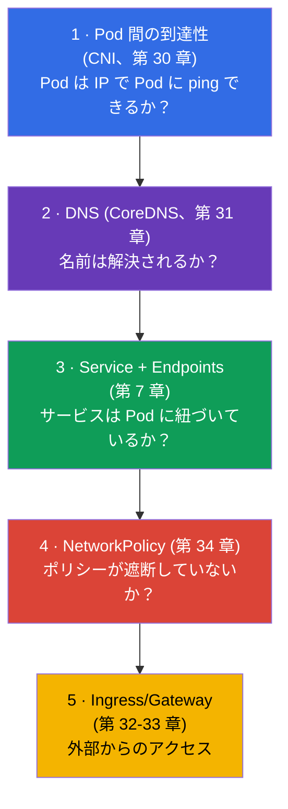
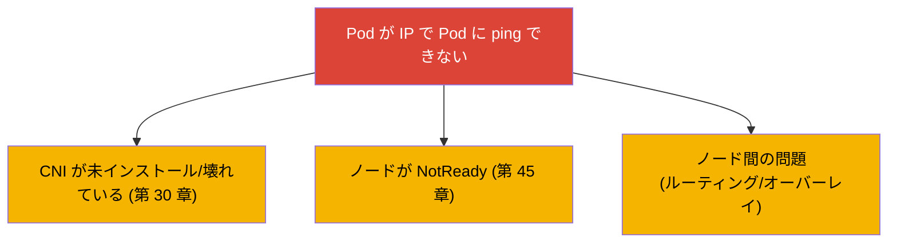
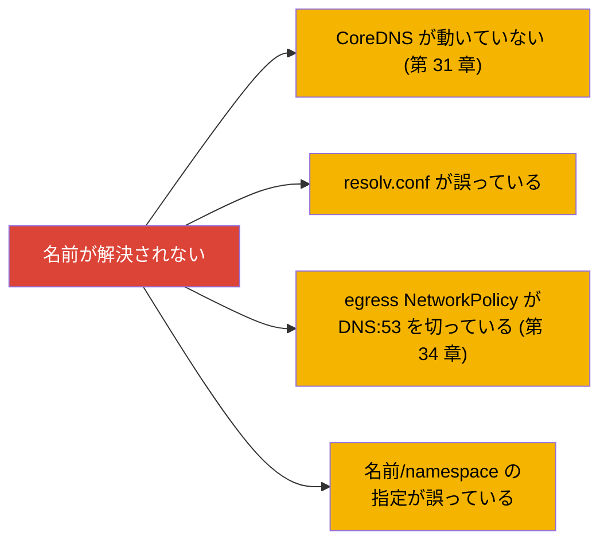
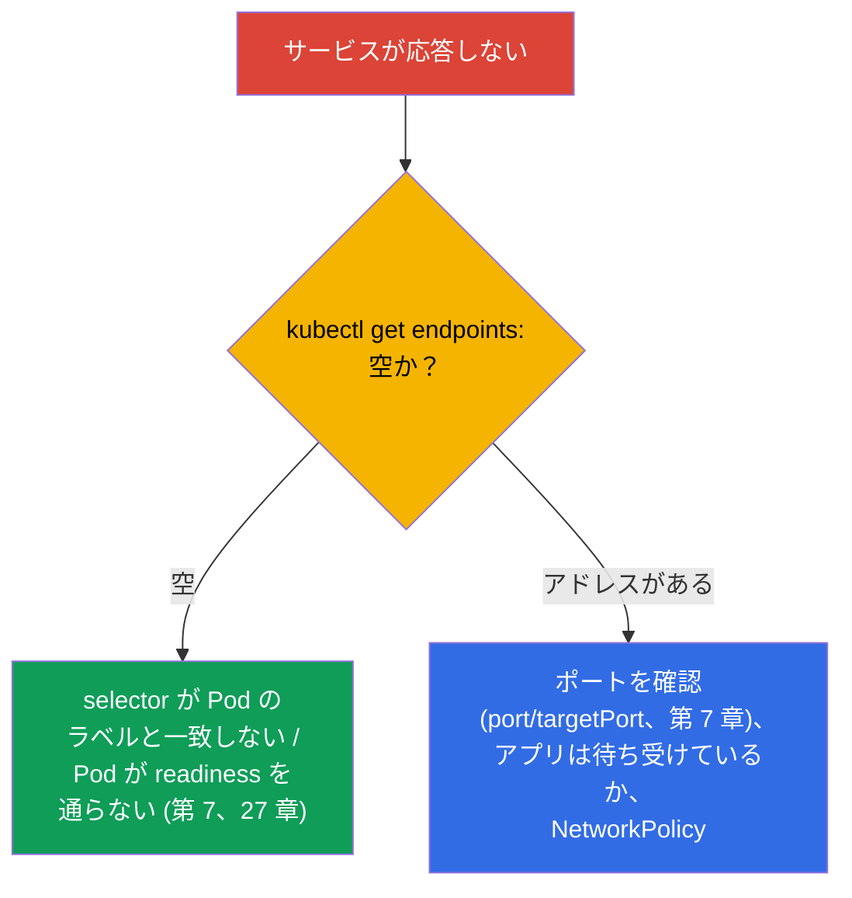
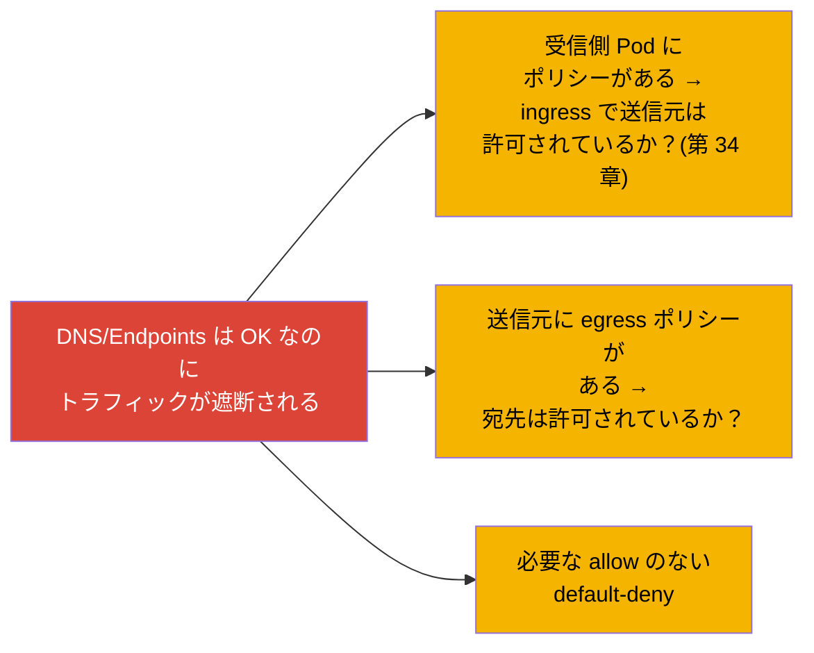
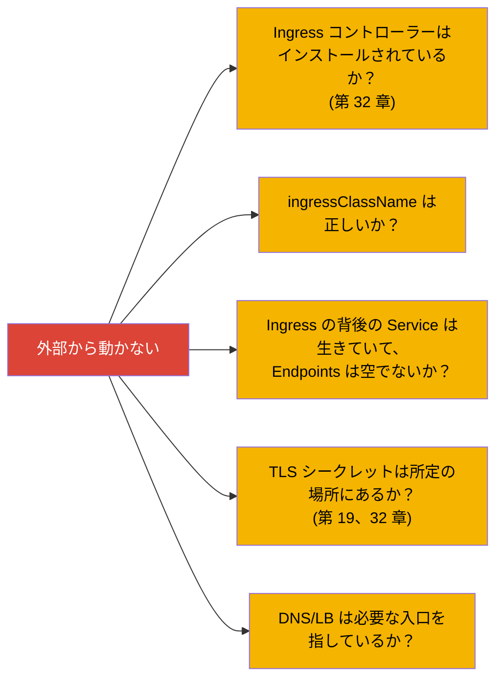
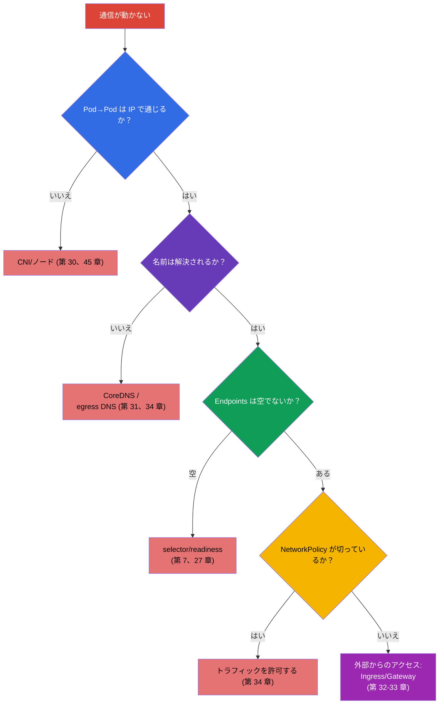

[Русская версия](ru.md) · [Eng version](README.md) · [Versión en español](es.md) · [Version française](fr.md) · [Deutsche Version](de.md) · [ქართული ვერსია](ge.md) · [繁體中文版](tw.md)

# 第 46 章。Service とネットワークのデバッグ

> 🟦 **CKA 向けの章**（Troubleshooting 領域 - 30%）。ネットワークのスキルは CKAD にも役立ちます。
>
> **次は何か。** パート 9 を、もっとも厄介なテーマ - ネットワーク - で締めくくります。「通信が
> 動かない」は、どの層でも壊れ得ます：DNS、Service、Endpoints、NetworkPolicy、kube-proxy、CNS。
> 第 7、30、31、34 章の知識を、ひとつの **層ごとのアルゴリズム** としてまとめます：「Pod が名前を
> 解決できない」から「サービスが応答しない」「NetworkPolicy がすべてを遮断した」まで。これは CKA で
> よく出る、配点の高い問題です。

## 46.1. ネットワークデバッグの層モデル

ネットワークは **下から上へ層ごとに** 切り分ける必要があります - そうでないと仮説の海に溺れます。
どう積み上がっているかを思い出しましょう（第 30-31 章）：



考え方：一度に 1 つの層だけを確認し、問題を絞り込みます。IP の到達性はあるか？名前は解決されるか？
Endpoints はあるか？ポリシーが切っていないか？外から届いているか？「いいえ」のたびに、その層が
示されます。

## 46.2. 層 1：Pod 間の到達性 (CNI)

いちばん下から始めます：Pod はそもそも IP で通信できますか（第 30 章）？

```bash
# Pod の IP
kubectl get pods -o wide
# ある Pod から別の Pod の IP へ到達する
kubectl exec <pod-a> -- ping -c1 <ip-pod-b>
kubectl exec <pod-a> -- curl -s <ip-pod-b>:<port>
```

Pod が **IP で** ほかの Pod に届かないなら、問題は CNI/ノードのレベルです：



IP の到達性はあるのに名前では動かない - そのときは上の層、DNS へ進みます。

## 46.3. 層 2：DNS (CoreDNS)

名前解決を確認します（第 31 章）：

```bash
kubectl exec <pod> -- nslookup backend
kubectl exec <pod> -- nslookup backend.prod.svc.cluster.local
kubectl exec <pod> -- cat /etc/resolv.conf      # nameserver と search ドメインは何か
kubectl get pods -n kube-system -l k8s-app=kube-dns   # CoreDNS は生きているか
kubectl logs -n kube-system -l k8s-app=kube-dns
```



古典的な罠（第 34 章）：default-deny egress が DNS（ポート 53）を遮断し、すべてが説明のつかない形で
「壊れます」。名前が解決されないときは、CoreDNS と egress ポリシーの両方を確認してください。

## 46.4. 層 3：Service と Endpoints

名前は解決されるのにサービスが応答しない - そのときは Service ↔ Endpoints の結びつきを見ます
（第 7 章）。これがサービス関連の問題の **もっとも多い根本原因** です。

```bash
kubectl get svc backend                 # サービスはあるか、ClusterIP/ポートは何か
kubectl get endpoints backend           # ← 最重要: Pod のアドレスはあるか
kubectl describe svc backend            # selector と endpoints
```



**空の Endpoints** が主要な症状です：サービスが誰にも紐づいていません。原因は、サービスのセレクタが
Pod のラベルと一致していないか、Pod が Ready でない（readiness、第 27 章）ことです。Endpoints が
空でないのに通信できない場合は、ポート (`port`/`targetPort`、第 7 章)、アプリケーションが必要な
ポートで待ち受けているか、そしてポリシーを確認します。

## 46.5. 層 4：NetworkPolicy

上のすべては問題ないのにトラフィックが流れない - ポリシーが切っている可能性があります（第 34 章）：

```bash
kubectl get networkpolicy -n <namespace>
kubectl describe networkpolicy <name> -n <namespace>
```



allow のロジックを思い出しましょう（第 34 章）：Pod にポリシーが現れたら、明示的に指定されたものだけが
許可されます。必要な送信元（受信側の ingress）と宛先（送信元の egress）が許可されているかを確認します。
よくある誤りは、必要なトラフィック（と DNS）を許可しないままの default-deny です。

## 46.6. 層 5：外部からのアクセス (Ingress/Gateway)

問題が **外部から** のアクセスにある場合（第 32-33 章）：



外部アクセスはもっとも上の層です。Ingress を責める前に、内部の Service が動いていること（層 1-4）を
確認してください。Service/Pod への `port-forward`（第 29 章）は、どこで切れているのかを知るのに
役立ちます：port-forward 経由では動くのに Ingress 経由では動かないなら、問題は Ingress/入口にあります。

## 46.7. 完全なアルゴリズムとツール

ひとつの木にまとめましょう - これがネットワーク troubleshooting の地図です：



ネットワークデバッグのツール：

```bash
# ツール入りのテスト用 Pod (最小イメージには kubectl debug、第 29 章)
kubectl run test --image=nicolaka/netshoot -it --rm -- sh
# 中では: nslookup, curl, ping, dig, netstat, traceroute
kubectl exec <pod> -- nslookup <svc>
kubectl exec <pod> -- curl -sv <svc>:<port>
kubectl get endpoints <svc>
kubectl get networkpolicy -A
```

## 46.8. 本番環境でこれをどう使うか

- **Endpoints が最初のチェック。** 本番で「サービスが応答しない」とき、当番はまず
  `kubectl get endpoints` を確認します：空なら → セレクタ/readiness。これは DNS とネットワークを
  切り離し、大量の時間を節約します。
- **DNS は原因のトップ。** 過負荷の CoreDNS、誤った resolv.conf、DNS を許可しない egress ポリシーは
  よくあるインシデントです。NodeLocal DNSCache（第 31 章）と丁寧な egress ポリシー（第 34 章）が
  それらを防ぎます。
- **層ごとのアプローチはパニック対策。** ネットワークのインシデントでは「あてずっぽうに撃つ」のが
  簡単に起きます。「下から上へ：IP → DNS → Endpoints → ポリシー → 入口」という規律が、混乱を
  素早い切り分けに変えます。
- **netshoot と port-forward。** 本番ではデバッグにネットワークツール入りの Pod (netshoot) や
  ephemeral コンテナ（第 29 章）を使い、`port-forward` はアプリケーションの問題と入口の問題を
  切り分けるのに役立ちます。
- **NetworkPolicy はよくある「自業自得」。** ポリシー導入後は、許可を忘れたもの（DNS、
  サービス間トラフィック）が壊れます。本番ではポリシーをテストし、いきなり enforce ではなく観測
  (audit) から始めて慎重に展開します。

## 46.9. ミニ用語集

- **層ごとのデバッグ** - ネットワークを下から上へ切り分けること：CNI → DNS → Endpoints →
  ポリシー → 入口。
- **Pod 間の到達性** - Pod どうしが IP で通信できるか（CNI のレベル、第 30 章）。
- **Endpoints** - サービスの背後にある Pod アドレスの一覧。空 = 紐づいていない（第 7 章）。
- **nslookup/dig** - Pod の内部から DNS 解決を確認すること。
- **netshoot** - デバッグ用のネットワークツールが入ったイメージ。
- **port-forward** - 入口を迂回して確認するためのポート転送（第 29 章）。
- **default-deny + DNS** - 罠：egress ポリシーが名前解決を切ってしまう（第 34 章）。

## 46.10. 本章のまとめ

- ネットワークは下から上へ層ごとにデバッグします：Pod 間の到達性 (CNI) → DNS (CoreDNS) → Service/
  Endpoints → NetworkPolicy → Ingress/Gateway。
- 層 1：Pod が IP で Pod に ping できない → CNI/ノード（第 30、45 章）。
- 層 2：名前が解決されない → CoreDNS、resolv.conf、egress ポリシーが DNS:53 を切っている。
- 層 3（もっとも多い）：サービスが応答しない → `get endpoints`。空 = セレクタ/readiness。
- 層 4：NetworkPolicy がトラフィックを切っている → allow ルール（と DNS）を確認する。
- 層 5：外部から動かない → Ingress コントローラー、ingressClassName、その背後の Service、TLS。
- ツール：内部からの nslookup/curl、`get endpoints`、netshoot/ephemeral、切り分けのための
  port-forward。

## 46.11. これがどう役に立つか：試験と実際の仕事で

**試験では (CKA)。** 「なぜ Pod がサービスに届かないのか」「サービスが応答しない」「DNS が解決しない」は
よく出る配点の高い troubleshooting 問題です (30%)。層ごとのアルゴリズムと `get endpoints` の反射が
ほとんどを解決します。各層を自信をもって確認し、egress-DNS の罠を知っている必要があります。

**実際の仕事では。** ネットワークのインシデントはもっとも多く、もっとも込み入ったもののひとつです。
層ごとの規律と、Endpoints と DNS が主要な容疑者だという知識は、切り分けを劇的に速めます。ツール
(netshoot、port-forward、ephemeral コンテナ) と NetworkPolicy の慎重な導入は、信頼できる運用の
日常的な実践です。

## 46.12. 自己チェックの質問

1. なぜネットワークは層ごとにデバッグするのですか。どの順番でですか？
2. Pod 間の IP 到達性はどう確認しますか。到達性がないことは何を示しますか？
3. 「名前が解決されない」ときに何を確認しますか。egress ポリシーに関わる罠は何ですか？
4. なぜ「サービスが応答しない」ときの最初のチェックが `kubectl get endpoints` なのですか。空の
   リストは何を意味しますか？
5. NetworkPolicy がトラフィックを切っているとどう分かりますか。そのとき何を確認しますか？
6. 外部アクセスの問題はどうデバッグしますか。port-forward は何の役に立ちますか？
7. クラスタ内でのネットワークデバッグにはどんなツールを使いますか？

## 演習

これでパート 9 (troubleshooting) は完了し、それとともにコースの一般的・管理者向けの内容すべてが
終わりました。残るはパート 10：試験対策 - CKAD の戦術（第 47 章）と CKA の戦術（第 48 章）です。
ネットワークの troubleshooting は、ネットワーク関連のラボと模擬試験で練習します。

🧪 ラボ 118（クラスタの DNS/ネットワークの診断）: [tasks/cka/labs/118](../../labs/118/README_JP.MD)

🧪 ラボ 123（CNI をゼロからインストール + netns/ルートの分析）: [tasks/cka/labs/123](../../labs/123/README_JP.MD)

---
[目次](../README_JP.md) · [第 45 章](../45/jp.md) · [第 47 章](../47/jp.md)
