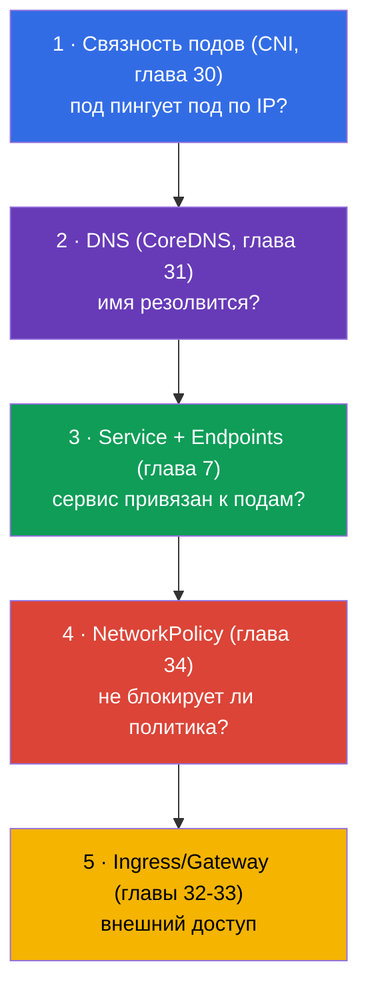
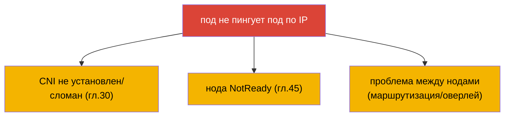
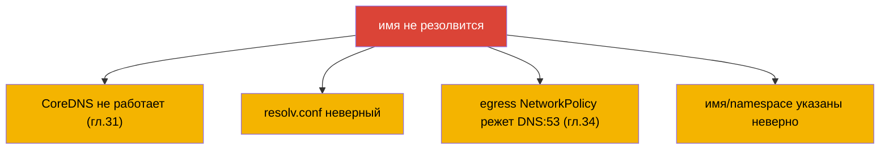
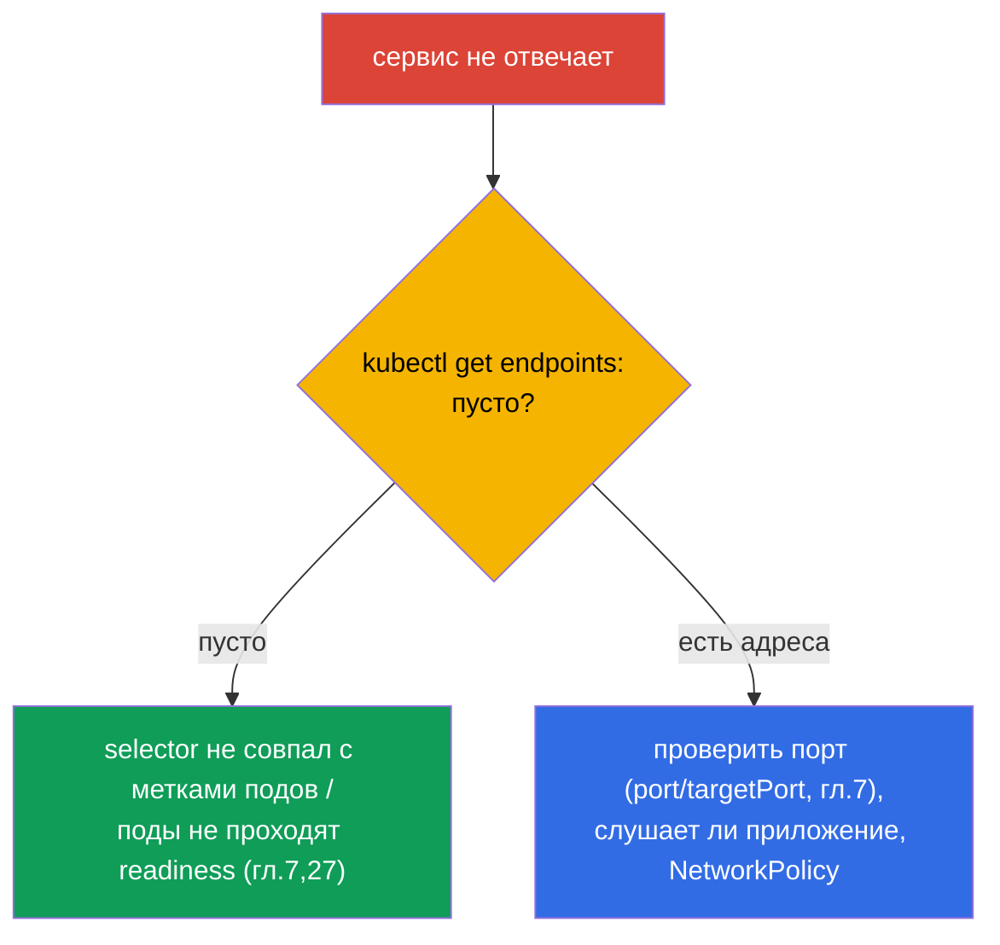
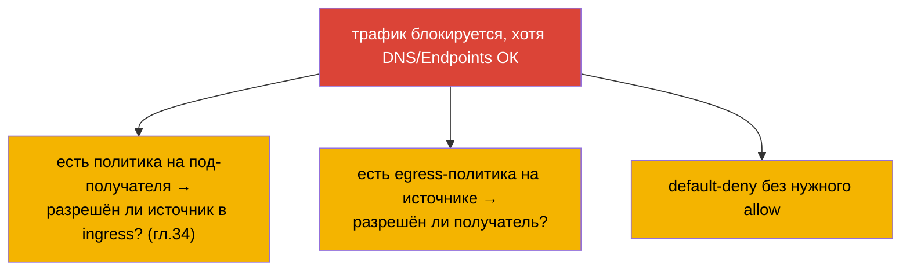
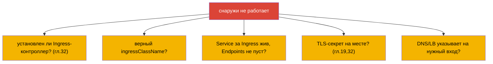
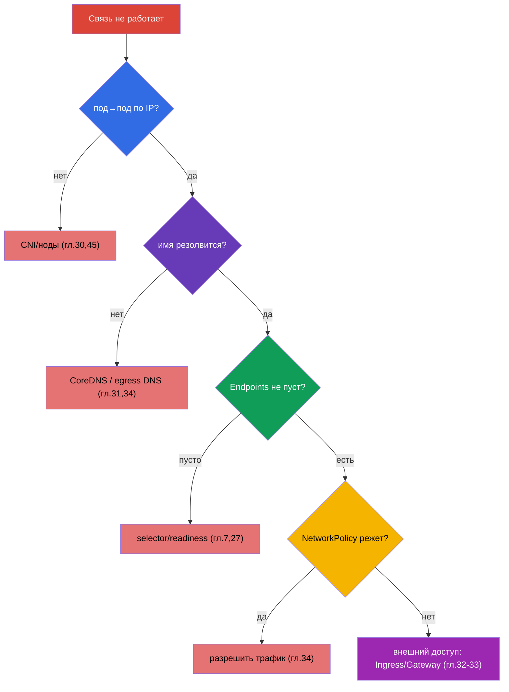

# Глава 46. Отладка сервисов и сети

> 🟦 **Глава для CKA** (домен Troubleshooting - 30%). Сетевые навыки полезны и для CKAD.
>
> **Что дальше.** Завершаем часть 9 самой коварной темой - сетью. «Не работает связь» может
> сломаться на любом из слоёв: DNS, Service, Endpoints, NetworkPolicy, kube-proxy, CNS.
> Соберём знания глав 7, 30, 31, 34 в единый **послойный алгоритм** отладки: от «под не
> резолвит имя» до «сервис не отвечает» и «NetworkPolicy всё заблокировала». Это частые и
> высокобалльные задания CKA.

## 46.1. Послойная модель отладки сети

Сеть надо разбирать **по слоям снизу вверх** - иначе тонешь в гипотезах. Вспомним, как всё
сложено (главы 30-31):



Идея: проверять по одному слою, сужая проблему. Работает ли IP-связность? Резолвится ли
имя? Есть ли Endpoints? Не режет ли политика? Дошли ли снаружи? Каждый «нет» указывает
слой.

## 46.2. Слой 1: связность подов (CNI)

Начинаем с самого низа: могут ли поды вообще общаться по IP (глава 30)?

```bash
# IP подов
kubectl get pods -o wide
# из одного пода достучаться до IP другого
kubectl exec <pod-a> -- ping -c1 <ip-pod-b>
kubectl exec <pod-a> -- curl -s <ip-pod-b>:<port>
```

Если под не достаёт другой под **по IP** - проблема на уровне CNI/нод:



Если IP-связность есть, но по имени не работает - идём выше, к DNS.

## 46.3. Слой 2: DNS (CoreDNS)

Проверяем резолвинг имён (глава 31):

```bash
kubectl exec <pod> -- nslookup backend
kubectl exec <pod> -- nslookup backend.prod.svc.cluster.local
kubectl exec <pod> -- cat /etc/resolv.conf      # какой nameserver, search-домены
kubectl get pods -n kube-system -l k8s-app=kube-dns   # жив ли CoreDNS
kubectl logs -n kube-system -l k8s-app=kube-dns
```



Классическая ловушка (глава 34): default-deny egress блокирует DNS (порт 53), и всё
«ломается» необъяснимо. Если имя не резолвится - проверьте и CoreDNS, и egress-политики.

## 46.4. Слой 3: Service и Endpoints

Имя резолвится, но сервис не отвечает - смотрим связку Service ↔ Endpoints (глава 7). Это
**самый частый корень** проблем с сервисами.

```bash
kubectl get svc backend                 # есть ли сервис, какой ClusterIP/порт
kubectl get endpoints backend           # ← КЛЮЧЕВОЕ: есть ли адреса подов
kubectl describe svc backend            # selector и endpoints
```



**Пустой Endpoints** - главный симптом: сервис ни к кому не привязан. Причины: селектор
сервиса не совпадает с метками подов, или поды не готовы (readiness, глава 27). Если
Endpoints не пуст, а связи нет - проверяем порты (`port`/`targetPort`, глава 7), слушает ли
приложение нужный порт, и политики.

## 46.5. Слой 4: NetworkPolicy

Всё выше в порядке, но трафик не идёт - возможно, режет политика (глава 34):

```bash
kubectl get networkpolicy -n <namespace>
kubectl describe networkpolicy <name> -n <namespace>
```



Помним allow-логику (глава 34): появилась политика на под - разрешено только явно
указанное. Проверяем, разрешён ли нужный источник (ingress у получателя) и назначение
(egress у источника). Частая ошибка - default-deny без разрешения нужного трафика (и DNS).

## 46.6. Слой 5: внешний доступ (Ingress/Gateway)

Если проблема с доступом **снаружи** (главы 32-33):



Внешний доступ - самый верхний слой; прежде чем винить Ingress, убедитесь, что внутренний
Service работает (слои 1-4). `port-forward` на Service/под (глава 29) помогает понять, где
рвётся: если через port-forward работает, а через Ingress нет - проблема в Ingress/входе.

## 46.7. Полный алгоритм и инструменты

Соберём единое дерево - это карта сетевого troubleshooting:



Инструменты сетевой отладки:

```bash
# тестовый под с инструментами (для минимальных образов — kubectl debug, гл.29)
kubectl run test --image=nicolaka/netshoot -it --rm -- sh
# внутри: nslookup, curl, ping, dig, netstat, traceroute
kubectl exec <pod> -- nslookup <svc>
kubectl exec <pod> -- curl -sv <svc>:<port>
kubectl get endpoints <svc>
kubectl get networkpolicy -A
```

## 46.8. Как это применяют в продакшене

- **Endpoints - первый чек.** В проде «сервис не отвечает» дежурный проверяет прежде всего
  `kubectl get endpoints`: пусто → селектор/readiness. Это экономит массу времени, отсекая
  DNS и сеть.
- **DNS - топ причин.** Перегруженный CoreDNS, неверный resolv.conf, egress-политика без
  DNS - частые инциденты. NodeLocal DNSCache (глава 31) и аккуратные egress-политики (глава
  34) их предотвращают.
- **Послойный подход - против паники.** При сетевом инциденте легко «стрелять наугад».
  Дисциплина «снизу вверх: IP → DNS → Endpoints → политика → вход» превращает хаос в
  быстрый разбор.
- **netshoot и port-forward.** В проде для отладки используют pod с сетевыми инструментами
  (netshoot) или ephemeral-контейнеры (глава 29), а `port-forward` помогает отделить
  проблему приложения от проблемы входа.
- **NetworkPolicy - частый «сам себе злодей».** После внедрения политик ломается то, что
  забыли разрешить (DNS, межсервисный трафик). В проде политики тестируют и катят
  осторожно, начиная с наблюдения (audit), а не сразу с enforce.

## 46.9. Мини-глоссарий

- **Послойная отладка** - разбор сети снизу вверх: CNI → DNS → Endpoints → политика →
  вход.
- **связность подов** - могут ли поды общаться по IP (уровень CNI, глава 30).
- **Endpoints** - список адресов подов за сервисом; пустой = не привязан (глава 7).
- **nslookup/dig** - проверка DNS-резолвинга изнутри пода.
- **netshoot** - образ с сетевыми инструментами для отладки.
- **port-forward** - проброс порта для проверки в обход входа (глава 29).
- **default-deny + DNS** - ловушка: egress-политика режет резолвинг (глава 34).

## 46.10. Итоги главы

- Сеть отлаживают послойно снизу вверх: связность подов (CNI) → DNS (CoreDNS) → Service/
  Endpoints → NetworkPolicy → Ingress/Gateway.
- Слой 1: под не пингует под по IP → CNI/ноды (главы 30, 45).
- Слой 2: имя не резолвится → CoreDNS, resolv.conf, egress-политика режет DNS:53.
- Слой 3 (самый частый): сервис не отвечает → `get endpoints`; пусто = селектор/readiness.
- Слой 4: трафик режет NetworkPolicy → проверить allow-правила (и DNS).
- Слой 5: снаружи не работает → Ingress-контроллер, ingressClassName, Service за ним, TLS.
- Инструменты: nslookup/curl изнутри, `get endpoints`, netshoot/ephemeral, port-forward
  для локализации.

## 46.11. Как это пригодится: на экзамене и в реальной работе

**На экзамене (CKA).** «Почему под не достучится до сервиса», «сервис не отвечает», «DNS
не резолвит» - частые высокобалльные задания troubleshooting (30%). Послойный алгоритм и
рефлекс `get endpoints` решают большинство. Нужно уверенно проверять каждый слой и знать
ловушку с egress-DNS.

**В реальной работе.** Сетевые инциденты - одни из самых частых и запутанных. Послойная
дисциплина и знание, что Endpoints и DNS - главные подозреваемые, кардинально ускоряют
разбор. Инструменты (netshoot, port-forward, ephemeral-контейнеры) и осторожное внедрение
NetworkPolicy - повседневная практика надёжной эксплуатации.

## 46.12. Вопросы для самопроверки

1. Почему сеть отлаживают послойно и в каком порядке?
2. Как проверить связность подов по IP и на что указывает её отсутствие?
3. Что проверить при «имя не резолвится» и какая ловушка связана с egress-политикой?
4. Почему `kubectl get endpoints` - первый чек при «сервис не отвечает»? Что значит пустой
   список?
5. Как понять, что трафик режет NetworkPolicy, и что при этом проверить?
6. Как отлаживать проблему внешнего доступа и чем помогает port-forward?
7. Какие инструменты используют для сетевой отладки внутри кластера?

## Практика

На этом часть 9 (troubleshooting) завершена, а с ней - всё общее и администраторское
содержание курса. Осталась часть 10: подготовка к экзаменам - тактика CKAD (глава 47) и
CKA (глава 48). Сетевой troubleshooting отрабатывается в лабах по сети и мок-экзаменах.

🧪 Лаба 118 (диагностика DNS/сети кластера): [tasks/cka/labs/118](../../labs/118/README_RU.MD)

🧪 Лаба 123 (установка CNI с нуля + разбор netns/маршрутов): [tasks/cka/labs/123](../../labs/123/README_RU.MD)

---
[Оглавление](../README_RU.md) · [Глава 45](../45/ru.md) · [Глава 47](../47/ru.md)
