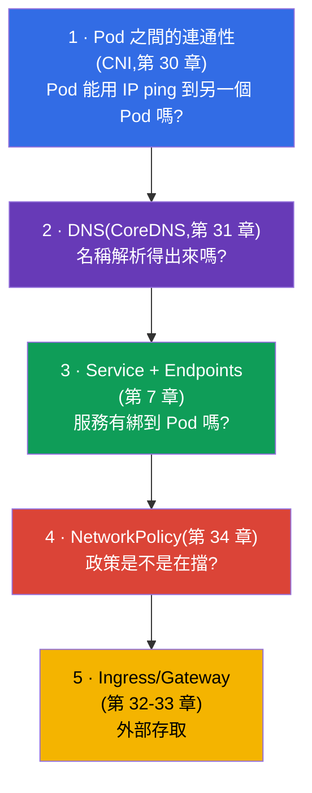
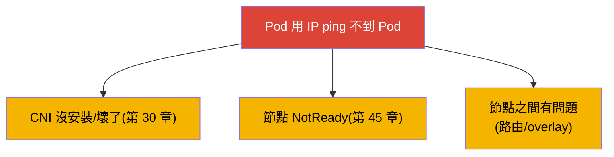
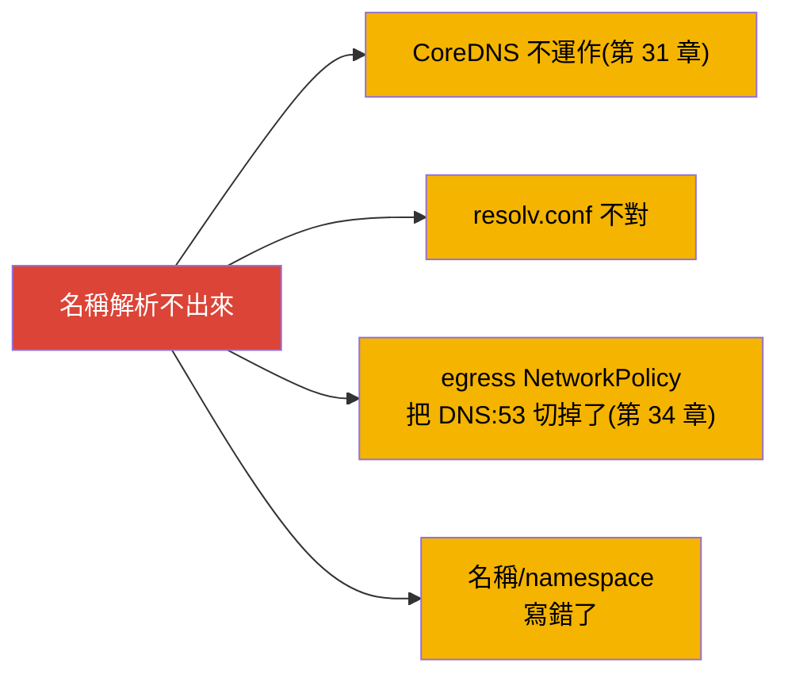
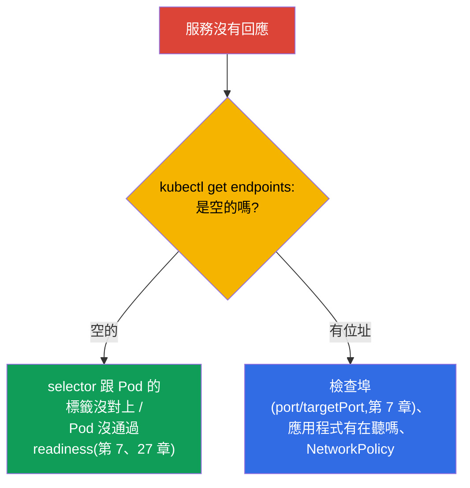
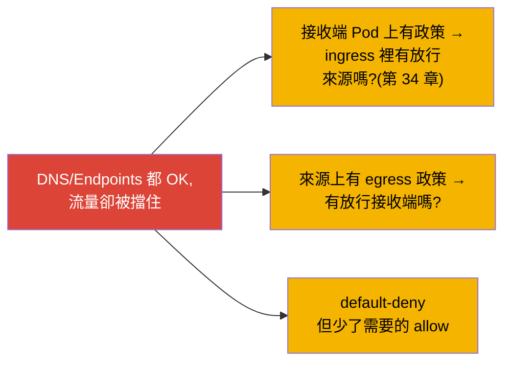
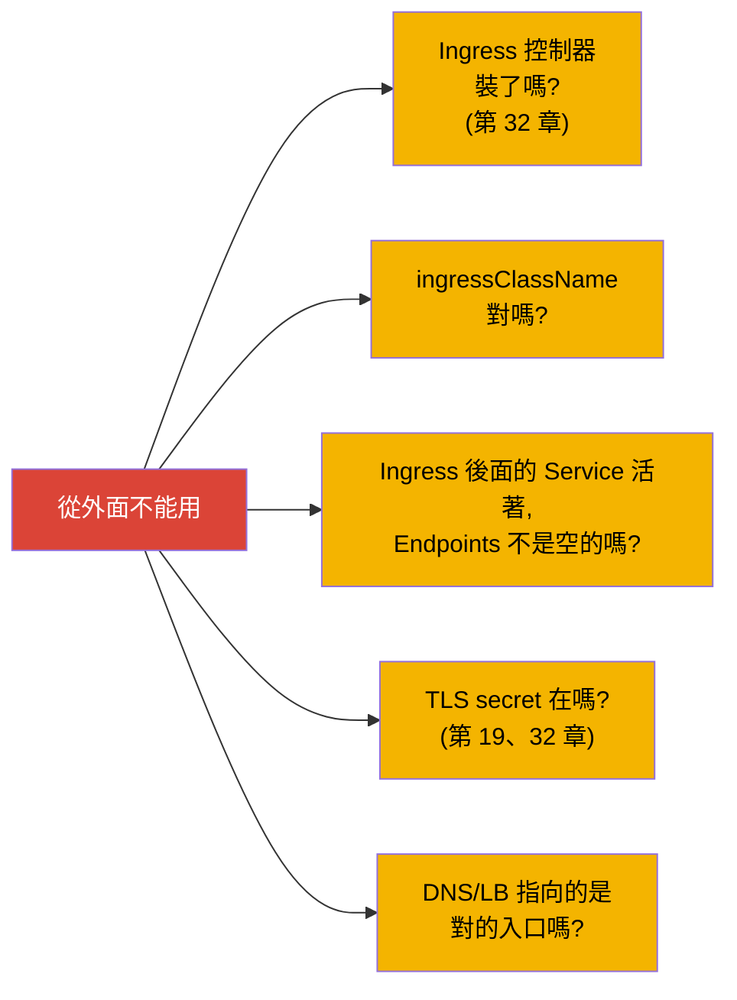
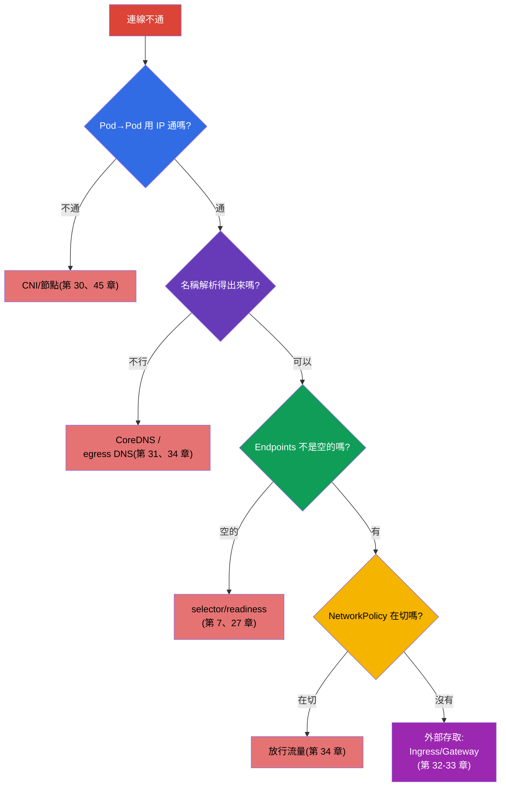

[Русская версия](ru.md) · [Eng version](README.md) · [Versión en español](es.md) · [Version française](fr.md) · [Deutsche Version](de.md) · [ქართული ვერსია](ge.md) · [日本語版](jp.md)

# 第 46 章。服務與網路的除錯

> 🟦 **CKA 章節**(Troubleshooting 領域 - 30%)。網路方面的技能對 CKAD 也很有用。
>
> **接下來是什麼。** 我們用最陰險的主題 - 網路 - 來收尾第 9 部分。「連線不通」可能斷在
> 任何一層:DNS、Service、Endpoints、NetworkPolicy、kube-proxy、CNS。我們會把第 7、
> 30、31、34 章的知識收攏成一套 **逐層演算法**:從「Pod 解析不了名稱」到「服務沒有
> 回應」以及「NetworkPolicy 把一切都擋掉了」。這些是 CKA 裡常見而且高分的題目。

## 46.1. 網路除錯的分層模型

網路要 **由下而上一層一層** 拆 - 不然你會淹沒在各種猜測裡。回想一下整體是怎麼疊起來的
(第 30-31 章):



想法是:一層一層檢查,把問題範圍縮小。IP 連通性通不通?名稱解析得出來嗎?有 Endpoints
嗎?政策有沒有在切?從外面進得來嗎?每一個「不」都指出一層。

## 46.2. 第 1 層:Pod 之間的連通性(CNI)

從最底下開始:Pod 到底能不能用 IP 互相溝通(第 30 章)?

```bash
# Pod 的 IP
kubectl get pods -o wide
# 從一個 Pod 連到另一個 Pod 的 IP
kubectl exec <pod-a> -- ping -c1 <ip-pod-b>
kubectl exec <pod-a> -- curl -s <ip-pod-b>:<port>
```

如果一個 Pod **用 IP** 連不到另一個 Pod - 問題就在 CNI/節點這一層:



如果 IP 連通性是好的,但用名稱不行 - 就往上走,到 DNS。

## 46.3. 第 2 層:DNS(CoreDNS)

檢查名稱解析(第 31 章):

```bash
kubectl exec <pod> -- nslookup backend
kubectl exec <pod> -- nslookup backend.prod.svc.cluster.local
kubectl exec <pod> -- cat /etc/resolv.conf      # nameserver 是哪個、search 網域
kubectl get pods -n kube-system -l k8s-app=kube-dns   # CoreDNS 還活著嗎
kubectl logs -n kube-system -l k8s-app=kube-dns
```



經典的陷阱(第 34 章):default-deny egress 把 DNS(埠 53)擋掉了,然後一切就莫名其妙
「壞掉」。如果名稱解析不出來 - CoreDNS 跟 egress 政策兩邊都要查。

## 46.4. 第 3 層:Service 與 Endpoints

名稱解析得出來,但服務沒有回應 - 那就看 Service ↔ Endpoints 這條連結(第 7 章)。這是
服務問題 **最常見的根源**。

```bash
kubectl get svc backend                 # 服務存在嗎,ClusterIP/埠是什麼
kubectl get endpoints backend           # ← 關鍵:有沒有 Pod 的位址
kubectl describe svc backend            # selector 與 endpoints
```



**空的 Endpoints** 是最主要的症狀:服務沒有綁到任何人。原因有:服務的選擇器跟 Pod 的
標籤不一致,或者 Pod 還沒就緒(readiness,第 27 章)。如果 Endpoints 不是空的但還是
連不通 - 就檢查埠(`port`/`targetPort`,第 7 章)、應用程式有沒有在聽那個埠,以及政策。

## 46.5. 第 4 層:NetworkPolicy

上面幾層都沒問題,但流量就是不通 - 有可能是政策在切(第 34 章):

```bash
kubectl get networkpolicy -n <namespace>
kubectl describe networkpolicy <name> -n <namespace>
```



記得 allow 的邏輯(第 34 章):Pod 一旦被政策選中,就只有明確寫出來的才被允許。檢查需要
的來源有沒有被放行(接收端的 ingress),以及目的地有沒有被放行(來源的 egress)。常見
的錯誤是 default-deny 卻沒有放行需要的流量(還有 DNS)。

## 46.6. 第 5 層:外部存取(Ingress/Gateway)

如果問題是 **從外面** 的存取(第 32-33 章):



外部存取是最上面的一層;在怪 Ingress 之前,先確定內部的 Service 是通的(第 1-4 層)。
對 Service/Pod 做 `port-forward`(第 29 章)有助於搞清楚是哪裡斷掉:如果透過
port-forward 可以但透過 Ingress 不行 - 問題就在 Ingress/入口。

## 46.7. 完整演算法與工具

我們把它收攏成一棵樹 - 這就是網路 troubleshooting 的地圖:



網路除錯的工具:

```bash
# 帶著工具的測試 Pod(對最小化映像 - 用 kubectl debug,第 29 章)
kubectl run test --image=nicolaka/netshoot -it --rm -- sh
# 裡面有:nslookup、curl、ping、dig、netstat、traceroute
kubectl exec <pod> -- nslookup <svc>
kubectl exec <pod> -- curl -sv <svc>:<port>
kubectl get endpoints <svc>
kubectl get networkpolicy -A
```

## 46.8. 這在生產環境中如何應用

- **Endpoints 是第一個檢查點。** 在生產環境裡遇到「服務沒有回應」,值班人員第一件事就是
  看 `kubectl get endpoints`:空的 → 選擇器/readiness。這會省下大量時間,直接把 DNS 跟
  網路排除掉。
- **DNS 是原因排行榜的前段。** 超載的 CoreDNS、錯誤的 resolv.conf、沒放行 DNS 的 egress
  政策 - 都是常見的事故。NodeLocal DNSCache(第 31 章)與謹慎的 egress 政策(第 34 章)
  可以預防它們。
- **分層做法能對抗慌亂。** 網路事故很容易讓人「亂槍打鳥」。「由下而上:IP → DNS →
  Endpoints → 政策 → 入口」這種紀律,能把混亂變成快速的排查。
- **netshoot 與 port-forward。** 生產環境除錯會用帶網路工具的 pod(netshoot)或
  ephemeral 容器(第 29 章),而 `port-forward` 有助於把應用程式的問題跟入口的問題分開。
- **NetworkPolicy 常常是「自己害自己」。** 政策上線之後,壞掉的都是忘記放行的東西
  (DNS、服務之間的流量)。生產環境會測試政策並小心推進,先從觀察(audit)開始,而不是
  一上來就 enforce。

## 46.9. 小詞彙表

- **分層除錯** - 由下而上拆網路:CNI → DNS → Endpoints → 政策 → 入口。
- **Pod 之間的連通性** - Pod 之間能不能用 IP 溝通(CNI 層,第 30 章)。
- **Endpoints** - 服務後面那些 Pod 位址的清單;空的 = 沒有綁到(第 7 章)。
- **nslookup/dig** - 從 Pod 內部檢查 DNS 解析。
- **netshoot** - 帶著網路工具、用來除錯的映像。
- **port-forward** - 轉發埠,繞過入口來做檢查(第 29 章)。
- **default-deny + DNS** - 陷阱:egress 政策把名稱解析切掉了(第 34 章)。

## 46.10. 本章總結

- 網路要由下而上分層除錯:Pod 之間的連通性(CNI)→ DNS(CoreDNS)→ Service/
  Endpoints → NetworkPolicy → Ingress/Gateway。
- 第 1 層:Pod 用 IP ping 不到 Pod → CNI/節點(第 30、45 章)。
- 第 2 層:名稱解析不出來 → CoreDNS、resolv.conf、egress 政策把 DNS:53 切掉了。
- 第 3 層(最常見):服務沒有回應 → `get endpoints`;空的 = 選擇器/readiness。
- 第 4 層:NetworkPolicy 在切流量 → 檢查 allow 規則(還有 DNS)。
- 第 5 層:從外面不能用 → Ingress 控制器、ingressClassName、它後面的 Service、TLS。
- 工具:從內部用 nslookup/curl、`get endpoints`、netshoot/ephemeral、用 port-forward
  做定位。

## 46.11. 這些知識用在哪:考試與實際工作

**在考試上(CKA)。**「為什麼 Pod 連不到服務」、「服務沒有回應」、「DNS 解析不出來」是
troubleshooting(30%)裡常見的高分題。分層演算法加上 `get endpoints` 的反射動作就能解掉
大部分。你需要能踏實地檢查每一層,並且知道 egress-DNS 那個陷阱。

**在實際工作中。** 網路事故是最常見、也最讓人繞不出來的一類。分層的紀律,以及知道
Endpoints 與 DNS 是頭號嫌疑犯,能大幅加快排查。工具(netshoot、port-forward、
ephemeral 容器)與謹慎導入 NetworkPolicy,是可靠營運的日常實務。

## 46.12. 自我檢查問題

1. 為什麼網路要分層除錯,順序是什麼?
2. 怎麼檢查 Pod 之間用 IP 的連通性,不通代表什麼?
3. 遇到「名稱解析不出來」要檢查什麼,egress 政策相關的陷阱是什麼?
4. 為什麼「服務沒有回應」時 `kubectl get endpoints` 是第一個檢查點?清單是空的代表
   什麼?
5. 怎麼判斷流量是被 NetworkPolicy 切掉的,這時候要檢查什麼?
6. 外部存取的問題怎麼除錯,port-forward 能幫上什麼?
7. 叢集內部做網路除錯會用哪些工具?

## 實踐

到這裡第 9 部分(troubleshooting)結束了,連同它,課程裡所有通用與管理相關的內容也都
講完了。剩下第 10 部分:考試準備 - CKAD 的戰術(第 47 章)與 CKA(第 48 章)。網路的
troubleshooting 會在網路相關的實驗與模擬考中練習。

🧪 實驗 118(叢集 DNS/網路的診斷):[tasks/cka/labs/118](../../labs/118/README_TW.MD)

🧪 實驗 123(從零安裝 CNI + 拆解 netns/路由):[tasks/cka/labs/123](../../labs/123/README_TW.MD)

---
[目錄](../README_TW.md) · [第 45 章](../45/tw.md) · [第 47 章](../47/tw.md)
