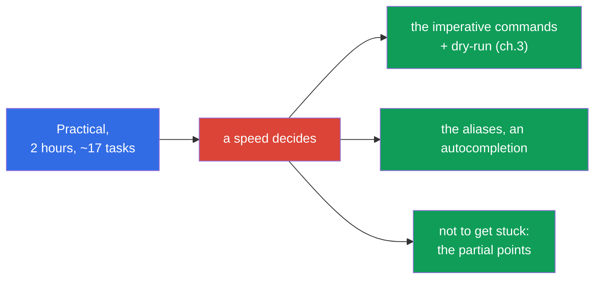
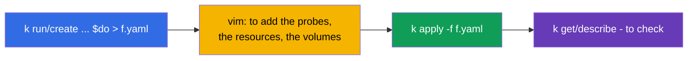
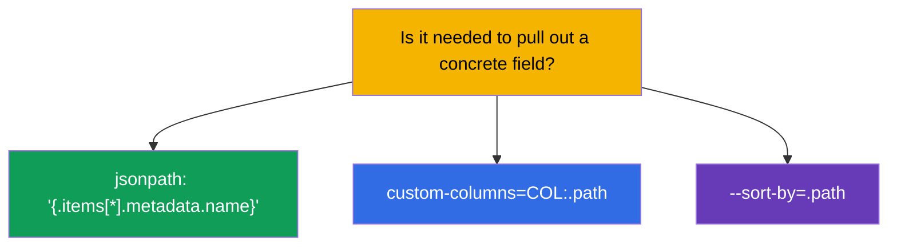
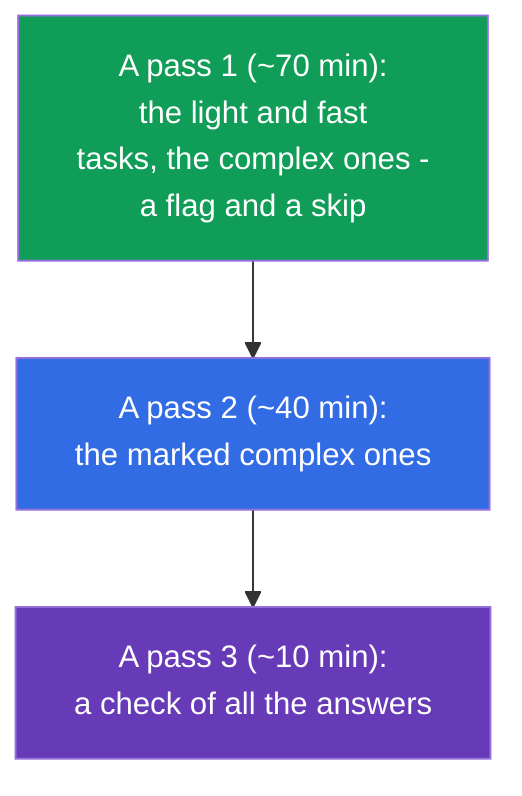
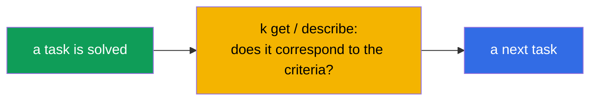
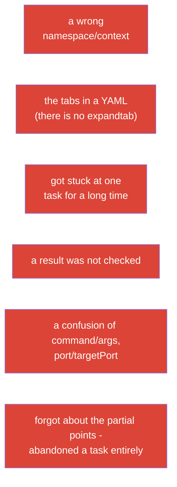

[Русская версия](ru.md) · [Versión en español](es.md) · [Version française](fr.md) · [Deutsche Version](de.md) · [ქართული ვერსია](ge.md) · [繁體中文版](tw.md) · [日本語版](jp.md)

# Chapter 47. The exam CKAD: a format, a time management, JSONPath and a productivity of kubectl

> 🟩 **A chapter for the CKAD.** A tactics of the exam CKA - in the chapter 48; a lot is in common.
>
> **What comes next.** We have got the knowledge - now we will turn it into a passed exam. The CKAD is
> practical, under a timer, and it is failed not because of an ignorance, but because of a slowness and an
> inattentiveness. This chapter is about a tactics: how to set up an environment in the first minutes, how
> to distribute a time, how to quickly generate the manifests and pull out the data through JSONPath.
> All this is a concentrate of the receptions from the chapters 3, 6, 17-24, 27-29.

## 47.1. A format of the CKAD and what it dictates

Let us recall the parameters (the chapter 1) and at once derive a strategy out of them:

| A parameter of the CKAD | A value | What follows out of this |
|---------------|----------|----------------------|
| a duration | 2 hours | ~6-7 minutes per a task - a speed is critical |
| of the tasks | ~15-20 | it is impossible to get stuck |
| a passing score | 66% | not necessarily everything; the partial points are counted |
| a format | a live cluster, a terminal | the hands, and not a theory |
| a documentation | kubernetes.io is allowed | there is no time to search the basics - to know by heart |



## 47.2. The first 3 minutes: a setup of an environment

Before solving the tasks, set up an environment - it will pay off with the dozens of the minutes (the chapter 3):

```bash
alias k=kubectl
export do="--dry-run=client -o yaml"
export now="--force --grace-period=0"
source <(kubectl completion bash)
complete -o default -F __start_kubectl k
# vim for a YAML - it is critical
echo 'set tabstop=2 shiftwidth=2 expandtab' >> ~/.vimrc
export KUBE_EDITOR=vim
```


> **vim expandtab - it is obligatory.** A YAML does not tolerate the tabs (the chapter 3). Without an `expandtab` you
> catch the parsing errors and lose a time. This is a first thing which is set up.

## 47.3. A rule №1: switch a context and a namespace

Every task specifies a cluster and a namespace. To forget means to do it in a wrong place (the chapter 6):

```bash
kubectl config use-context <from a task>             # THE FIRST thing in a task
kubectl config set-context --current --namespace=<ns>  # if there are many tasks in one ns
```

Or add a `-n <ns>` into every command. The most annoying loss of the points at the CKAD is a correct
solution in a wrong namespace.

## 47.4. A speed through an imperative and a dry-run

Do not write a YAML from a scratch. Generate a skeleton imperatively (the chapter 3) and add what is needed:

```bash
# A pod with a command
k run nginx --image=nginx $do > pod.yaml

# Deployment
k create deploy web --image=nginx --replicas=3 $do > deploy.yaml

# Service
k expose deploy web --port=80 $do > svc.yaml

# ConfigMap / Secret
k create cm app --from-literal=COLOR=blue $do > cm.yaml
k create secret generic db --from-literal=pass=x $do > sec.yaml

# Job / CronJob
k create job pi --image=perl $do > job.yaml
k create cronjob backup --image=busybox --schedule="*/5 * * * *" $do > cj.yaml
```



For the fields which are absent in the imperative flags (the probes, the volumes, a securityContext), - recall
a `kubectl explain` (the chapter 3) or search an example at kubernetes.io and paste it.

## 47.5. JSONPath and custom-columns

A part of the tasks asks to "output the names/the fields into a file". Here a JSONPath is needed (the chapter 3):

```bash
# the names of all the pods
k get pods -o jsonpath='{.items[*].metadata.name}'

# the images of the containers
k get pods -o jsonpath='{.items[*].spec.containers[*].image}'

# to sort
k get pods --sort-by=.metadata.creationTimestamp

# the InternalIP of the nodes
k get nodes -o jsonpath='{.items[*].status.addresses[?(@.type=="InternalIP")].address}'

# an own table
k get pods -o custom-columns=NAME:.metadata.name,STATUS:.status.phase
```



A JSONPath does not have to be crammed by heart - but the basic templates (`.items[*].metadata.name`, a filter
`[?(@.type=="...")]`) are worth to be trained up to an automatism.

## 47.6. A time management: three passes

15-20 tasks for 2 hours. A strategy is not to go linearly, but in three passes:



- **Prioritize the fast and the familiar tasks.** Earlier at every task they showed its
  weight (a percent), but in an actual format of the exam a weight is **not displayed**. Therefore go
  from a confidence and a speed: at first that thing which is solved fast and for sure, and a laborious and an
  unfamiliar one - into a next pass.
- **Do not get stuck.** You have got stuck for 5+ minutes - a flag and further (the partial points could already
  have been received).
- **Leave a time for a check** - the stupid errors (a wrong namespace, a typo) cost the points.

## 47.7. Check yourself

After every task - a fast check, that exactly that thing is done which was asked:

```bash
k get <resource> -n <ns>              # does it exist?
k describe <resource> <name> -n <ns>  # the needed fields?
k get pod <name> -o yaml | grep <searched>
k logs <pod>                          # if it is about a behaviour
```



Especially check the tasks where it is "to delete and to recreate" (some fields of a pod are immutable,
the chapter 3): make sure, that a new object is really created and works.

## 47.8. A top of the errors at the CKAD



The most of the failures of the CKAD are not about an ignorance, but about these organizational errors. Their
prevention (a setup of an environment, a discipline of a namespace, three passes, a check) gives
more points than a cramming.

## 47.9. What to repeat before the CKAD (a map of the chapters)

The CKAD domains and where they lie down in the course:

| A domain of the CKAD | The chapters of the course |
|------------|-------------|
| Application Design and Build (20%) | 4-5, 10-11, 22-24 (the pods, Jobs/CronJob, DaemonSet/StatefulSet, multi-container, the images, the volumes) |
| Application Deployment (20%) | 8-9 (rolling update, canary/blue-green), 42-43 (Helm/Kustomize) |
| Observability and Maintenance (15%) | 27-29 (the probes, the logs/the metrics, a debugging, the deprecations) |
| Environment, Config, Security (25%) | 14, 17-21, 41 (the resources, env, ConfigMap/Secret, SecurityContext, SA, CRD) |
| Services and Networking (20%) | 6-7, 32, 34 (the labels, Service, Ingress, NetworkPolicy) |

## 47.10. A mini glossary

- **$do / $now** - the helpers `--dry-run=client -o yaml` / a fast deletion.
- **JSONPath** - a selection of the fields out of an answer of an API (`-o jsonpath`).
- **custom-columns** - an own table of an output.
- **three passes** - a strategy of a time: the light ones → the complex ones → a check.
- **a weight of a task** - a share of the points, a hint of a priority.
- **the partial points** - a partially fulfilled thing is counted.
- **expandtab** - a setting of a vim (the spaces instead of the tabs) for a YAML.

## 47.11. The conclusions of the chapter

- The CKAD is practical, 2 hours, ~17 tasks, a threshold of 66%, the partial points - everything is decided by a speed
  and an attentiveness.
- The first minutes: an alias `k`, `$do`/`$now`, an autocompletion, a vim with an expandtab.
- In every task at first to switch a context/a namespace - otherwise a solution is in a wrong place.
- A speed is through an imperative + `$do` (a generation of a skeleton) and a refinement in a vim; the fields -
  `explain`/docs.
- JSONPath/custom-columns - for the tasks "output the fields"; to train the basic templates.
- A time management: three passes, to look at a weight of the tasks, not to get stuck, to leave a time for a
  check.
- A top of the failures is the organizational ones (a namespace, the tabs, a getting stuck, an absence of a check), and not
  an ignorance.

## 47.12. How this will come in handy: at an exam and in a real work

**At an exam (CKAD).** This is a direct instruction on a passing: a setup of an environment, a discipline of a
namespace, an imperative generation, JSONPath and a time management - that thing which turns the knowledge into a
passing score. Repeat a map of the chapters by the domains (47.9) before an exam.

**In a real work.** The same skills (a fast kubectl, a dry-run, JSONPath, a habit
to check a namespace and a result) - this is an everyday productivity of an engineer. A speed and
an accuracy in a terminal save a time and prevent the errors in a prod.

## 47.13. The questions for a self-check

1. What to set up in the first minutes of an exam and why is an expandtab critical?
2. Why is a switching of a context/of a namespace a rule №1 in every task?
3. How to fast get a skeleton of a manifest for a pod/a deploy/a service?
4. How to output the names of all the pods through a JSONPath? And the InternalIP of the nodes?
5. What is an essence of a strategy of three passes and why to look at a weight of a task?
6. Why is it impossible to get stuck and how are the partial points connected with a strategy?
7. Name a top of the organizational errors at the CKAD and how to avoid them.

## Practice

The best preparation for the CKAD is a run of the mock exams under a timer (`tasks/ckad/mock`) with
an autocheck. Practise a setup of an environment, three passes and a self-check at the real
tasks. Further is a last chapter: a tactics of the CKA (the chapter 48).

🧪 A lab 119 (the drills on a speed and a JSONPath): [tasks/cka/labs/119](../../labs/119/README.MD)

🧪 The mock exams of the CKAD: [tasks/ckad/mock](../../../ckad/mock)

🎮 Killercoda (in a browser, no setup): [Playground](https://killercoda.com/chadmcrowell/course/ckad/playground)

---
[Contents](../README.md) · [Chapter 46](../46/README.md) · [Chapter 48](../48/README.md)
