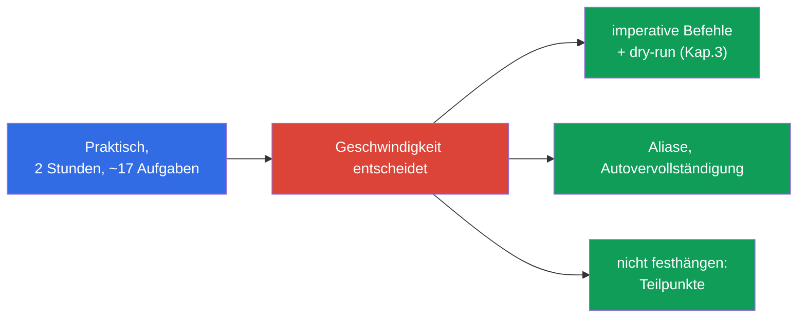
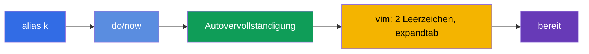
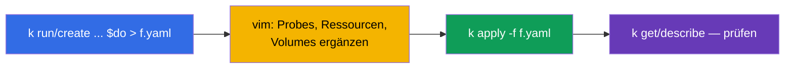
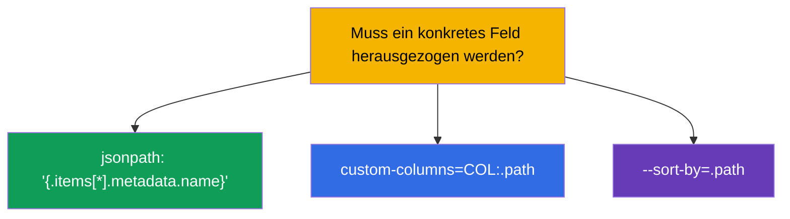
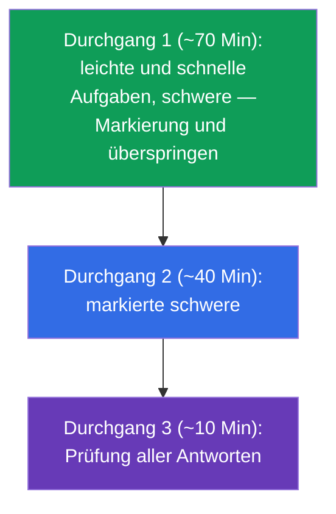
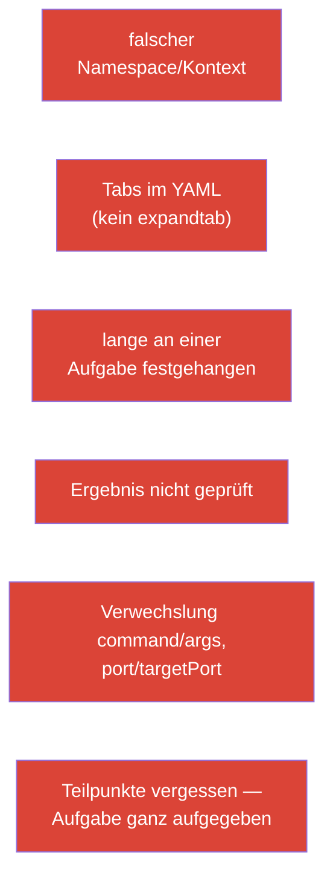

[Русская версия](ru.md) · [Eng version](README.md) · [Versión en español](es.md) · [Version française](fr.md) · [ქართული ვერსია](ge.md) · [繁體中文版](tw.md) · [日本語版](jp.md)

# Kapitel 47. Prüfung CKAD: Format, Zeitmanagement, JSONPath und Produktivität von kubectl

> 🟩 **Kapitel für CKAD.** Die Taktik der Prüfung CKA - in Kapitel 48; viel ist gemeinsam.
>
> **Was kommt.** Das Wissen haben wir - jetzt verwandeln wir es in eine bestandene Prüfung. CKAD ist
> praktisch, unter der Uhr, und man fällt nicht wegen Unwissen durch, sondern wegen Langsamkeit und
> Unachtsamkeit. Dieses Kapitel dreht sich um Taktik: wie man die Umgebung in den ersten Minuten
> einrichtet, die Zeit einteilt, schnell Manifeste generiert und Daten per JSONPath herauszieht. All
> das ist das Konzentrat der Techniken aus den Kapiteln 3, 6, 17-24, 27-29.

## 47.1. Das Format von CKAD und was es vorgibt

Erinnern wir uns an die Parameter (Kapitel 1) und leiten daraus sofort die Strategie ab:

| Parameter CKAD | Wert | Was daraus folgt |
|---------------|----------|----------------------|
| Dauer | 2 Stunden | ~6-7 Minuten pro Aufgabe - Geschwindigkeit ist kritisch |
| Aufgaben | ~15-20 | man darf nicht festhängen |
| Bestehensgrenze | 66% | nicht alles ist nötig; Teilpunkte werden angerechnet |
| Format | lebendiger Cluster, Terminal | Hände, nicht Theorie |
| Dokumentation | kubernetes.io erlaubt | für Grundlagen ist keine Zeit - man muss sie auswendig kennen |



## 47.2. Die ersten 3 Minuten: Einrichtung der Umgebung

Bevor Sie Aufgaben lösen, richten Sie die Umgebung ein - das zahlt sich vielfach aus (Kapitel 3):

```bash
alias k=kubectl
export do="--dry-run=client -o yaml"
export now="--force --grace-period=0"
source <(kubectl completion bash)
complete -o default -F __start_kubectl k
# vim für YAML — kritisch
echo 'set tabstop=2 shiftwidth=2 expandtab' >> ~/.vimrc
export KUBE_EDITOR=vim
```



> **vim expandtab - Pflicht.** YAML verträgt keine Tabs (Kapitel 3). Ohne `expandtab` fangen Sie
> Parsing-Fehler ein und verlieren Zeit. Das ist das Erste, was man einrichtet.

## 47.3. Regel Nr. 1: Kontext und Namespace umschalten

Jede Aufgabe nennt Cluster und Namespace. Vergessen heißt, es am falschen Ort zu tun (Kapitel 6):

```bash
kubectl config use-context <aus der Aufgabe>            # ALS ERSTES in der Aufgabe
kubectl config set-context --current --namespace=<ns>  # wenn viele Aufgaben im selben ns
```

Oder fügen Sie `-n <ns>` in jeden Befehl ein. Der ärgerlichste Punktverlust bei CKAD ist eine
richtige Lösung im falschen Namespace.

## 47.4. Geschwindigkeit durch Imperativ und dry-run

Schreiben Sie YAML nicht von Null. Generieren Sie das Skelett imperativ (Kapitel 3) und ergänzen es:

```bash
# Pod mit Befehl
k run nginx --image=nginx $do > pod.yaml

# Deployment
k create deploy web --image=nginx --replicas=3 $do > deploy.yaml

# Service
k expose deploy web --port=80 $do > svc.yaml

# ConfigMap / Secret
k create cm app --from-literal=COLOR=blue $do > cm.yaml
k create secret generic db --from-literal=pass=x $do > sec.yaml

# Job / CronJob
k create job pi --image=perl $do > job.yaml
k create cronjob backup --image=busybox --schedule="*/5 * * * *" $do > cj.yaml
```



Für Felder ohne imperative Flags (Probes, Volumes, securityContext) - erinnern Sie sich an
`kubectl explain` (Kapitel 3) oder suchen Sie ein Beispiel auf kubernetes.io und fügen es ein.

## 47.5. JSONPath und custom-columns

Ein Teil der Aufgaben verlangt „gib Namen/Felder in eine Datei aus“. Hier braucht man JSONPath (Kapitel 3):

```bash
# Namen aller Pods
k get pods -o jsonpath='{.items[*].metadata.name}'

# Images der Container
k get pods -o jsonpath='{.items[*].spec.containers[*].image}'

# sortieren
k get pods --sort-by=.metadata.creationTimestamp

# InternalIP der Nodes
k get nodes -o jsonpath='{.items[*].status.addresses[?(@.type=="InternalIP")].address}'

# eigene Tabelle
k get pods -o custom-columns=NAME:.metadata.name,STATUS:.status.phase
```



JSONPath muss man nicht auswendig lernen - aber die Basis-Muster (`.items[*].metadata.name`, den
Filter `[?(@.type=="...")]`) sollte man bis zur Automatik trainieren.

## 47.6. Zeitmanagement: drei Durchgänge

15-20 Aufgaben in 2 Stunden. Die Strategie - nicht linear vorgehen, sondern in drei Durchgängen:



- **Priorisieren Sie schnelle und bekannte Aufgaben.** Früher zeigte man bei jeder Aufgabe ihr
  Gewicht (Prozent), aber im aktuellen Format der Prüfung wird das Gewicht **nicht angezeigt**.
  Gehen Sie deshalb nach Sicherheit und Geschwindigkeit: zuerst das, was schnell und garantiert
  gelöst wird, und das Aufwändige und Unbekannte - in den nächsten Durchgang.
- **Hängen Sie nicht fest.** 5+ Minuten festgehangen - Markierung und weiter (Teilpunkte konnten
  schon erreicht sein).
- **Lassen Sie Zeit zum Prüfen** - dumme Fehler (falscher Namespace, Tippfehler) kosten Punkte.

## 47.7. Prüfen Sie sich selbst

Nach jeder Aufgabe eine schnelle Prüfung, dass genau das getan wurde, was verlangt war:

```bash
k get <resource> -n <ns>              # existiert es?
k describe <resource> <name> -n <ns>  # die nötigen Felder?
k get pod <name> -o yaml | grep <gesuchtes>
k logs <pod>                          # wenn es um Verhalten geht
```


Prüfen Sie besonders Aufgaben mit „löschen und neu erstellen“ (manche Felder eines Pods sind
unveränderlich, Kapitel 3): das neue Objekt muss wirklich erstellt sein und funktionieren.

## 47.8. Top-Fehler bei CKAD



Die meisten Misserfolge bei CKAD drehen sich nicht um Unwissen, sondern um diese
organisatorischen Fehler. Ihre Vorbeugung (Einrichtung der Umgebung, Namespace-Disziplin, drei
Durchgänge, Prüfung) bringt mehr Punkte als Auswendiglernen.

## 47.9. Was man vor CKAD wiederholen sollte (Karte der Kapitel)

Die CKAD-Domänen und wo sie im Kurs liegen:

| Domäne CKAD | Kapitel des Kurses |
|------------|-------------|
| Application Design and Build (20%) | 4-5, 10-11, 22-24 (Pods, Jobs/CronJob, DaemonSet/StatefulSet, multi-container, Images, Volumes) |
| Application Deployment (20%) | 8-9 (rolling update, canary/blue-green), 42-43 (Helm/Kustomize) |
| Observability and Maintenance (15%) | 27-29 (Probes, Logs/Metriken, Debugging, deprecations) |
| Environment, Config, Security (25%) | 14, 17-21, 41 (Ressourcen, env, ConfigMap/Secret, SecurityContext, SA, CRD) |
| Services and Networking (20%) | 6-7, 32, 34 (Labels, Service, Ingress, NetworkPolicy) |

## 47.10. Mini-Glossar

- **$do / $now** - Helfer `--dry-run=client -o yaml` / schnelles Löschen.
- **JSONPath** - Auswahl von Feldern aus der Antwort der API (`-o jsonpath`).
- **custom-columns** - eigene Tabelle der Ausgabe.
- **drei Durchgänge** - Zeitstrategie: leichte → schwere → Prüfung.
- **Gewicht der Aufgabe** - Anteil der Punkte, Hinweis auf die Priorität.
- **Teilpunkte** - teilweise Erledigtes wird angerechnet.
- **expandtab** - Einstellung von vim (Leerzeichen statt Tabs) für YAML.

## 47.11. Zusammenfassung des Kapitels

- CKAD ist praktisch, 2 Stunden, ~17 Aufgaben, Grenze 66%, Teilpunkte - alles entscheiden
  Geschwindigkeit und Aufmerksamkeit.
- Die ersten Minuten: alias `k`, `$do`/`$now`, Autovervollständigung, vim mit expandtab.
- In jeder Aufgabe zuerst Kontext/Namespace umschalten - sonst liegt die Lösung an der falschen Stelle.
- Geschwindigkeit - durch Imperativ + `$do` (Generierung des Skeletts) und Nacharbeit in vim;
  Felder - `explain`/docs.
- JSONPath/custom-columns - für Aufgaben „gib die Felder aus“; die Basis-Muster trainieren.
- Zeitmanagement: drei Durchgänge, auf das Gewicht der Aufgaben schauen, nicht festhängen, Zeit
  für die Prüfung lassen.
- Die Top-Misserfolge sind organisatorisch (Namespace, Tabs, Festhängen, fehlende Prüfung), nicht
  Unwissen.

## 47.12. Wofür das nützlich ist: in der Prüfung und in der echten Arbeit

**In der Prüfung (CKAD).** Das ist die direkte Anleitung zum Bestehen: Einrichtung der Umgebung,
Namespace-Disziplin, imperative Generierung, JSONPath und Zeitmanagement - das, was Wissen in eine
bestandene Note verwandelt. Wiederholen Sie vor der Prüfung die Karte der Kapitel (47.9).

**In der echten Arbeit.** Dieselben Fähigkeiten (schnelles kubectl, dry-run, JSONPath, die
Gewohnheit, Namespace und Ergebnis zu prüfen) sind die alltägliche Produktivität eines Ingenieurs.
Geschwindigkeit und Sorgfalt im Terminal sparen Zeit und verhindern Fehler in der Produktion.

## 47.13. Fragen zur Selbstüberprüfung

1. Was richtet man in den ersten Minuten der Prüfung ein und warum ist expandtab kritisch?
2. Warum ist das Umschalten von Kontext/Namespace die Regel Nr. 1 in jeder Aufgabe?
3. Wie erhält man schnell das Skelett eines Manifests für Pod/Deployment/Service?
4. Wie gibt man per JSONPath die Namen aller Pods aus? Und die InternalIP der Nodes?
5. Worin besteht das Wesen der Strategie der drei Durchgänge und warum schaut man auf das Gewicht der Aufgabe?
6. Warum darf man nicht festhängen und wie hängen Teilpunkte mit der Strategie zusammen?
7. Nennen Sie die Top-organisatorischen Fehler bei CKAD und wie man sie vermeidet.

## Praxis

Die beste Vorbereitung auf CKAD ist das Durchspielen von Mock-Prüfungen unter der Uhr
(`tasks/ckad/mock`) mit Autoprüfung. Üben Sie Einrichtung der Umgebung, drei Durchgänge und
Selbstüberprüfung an echten Aufgaben. Weiter: das letzte Kapitel - Taktik für CKA (Kapitel 48).

🧪 Lab 119 (Drills für Geschwindigkeit und JSONPath): [tasks/cka/labs/119](../../labs/119/README_DE.MD)

🧪 Mock-Prüfungen CKAD: [tasks/ckad/mock](../../../ckad/mock)

---
[Inhalt](../README_DE.md) · [Kapitel 46](../46/de.md) · [Kapitel 48](../48/de.md)
