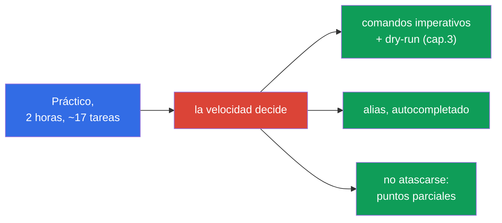
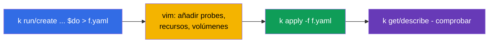
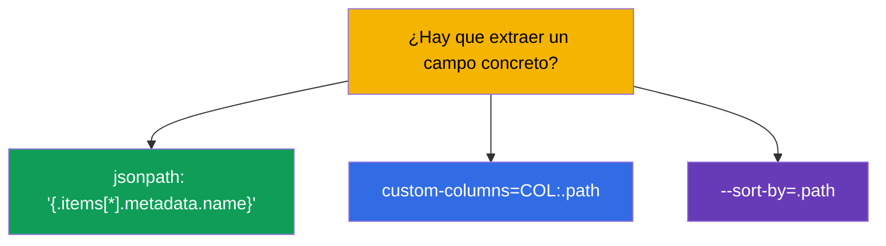
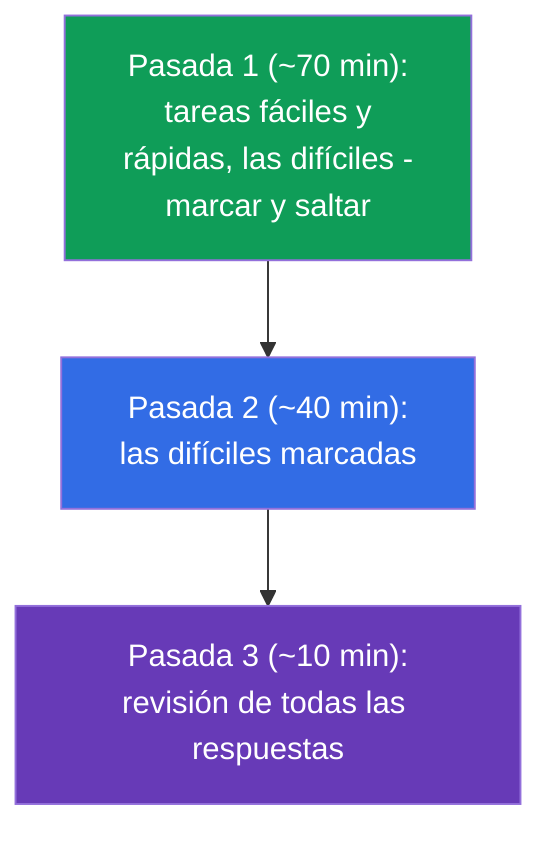
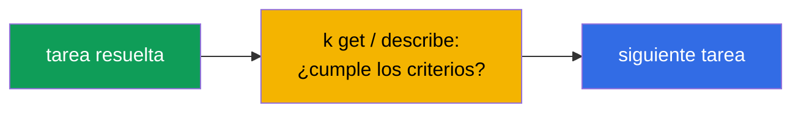
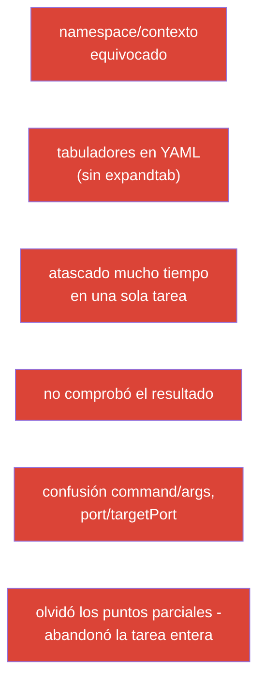

[Русская версия](ru.md) · [Eng version](README.md) · [Version française](fr.md) · [Deutsche Version](de.md) · [ქართული ვერსია](ge.md) · [繁體中文版](tw.md) · [日本語版](jp.md)

# Capítulo 47. Examen CKAD: formato, gestión del tiempo, JSONPath y productividad con kubectl

> 🟩 **Capítulo para CKAD.** La táctica del examen CKA está en el capítulo 48; hay mucho en común.
>
> **Qué viene ahora.** El conocimiento ya lo tenemos - ahora toca convertirlo en un examen aprobado. El CKAD es
> práctico, con cronómetro, y se suspende no por falta de saber, sino por lentitud y
> despiste. Este capítulo va de táctica: cómo preparar el entorno en los primeros minutos, cómo
> repartir el tiempo, cómo generar manifiestos rápido y extraer datos con JSONPath.
> Todo esto es un concentrado de trucos de los capítulos 3, 6, 17-24, 27-29.

## 47.1. El formato del CKAD y qué impone

Recordemos los parámetros (capítulo 1) y saquemos de ellos la estrategia:

| Parámetro del CKAD | Valor | Qué se deduce de ello |
|---------------|----------|----------------------|
| duración | 2 horas | ~6-7 minutos por tarea - la velocidad es crítica |
| tareas | ~15-20 | no se puede atascarse |
| nota de aprobado | 66% | no hace falta todo; los puntos parciales cuentan |
| formato | clúster real, terminal | manos, no teoría |
| documentación | kubernetes.io permitida | no hay tiempo de buscar lo básico - hay que sabérselo |



## 47.2. Los primeros 3 minutos: preparar el entorno

Antes de resolver tareas, prepara el entorno - se amortiza en decenas de minutos (capítulo 3):

```bash
alias k=kubectl
export do="--dry-run=client -o yaml"
export now="--force --grace-period=0"
source <(kubectl completion bash)
complete -o default -F __start_kubectl k
# vim para YAML - crítico
echo 'set tabstop=2 shiftwidth=2 expandtab' >> ~/.vimrc
export KUBE_EDITOR=vim
```


> **vim expandtab - obligatorio.** YAML no tolera tabuladores (capítulo 3). Sin `expandtab` te
> comes errores de parseo y pierdes tiempo. Es lo primero que se configura.

## 47.3. Regla nº1: cambia de contexto y de namespace

Cada tarea indica el clúster y el namespace. Olvidarlo significa hacerlo donde no toca (capítulo 6):

```bash
kubectl config use-context <del enunciado>              # LO PRIMERO en cada tarea
kubectl config set-context --current --namespace=<ns>  # si hay muchas tareas en el mismo ns
```

O añade `-n <ns>` a cada comando. La pérdida de puntos más rabiosa del CKAD es una solución
correcta en el namespace equivocado.

## 47.4. Velocidad con imperativo y dry-run

No escribas YAML desde cero. Genera el esqueleto de forma imperativa (capítulo 3) y añade lo que falte:

```bash
# Pod con comando
k run nginx --image=nginx $do > pod.yaml

# Deployment
k create deploy web --image=nginx --replicas=3 $do > deploy.yaml

# Service
k expose deploy web --port=80 $do > svc.yaml

# ConfigMap / Secret
k create cm app --from-literal=COLOR=blue $do > cm.yaml
k create secret generic db --from-literal=pass=x $do > sec.yaml

# Job / CronJob
k create job pi --image=perl $do > job.yaml
k create cronjob backup --image=busybox --schedule="*/5 * * * *" $do > cj.yaml
```



Para los campos que no tienen flag imperativo (probes, volúmenes, securityContext) - acuérdate de
`kubectl explain` (capítulo 3) o busca un ejemplo en kubernetes.io y pégalo.

## 47.5. JSONPath y custom-columns

Parte de las tareas pide «saca los nombres/campos a un fichero». Ahí hace falta JSONPath (capítulo 3):

```bash
# nombres de todos los pods
k get pods -o jsonpath='{.items[*].metadata.name}'

# imágenes de los contenedores
k get pods -o jsonpath='{.items[*].spec.containers[*].image}'

# ordenar
k get pods --sort-by=.metadata.creationTimestamp

# InternalIP de los nodos
k get nodes -o jsonpath='{.items[*].status.addresses[?(@.type=="InternalIP")].address}'

# tabla propia
k get pods -o custom-columns=NAME:.metadata.name,STATUS:.status.phase
```



JSONPath no hay que memorizarlo entero - pero las plantillas básicas (`.items[*].metadata.name`, el filtro
`[?(@.type=="...")]`) conviene entrenarlas hasta el automatismo.

## 47.6. Gestión del tiempo: tres pasadas

15-20 tareas en 2 horas. La estrategia no es ir en línea recta, sino en tres pasadas:



- **Prioriza las tareas rápidas y conocidas.** Antes se mostraba en cada tarea su
  peso (porcentaje), pero en el formato actual del examen el peso **no se muestra**. Así que ve
  por confianza y velocidad: primero lo que se resuelve rápido y seguro, y lo laborioso y
  desconocido - a la pasada siguiente.
- **No te atasques.** Llevas 5+ minutos atascado - marca y sigue (los puntos parciales ya
  puedes tenerlos).
- **Deja tiempo para revisar** - los fallos tontos (namespace equivocado, una errata) cuestan puntos.

## 47.7. Compruébate a ti mismo

Tras cada tarea, una comprobación rápida de que has hecho exactamente lo que pedían:

```bash
k get <resource> -n <ns>              # ¿existe?
k describe <resource> <name> -n <ns>  # ¿los campos necesarios?
k get pod <name> -o yaml | grep <lo buscado>
k logs <pod>                          # si va de comportamiento
```



Comprueba sobre todo las tareas de «borrar y recrear» (algunos campos del pod son inmutables,
capítulo 3): asegúrate de que el objeto nuevo se ha creado de verdad y funciona.

## 47.8. Top de errores en el CKAD



La mayoría de los suspensos del CKAD no van de desconocimiento, sino de estos errores de organización. Su
prevención (preparar el entorno, disciplina de namespace, tres pasadas, comprobar) da
más puntos que empollar.

## 47.9. Qué repasar antes del CKAD (mapa de capítulos)

Los dominios del CKAD y dónde encajan en el curso:

| Dominio del CKAD | Capítulos del curso |
|------------|-------------|
| Application Design and Build (20%) | 4-5, 10-11, 22-24 (pods, Jobs/CronJob, DaemonSet/StatefulSet, multi-container, imágenes, volúmenes) |
| Application Deployment (20%) | 8-9 (rolling update, canary/blue-green), 42-43 (Helm/Kustomize) |
| Observability and Maintenance (15%) | 27-29 (probes, logs/métricas, depuración, deprecations) |
| Environment, Config, Security (25%) | 14, 17-21, 41 (recursos, env, ConfigMap/Secret, SecurityContext, SA, CRD) |
| Services and Networking (20%) | 6-7, 32, 34 (etiquetas, Service, Ingress, NetworkPolicy) |

## 47.10. Mini-glosario

- **$do / $now** - helpers para `--dry-run=client -o yaml` / borrado rápido.
- **JSONPath** - selección de campos de la respuesta de la API (`-o jsonpath`).
- **custom-columns** - tabla de salida propia.
- **tres pasadas** - estrategia de tiempo: fáciles → difíciles → revisión.
- **peso de la tarea** - proporción de puntos, pista de prioridad.
- **puntos parciales** - se cuenta lo hecho parcialmente.
- **expandtab** - ajuste de vim (espacios en vez de tabuladores) para YAML.

## 47.11. Resumen del capítulo

- El CKAD es práctico, 2 horas, ~17 tareas, umbral 66%, con puntos parciales - lo deciden la velocidad
  y la atención.
- Primeros minutos: alias `k`, `$do`/`$now`, autocompletado, vim con expandtab.
- En cada tarea, primero cambiar de contexto/namespace - si no, la solución acaba donde no toca.
- La velocidad viene del imperativo + `$do` (generar el esqueleto) y el retoque en vim; los campos -
  `explain`/docs.
- JSONPath/custom-columns - para las tareas de «saca los campos»; entrenar las plantillas básicas.
- Gestión del tiempo: tres pasadas, mirar el peso de las tareas, no atascarse, dejar tiempo para
  revisar.
- El top de suspensos es organizativo (namespace, tabuladores, atascarse, falta de comprobación), no de
  desconocimiento.

## 47.12. Para qué sirve esto: en el examen y en el trabajo real

**En el examen (CKAD).** Es la instrucción directa para aprobar: preparación del entorno, disciplina de
namespace, generación imperativa, JSONPath y gestión del tiempo - lo que convierte el conocimiento en
una nota de aprobado. Repasa el mapa de capítulos por dominios (47.9) antes del examen.

**En el trabajo real.** Las mismas habilidades (kubectl rápido, dry-run, JSONPath, la costumbre de
comprobar el namespace y el resultado) son la productividad diaria de un ingeniero. Velocidad y
precisión en el terminal ahorran tiempo y evitan errores en producción.

## 47.13. Preguntas de autocomprobación

1. ¿Qué configurar en los primeros minutos del examen y por qué expandtab es crítico?
2. ¿Por qué cambiar de contexto/namespace es la regla nº1 en cada tarea?
3. ¿Cómo obtener rápido el esqueleto de un manifiesto de pod/deployment/service?
4. ¿Cómo sacar con JSONPath los nombres de todos los pods? ¿Y la InternalIP de los nodos?
5. ¿En qué consiste la estrategia de tres pasadas y para qué mirar el peso de la tarea?
6. ¿Por qué no hay que atascarse y cómo se relacionan los puntos parciales con la estrategia?
7. Nombra el top de errores de organización del CKAD y cómo evitarlos.

## Práctica

La mejor preparación para el CKAD es pasar exámenes simulados con cronómetro (`tasks/ckad/mock`) con
autocorrección. Practica la preparación del entorno, las tres pasadas y la autocomprobación con tareas
reales. Luego viene el último capítulo: la táctica del CKA (capítulo 48).

🧪 Laboratorio 119 (drills de velocidad y JSONPath): [tasks/cka/labs/119](../../labs/119/README_ES.MD)

🧪 Exámenes simulados del CKAD: [tasks/ckad/mock](../../../ckad/mock)

🎮 Killercoda (en el navegador, sin instalación): [Playground](https://killercoda.com/chadmcrowell/course/ckad/playground)

---
[Índice](../README_ES.md) · [Capítulo 46](../46/es.md) · [Capítulo 48](../48/es.md)
