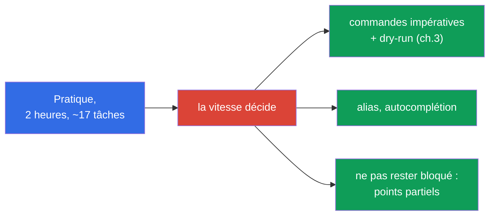
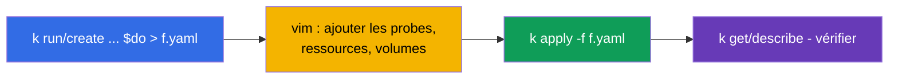
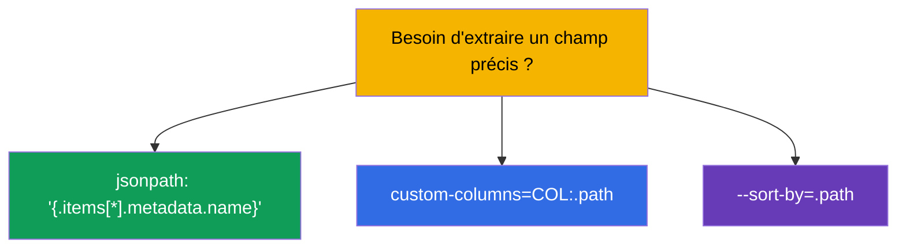
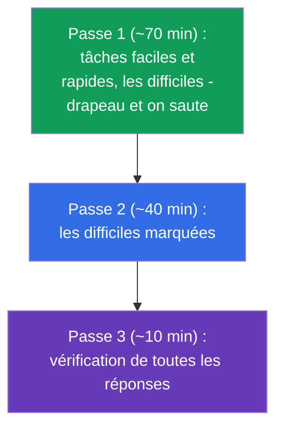
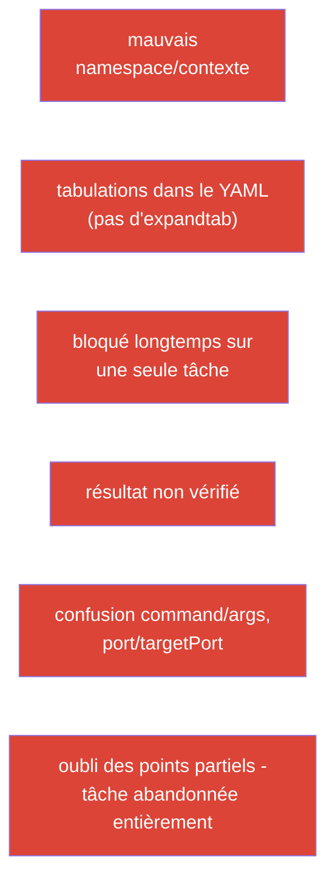

[Русская версия](ru.md) · [Eng version](README.md) · [Versión en español](es.md) · [Deutsche Version](de.md) · [ქართული ვერსია](ge.md) · [繁體中文版](tw.md) · [日本語版](jp.md)

# Chapitre 47. L'examen CKAD : format, gestion du temps, JSONPath et productivité kubectl

> 🟩 **Chapitre pour le CKAD.** La tactique de l'examen CKA - au chapitre 48 ; beaucoup est commun.
>
> **Ce qui suit.** Les connaissances sont là - transformons-les maintenant en examen réussi. Le CKAD
> est pratique, sous chronomètre, et on l'échoue non par ignorance, mais par lenteur et
> inattention. Ce chapitre porte sur la tactique : comment configurer l'environnement dans les
> premières minutes, comment répartir le temps, comment générer vite des manifestes et extraire les
> données via JSONPath. Tout cela - un concentré des techniques des chapitres 3, 6, 17-24, 27-29.

## 47.1. Le format du CKAD et ce qu'il impose

Rappelons les paramètres (chapitre 1) et déduisons-en tout de suite la stratégie :

| Paramètre du CKAD | Valeur | Ce qui en découle |
|---------------|----------|----------------------|
| durée | 2 heures | ~6-7 minutes par tâche - la vitesse est critique |
| tâches | ~15-20 | on ne peut pas rester bloqué |
| score de passage | 66% | pas besoin de tout faire ; les points partiels comptent |
| format | cluster réel, terminal | de la pratique, pas de la théorie |
| documentation | kubernetes.io autorisée | pas le temps de chercher les bases - les connaître par cœur |



## 47.2. Les 3 premières minutes : configurer l'environnement

Avant de résoudre les tâches, configurez l'environnement - cela sera remboursé en dizaines de minutes (chapitre 3) :

```bash
alias k=kubectl
export do="--dry-run=client -o yaml"
export now="--force --grace-period=0"
source <(kubectl completion bash)
complete -o default -F __start_kubectl k
# vim pour YAML - critique
echo 'set tabstop=2 shiftwidth=2 expandtab' >> ~/.vimrc
export KUBE_EDITOR=vim
```


> **vim expandtab - obligatoire.** YAML ne supporte pas les tabulations (chapitre 3). Sans
> `expandtab` vous accumulez des erreurs de parsing et perdez du temps. C'est la première chose à régler.

## 47.3. Règle n°1 : changer de contexte et de namespace

Chaque tâche indique le cluster et le namespace. L'oublier - c'est agir au mauvais endroit (chapitre 6) :

```bash
kubectl config use-context <de l'énoncé>             # EN PREMIER dans chaque tâche
kubectl config set-context --current --namespace=<ns>  # si beaucoup de tâches dans le même ns
```

Ou ajoutez `-n <ns>` à chaque commande. La perte de points la plus rageante au CKAD - une solution
correcte dans le mauvais namespace.

## 47.4. La vitesse par l'impératif et le dry-run

N'écrivez pas de YAML de zéro. Générez le squelette en impératif (chapitre 3) et complétez le nécessaire :

```bash
# Pod avec une commande
k run nginx --image=nginx $do > pod.yaml

# Deployment
k create deploy web --image=nginx --replicas=3 $do > deploy.yaml

# Service
k expose deploy web --port=80 $do > svc.yaml

# ConfigMap / Secret
k create cm app --from-literal=COLOR=blue $do > cm.yaml
k create secret generic db --from-literal=pass=x $do > sec.yaml

# Job / CronJob
k create job pi --image=perl $do > job.yaml
k create cronjob backup --image=busybox --schedule="*/5 * * * *" $do > cj.yaml
```



Pour les champs absents des flags impératifs (probes, volumes, securityContext), - pensez à
`kubectl explain` (chapitre 3) ou cherchez un exemple sur kubernetes.io et collez-le.

## 47.5. JSONPath et custom-columns

Une partie des tâches demande « affiche les noms/champs dans un fichier ». Là il faut JSONPath (chapitre 3) :

```bash
# noms de tous les pods
k get pods -o jsonpath='{.items[*].metadata.name}'

# images des conteneurs
k get pods -o jsonpath='{.items[*].spec.containers[*].image}'

# trier
k get pods --sort-by=.metadata.creationTimestamp

# InternalIP des nœuds
k get nodes -o jsonpath='{.items[*].status.addresses[?(@.type=="InternalIP")].address}'

# tableau personnalisé
k get pods -o custom-columns=NAME:.metadata.name,STATUS:.status.phase
```



Pas besoin d'apprendre JSONPath par cœur - mais les modèles de base (`.items[*].metadata.name`, le
filtre `[?(@.type=="...")]`) valent d'être entraînés jusqu'à l'automatisme.

## 47.6. Gestion du temps : trois passes

15-20 tâches en 2 heures. La stratégie - ne pas avancer linéairement, mais en trois passes :



- **Priorisez les tâches rapides et familières.** Avant, chaque tâche affichait son poids
  (pourcentage), mais dans le format actuel de l'examen le poids **n'est pas affiché**. Allez donc
  par confiance et vitesse : d'abord ce qui se résout vite et à coup sûr, et le laborieux ou
  l'inconnu - dans la passe suivante.
- **Ne restez pas bloqué.** Bloqué depuis plus de 5 minutes - drapeau et on avance (les points
  partiels ont peut-être déjà été acquis).
- **Gardez du temps pour la vérification** - les erreurs bêtes (mauvais namespace, faute de frappe) coûtent des points.

## 47.7. Vérifiez-vous

Après chaque tâche - une vérification rapide que c'est bien ce qui était demandé qui a été fait :

```bash
k get <resource> -n <ns>              # existe ?
k describe <resource> <name> -n <ns>  # les champs voulus ?
k get pod <name> -o yaml | grep <recherché>
k logs <pod>                          # si c'est sur le comportement
```


Vérifiez surtout les tâches où il faut « supprimer et recréer » (certains champs du pod sont
immuables, chapitre 3) : assurez-vous que le nouvel objet est réellement créé et fonctionne.

## 47.8. Top des erreurs au CKAD



La plupart des échecs au CKAD - pas de l'ignorance, mais ces erreurs d'organisation. Leur
prévention (configuration de l'environnement, discipline du namespace, trois passes, vérification)
donne plus de points que le bachotage.

## 47.9. Ce qu'il faut réviser avant le CKAD (carte des chapitres)

Les domaines du CKAD et où ils se placent dans le cours :

| Domaine CKAD | Chapitres du cours |
|------------|-------------|
| Application Design and Build (20%) | 4-5, 10-11, 22-24 (pods, Jobs/CronJob, DaemonSet/StatefulSet, multi-conteneurs, images, volumes) |
| Application Deployment (20%) | 8-9 (rolling update, canary/blue-green), 42-43 (Helm/Kustomize) |
| Observability and Maintenance (15%) | 27-29 (probes, logs/métriques, débogage, deprecations) |
| Environment, Config, Security (25%) | 14, 17-21, 41 (ressources, env, ConfigMap/Secret, SecurityContext, SA, CRD) |
| Services and Networking (20%) | 6-7, 32, 34 (labels, Service, Ingress, NetworkPolicy) |

## 47.10. Mini-glossaire

- **$do / $now** - des helpers `--dry-run=client -o yaml` / suppression rapide.
- **JSONPath** - extraction de champs de la réponse de l'API (`-o jsonpath`).
- **custom-columns** - tableau de sortie personnalisé.
- **trois passes** - stratégie de temps : faciles → difficiles → vérification.
- **poids d'une tâche** - part des points, indice de priorité.
- **points partiels** - ce qui est partiellement fait est compté.
- **expandtab** - réglage de vim (espaces au lieu de tabulations) pour le YAML.

## 47.11. Bilan du chapitre

- Le CKAD - pratique, 2 heures, ~17 tâches, seuil 66%, points partiels - tout se joue sur la vitesse
  et l'attention.
- Les premières minutes : alias `k`, `$do`/`$now`, autocomplétion, vim avec expandtab.
- Dans chaque tâche, changer d'abord de contexte/namespace - sinon la solution n'est pas au bon endroit.
- La vitesse - par l'impératif + `$do` (génération du squelette) et la finition dans vim ; les champs -
  `explain`/docs.
- JSONPath/custom-columns - pour les tâches « affiche les champs » ; entraîner les modèles de base.
- Gestion du temps : trois passes, regarder le poids des tâches, ne pas rester bloqué, garder du temps
  pour la vérification.
- Top des échecs - organisationnels (namespace, tabulations, blocage, absence de vérification), et non
  l'ignorance.

## 47.12. À quoi cela sert : à l'examen et dans le travail réel

**À l'examen (CKAD).** C'est le mode d'emploi direct pour réussir : configuration de l'environnement,
discipline du namespace, génération impérative, JSONPath et gestion du temps - ce qui transforme les
connaissances en score de passage. Révisez la carte des chapitres par domaines (47.9) avant l'examen.

**Dans le travail réel.** Les mêmes compétences (kubectl rapide, dry-run, JSONPath, l'habitude de
vérifier le namespace et le résultat) - c'est la productivité quotidienne de l'ingénieur. La vitesse
et la rigueur dans le terminal font gagner du temps et évitent les erreurs en prod.

## 47.13. Questions d'auto-évaluation

1. Que configurer dans les premières minutes de l'examen et pourquoi expandtab est-il critique ?
2. Pourquoi changer de contexte/namespace est-il la règle n°1 dans chaque tâche ?
3. Comment obtenir vite le squelette d'un manifeste de pod/deployment/service ?
4. Comment afficher les noms de tous les pods via JSONPath ? Et les InternalIP des nœuds ?
5. En quoi consiste la stratégie des trois passes et pourquoi regarder le poids d'une tâche ?
6. Pourquoi ne faut-il pas rester bloqué et comment les points partiels sont-ils liés à la stratégie ?
7. Citez le top des erreurs d'organisation au CKAD et comment les éviter.

## Pratique

La meilleure préparation au CKAD - passer des examens blancs sous chronomètre (`tasks/ckad/mock`) avec
vérification automatique. Entraînez la configuration de l'environnement, les trois passes et
l'auto-vérification sur des tâches réelles. Ensuite - le dernier chapitre : la tactique CKA (chapitre 48).

🧪 TP 119 (drills de vitesse et JSONPath) : [tasks/cka/labs/119](../../labs/119/README_FR.MD)

🧪 Examens blancs CKAD : [tasks/ckad/mock](../../../ckad/mock)

🎮 Killercoda (dans le navigateur, sans installation) : [Playground](https://killercoda.com/chadmcrowell/course/ckad/playground)

---
[Sommaire](../README_FR.md) · [Chapitre 46](../46/fr.md) · [Chapitre 48](../48/fr.md)
