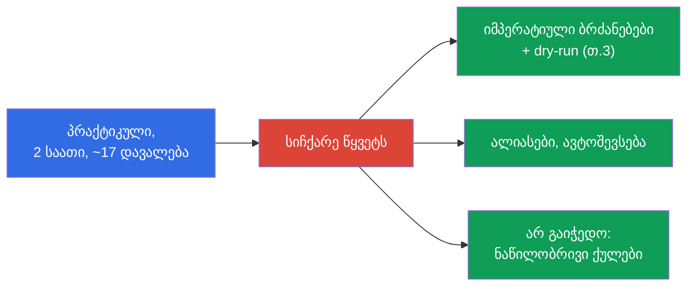
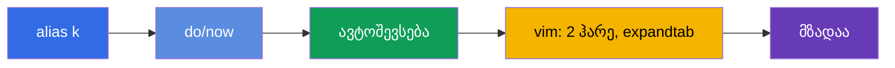
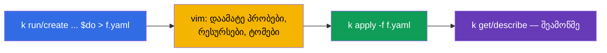
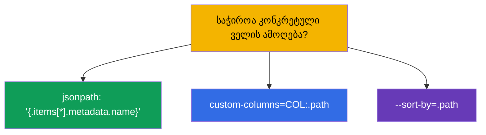
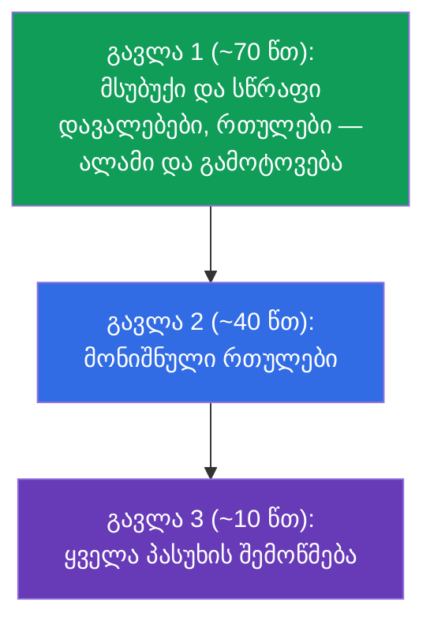
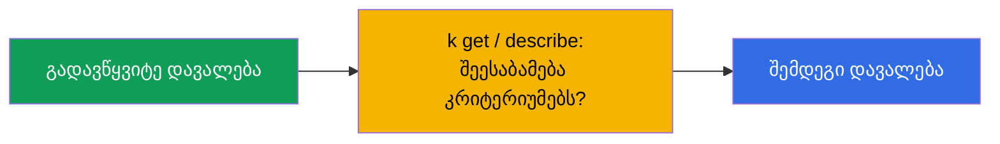
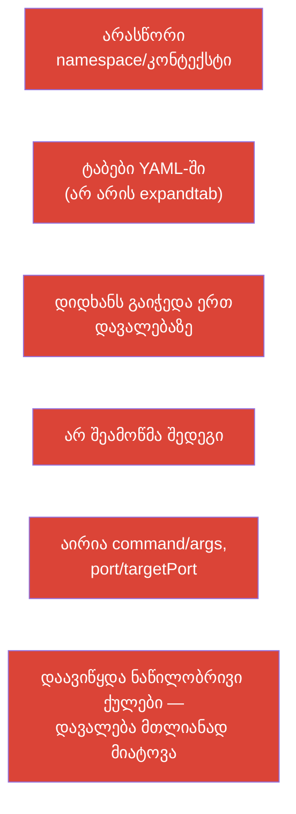

[Русская версия](ru.md) · [Eng version](README.md) · [Versión en español](es.md) · [Version française](fr.md) · [Deutsche Version](de.md) · [繁體中文版](tw.md) · [日本語版](jp.md)

# თავი 47. CKAD გამოცდა: ფორმატი, დროის მართვა, JSONPath და kubectl-ის პროდუქტიულობა

> 🟩 **თავი CKAD-სთვის.** CKA-ის გამოცდის ტაქტიკა - თავ 48-ში; ბევრი რამ საერთოა.
>
> **რა იქნება შემდეგ.** ცოდნა გვაქვს - ახლა მას ჩაბარებულ გამოცდად ვაქცევთ. CKAD
> პრაქტიკულია, ტაიმერის ქვეშ, და მას ჩაშლიან არა უცოდინრობის, არამედ ნელი ტემპისა და
> უყურადღებობის გამო. ეს თავი ტაქტიკაზეა: როგორ გავმართოთ გარემო პირველ წუთებში, როგორ
> გავანაწილოთ დრო, როგორ ვაგენერიროთ სწრაფად მანიფესტები და ამოვიღოთ მონაცემები JSONPath-ით.
> ეს ყველაფერი - თავები 3, 6, 17-24, 27-29-ის ხერხების კონცენტრატია.

## 47.1. CKAD-ის ფორმატი და რას კარნახობს ის

გავიხსენოთ პარამეტრები (თავი 1) და მაშინვე გამოვიყვანოთ სტრატეგია:

| CKAD-ის პარამეტრი | მნიშვნელობა | რა გამომდინარეობს აქედან |
|---------------|----------|----------------------|
| ხანგრძლივობა | 2 საათი | ~6-7 წუთი დავალებაზე - სიჩქარე კრიტიკულია |
| დავალებები | ~15-20 | გაჭედვა არ შეიძლება |
| გამსვლელი ქულა | 66% | ყველაფერი აუცილებელი არ არის; ნაწილობრივი ქულები ითვლება |
| ფორმატი | ცოცხალი კლასტერი, ტერმინალი | ხელები და არა თეორია |
| დოკუმენტაცია | kubernetes.io ნებადართულია | საფუძვლების ძებნის დრო არ არის - ზეპირად უნდა ვიცოდეთ |



## 47.2. პირველი 3 წუთი: გარემოს გამართვა

სანამ დავალებებს გადაწყვეტთ, გამართეთ გარემო - ეს ათეულობით წუთით აისხმევა (თავი 3):

```bash
alias k=kubectl
export do="--dry-run=client -o yaml"
export now="--force --grace-period=0"
source <(kubectl completion bash)
complete -o default -F __start_kubectl k
# vim YAML-ისთვის — კრიტიკულია
echo 'set tabstop=2 shiftwidth=2 expandtab' >> ~/.vimrc
export KUBE_EDITOR=vim
```



> **vim expandtab - აუცილებელია.** YAML ტაბებს არ ითმენს (თავი 3). `expandtab`-ის გარეშე
> პარსინგის შეცდომებს იჭერთ და დროს კარგავთ. ეს არის პირველი, რასაც გამართავენ.

## 47.3. წესი №1: გადართე კონტექსტი და namespace

ყოველი დავალება მიუთითებს კლასტერსა და namespace-ს. დავიწყება ნიშნავს არასწორ ადგილას გაკეთებას (თავი 6):

```bash
kubectl config use-context <დავალებიდან>              # პირველ რიგში დავალებაში
kubectl config set-context --current --namespace=<ns>  # თუ ერთ ns-ში ბევრი დავალებაა
```

ან დაამატეთ `-n <ns>` ყოველ ბრძანებაში. ყველაზე სამწუხარო ქულების დაკარგვა CKAD-ზე - სწორი
გადაწყვეტა არასწორ namespace-ში.

## 47.4. სიჩქარე იმპერატივისა და dry-run-ის ხარჯზე

არ დაწეროთ YAML ნულიდან. დააგენერირეთ ჩარჩო იმპერატიულად (თავი 3) და დააწერეთ საჭირო:

```bash
# პოდი ბრძანებით
k run nginx --image=nginx $do > pod.yaml

# Deployment
k create deploy web --image=nginx --replicas=3 $do > deploy.yaml

# Service
k expose deploy web --port=80 $do > svc.yaml

# ConfigMap / Secret
k create cm app --from-literal=COLOR=blue $do > cm.yaml
k create secret generic db --from-literal=pass=x $do > sec.yaml

# Job / CronJob
k create job pi --image=perl $do > job.yaml
k create cronjob backup --image=busybox --schedule="*/5 * * * *" $do > cj.yaml
```



ველებისთვის, რომლებიც იმპერატიულ ფლაგებში არ არის (პრობები, ტომები, securityContext), - გაიხსენეთ
`kubectl explain` (თავი 3) ან მოძებნეთ მაგალითი kubernetes.io-ზე და ჩასვით.

## 47.5. JSONPath და custom-columns

დავალებების ნაწილი ითხოვს „გამოიტანე სახელები/ველები ფაილში“. აქ საჭიროა JSONPath (თავი 3):

```bash
# ყველა პოდის სახელი
k get pods -o jsonpath='{.items[*].metadata.name}'

# კონტეინერების იმიჯები
k get pods -o jsonpath='{.items[*].spec.containers[*].image}'

# დასორტირება
k get pods --sort-by=.metadata.creationTimestamp

# ნოდების InternalIP
k get nodes -o jsonpath='{.items[*].status.addresses[?(@.type=="InternalIP")].address}'

# საკუთარი ცხრილი
k get pods -o custom-columns=NAME:.metadata.name,STATUS:.status.phase
```



JSONPath ზეპირად სწავლა არ სჭირდება - მაგრამ ბაზისური შაბლონები (`.items[*].metadata.name`, ფილტრი
`[?(@.type=="...")]`) ავტომატიზმამდე უნდა გავიწაფოთ.

## 47.6. დროის მართვა: სამი გავლა

15-20 დავალება 2 საათში. სტრატეგია - არ ვიაროთ ხაზობრივად, არამედ სამ გავლად:



- **პრიორიტეტი მიეცით სწრაფ და ნაცნობ დავალებებს.** ადრე ყოველი დავალების გვერდით ეწერა მისი
  წონა (პროცენტი), მაგრამ გამოცდის აქტუალურ ფორმატში წონა **არ ჩანს**. ამიტომ იარეთ
  თავდაჯერებულობითა და სიჩქარით: თავიდან ის, რაც სწრაფად და დანამდვილებით იხსნება, ხოლო შრომატევადი და
  უცნობი - შემდეგ გავლაზე.
- **არ გაიჭედოთ.** გაიჭედეთ 5+ წუთი - ალამი და შემდეგზე (ნაწილობრივი ქულები შესაძლოა უკვე
  მიღებული იყოს).
- **დატოვეთ დრო შემოწმებისთვის** - სულელური შეცდომები (არასწორი namespace, შეცდომა ჩაწერაში) ქულებად ჯდება.

## 47.7. შეამოწმეთ თავი

ყოველი დავალების შემდეგ - სწრაფი შემოწმება, რომ გაკეთდა ზუსტად ის, რაც ითხოვეს:

```bash
k get <resource> -n <ns>              # არსებობს?
k describe <resource> <name> -n <ns>  # საჭირო ველები?
k get pod <name> -o yaml | grep <საძიებელი>
k logs <pod>                          # თუ ქცევაზეა
```



განსაკუთრებით შეამოწმეთ დავალებები, სადაც „წაშალე და შექმენი ხელახლა“ (პოდის ზოგიერთი ველი უცვლელია,
თავი 3): დარწმუნდით, რომ ახალი ობიექტი მართლა შეიქმნა და მუშაობს.

## 47.8. CKAD-ზე შეცდომების ტოპი



CKAD-ის ჩაშლების უმეტესობა - არა უცოდინრობაზეა, არამედ ამ ორგანიზაციულ შეცდომებზე. მათი
პრევენცია (გარემოს გამართვა, namespace-ის დისციპლინა, სამი გავლა, შემოწმება) მეტ ქულას აძლევს,
ვიდრე ზეპირად სწავლა.

## 47.9. რა გავიმეოროთ CKAD-ის წინ (თავების რუკა)

CKAD-ის დომენები და სად ეწერება ისინი კურსში:

| CKAD-ის დომენი | კურსის თავები |
|------------|-------------|
| Application Design and Build (20%) | 4-5, 10-11, 22-24 (პოდები, Jobs/CronJob, DaemonSet/StatefulSet, multi-container, იმიჯები, ტომები) |
| Application Deployment (20%) | 8-9 (rolling update, canary/blue-green), 42-43 (Helm/Kustomize) |
| Observability and Maintenance (15%) | 27-29 (პრობები, ლოგები/მეტრიკები, გამართვა, deprecations) |
| Environment, Config, Security (25%) | 14, 17-21, 41 (რესურსები, env, ConfigMap/Secret, SecurityContext, SA, CRD) |
| Services and Networking (20%) | 6-7, 32, 34 (ლეიბლები, Service, Ingress, NetworkPolicy) |

## 47.10. მინი-ლექსიკონი

- **$do / $now** - ჰელპერები `--dry-run=client -o yaml` / სწრაფი წაშლა.
- **JSONPath** - ველების ამორჩევა API-ის პასუხიდან (`-o jsonpath`).
- **custom-columns** - გამოტანის საკუთარი ცხრილი.
- **სამი გავლა** - დროის სტრატეგია: მსუბუქები → რთულები → შემოწმება.
- **დავალების წონა** - ქულების წილი, პრიორიტეტის მინიშნება.
- **ნაწილობრივი ქულები** - ნაწილობრივ შესრულებული ითვლება.
- **expandtab** - vim-ის პარამეტრი (ჰარეები ტაბების ნაცვლად) YAML-ისთვის.

## 47.11. თავის შეჯამება

- CKAD - პრაქტიკულია, 2 საათი, ~17 დავალება, ზღვარი 66%, ნაწილობრივი ქულები - ყველაფერს წყვეტს სიჩქარე
  და ყურადღებიანობა.
- პირველი წუთები: alias `k`, `$do`/`$now`, ავტოშევსება, vim expandtab-ით.
- ყოველ დავალებაში პირველად გადართეთ კონტექსტი/namespace - სხვაგვარად გადაწყვეტა არასწორ ადგილას იქნება.
- სიჩქარე - იმპერატივი + `$do` (ჩარჩოს გენერაცია) და vim-ში დამუშავება; ველები -
  `explain`/docs.
- JSONPath/custom-columns - დავალებებისთვის „გამოიტანე ველები“; ბაზისური შაბლონები უნდა გავიწაფოთ.
- დროის მართვა: სამი გავლა, დავალებების წონას დაკვირვება, არ გაიჭედოთ, დრო დატოვეთ
  შემოწმებისთვის.
- ჩაშლების ტოპი - ორგანიზაციულია (namespace, ტაბები, გაჭედვა, შემოწმების არარსებობა), და არა
  უცოდინრობა.

## 47.12. როგორ გამოგადგებათ: გამოცდაზე და რეალურ სამუშაოში

**გამოცდაზე (CKAD).** ეს ჩაბარების პირდაპირი ინსტრუქციაა: გარემოს გამართვა, namespace-ის
დისციპლინა, იმპერატიული გენერაცია, JSONPath და დროის მართვა - ის, რაც ცოდნას
გამსვლელ ქულად აქცევს. გამოცდის წინ გაიმეორეთ თავების რუკა დომენების მიხედვით (47.9).

**რეალურ სამუშაოში.** იგივე უნარები (სწრაფი kubectl, dry-run, JSONPath, namespace-ისა და შედეგის
შემოწმების ჩვევა) - ინჟინრის ყოველდღიური პროდუქტიულობაა. სიჩქარე და
სიზუსტე ტერმინალში დროს ზოგავს და პროდში შეცდომებს ასწრებს.

## 47.13. თვითშემოწმების კითხვები

1. რა გავმართოთ გამოცდის პირველ წუთებში და რატომ არის expandtab კრიტიკული?
2. რატომ არის კონტექსტის/namespace-ის გადართვა წესი №1 ყოველ დავალებაში?
3. როგორ მივიღოთ სწრაფად მანიფესტის ჩარჩო პოდისთვის/დეპლოისთვის/სერვისისთვის?
4. როგორ გამოვიტანოთ JSONPath-ით ყველა პოდის სახელი? ხოლო ნოდების InternalIP?
5. რაშია სამი გავლის სტრატეგიის არსი და რატომ უნდა ვუყუროთ დავალების წონას?
6. რატომ არ შეიძლება გაჭედვა და როგორ უკავშირდება ნაწილობრივი ქულები სტრატეგიას?
7. დაასახელეთ CKAD-ზე ორგანიზაციული შეცდომების ტოპი და როგორ ავიცილოთ თავიდან.

## პრაქტიკა

CKAD-ისთვის საუკეთესო მომზადება - მოკ-გამოცდების გავლა ტაიმერის ქვეშ (`tasks/ckad/mock`)
ავტოშემოწმებით. გაიწაფეთ გარემოს გამართვაში, სამ გავლასა და თვითშემოწმებაში რეალურ
დავალებებზე. შემდეგ - ბოლო თავი: CKA-ის ტაქტიკა (თავი 48).

🧪 ლაბი 119 (დრილები სიჩქარესა და JSONPath-ზე): [tasks/cka/labs/119](../../labs/119/README_GE.MD)

🧪 CKAD-ის მოკ-გამოცდები: [tasks/ckad/mock](../../../ckad/mock)

🎮 Killercoda (ბრაუზერში, ინსტალაციის გარეშე): [Playground](https://killercoda.com/chadmcrowell/course/ckad/playground)

---
[სარჩევი](../README_GE.md) · [თავი 46](../46/ge.md) · [თავი 48](../48/ge.md)
