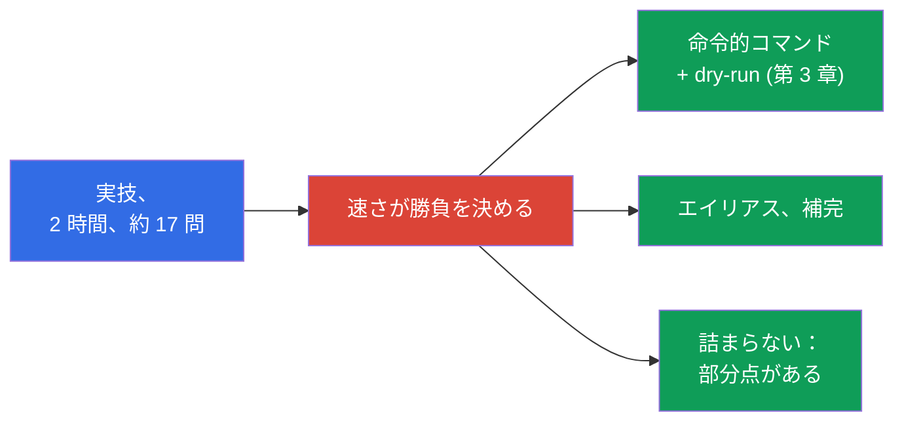
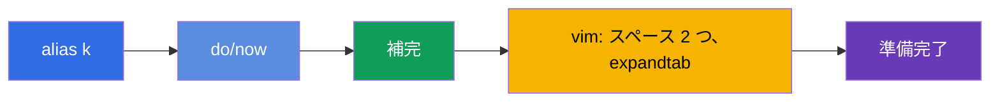
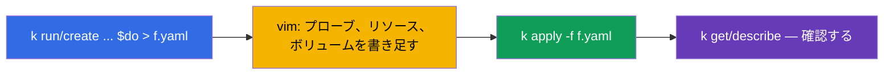
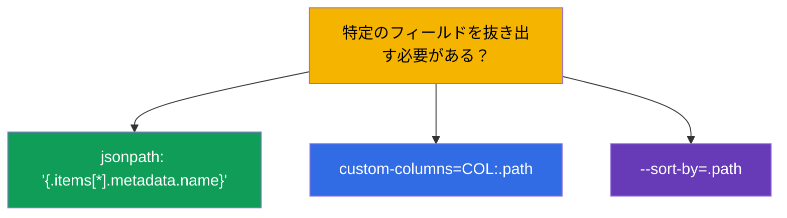
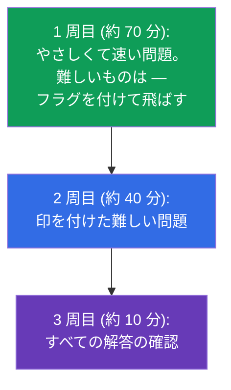
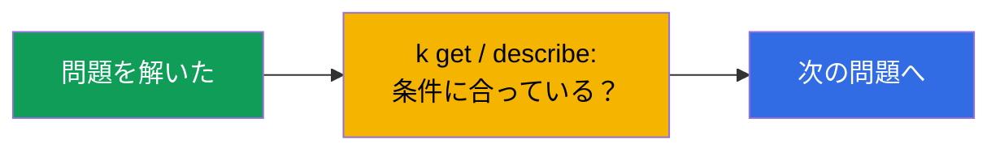
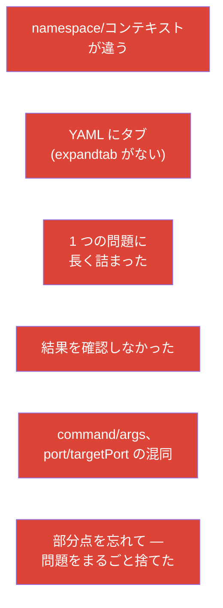

[Русская версия](ru.md) · [Eng version](README.md) · [Versión en español](es.md) · [Version française](fr.md) · [Deutsche Version](de.md) · [ქართული ვერსია](ge.md) · [繁體中文版](tw.md)

# 第 47 章。CKAD 試験：形式、タイムマネジメント、JSONPath と kubectl の生産性

> 🟩 **CKAD 向けの章。** CKA の試験戦術は第 48 章にあります。共通点は多いです。
>
> **次は何か。** 知識はもう手に入りました - あとはそれを「合格」に変えるだけです。CKAD は
> 実技で、タイマー付きです。落ちる理由は知識不足ではなく、遅さと不注意です。
> この章は戦術の話です：最初の数分で環境をどう整えるか、時間をどう配分するか、
> マニフェストをどう素早く生成するか、JSONPath でデータをどう抜き出すか。
> すべては第 3、6、17-24、27-29 章のテクニックの濃縮です。

## 47.1. CKAD の形式とそこから導かれること

パラメータ（第 1 章）を思い出し、そこからすぐに戦略を導きましょう：

| CKAD のパラメータ | 値 | そこから何が言えるか |
|---------------|----------|----------------------|
| 時間 | 2 時間 | 1 問あたり約 6-7 分 - 速さが決定的 |
| 問題数 | 約 15-20 | 詰まってはいけない |
| 合格点 | 66% | 全問正解は不要。部分点が加算される |
| 形式 | 実際のクラスタ、ターミナル | 理論ではなく手を動かす |
| ドキュメント | kubernetes.io は許可 | 基本を調べる時間はない - 暗記しておく |



## 47.2. 最初の 3 分：環境の準備

問題を解き始める前に環境を整えましょう - これは何十分もの節約になって返ってきます（第 3 章）：

```bash
alias k=kubectl
export do="--dry-run=client -o yaml"
export now="--force --grace-period=0"
source <(kubectl completion bash)
complete -o default -F __start_kubectl k
# YAML 向けの vim — 決定的に重要
echo 'set tabstop=2 shiftwidth=2 expandtab' >> ~/.vimrc
export KUBE_EDITOR=vim
```



> **vim の expandtab は必須。** YAML はタブを許しません（第 3 章）。`expandtab` がないと
> パースエラーを踏んで時間を失います。これが最初に設定するものです。

## 47.3. ルール 1：コンテキストと namespace を切り替える

どの問題にもクラスタと namespace が指定されています。忘れると、違う場所で作業したことに
なります（第 6 章）：

```bash
kubectl config use-context <問題の指定>              # 各問題で最初にやること
kubectl config set-context --current --namespace=<ns>  # 同じ ns の問題が多いとき
```

あるいは、すべてのコマンドに `-n <ns>` を付けてください。CKAD でもっとも悔しい失点は、
正しい解答が違う namespace にあることです。

## 47.4. 命令的コマンドと dry-run による速度

YAML をゼロから書かないでください。骨組みを命令的に生成し（第 3 章）、必要な部分を
書き足します：

```bash
# コマンド付きの Pod
k run nginx --image=nginx $do > pod.yaml

# Deployment
k create deploy web --image=nginx --replicas=3 $do > deploy.yaml

# Service
k expose deploy web --port=80 $do > svc.yaml

# ConfigMap / Secret
k create cm app --from-literal=COLOR=blue $do > cm.yaml
k create secret generic db --from-literal=pass=x $do > sec.yaml

# Job / CronJob
k create job pi --image=perl $do > job.yaml
k create cronjob backup --image=busybox --schedule="*/5 * * * *" $do > cj.yaml
```



命令的フラグに存在しないフィールド（プローブ、ボリューム、securityContext）については、
`kubectl explain`（第 3 章）を思い出すか、kubernetes.io で例を探して貼り付けてください。

## 47.5. JSONPath と custom-columns

一部の問題は「名前やフィールドをファイルに出力せよ」と求めます。ここで JSONPath が
必要になります（第 3 章）：

```bash
# すべての Pod の名前
k get pods -o jsonpath='{.items[*].metadata.name}'

# コンテナのイメージ
k get pods -o jsonpath='{.items[*].spec.containers[*].image}'

# ソートする
k get pods --sort-by=.metadata.creationTimestamp

# ノードの InternalIP
k get nodes -o jsonpath='{.items[*].status.addresses[?(@.type=="InternalIP")].address}'

# 自分用のテーブル
k get pods -o custom-columns=NAME:.metadata.name,STATUS:.status.phase
```



JSONPath を丸暗記する必要はありません - ただし基本のパターン（`.items[*].metadata.name`、
フィルタ `[?(@.type=="...")]`）は反射で書けるまで練習する価値があります。

## 47.6. タイムマネジメント：3 周する

2 時間で 15-20 問。戦略は、順番どおりに進むのではなく 3 周することです：



- **速くて馴染みのある問題を優先する。** 以前は各問題の配点（パーセント）が表示されて
  いましたが、現在の試験形式では配点は **表示されません**。ですから確実さと速さを基準に
  進めてください：まず速く確実に解けるものから、手間のかかるものや馴染みのないものは
  次の周に回します。
- **詰まらない。** 5 分以上詰まったらフラグを付けて次へ（部分点はすでに取れている
  かもしれません）。
- **確認の時間を残す** - つまらないミス（namespace 違い、タイプミス）は失点になります。

## 47.7. 自分で確認する

各問題のあとには、求められたことをきちんとやったかを素早く確認します：

```bash
k get <resource> -n <ns>              # 存在する？
k describe <resource> <name> -n <ns>  # 必要なフィールドは？
k get pod <name> -o yaml | grep <探したいもの>
k logs <pod>                          # 挙動に関する問題なら
```



とくに「削除して作り直す」系の問題は確認してください（Pod の一部のフィールドは変更
できません、第 3 章）：新しいオブジェクトが実際に作られて動いていることを確かめます。

## 47.8. CKAD でのミス トップ



CKAD の不合格の大半は知識不足ではなく、こうした運用上のミスです。その予防（環境の準備、
namespace の規律、3 周する、確認）は、丸暗記よりも多くの点をもたらします。

## 47.9. CKAD の前に復習すること（章のマップ）

CKAD のドメインと、それがコースのどこに対応するか：

| CKAD のドメイン | コースの章 |
|------------|-------------|
| Application Design and Build (20%) | 4-5、10-11、22-24（Pod、Jobs/CronJob、DaemonSet/StatefulSet、マルチコンテナ、イメージ、ボリューム） |
| Application Deployment (20%) | 8-9（rolling update、canary/blue-green）、42-43（Helm/Kustomize） |
| Observability and Maintenance (15%) | 27-29（プローブ、ログ/メトリクス、デバッグ、deprecations） |
| Environment, Config, Security (25%) | 14、17-21、41（リソース、env、ConfigMap/Secret、SecurityContext、SA、CRD） |
| Services and Networking (20%) | 6-7、32、34（ラベル、Service、Ingress、NetworkPolicy） |

## 47.10. ミニ用語集

- **$do / $now** - `--dry-run=client -o yaml` / 高速削除のヘルパー。
- **JSONPath** - API の応答からフィールドを取り出すこと (`-o jsonpath`)。
- **custom-columns** - 自分用の出力テーブル。
- **3 周する** - 時間の戦略：やさしい → 難しい → 確認。
- **問題の配点** - 得点の割合で、優先順位のヒント。
- **部分点** - 部分的にできたものが加算されること。
- **expandtab** - YAML のための vim の設定（タブの代わりにスペース）。

## 47.11. 本章のまとめ

- CKAD は実技、2 時間、約 17 問、合格ラインは 66%、部分点あり - すべてを決めるのは速さと
  注意深さです。
- 最初の数分：alias `k`、`$do`/`$now`、補完、expandtab 付きの vim。
- 各問題ではまずコンテキスト/namespace を切り替える - でないと解答が違う場所に入ります。
- 速さは、命令的コマンド + `$do`（骨組みの生成）と vim での仕上げから生まれます。フィールドは
  `explain`/docs で。
- JSONPath/custom-columns は「フィールドを出力せよ」系の問題に使います。基本パターンを
  練習しておきましょう。
- タイムマネジメント：3 周する、問題の配点を見る、詰まらない、確認の時間を残す。
- 不合格の主因は運用上のもの（namespace、タブ、詰まり、確認の欠如）で、知識不足では
  ありません。

## 47.12. これがどう役に立つか：試験と実際の仕事で

**試験で (CKAD)。** これは合格のための直接の手引きです：環境の準備、namespace の規律、
命令的な生成、JSONPath とタイムマネジメント - 知識を合格点に変えるものです。試験の前に
ドメインごとの章のマップ (47.9) を復習してください。

**実際の仕事で。** 同じスキル（速い kubectl、dry-run、JSONPath、namespace と結果を
確認する習慣）は、エンジニアの毎日の生産性そのものです。ターミナルでの速さと正確さは
時間を節約し、本番でのミスを防ぎます。

## 47.13. 自己チェックの質問

1. 試験の最初の数分で何を設定しますか。そしてなぜ expandtab は決定的に重要なのですか？
2. なぜコンテキスト/namespace の切り替えが、各問題でのルール 1 なのですか？
3. Pod/Deployment/Service のマニフェストの骨組みを素早く得るにはどうしますか？
4. JSONPath ですべての Pod の名前を出力するには？ノードの InternalIP は？
5. 3 周する戦略の要点は何で、なぜ問題の配点を見るのですか？
6. なぜ詰まってはいけないのか、そして部分点は戦略とどう結びついていますか？
7. CKAD での運用上のミスのトップを挙げ、その回避方法を述べてください。

## 演習

CKAD への最良の準備は、タイマー付きでのモック試験の通し (`tasks/ckad/mock`) と自動採点
です。環境の準備、3 周する戦略、自己チェックを実際の問題で練習してください。次は - 最後の
章：CKA の戦術（第 48 章）。

🧪 ラボ 119（速度と JSONPath のドリル）: [tasks/cka/labs/119](../../labs/119/README_JP.MD)

🧪 CKAD のモック試験: [tasks/ckad/mock](../../../ckad/mock)

🎮 Killercoda（ブラウザ内、セットアップ不要）：[Playground](https://killercoda.com/chadmcrowell/course/ckad/playground)

---
[目次](../README_JP.md) · [第 46 章](../46/jp.md) · [第 48 章](../48/jp.md)
