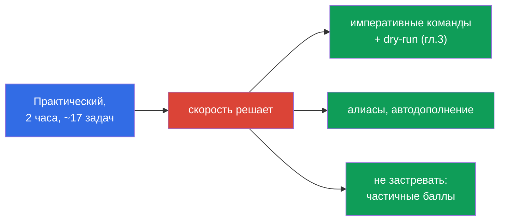
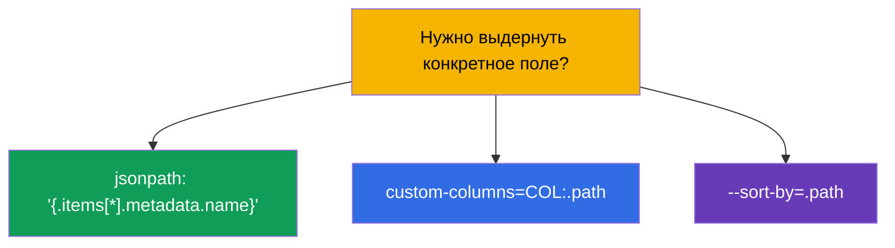
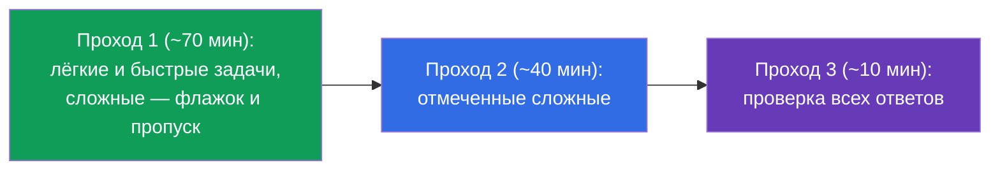
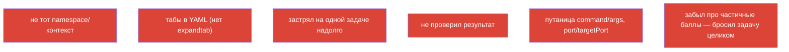

# Глава 47. Экзамен CKAD: формат, тайм-менеджмент, JSONPath и продуктивность kubectl

> 🟩 **Глава для CKAD.** Тактика экзамена CKA - в главе 48; многое общее.
>
> **Что дальше.** Знания у нас есть - теперь превратим их в сданный экзамен. CKAD
> практический, под таймером, и его проваливают не из-за незнания, а из-за медлительности и
> невнимательности. Эта глава - про тактику: как настроить окружение за первые минуты, как
> распределить время, как быстро генерировать манифесты и выдёргивать данные через JSONPath.
> Всё это - концентрат приёмов из глав 3, 6, 17-24, 27-29.

## 47.1. Формат CKAD и что он диктует

Напомним параметры (глава 1) и сразу выведем из них стратегию:

| Параметр CKAD | Значение | Что из этого следует |
|---------------|----------|----------------------|
| длительность | 2 часа | ~6-7 минут на задачу - скорость критична |
| задач | ~15-20 | нельзя застревать |
| проходной балл | 66% | не обязательно всё; частичные баллы засчитываются |
| формат | живой кластер, терминал | руки, а не теория |
| документация | kubernetes.io разрешена | искать основы некогда - знать наизусть |



## 47.2. Первые 3 минуты: настройка окружения

Прежде чем решать задачи, настройте окружение - это окупится десятками минут (глава 3):

```bash
alias k=kubectl
export do="--dry-run=client -o yaml"
export now="--force --grace-period=0"
source <(kubectl completion bash)
complete -o default -F __start_kubectl k
# vim под YAML — критично
echo 'set tabstop=2 shiftwidth=2 expandtab' >> ~/.vimrc
export KUBE_EDITOR=vim
```


> **vim expandtab - обязательно.** YAML не терпит табов (глава 3). Без `expandtab` вы
> ловите ошибки парсинга и теряете время. Это первое, что настраивают.

## 47.3. Правило №1: переключай контекст и namespace

Каждая задача указывает кластер и namespace. Забыть - значит сделать не там (глава 6):

```bash
kubectl config use-context <из задания>              # ПЕРВЫМ делом в задаче
kubectl config set-context --current --namespace=<ns>  # если много задач в одном ns
```

Или добавляйте `-n <ns>` в каждую команду. Самая обидная потеря баллов на CKAD - верное
решение не в том namespace.

## 47.4. Скорость через императив и dry-run

Не пишите YAML с нуля. Генерируйте каркас императивно (глава 3) и дописывайте нужное:

```bash
# Под с командой
k run nginx --image=nginx $do > pod.yaml

# Deployment
k create deploy web --image=nginx --replicas=3 $do > deploy.yaml

# Service
k expose deploy web --port=80 $do > svc.yaml

# ConfigMap / Secret
k create cm app --from-literal=COLOR=blue $do > cm.yaml
k create secret generic db --from-literal=pass=x $do > sec.yaml

# Job / CronJob
k create job pi --image=perl $do > job.yaml
k create cronjob backup --image=busybox --schedule="*/5 * * * *" $do > cj.yaml
```


Для полей, которых нет в императивных флагах (пробы, тома, securityContext), - вспоминайте
`kubectl explain` (глава 3) или ищите пример в kubernetes.io и вставляйте.

## 47.5. JSONPath и custom-columns

Часть заданий просит «выведи имена/поля в файл». Тут нужен JSONPath (глава 3):

```bash
# имена всех подов
k get pods -o jsonpath='{.items[*].metadata.name}'

# образы контейнеров
k get pods -o jsonpath='{.items[*].spec.containers[*].image}'

# отсортировать
k get pods --sort-by=.metadata.creationTimestamp

# InternalIP нод
k get nodes -o jsonpath='{.items[*].status.addresses[?(@.type=="InternalIP")].address}'

# своя таблица
k get pods -o custom-columns=NAME:.metadata.name,STATUS:.status.phase
```



JSONPath не надо зубрить наизусть - но базовые шаблоны (`.items[*].metadata.name`, фильтр
`[?(@.type=="...")]`) стоит натренировать до автоматизма.

## 47.6. Тайм-менеджмент: три прохода

15-20 задач за 2 часа. Стратегия - не идти линейно, а в три прохода:



- **Смотрите вес задачи** (указан у каждой) - высокий вес и быстрое решение делайте
  первым.
- **Не застревайте.** Застряли на 5+ минут - флажок и дальше (частичные баллы уже могли
  быть получены).
- **Оставьте время на проверку** - глупые ошибки (не тот namespace, опечатка) стоят баллов.

## 47.7. Проверяйте себя

После каждой задачи - быстрая проверка, что сделано именно то, что просили:

```bash
k get <resource> -n <ns>              # существует?
k describe <resource> <name> -n <ns>  # нужные поля?
k get pod <name> -o yaml | grep <искомое>
k logs <pod>                          # если про поведение
```


Особенно проверяйте задачи, где «удалить и пересоздать» (некоторые поля пода неизменяемы,
глава 3): убедитесь, что новый объект реально создан и работает.

## 47.8. Топ ошибок на CKAD



Большинство провалов CKAD - не про незнание, а про эти организационные ошибки. Их
профилактика (настройка окружения, дисциплина namespace, три прохода, проверка) даёт
больше баллов, чем зубрёжка.

## 47.9. Что повторить перед CKAD (карта глав)

CKAD-домены и куда они ложатся в курсе:

| Домен CKAD | Главы курса |
|------------|-------------|
| Application Design and Build (20%) | 4-5, 22-24 (поды, multi-container, образы, тома) |
| Application Deployment (20%) | 8-9 (rolling update, canary/blue-green), 42-43 (Helm/Kustomize) |
| Observability and Maintenance (15%) | 27-29 (пробы, логи/метрики, отладка, deprecations) |
| Environment, Config, Security (25%) | 14, 17-21 (ресурсы, env, ConfigMap/Secret, SecurityContext, SA) |
| Services and Networking (20%) | 6-7, 32, 34 (метки, Service, Ingress, NetworkPolicy) |

## 47.10. Мини-глоссарий

- **$do / $now** - хелперы `--dry-run=client -o yaml` / быстрое удаление.
- **JSONPath** - выборка полей из ответа API (`-o jsonpath`).
- **custom-columns** - своя таблица вывода.
- **три прохода** - стратегия времени: лёгкие → сложные → проверка.
- **вес задачи** - доля баллов, подсказка приоритета.
- **частичные баллы** - засчитывается частично выполненное.
- **expandtab** - настройка vim (пробелы вместо табов) для YAML.

## 47.11. Итоги главы

- CKAD - практический, 2 часа, ~17 задач, порог 66%, частичные баллы - всё решают скорость
  и внимательность.
- Первые минуты: alias `k`, `$do`/`$now`, автодополнение, vim с expandtab.
- В каждой задаче сначала переключить контекст/namespace - иначе решение не там.
- Скорость - через императив + `$do` (генерация каркаса) и доработку в vim; поля -
  `explain`/docs.
- JSONPath/custom-columns - для заданий «выведи поля»; натренировать базовые шаблоны.
- Тайм-менеджмент: три прохода, смотреть вес задач, не застревать, оставить время на
  проверку.
- Топ провалов - организационные (namespace, табы, застревание, отсутствие проверки), а не
  незнание.

## 47.12. Как это пригодится: на экзамене и в реальной работе

**На экзамене (CKAD).** Это прямая инструкция по сдаче: настройка окружения, дисциплина
namespace, императивная генерация, JSONPath и тайм-менеджмент - то, что превращает знания в
проходной балл. Повторите карту глав по доменам (47.9) перед экзаменом.

**В реальной работе.** Те же навыки (быстрый kubectl, dry-run, JSONPath, привычка
проверять namespace и результат) - это ежедневная продуктивность инженера. Скорость и
аккуратность в терминале экономят время и предотвращают ошибки в проде.

## 47.13. Вопросы для самопроверки

1. Что настроить в первые минуты экзамена и почему expandtab критичен?
2. Почему переключение контекста/namespace - правило №1 в каждой задаче?
3. Как быстро получить каркас манифеста для пода/деплоя/сервиса?
4. Как через JSONPath вывести имена всех подов? А InternalIP нод?
5. В чём суть стратегии трёх проходов и зачем смотреть вес задачи?
6. Почему нельзя застревать и как связаны частичные баллы со стратегией?
7. Назовите топ организационных ошибок на CKAD и как их избежать.

## Практика

Лучшая подготовка к CKAD - прогон мок-экзаменов под таймером (`tasks/ckad/mock`) с
автопроверкой. Отрабатывайте настройку окружения, три прохода и самопроверку на реальных
заданиях. Дальше - последняя глава: тактика CKA (глава 48).

🧪 Лаба 119 (дриллы на скорость и JSONPath): [tasks/cka/labs/119](../../labs/119/README_RU.MD)

🧪 Мок-экзамены CKAD: [tasks/ckad/mock](../../../ckad/mock)

---
[Оглавление](../README_RU.md) · [Глава 46](../46/ru.md) · [Глава 48](../48/ru.md)
