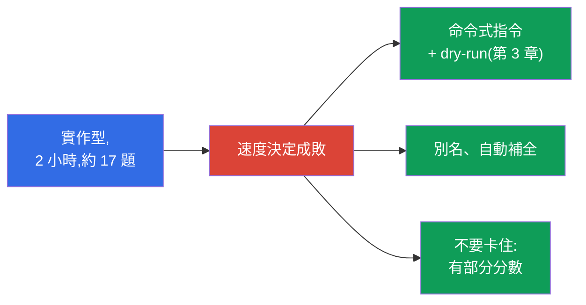
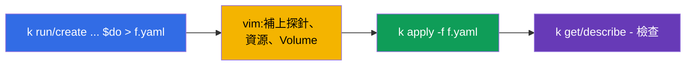
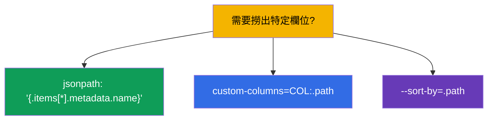
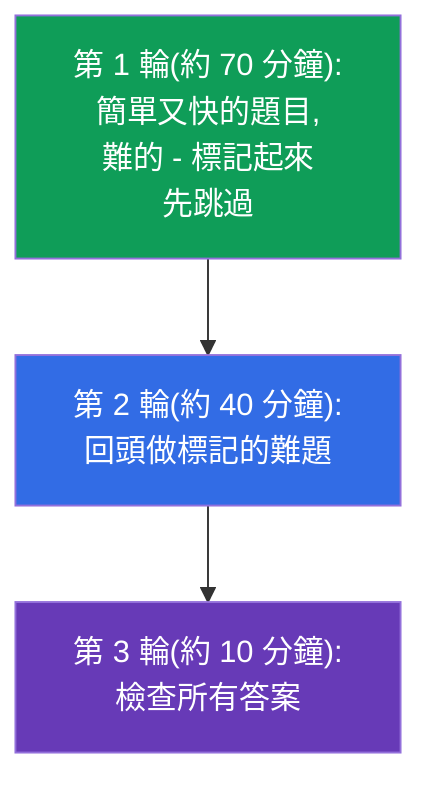
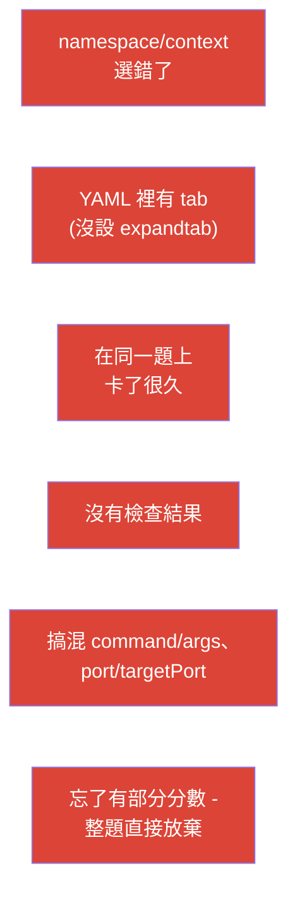

[Русская версия](ru.md) · [Eng version](README.md) · [Versión en español](es.md) · [Version française](fr.md) · [Deutsche Version](de.md) · [ქართული ვერსია](ge.md) · [日本語版](jp.md)

# 第 47 章。CKAD 考試:形式、時間管理、JSONPath 與 kubectl 生產力

> 🟩 **CKAD 章節。** CKA 的考試戰術在第 48 章;很多地方是共通的。
>
> **接下來是什麼。** 知識我們已經有了 - 現在把它變成一張通過的考試成績。CKAD 是
> 實作型、有計時的,而大家考不過通常不是因為不會,而是因為太慢、太不小心。這一章講的是
> 戰術:前幾分鐘怎麼設定環境、時間怎麼分配、怎麼快速產生清單檔、怎麼用 JSONPath 把資料
> 撈出來。這些全部都是第 3、6、17-24、27-29 章手法的濃縮。

## 47.1. CKAD 的形式,以及它決定了什麼

我們重述一下參數(第 1 章),並直接從裡面推出策略:

| CKAD 參數 | 數值 | 由此得到的結論 |
|---------------|----------|----------------------|
| 時間長度 | 2 小時 | 每題約 6-7 分鐘 - 速度非常關鍵 |
| 題數 | 約 15-20 題 | 不能卡在一題上 |
| 及格分數 | 66% | 不必全對;部分分數也算 |
| 形式 | 真實叢集、終端機 | 靠手,不是靠理論 |
| 文件 | 允許看 kubernetes.io | 沒時間查基本東西 - 要背到很熟 |



## 47.2. 前 3 分鐘:設定環境

在開始解題之前,先把環境設好 - 這會替你賺回好幾十分鐘(第 3 章):

```bash
alias k=kubectl
export do="--dry-run=client -o yaml"
export now="--force --grace-period=0"
source <(kubectl completion bash)
complete -o default -F __start_kubectl k
# 針對 YAML 調整 vim - 非常關鍵
echo 'set tabstop=2 shiftwidth=2 expandtab' >> ~/.vimrc
export KUBE_EDITOR=vim
```


> **vim expandtab - 必做。** YAML 不能有 tab(第 3 章)。沒設 `expandtab`,你就會一直
> 遇到解析錯誤、白白浪費時間。這是大家第一個設定的東西。

## 47.3. 第一條規則:切換 context 與 namespace

每一題都會指定叢集與 namespace。忘記切,等於做在錯的地方(第 6 章):

```bash
kubectl config use-context <題目給的>              # 每題一開始就先做
kubectl config set-context --current --namespace=<ns>  # 如果同一個 ns 有很多題
```

或者在每個指令裡都加上 `-n <ns>`。CKAD 最令人扼腕的失分,就是正確答案做在錯的
namespace 裡。

## 47.4. 用命令式與 dry-run 換取速度

不要從零開始寫 YAML。用命令式指令產生骨架(第 3 章),再把需要的東西補上去:

```bash
# 帶指令的 Pod
k run nginx --image=nginx $do > pod.yaml

# Deployment
k create deploy web --image=nginx --replicas=3 $do > deploy.yaml

# Service
k expose deploy web --port=80 $do > svc.yaml

# ConfigMap / Secret
k create cm app --from-literal=COLOR=blue $do > cm.yaml
k create secret generic db --from-literal=pass=x $do > sec.yaml

# Job / CronJob
k create job pi --image=perl $do > job.yaml
k create cronjob backup --image=busybox --schedule="*/5 * * * *" $do > cj.yaml
```



至於命令式旗標裡沒有的欄位(探針、Volume、securityContext)- 想想 `kubectl explain`
(第 3 章),或者去 kubernetes.io 找一個範例貼進來。

## 47.5. JSONPath 與 custom-columns

有一部分題目會要你「把名稱/欄位輸出到檔案」。這時候就需要 JSONPath(第 3 章):

```bash
# 所有 Pod 的名稱
k get pods -o jsonpath='{.items[*].metadata.name}'

# 容器的映像
k get pods -o jsonpath='{.items[*].spec.containers[*].image}'

# 排序
k get pods --sort-by=.metadata.creationTimestamp

# 節點的 InternalIP
k get nodes -o jsonpath='{.items[*].status.addresses[?(@.type=="InternalIP")].address}'

# 自訂表格
k get pods -o custom-columns=NAME:.metadata.name,STATUS:.status.phase
```



JSONPath 不需要死背 - 但基本樣板(`.items[*].metadata.name`、過濾器
`[?(@.type=="...")]`)值得練到變成反射動作。

## 47.6. 時間管理:三輪作法

2 小時 15-20 題。策略不是照順序線性做完,而是分成三輪:



- **優先挑快的、熟悉的題目。** 以前每題會顯示它的權重(百分比),但在現在的考試形式裡
  權重 **不會顯示**。所以請照著「有把握」跟「快」來排:先做能快速又確定做對的,費工的
  跟不熟的留到下一輪。
- **不要卡住。** 卡超過 5 分鐘 - 標記起來往下走(部分分數可能已經拿到了)。
- **留時間檢查** - 蠢錯誤(namespace 不對、打錯字)是會扣分的。

## 47.7. 自己檢查自己

每做完一題 - 快速確認一下你做的正是題目要求的:

```bash
k get <resource> -n <ns>              # 存在嗎?
k describe <resource> <name> -n <ns>  # 該有的欄位都對嗎?
k get pod <name> -o yaml | grep <要找的東西>
k logs <pod>                          # 如果題目是關於行為
```


特別要檢查那種要「刪掉再重建」的題目(Pod 有些欄位是不可變的,第 3 章):確認新的物件
真的建起來了、而且是正常運作的。

## 47.8. CKAD 錯誤排行榜



CKAD 大部分的失敗不是因為不會,而是因為這些流程上的錯誤。預防它們(設定環境、namespace
的紀律、三輪作法、檢查)比死背拿到的分數還多。

## 47.9. 考 CKAD 之前該複習什麼(章節地圖)

CKAD 的領域,以及它們對應到課程的哪裡:

| CKAD 領域 | 課程章節 |
|------------|-------------|
| Application Design and Build (20%) | 4-5、10-11、22-24(Pod、Jobs/CronJob、DaemonSet/StatefulSet、multi-container、映像、Volume) |
| Application Deployment (20%) | 8-9(rolling update、canary/blue-green)、42-43(Helm/Kustomize) |
| Observability and Maintenance (15%) | 27-29(探針、日誌/指標、除錯、deprecations) |
| Environment, Config, Security (25%) | 14、17-21、41(資源、env、ConfigMap/Secret、SecurityContext、SA、CRD) |
| Services and Networking (20%) | 6-7、32、34(標籤、Service、Ingress、NetworkPolicy) |

## 47.10. 小詞彙表

- **$do / $now** - `--dry-run=client -o yaml` 的輔助變數 / 快速刪除。
- **JSONPath** - 從 API 回應裡挑選欄位(`-o jsonpath`)。
- **custom-columns** - 自訂的輸出表格。
- **三輪作法** - 時間策略:簡單 → 困難 → 檢查。
- **題目權重** - 該題佔的分數比例,是排優先順序的提示。
- **部分分數** - 只做到一部分也會算分。
- **expandtab** - vim 的設定(用空格取代 tab),為了寫 YAML。

## 47.11. 本章總結

- CKAD 是實作型、2 小時、約 17 題、門檻 66%、有部分分數 - 決定成敗的是速度與細心。
- 前幾分鐘:alias `k`、`$do`/`$now`、自動補全、設好 expandtab 的 vim。
- 每一題先切換 context/namespace - 否則答案就做在錯的地方。
- 速度來自命令式 + `$do`(產生骨架)再用 vim 補完;欄位查 `explain`/文件。
- JSONPath/custom-columns - 用在「把欄位輸出出來」的題目;基本樣板要練熟。
- 時間管理:三輪作法、看題目權重、不要卡住、留時間檢查。
- 失敗排行榜是流程性的問題(namespace、tab、卡住、沒檢查),而不是不會。

## 47.12. 這些知識用在哪:考試與實際工作

**在考試上(CKAD)。** 這就是一份直接的應考說明:設定環境、namespace 的紀律、命令式
產生、JSONPath 與時間管理 - 這些正是把知識變成及格分數的東西。考前請把按領域整理的
章節地圖(47.9)再複習一遍。

**在實際工作中。** 同樣這些技能(快速的 kubectl、dry-run、JSONPath、檢查 namespace 與
結果的習慣)就是一個工程師每天的生產力。在終端機裡又快又準,能省下時間、也能避免在
生產環境出錯。

## 47.13. 自我檢查問題

1. 考試前幾分鐘要設定什麼,為什麼 expandtab 那麼關鍵?
2. 為什麼切換 context/namespace 是每一題的第一條規則?
3. 怎麼快速拿到 Pod/Deployment/Service 的清單檔骨架?
4. 怎麼用 JSONPath 輸出所有 Pod 的名稱?節點的 InternalIP 呢?
5. 三輪作法的重點是什麼,為什麼要看題目的權重?
6. 為什麼不能卡在一題上,部分分數又跟這個策略有什麼關係?
7. 說出 CKAD 上流程性錯誤的排行榜,以及要怎麼避免。

## 實踐

準備 CKAD 最好的方式,就是在計時的狀況下跑模擬考(`tasks/ckad/mock`)並用自動檢查驗證。
用真實的題目來練習環境設定、三輪作法與自我檢查。接下來是最後一章:CKA 的戰術
(第 48 章)。

🧪 實驗 119(速度與 JSONPath 的練習):[tasks/cka/labs/119](../../labs/119/README_TW.MD)

🧪 CKAD 模擬考:[tasks/ckad/mock](../../../ckad/mock)

---
[目錄](../README_TW.md) · [第 46 章](../46/tw.md) · [第 48 章](../48/tw.md)
