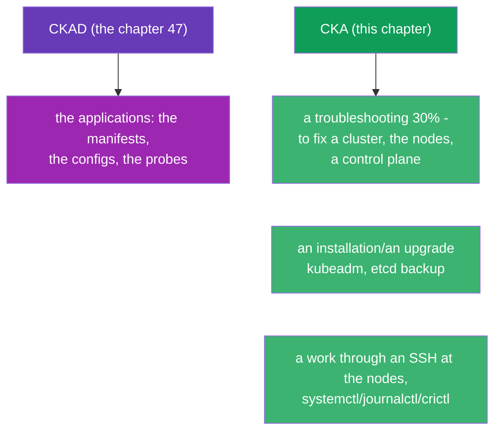
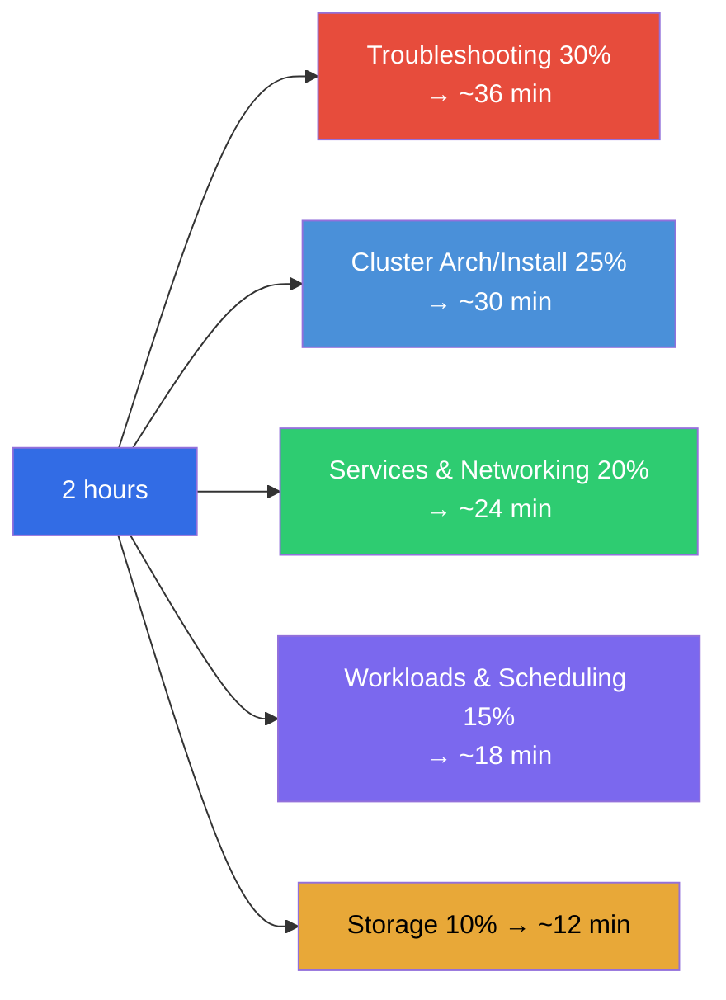
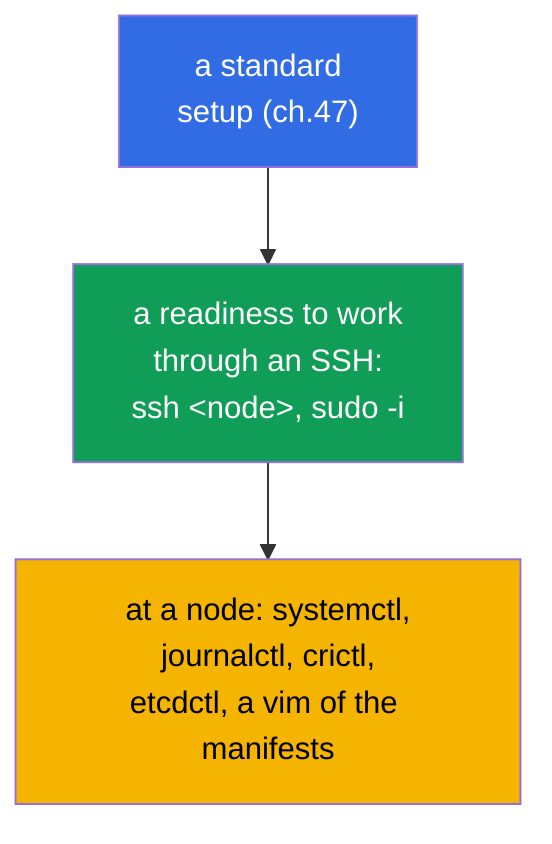
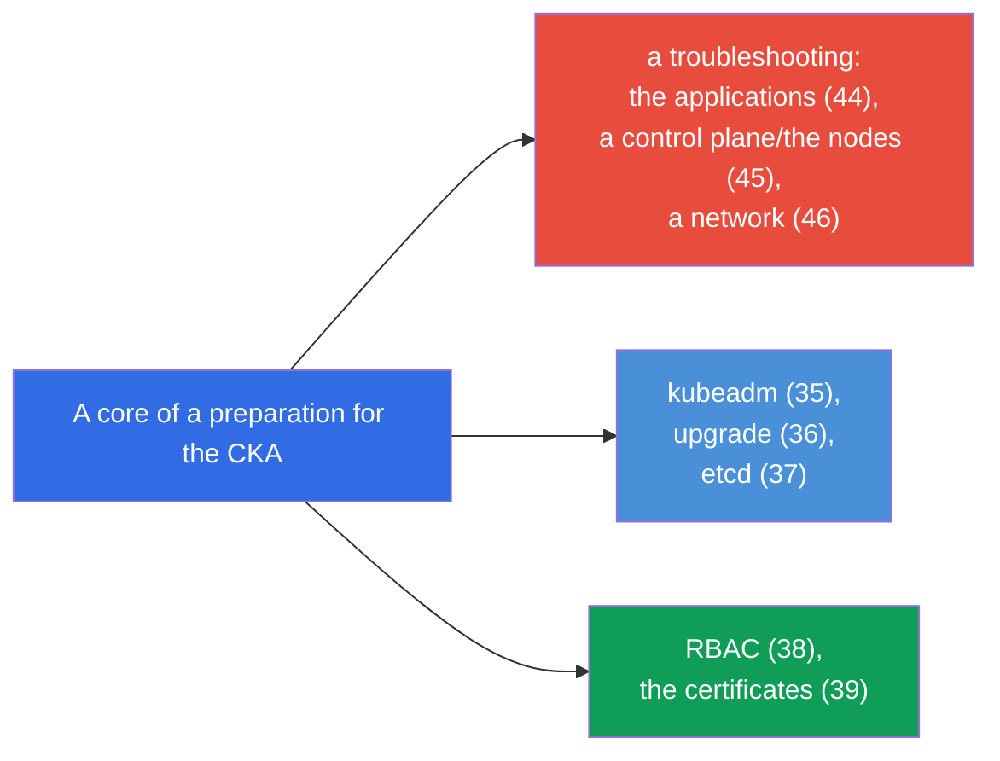
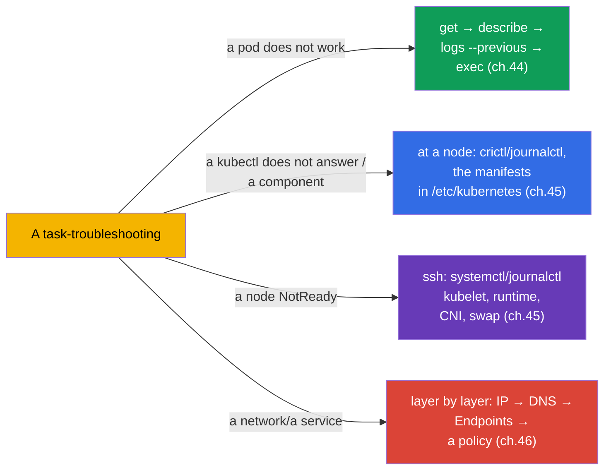
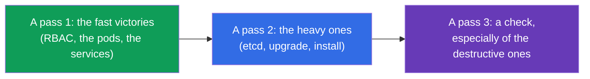
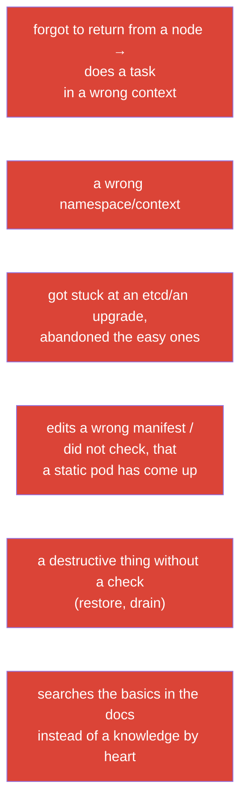
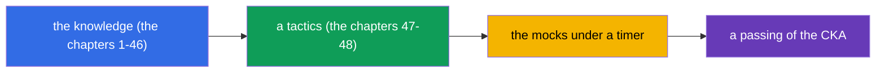

[Русская версия](ru.md) · [Versión en español](es.md) · [Version française](fr.md) · [Deutsche Version](de.md) · [ქართული ვერსია](ge.md) · [繁體中文版](tw.md) · [日本語版](jp.md)

# Chapter 48. The exam CKA: a format, a time management and a strategy

> 🟦 **A chapter for the CKA.** The general receptions of a speed and of an organization are the same as for the CKAD (the
> chapter 47); here a focus is on a specificity of the CKA: a troubleshooting (30%), an administration of a cluster,
> a work at the nodes.
>
> **What comes next.** A final of the course. You have got all the knowledge (the chapters 1-46) and a tactics of a speed (the
> chapter 47). Now - how to pass exactly the CKA: this exam is shifted towards an operation and a
> troubleshooting, it requires a work through an SSH at the nodes and a confident analysis of the failures of a cluster.
> We will assemble a strategy and a map of a repetition.

## 48.1. How the CKA differs from the CKAD by a tactics

A format is the same (2 hours, ~15-20 tasks, 66%, a documentation is allowed, the partial points), but
the accents are different (the chapter 1):



A main difference: **at the CKA there is a lot of a work outside of a kubectl** - at the nodes themselves (an SSH, the system
services, the files). A troubleshooting (30%) and an installation/a maintenance of a cluster require to get into
`/etc/kubernetes/`, `systemctl`, `journalctl`, `crictl`, `etcdctl`.

## 48.2. The weights of the domains and a distribution of a time

Distribute a time by the weights (the chapter 1):



A troubleshooting and a Cluster Architecture together are more than a half of an exam. Exactly there it is worth
to invest a main preparation.

## 48.3. The first minutes: the same settings + an SSH

A setup of an environment is as at the CKAD (the chapter 47): an alias, `$do`/`$now`, an autocompletion, a vim with
an expandtab. Plus a specificity of the CKA:

```bash
alias k=kubectl
export do="--dry-run=client -o yaml"
source <(kubectl completion bash); complete -o default -F __start_kubectl k
echo 'set tabstop=2 shiftwidth=2 expandtab' >> ~/.vimrc; export KUBE_EDITOR=vim
```



> **It is important for the CKA.** A lot of the tasks are solved **at a node**, and not through a kubectl. Be ready to
> `ssh` to a control plane/a worker, to `sudo`, to edit the files in `/etc/kubernetes/`,
> to look at `journalctl -u kubelet`, `crictl ps`. Do not forget to return to "your own" machine
> after a work at a node.

## 48.4. The key tasks of the CKA and where to repeat

The typical high-scoring tasks and the chapters of the course:

| A task | The chapters |
|---------|-------|
| to install a cluster / to add a node (kubeadm) | 35 |
| to upgrade a cluster (upgrade, cordon/drain) | 36 |
| a backup/a restoration of etcd | 37 |
| RBAC: the roles and the bindings | 38 |
| to issue a certificate through a CSR / kubeconfig | 39 |
| to fix a control plane (static pods) | 15, 45 |
| a node NotReady (kubelet/runtime/CNI) | 45, 30 |
| a service/a DNS does not work (Endpoints, CoreDNS) | 7, 31, 46 |
| NetworkPolicy | 34 |
| Deployment, scheduling, the resources | 5, 8, 12-14 |
| PV/PVC, StorageClass | 25-26 |



## 48.5. A strategy of a troubleshooting under a timer

Since a troubleshooting is 30%, train the algorithms up to an automatism (the chapters 44-46):



Do not guess - apply the decision trees out of the chapters 44-46. A fast localization ("which layer /
component") is more important than a knowledge of the rare details.

## 48.6. A time management and the rules of an exam

A general strategy is as at the CKAD (the chapter 47): three passes, to look at a weight, not to get stuck,
to leave a time for a check. A specificity of the CKA:

- **The heavy tasks (an etcd restore, an upgrade, an installation) take a lot of a time** - estimate,
  whether you manage them, and do not sacrifice several easy ones for a sake of one complex one.
- **After a work at a node return into an initial context** - it is easy to forget and to do
  a next task "in a wrong place".
- **Check the destructive operations** (a restore of etcd, a drain) - they are expensive at an error.
- **A documentation of kubernetes.io is allowed** - keep at hand the pages about a kubeadm
  upgrade, an etcd backup, a CSR: the exact commands are convenient to copy.



## 48.7. A top of the errors at the CKA



## 48.8. A final check-list before the CKA

- [ ] I can do a kubeadm init/join and I know the steps of a preparation of a node (the chapter 35);
- [ ] I can do an upgrade of a cluster with a cordon/drain/uncordon (the chapter 36);
- [ ] I know by heart the commands of an etcd snapshot save/restore (the chapter 37);
- [ ] I confidently create an RBAC and check an `auth can-i --as` (the chapter 38);
- [ ] I can do a CSR approve and a setup of a kubeconfig (the chapter 39);
- [ ] I fix a control plane through the manifests + crictl/journalctl (the chapters 15, 45);
- [ ] I analyse a NotReady at a node through an SSH (the chapter 45);
- [ ] I debug a network layer by layer and I know about the Endpoints/DNS (the chapter 46);
- [ ] I have set up an alias/an autocompletion/a vim and I switch the contexts reflexively (the chapter 47);
- [ ] I have run the mock exams under a timer.



## 48.9. A mini glossary

- **a troubleshooting domain** - 30% of the CKA, the most weighty one; to fix the applications/a cluster/a network.
- **a work at a node** - an SSH + systemctl/journalctl/crictl/etcdctl (a specificity of the CKA).
- **three passes** - a strategy of a time (the light ones → the heavy ones → a check).
- **the destructive operations** - an etcd restore, a drain: to check especially.
- **to return into a context** - after a work at a node to continue at an initial machine.
- **a mock exam** - a rehearsal under a timer with an autocheck.

## 48.10. The conclusions of the chapter

- The CKA is formally as the CKAD (2 hours, ~17 tasks, 66%, the partial points), but it is shifted into
  a troubleshooting (30%) and an administration - there is a lot of a work outside of a kubectl, at the nodes through an SSH.
- A time is by the weights: a troubleshooting + a cluster architecture is >50% of an exam, there is a main
  focus.
- A setup of an environment is the same (the chapter 47) + a readiness for an SSH/systemctl/journalctl/crictl/
  etcdctl at the nodes; after a work at a node to return into an initial context.
- The key tasks: a kubeadm install/upgrade, an etcd backup/restore, RBAC, CSR, a fixing of a
  control plane and of the nodes, a network debugging - to repeat by the maps 48.4/48.5.
- A troubleshooting is to be solved by the decision trees (the chapters 44-46), and not by a guessing.
- A time management: three passes, not to get stuck at the heavy ones (etcd/upgrade), to check the
  destructive operations.

## 48.11. How this will come in handy: at an exam and in a real work

**At an exam (CKA).** This chapter is an assembly of everything into a strategy of a passing: a distribution of a time by
the weights, a readiness to work at the nodes, the trees of a troubleshooting and a check-list. Together with the chapter 47
(a general tactics) and the knowledge of the chapters 1-46 this is a thing which gives a passing score.

**In a real work.** The skills of the CKA are exactly an everyday work of an administrator/of an SRE:
to raise and to upgrade a cluster, to back up an etcd, to set up the accesses, to fix a fallen control
plane or a node, to analyse a network incident. An exam checks exactly that thing which they do in a prod -
therefore a preparation for the CKA directly raises your value as an engineer.

## 48.12. The questions for a self-check

1. How does a tactics of the CKA differ from the CKAD? Why is a readiness to work at the nodes important?
2. How to distribute 2 hours by the domains and where to invest a main preparation?
3. Which tools are needed at a node and why is it impossible to forget to return into an initial context?
4. List the key high-scoring tasks of the CKA and the chapters for their repetition.
5. How to fast localize a troubleshooting problem under a timer?
6. Why do the destructive operations (an etcd restore, a drain) require a special check?
7. What in your final check-list is not yet trained up to an automatism?

## A conclusion of the course

Congratulations - you have passed a whole joint course CKA + CKAD. You have analysed Kubernetes from
an architecture of a cluster and the workloads up to a network, a storage, a security,
an administration and a troubleshooting, and you know a tactics of both the exams. A main thing is left -
**the hands**: run the labs and the mock exams under a timer, until the commands do not
become a reflex. A knowledge + a trained speed = the passed CKA and CKAD.

For a targeted preparation for one exam use the guides:
[CKA](../CKA.md) · [CKAD](../CKAD.md).

🧪 A lab 119 (the drills on a speed and a JSONPath): [tasks/cka/labs/119](../../labs/119/README.MD)

🧪 The mock exams of the CKA: [tasks/cka/mock](../../mock)

---
[Contents](../README.md) · [Chapter 47](../47/README.md)
