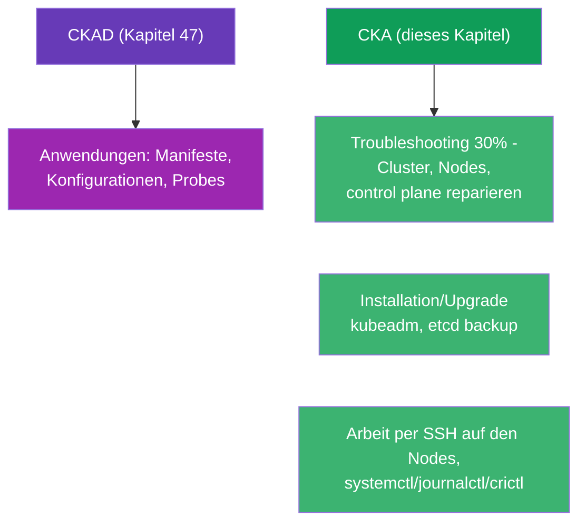
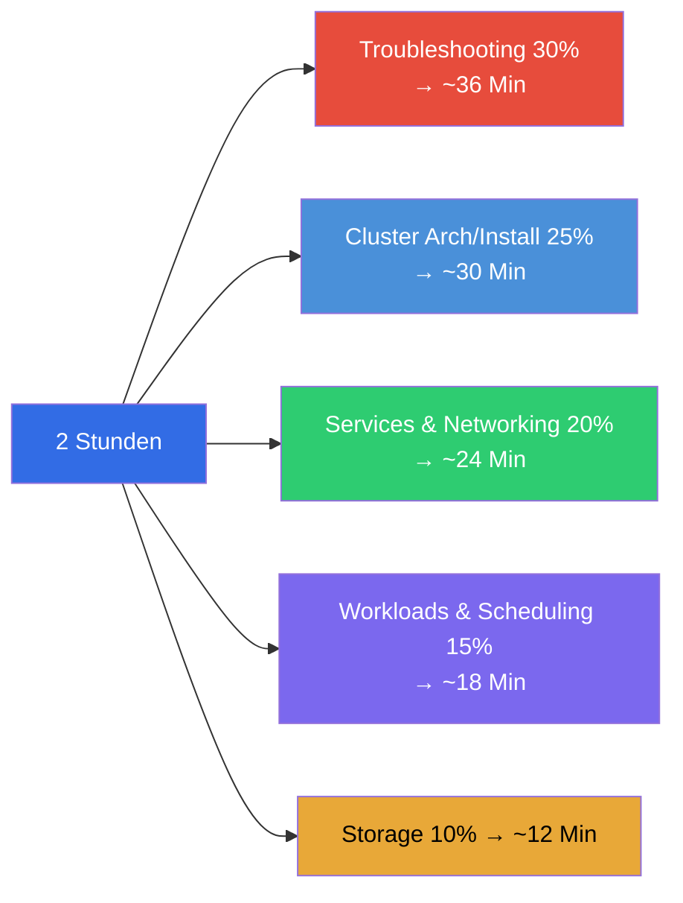
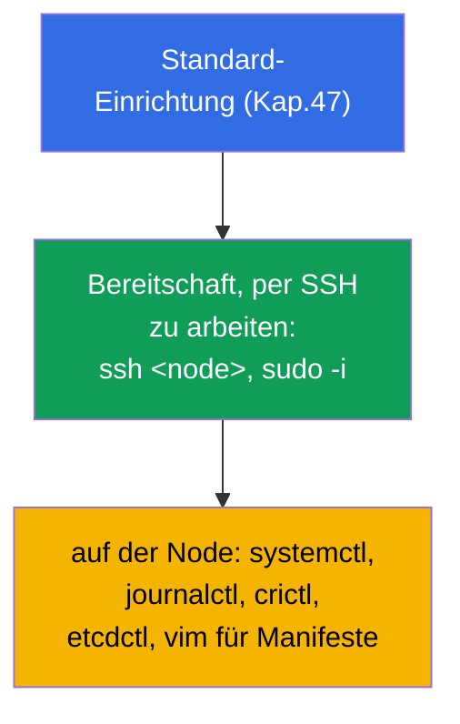
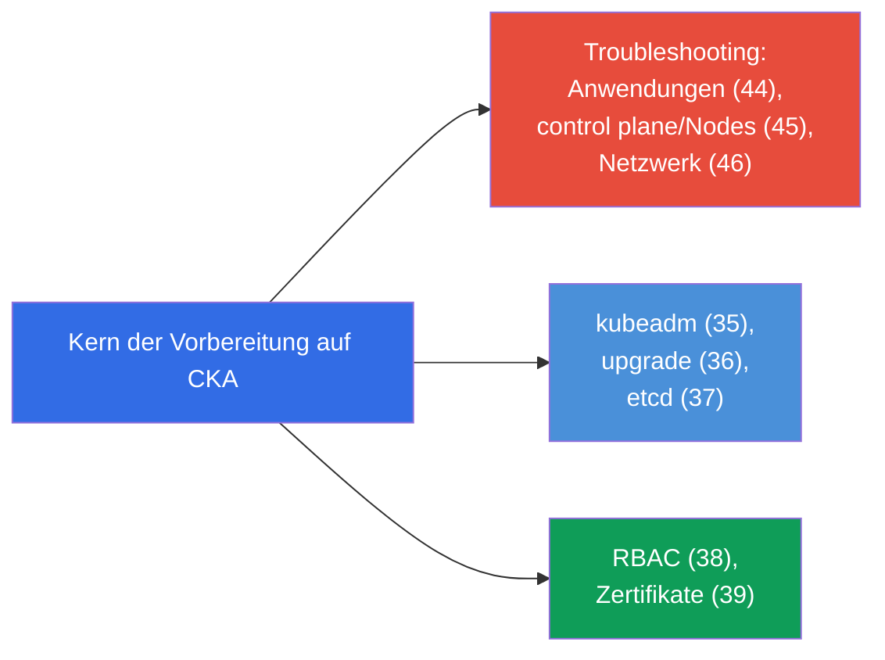
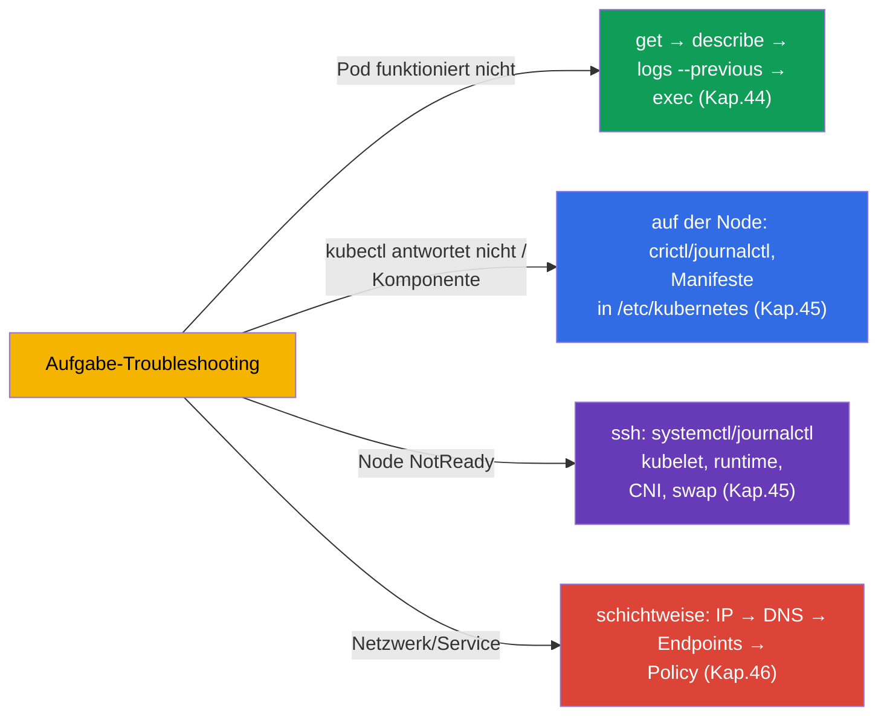
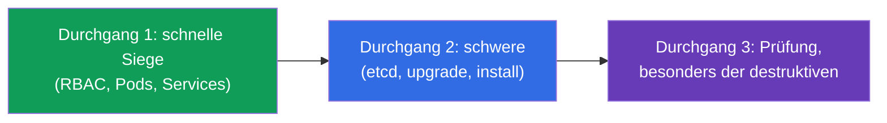
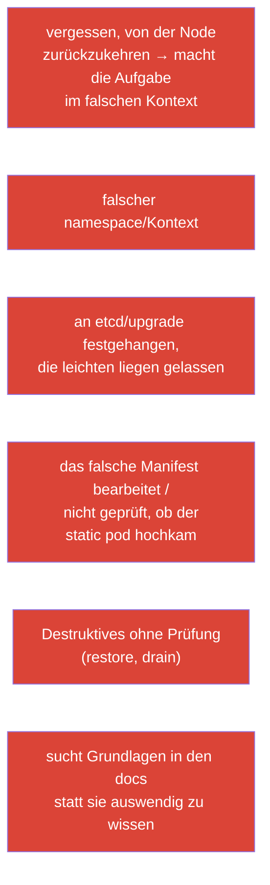

[Русская версия](ru.md) · [Eng version](README.md) · [Versión en español](es.md) · [Version française](fr.md) · [ქართული ვერსია](ge.md)

# Kapitel 48. Prüfung CKA: Format, Zeitmanagement und Strategie

> 🟦 **Kapitel für CKA.** Die allgemeinen Techniken für Geschwindigkeit und Organisation sind
> dieselben wie für CKAD (Kapitel 47); hier liegt der Fokus auf den Besonderheiten von CKA:
> Troubleshooting (30%), Administration des Clusters, Arbeit auf den Nodes.
>
> **Was kommt.** Das Finale des Kurses. Sie haben das gesamte Wissen (Kapitel 1-46) und die Taktik
> der Geschwindigkeit (Kapitel 47). Jetzt geht es darum, wie man genau CKA besteht: diese Prüfung
> ist in Richtung Betrieb und Troubleshooting verschoben, verlangt Arbeit per SSH auf den Nodes und
> souveränes Zerlegen von Cluster-Ausfällen. Bauen wir die Strategie und die Karte der Wiederholung.

## 48.1. Worin sich CKA von CKAD taktisch unterscheidet

Das Format ist dasselbe (2 Stunden, ~15-20 Aufgaben, 66%, Dokumentation erlaubt, Teilpunkte), aber
die Akzente sind andere (Kapitel 1):



Der wichtigste Unterschied: **bei CKA gibt es viel Arbeit außerhalb von kubectl** - auf den Nodes
selbst (SSH, Systemdienste, Dateien). Troubleshooting (30%) und Installation/Wartung des Clusters
verlangen, in `/etc/kubernetes/`, `systemctl`, `journalctl`, `crictl`, `etcdctl` hineinzugehen.

## 48.2. Gewichte der Domänen und Verteilung der Zeit

Verteilen Sie die Zeit nach den Gewichten (Kapitel 1):



Troubleshooting und Cluster Architecture zusammen sind mehr als die Hälfte der Prüfung. Genau dort
lohnt es sich, die Hauptvorbereitung zu investieren.

## 48.3. Die ersten Minuten: dieselben Einstellungen + SSH

Die Einrichtung der Umgebung ist wie bei CKAD (Kapitel 47): alias, `$do`/`$now`,
Autovervollständigung, vim mit expandtab. Dazu die Besonderheiten von CKA:

```bash
alias k=kubectl
export do="--dry-run=client -o yaml"
source <(kubectl completion bash); complete -o default -F __start_kubectl k
echo 'set tabstop=2 shiftwidth=2 expandtab' >> ~/.vimrc; export KUBE_EDITOR=vim
```



> **Wichtig für CKA.** Viele Aufgaben werden **auf der Node** gelöst und nicht über kubectl. Seien
> Sie bereit für `ssh` auf control plane/worker, `sudo`, Bearbeiten von Dateien in
> `/etc/kubernetes/`, Ansehen von `journalctl -u kubelet`, `crictl ps`. Vergessen Sie nicht, nach
> der Arbeit auf der Node auf „Ihre“ Maschine zurückzukehren.

## 48.4. Die Schlüsselaufgaben von CKA und wo man sie wiederholt

Typische punktestarke Aufgaben und die Kapitel des Kurses:

| Aufgabe | Kapitel |
|---------|-------|
| Cluster installieren / Node hinzufügen (kubeadm) | 35 |
| Cluster aktualisieren (upgrade, cordon/drain) | 36 |
| Backup/Wiederherstellung von etcd | 37 |
| RBAC: Rollen und Bindings | 38 |
| Zertifikat per CSR ausstellen / kubeconfig | 39 |
| control plane reparieren (static pods) | 15, 45 |
| Node NotReady (kubelet/runtime/CNI) | 45, 30 |
| Service/DNS funktioniert nicht (Endpoints, CoreDNS) | 7, 31, 46 |
| NetworkPolicy | 34 |
| Deployment, scheduling, Ressourcen | 5, 8, 12-14 |
| PV/PVC, StorageClass | 25-26 |



## 48.5. Strategie des Troubleshooting unter der Uhr

Da Troubleshooting 30% ausmacht, trainieren Sie die Algorithmen bis zur Automatik (Kapitel 44-46):



Raten Sie nicht - wenden Sie die Entscheidungsbäume aus den Kapiteln 44-46 an. Schnelle
Lokalisierung („welche Schicht / Komponente“) ist wichtiger als das Wissen um seltene Details.

## 48.6. Zeitmanagement und Regeln der Prüfung

Die allgemeine Strategie ist wie bei CKAD (Kapitel 47): drei Durchgänge, auf das Gewicht schauen,
nicht festhängen, Zeit für die Prüfung lassen. Die Besonderheiten von CKA:

- **Schwere Aufgaben (etcd restore, upgrade, Installation) brauchen viel Zeit** - schätzen Sie ab,
  ob Sie es schaffen, und opfern Sie nicht mehrere leichte für eine komplizierte.
- **Kehren Sie nach der Arbeit auf der Node in den ursprünglichen Kontext zurück** - man vergisst es
  leicht und macht die nächste Aufgabe „am falschen Ort“.
- **Prüfen Sie destruktive Operationen** (restore etcd, drain) - sie sind bei einem Fehler teuer.
- **Die Dokumentation kubernetes.io ist erlaubt** - halten Sie die Seiten zu kubeadm upgrade, etcd
  backup, CSR bereit: exakte Befehle lassen sich bequem kopieren.



## 48.7. Top-Fehler bei CKA



## 48.8. Finale Checkliste vor CKA

- [ ] ich kann kubeadm init/join und kenne die Schritte der Vorbereitung einer Node (Kapitel 35);
- [ ] ich kann ein upgrade des Clusters mit cordon/drain/uncordon (Kapitel 36);
- [ ] ich kenne die Befehle etcd snapshot save/restore auswendig (Kapitel 37);
- [ ] ich erstelle souverän RBAC und prüfe `auth can-i --as` (Kapitel 38);
- [ ] ich kann CSR approve und die Einrichtung von kubeconfig (Kapitel 39);
- [ ] ich repariere das control plane über Manifeste + crictl/journalctl (Kapitel 15, 45);
- [ ] ich zerlege NotReady auf der Node per SSH (Kapitel 45);
- [ ] ich debugge das Netzwerk schichtweise und weiß über Endpoints/DNS (Kapitel 46);
- [ ] ich habe alias/Autovervollständigung/vim eingerichtet und schalte Kontexte reflexartig um (Kapitel 47);
- [ ] ich habe Mock-Prüfungen unter der Uhr durchgespielt.


## 48.9. Mini-Glossar

- **Troubleshooting-Domäne** - 30% von CKA, die gewichtigste; Anwendungen/Cluster/Netzwerk reparieren.
- **Arbeit auf der Node** - SSH + systemctl/journalctl/crictl/etcdctl (Besonderheit von CKA).
- **drei Durchgänge** - Zeitstrategie (leichte → schwere → Prüfung).
- **destruktive Operationen** - etcd restore, drain: besonders prüfen.
- **in den Kontext zurückkehren** - nach der Arbeit auf der Node auf der ursprünglichen Maschine weitermachen.
- **Mock-Prüfung** - Probe unter der Uhr mit Autoprüfung.

## 48.10. Zusammenfassung des Kapitels

- CKA ist formal wie CKAD (2 Stunden, ~17 Aufgaben, 66%, Teilpunkte), aber verschoben in Richtung
  Troubleshooting (30%) und Administration - viel Arbeit außerhalb von kubectl, auf den Nodes per SSH.
- Die Zeit - nach den Gewichten: Troubleshooting + cluster architecture sind >50% der Prüfung, dorthin
  der Hauptfokus.
- Die Einrichtung der Umgebung ist dieselbe (Kapitel 47) + Bereitschaft für SSH/systemctl/journalctl/crictl/
  etcdctl auf den Nodes; nach der Arbeit auf der Node in den ursprünglichen Kontext zurückkehren.
- Schlüsselaufgaben: kubeadm install/upgrade, etcd backup/restore, RBAC, CSR, Reparatur von
  control plane und Nodes, Netzwerk-Debugging - wiederholen nach den Karten 48.4/48.5.
- Troubleshooting mit Entscheidungsbäumen lösen (Kapitel 44-46) und nicht durch Raten.
- Zeitmanagement: drei Durchgänge, nicht an den schweren festhängen (etcd/upgrade), destruktive
  Operationen prüfen.

## 48.11. Wofür das nützlich ist: in der Prüfung und in der echten Arbeit

**In der Prüfung (CKA).** Dieses Kapitel ist die Zusammenstellung von allem zu einer Strategie des Bestehens: Verteilung
der Zeit nach Gewichten, Bereitschaft auf den Nodes zu arbeiten, Bäume des Troubleshooting und die Checkliste. Zusammen
mit Kapitel 47 (allgemeine Taktik) und dem Wissen der Kapitel 1-46 ist das, was die Bestehensgrenze liefert.

**In der echten Arbeit.** Die Fähigkeiten von CKA sind genau die alltägliche Arbeit eines Administrators/SRE: einen
Cluster aufsetzen und aktualisieren, etcd backuppen, Zugriffe einrichten, ein abgestürztes control plane oder eine Node
reparieren, einen Netzwerk-Vorfall zerlegen. Die Prüfung prüft genau das, was man in der Produktion tut - deshalb erhöht
die Vorbereitung auf CKA direkt Ihren Wert als Ingenieur.

## 48.12. Fragen zur Selbstüberprüfung

1. Worin unterscheidet sich die Taktik von CKA von CKAD? Warum ist die Bereitschaft, auf den Nodes zu arbeiten, wichtig?
2. Wie verteilt man 2 Stunden auf die Domänen und wohin investiert man die Hauptvorbereitung?
3. Welche Werkzeuge braucht man auf der Node und warum darf man nicht vergessen, in den ursprünglichen Kontext zurückzukehren?
4. Nennen Sie die wichtigsten punktestarken Aufgaben von CKA und die Kapitel für ihre Wiederholung.
5. Wie lokalisiert man unter der Uhr schnell ein Troubleshooting-Problem?
6. Warum verlangen destruktive Operationen (etcd restore, drain) eine besondere Prüfung?
7. Was in Ihrer finalen Checkliste ist noch nicht bis zur Automatik trainiert?

## Abschluss des Kurses

Herzlichen Glückwunsch - Sie haben den gesamten gemeinsamen Kurs CKA + CKAD durchlaufen. Sie haben
Kubernetes von der Architektur des Clusters und den Workloads bis zu Netzwerk, Storage, Sicherheit,
Administration und Troubleshooting zerlegt und kennen die Taktik beider Prüfungen. Es bleibt das
Wichtigste - die **Hände**: spielen Sie die Laborarbeiten und Mock-Prüfungen unter der Uhr durch,
bis die Befehle zum Reflex werden. Wissen + trainierte Geschwindigkeit = bestandene CKA und CKAD.

Für die punktgenaue Vorbereitung auf eine einzelne Prüfung nutzen Sie die Wegweiser:
[CKA](../CKA_DE.md) · [CKAD](../CKAD_DE.md).

🧪 Lab 119 (Drills für Geschwindigkeit und JSONPath): [tasks/cka/labs/119](../../labs/119/README_DE.MD)

🧪 Mock-Prüfungen CKA: [tasks/cka/mock](../../mock)

---
[Inhalt](../README_DE.md) · [Kapitel 47](../47/de.md)
