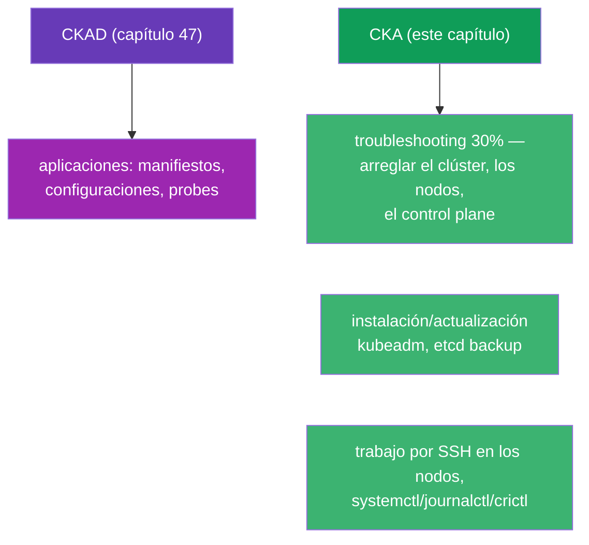
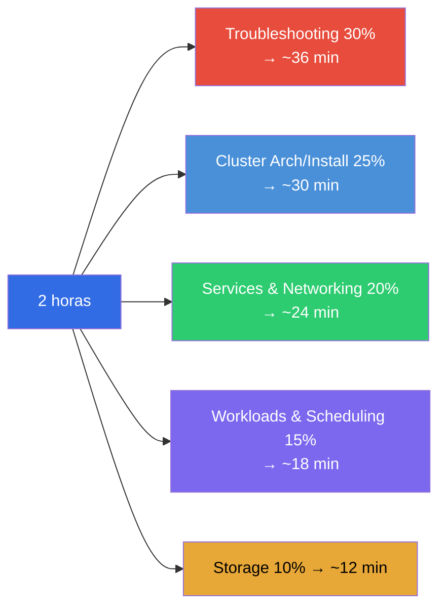
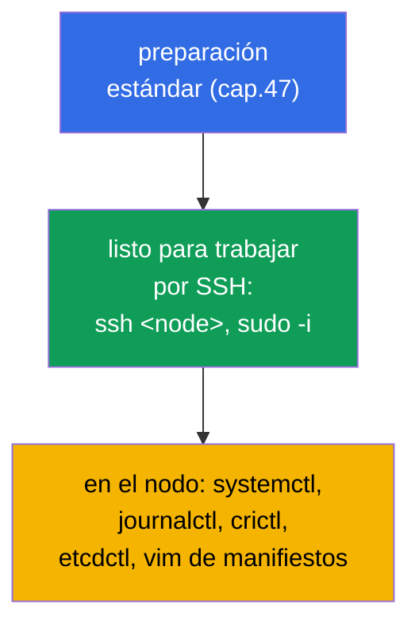
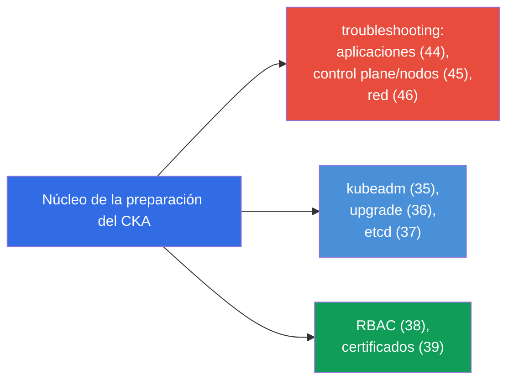
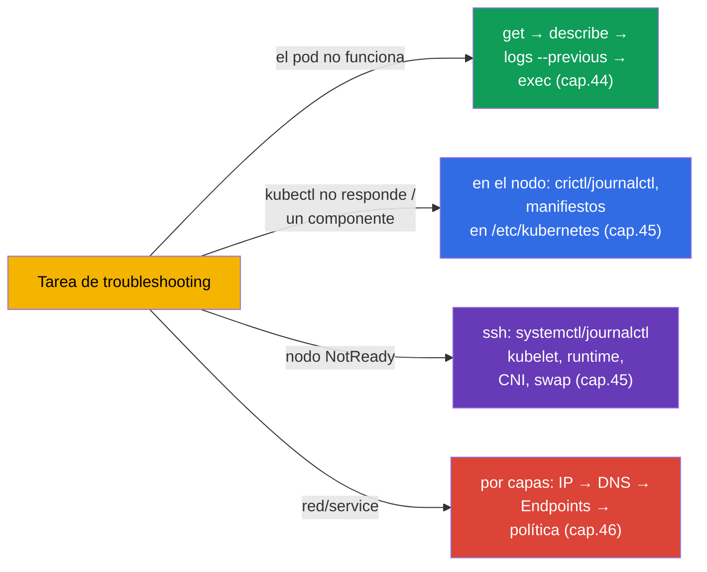
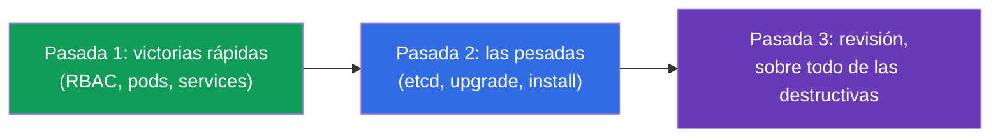
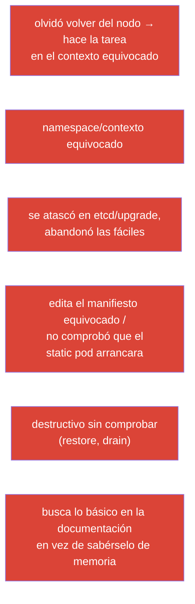
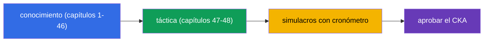

[Русская версия](ru.md) · [Eng version](README.md) · [Version française](fr.md) · [Deutsche Version](de.md) · [ქართული ვერსია](ge.md)

# Capítulo 48. Examen CKA: formato, gestión del tiempo y estrategia

> 🟦 **Capítulo para CKA.** Los trucos generales de velocidad y organización son los mismos que para el CKAD (capítulo
> 47); aquí el foco está en lo específico del CKA: troubleshooting (30%), administración del clúster,
> trabajo en los nodos.
>
> **Qué viene ahora.** El final del curso. Ya tienes todo el conocimiento (capítulos 1-46) y la táctica de velocidad (capítulo
> 47). Ahora toca ver cómo aprobar precisamente el CKA: este examen está desplazado hacia la operación y el
> troubleshooting, exige trabajar por SSH en los nodos y analizar con soltura los fallos del clúster.
> Vamos a montar la estrategia y el mapa de repaso.

## 48.1. En qué se diferencia el CKA del CKAD en cuanto a táctica

El formato es el mismo (2 horas, ~15-20 tareas, 66%, documentación permitida, puntos parciales), pero
los acentos son distintos (capítulo 1):



La diferencia principal: **en el CKA hay mucho trabajo fuera de kubectl** - en los propios nodos (SSH, servicios
del sistema, ficheros). El troubleshooting (30%) y la instalación/mantenimiento del clúster obligan a meterse en
`/etc/kubernetes/`, `systemctl`, `journalctl`, `crictl`, `etcdctl`.

## 48.2. Pesos de los dominios y reparto del tiempo

Reparte el tiempo según los pesos (capítulo 1):



Troubleshooting y Cluster Architecture juntos son más de la mitad del examen. Es justo ahí donde conviene
invertir el grueso de la preparación.

## 48.3. Los primeros minutos: los mismos ajustes + SSH

La preparación del entorno es como en el CKAD (capítulo 47): alias, `$do`/`$now`, autocompletado, vim con
expandtab. Más lo específico del CKA:

```bash
alias k=kubectl
export do="--dry-run=client -o yaml"
source <(kubectl completion bash); complete -o default -F __start_kubectl k
echo 'set tabstop=2 shiftwidth=2 expandtab' >> ~/.vimrc; export KUBE_EDITOR=vim
```



> **Importante para el CKA.** Muchas tareas se resuelven **en el nodo**, no a través de kubectl. Prepárate para
> hacer `ssh` al control plane/worker, `sudo`, editar ficheros en `/etc/kubernetes/`,
> mirar `journalctl -u kubelet`, `crictl ps`. No olvides volver a «tu» máquina
> después de trabajar en el nodo.

## 48.4. Tareas clave del CKA y dónde repasarlas

Tareas típicas de alta puntuación y capítulos del curso:

| Tarea | Capítulos |
|---------|-------|
| instalar un clúster / añadir un nodo (kubeadm) | 35 |
| actualizar el clúster (upgrade, cordon/drain) | 36 |
| backup/restauración de etcd | 37 |
| RBAC: roles y bindings | 38 |
| emitir un certificado vía CSR / kubeconfig | 39 |
| arreglar el control plane (static pods) | 15, 45 |
| nodo NotReady (kubelet/runtime/CNI) | 45, 30 |
| service/DNS no funciona (Endpoints, CoreDNS) | 7, 31, 46 |
| NetworkPolicy | 34 |
| Deployment, scheduling, recursos | 5, 8, 12-14 |
| PV/PVC, StorageClass | 25-26 |



## 48.5. Estrategia de troubleshooting con el cronómetro en marcha

Si el troubleshooting es el 30%, entrena los algoritmos hasta el automatismo (capítulos 44-46):



No adivines - aplica los árboles de decisión de los capítulos 44-46. La localización rápida («qué capa /
componente») importa más que conocer detalles raros.

## 48.6. Gestión del tiempo y reglas del examen

La estrategia general es como en el CKAD (capítulo 47): tres pasadas, mirar el peso, no atascarse,
dejar tiempo para revisar. Lo específico del CKA:

- **Las tareas pesadas (etcd restore, upgrade, instalación) llevan mucho tiempo** - valora
  si te da tiempo y no sacrifiques varias fáciles por una difícil.
- **Después de trabajar en el nodo vuelve al contexto de partida** - es fácil olvidarse y hacer
  la siguiente tarea «donde no toca».
- **Comprueba las operaciones destructivas** (restore de etcd, drain) - salen caras si te equivocas.
- **La documentación de kubernetes.io está permitida** - ten a mano las páginas de kubeadm
  upgrade, etcd backup, CSR: los comandos exactos son cómodos de copiar.



## 48.7. Top de errores en el CKA



## 48.8. Checklist final antes del CKA

- [ ] sé hacer kubeadm init/join y conozco los pasos de preparación de un nodo (capítulo 35);
- [ ] sé hacer upgrade del clúster con cordon/drain/uncordon (capítulo 36);
- [ ] me sé de memoria los comandos de etcd snapshot save/restore (capítulo 37);
- [ ] creo RBAC con soltura y compruebo con `auth can-i --as` (capítulo 38);
- [ ] sé aprobar CSR y configurar kubeconfig (capítulo 39);
- [ ] arreglo el control plane vía manifiestos + crictl/journalctl (capítulos 15, 45);
- [ ] analizo un NotReady en el nodo por SSH (capítulo 45);
- [ ] depuro la red por capas y conozco Endpoints/DNS (capítulo 46);
- [ ] configuré alias/autocompletado/vim y cambio de contexto de forma refleja (capítulo 47);
- [ ] pasé exámenes simulados con cronómetro.



## 48.9. Mini-glosario

- **dominio de troubleshooting** - el 30% del CKA, el de mayor peso; arreglar aplicaciones/clúster/red.
- **trabajo en el nodo** - SSH + systemctl/journalctl/crictl/etcdctl (específico del CKA).
- **tres pasadas** - estrategia de tiempo (fáciles → pesadas → revisión).
- **operaciones destructivas** - etcd restore, drain: comprobarlas con especial cuidado.
- **volver al contexto** - después de trabajar en el nodo, continuar en la máquina de partida.
- **examen simulado** - ensayo con cronómetro y autocorrección.

## 48.10. Resumen del capítulo

- El CKA es formalmente como el CKAD (2 horas, ~17 tareas, 66%, puntos parciales), pero está desplazado hacia el
  troubleshooting (30%) y la administración - mucho trabajo fuera de kubectl, en los nodos por SSH.
- El tiempo, según los pesos: troubleshooting + cluster architecture son >50% del examen, ahí va el foco
  principal.
- La preparación del entorno es la misma (capítulo 47) + estar listo para SSH/systemctl/journalctl/crictl/
  etcdctl en los nodos; después de trabajar en el nodo, volver al contexto de partida.
- Tareas clave: kubeadm install/upgrade, etcd backup/restore, RBAC, CSR, arreglar el
  control plane y los nodos, depuración de red - repasar con los mapas 48.4/48.5.
- El troubleshooting se resuelve con árboles de decisión (capítulos 44-46), no adivinando.
- Gestión del tiempo: tres pasadas, no atascarse en las pesadas (etcd/upgrade), comprobar las
  operaciones destructivas.

## 48.11. Para qué sirve esto: en el examen y en el trabajo real

**En el examen (CKA).** Este capítulo es el ensamblaje de todo en una estrategia de aprobado: reparto del tiempo por
pesos, disposición para trabajar en los nodos, árboles de troubleshooting y checklist. Junto con el capítulo 47
(táctica general) y el conocimiento de los capítulos 1-46, es lo que da la nota de aprobado.

**En el trabajo real.** Las habilidades del CKA son justamente el día a día de un administrador/SRE:
levantar y actualizar un clúster, hacer backup de etcd, configurar accesos, arreglar un control
plane o un nodo caído, analizar un incidente de red. El examen comprueba exactamente lo que se hace en producción -
por eso preparar el CKA aumenta directamente tu valor como ingeniero.

## 48.12. Preguntas de autocomprobación

1. ¿En qué se diferencia la táctica del CKA de la del CKAD? ¿Por qué importa estar listo para trabajar en los nodos?
2. ¿Cómo repartir las 2 horas entre dominios y dónde invertir el grueso de la preparación?
3. ¿Qué herramientas hacen falta en el nodo y por qué no se puede olvidar volver al contexto de partida?
4. Enumera las tareas clave de alta puntuación del CKA y los capítulos para repasarlas.
5. ¿Cómo localizar rápido un problema de troubleshooting con el cronómetro en marcha?
6. ¿Por qué las operaciones destructivas (etcd restore, drain) exigen una comprobación especial?
7. ¿Qué queda en tu checklist final por llevar hasta el automatismo?

## Conclusión del curso

Enhorabuena - has completado todo el curso conjunto de CKA + CKAD. Has recorrido Kubernetes desde la
arquitectura del clúster y las cargas de trabajo hasta la red, el almacenamiento, la seguridad, la
administración y el troubleshooting, y conoces la táctica de ambos exámenes. Queda lo principal -
**las manos**: pasa los laboratorios y los exámenes simulados con cronómetro hasta que los comandos se
vuelvan un reflejo. Conocimiento + velocidad entrenada = CKA y CKAD aprobados.

Para una preparación centrada en un solo examen usa las guías:
[CKA](../CKA_ES.md) · [CKAD](../CKAD_ES.md).

🧪 Laboratorio 119 (drills de velocidad y JSONPath): [tasks/cka/labs/119](../../labs/119/README_ES.MD)

🧪 Exámenes simulados del CKA: [tasks/cka/mock](../../mock)

---
[Índice](../README_ES.md) · [Capítulo 47](../47/es.md)
