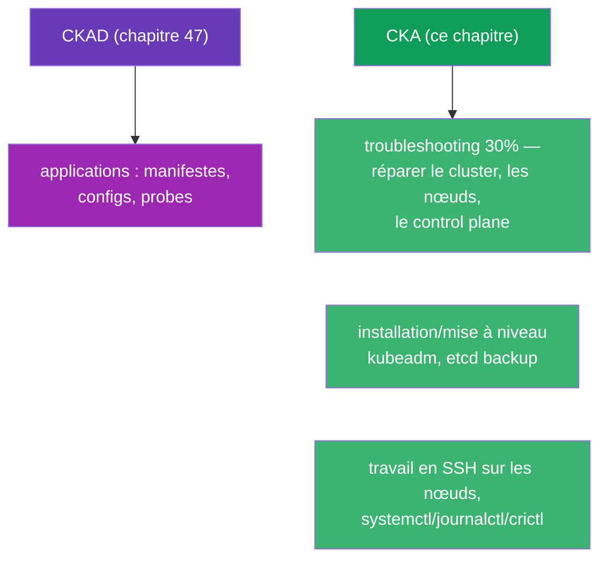
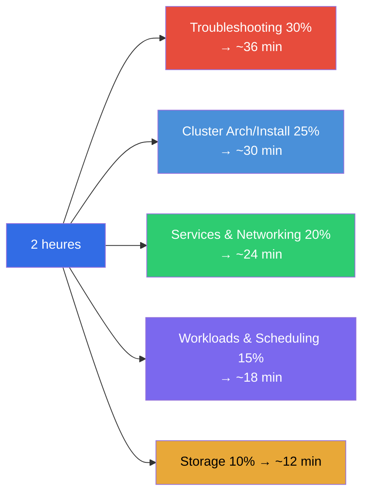
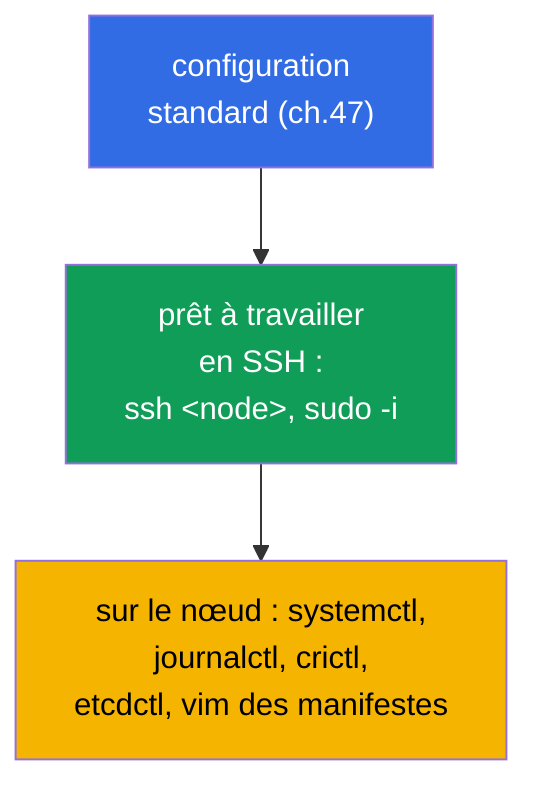
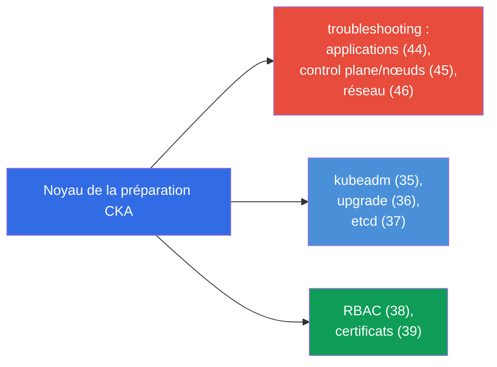
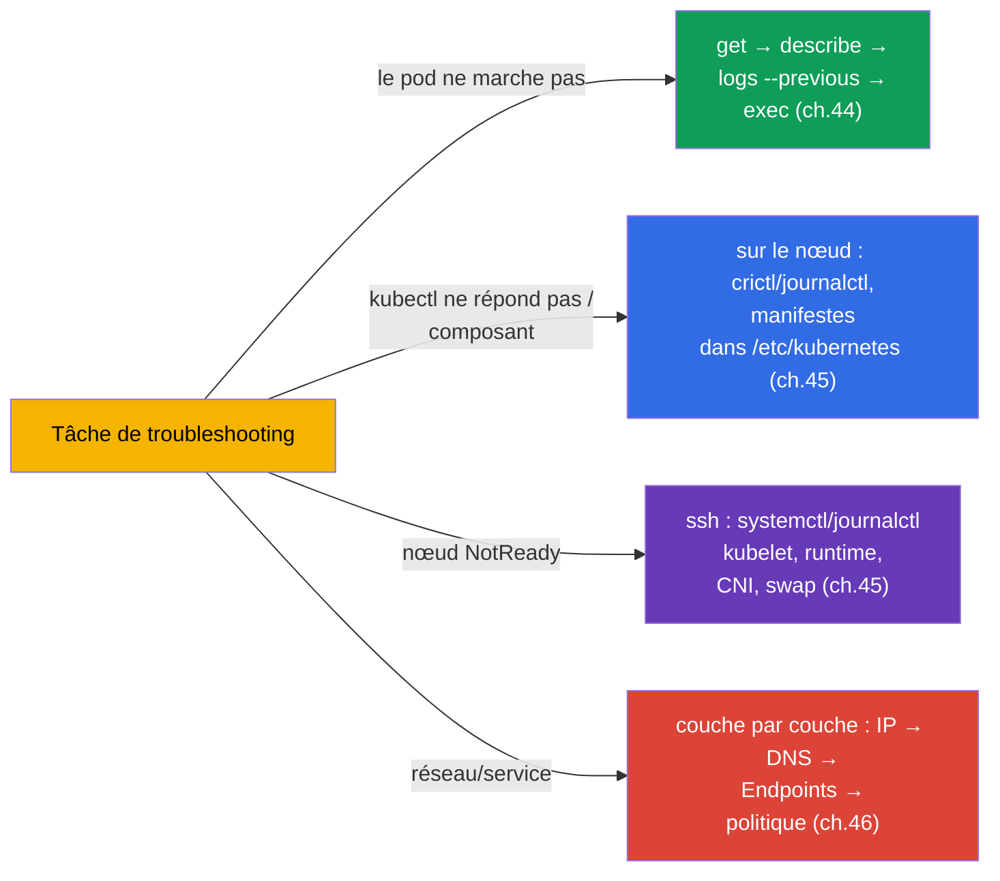
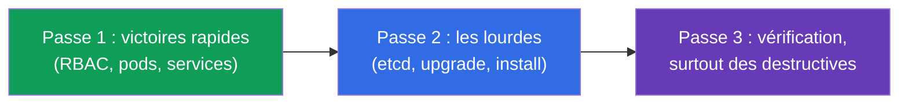
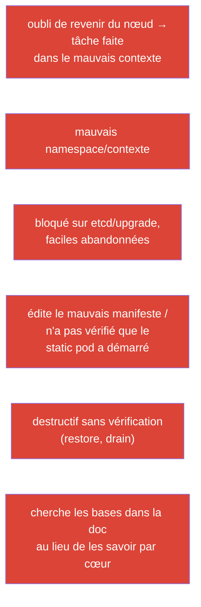

[Русская версия](ru.md) · [Eng version](README.md) · [Versión en español](es.md) · [Deutsche Version](de.md) · [ქართული ვერსია](ge.md) · [繁體中文版](tw.md) · [日本語版](jp.md)

# Chapitre 48. L'examen CKA : format, gestion du temps et stratégie

> 🟦 **Chapitre pour le CKA.** Les techniques générales de vitesse et d'organisation - les mêmes que
> pour le CKAD (chapitre 47) ; ici l'accent porte sur la spécificité du CKA : troubleshooting (30%),
> administration du cluster, travail sur les nœuds.
>
> **Ce qui suit.** La fin du cours. Vous avez toutes les connaissances (chapitres 1-46) et la tactique
> de vitesse (chapitre 47). Maintenant - comment réussir précisément le CKA : cet examen est orienté
> exploitation et troubleshooting, il exige de travailler en SSH sur les nœuds et d'analyser avec
> assurance les pannes du cluster. Construisons la stratégie et la carte de révision.

## 48.1. En quoi la tactique du CKA diffère de celle du CKAD

Le format est le même (2 heures, ~15-20 tâches, 66%, documentation autorisée, points partiels), mais
les accents sont différents (chapitre 1) :



La différence principale : **au CKA il y a beaucoup de travail hors de kubectl** - sur les nœuds
eux-mêmes (SSH, services système, fichiers). Le troubleshooting (30%) et l'installation/maintenance du
cluster obligent à aller dans `/etc/kubernetes/`, `systemctl`, `journalctl`, `crictl`, `etcdctl`.

## 48.2. Poids des domaines et répartition du temps

Répartissez le temps selon les poids (chapitre 1) :



Le troubleshooting et Cluster Architecture ensemble - plus de la moitié de l'examen. C'est là qu'il
faut investir l'essentiel de la préparation.

## 48.3. Les premières minutes : les mêmes réglages + SSH

La configuration de l'environnement - comme au CKAD (chapitre 47) : alias, `$do`/`$now`,
autocomplétion, vim avec expandtab. Plus la spécificité du CKA :

```bash
alias k=kubectl
export do="--dry-run=client -o yaml"
source <(kubectl completion bash); complete -o default -F __start_kubectl k
echo 'set tabstop=2 shiftwidth=2 expandtab' >> ~/.vimrc; export KUBE_EDITOR=vim
```



> **Important pour le CKA.** Beaucoup de tâches se résolvent **sur le nœud**, et non via kubectl. Soyez
> prêt à faire `ssh` vers le control plane/worker, `sudo`, éditer des fichiers dans `/etc/kubernetes/`,
> consulter `journalctl -u kubelet`, `crictl ps`. N'oubliez pas de revenir sur « votre » machine
> après le travail sur le nœud.

## 48.4. Les tâches clés du CKA et où les réviser

Tâches types à fort score et chapitres du cours :

| Tâche | Chapitres |
|---------|-------|
| installer un cluster / ajouter un nœud (kubeadm) | 35 |
| mettre à niveau le cluster (upgrade, cordon/drain) | 36 |
| backup/restauration d'etcd | 37 |
| RBAC : rôles et liaisons | 38 |
| délivrer un certificat via CSR / kubeconfig | 39 |
| réparer le control plane (static pods) | 15, 45 |
| nœud NotReady (kubelet/runtime/CNI) | 45, 30 |
| service/DNS ne fonctionne pas (Endpoints, CoreDNS) | 7, 31, 46 |
| NetworkPolicy | 34 |
| Deployment, scheduling, ressources | 5, 8, 12-14 |
| PV/PVC, StorageClass | 25-26 |



## 48.5. Stratégie de troubleshooting sous chronomètre

Puisque le troubleshooting - 30%, entraînez les algorithmes jusqu'à l'automatisme (chapitres 44-46) :



Ne devinez pas - appliquez les arbres de décision des chapitres 44-46. Une localisation rapide
(« quelle couche / quel composant ») importe plus que la connaissance de détails rares.

## 48.6. Gestion du temps et règles de l'examen

La stratégie générale - comme au CKAD (chapitre 47) : trois passes, regarder le poids, ne pas rester
bloqué, garder du temps pour la vérification. Spécificité du CKA :

- **Les tâches lourdes (etcd restore, upgrade, installation) prennent beaucoup de temps** - évaluez
  si vous y arrivez, et ne sacrifiez pas plusieurs tâches faciles pour une seule difficile.
- **Après le travail sur un nœud, revenez au contexte d'origine** - il est facile d'oublier et de
  faire la tâche suivante « au mauvais endroit ».
- **Vérifiez les opérations destructives** (restore etcd, drain) - elles coûtent cher en cas d'erreur.
- **La documentation kubernetes.io est autorisée** - gardez à portée de main les pages sur kubeadm
  upgrade, etcd backup, CSR : les commandes exactes sont pratiques à copier.



## 48.7. Top des erreurs au CKA



## 48.8. Checklist finale avant le CKA

- [ ] je sais faire kubeadm init/join et je connais les étapes de préparation d'un nœud (chapitre 35) ;
- [ ] je sais faire l'upgrade du cluster avec cordon/drain/uncordon (chapitre 36) ;
- [ ] je connais par cœur les commandes etcd snapshot save/restore (chapitre 37) ;
- [ ] je crée le RBAC avec assurance et je vérifie `auth can-i --as` (chapitre 38) ;
- [ ] je sais faire CSR approve et configurer kubeconfig (chapitre 39) ;
- [ ] je répare le control plane via les manifestes + crictl/journalctl (chapitres 15, 45) ;
- [ ] j'analyse un nœud NotReady en SSH (chapitre 45) ;
- [ ] je débogue le réseau couche par couche et je connais Endpoints/DNS (chapitre 46) ;
- [ ] j'ai configuré alias/autocomplétion/vim et je change de contexte par réflexe (chapitre 47) ;
- [ ] j'ai passé des examens blancs sous chronomètre.


## 48.9. Mini-glossaire

- **domaine troubleshooting** - 30% du CKA, le plus lourd ; réparer applications/cluster/réseau.
- **travail sur le nœud** - SSH + systemctl/journalctl/crictl/etcdctl (spécificité du CKA).
- **trois passes** - stratégie de temps (faciles → lourdes → vérification).
- **opérations destructives** - etcd restore, drain : à vérifier particulièrement.
- **revenir au contexte** - après le travail sur le nœud, continuer sur la machine d'origine.
- **examen blanc** - répétition sous chronomètre avec vérification automatique.

## 48.10. Bilan du chapitre

- Le CKA est formellement comme le CKAD (2 heures, ~17 tâches, 66%, points partiels), mais orienté
  troubleshooting (30%) et administration - beaucoup de travail hors de kubectl, sur les nœuds en SSH.
- Le temps - selon les poids : troubleshooting + cluster architecture c'est >50% de l'examen, l'essentiel
  du focus va là.
- La configuration de l'environnement est la même (chapitre 47) + être prêt pour SSH/systemctl/journalctl/crictl/
  etcdctl sur les nœuds ; après le travail sur un nœud, revenir au contexte d'origine.
- Tâches clés : kubeadm install/upgrade, etcd backup/restore, RBAC, CSR, réparation du
  control plane et des nœuds, débogage réseau - à réviser via les cartes 48.4/48.5.
- Le troubleshooting se résout par arbres de décision (chapitres 44-46), et non par devinettes.
- Gestion du temps : trois passes, ne pas rester bloqué sur les lourdes (etcd/upgrade), vérifier
  les opérations destructives.

## 48.11. À quoi cela sert : à l'examen et dans le travail réel

**À l'examen (CKA).** Ce chapitre - l'assemblage de tout en une stratégie de réussite : répartition du
temps selon les poids, aptitude à travailler sur les nœuds, arbres de troubleshooting et checklist. Avec
le chapitre 47 (tactique générale) et les chapitres 1-46, c'est ce qui donne le score de passage.

**Dans le travail réel.** Les compétences du CKA - c'est exactement le quotidien d'un administrateur/SRE :
monter et mettre à niveau un cluster, sauvegarder etcd, configurer les accès, réparer un control
plane ou un nœud tombé, analyser un incident réseau. L'examen vérifie exactement ce qui se fait en prod -
c'est pourquoi la préparation au CKA augmente directement votre valeur d'ingénieur.

## 48.12. Questions d'auto-évaluation

1. En quoi la tactique du CKA diffère-t-elle de celle du CKAD ? Pourquoi l'aptitude à travailler sur les nœuds est-elle importante ?
2. Comment répartir 2 heures entre les domaines et où investir l'essentiel de la préparation ?
3. Quels outils faut-il sur le nœud et pourquoi ne pas oublier de revenir au contexte d'origine ?
4. Citez les tâches clés à fort score du CKA et les chapitres pour les réviser.
5. Comment localiser rapidement un problème de troubleshooting sous chronomètre ?
6. Pourquoi les opérations destructives (etcd restore, drain) exigent-elles une vérification particulière ?
7. Qu'est-ce qui, dans votre checklist finale, n'est pas encore acquis jusqu'à l'automatisme ?

## Conclusion du cours

Félicitations - vous avez terminé tout le cours conjoint CKA + CKAD. Vous avez exploré Kubernetes depuis
l'architecture du cluster et les charges de travail jusqu'au réseau, au stockage, à la sécurité,
à l'administration et au troubleshooting, et vous connaissez la tactique des deux examens. Reste l'essentiel -
**les mains** : refaites les TP et les examens blancs sous chronomètre, jusqu'à ce que les commandes
deviennent un réflexe. Connaissances + vitesse entraînée = CKA et CKAD réussis.

Pour une préparation ciblée à un seul examen, utilisez les guides :
[CKA](../CKA_FR.md) · [CKAD](../CKAD_FR.md).

🧪 TP 119 (drills de vitesse et JSONPath) : [tasks/cka/labs/119](../../labs/119/README_FR.MD)

🧪 Examens blancs CKA : [tasks/cka/mock](../../mock)

---
[Sommaire](../README_FR.md) · [Chapitre 47](../47/fr.md)
