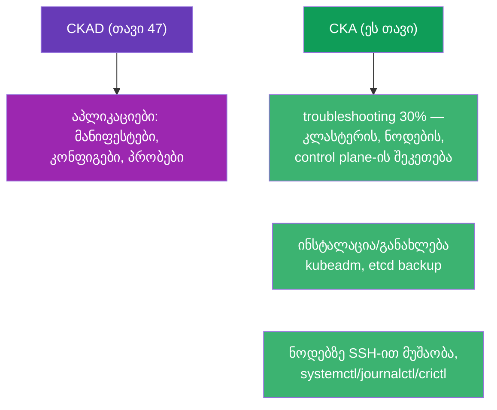
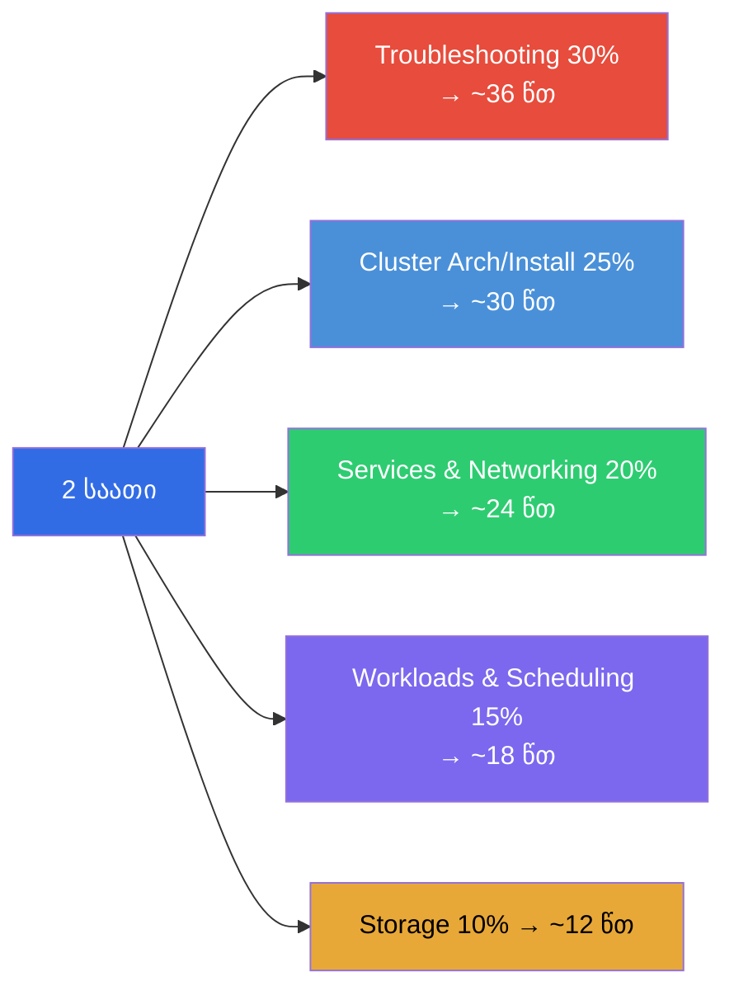
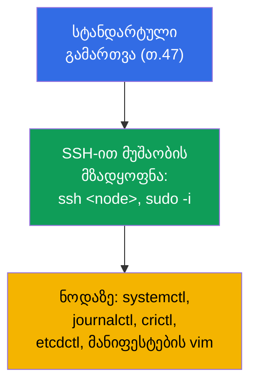
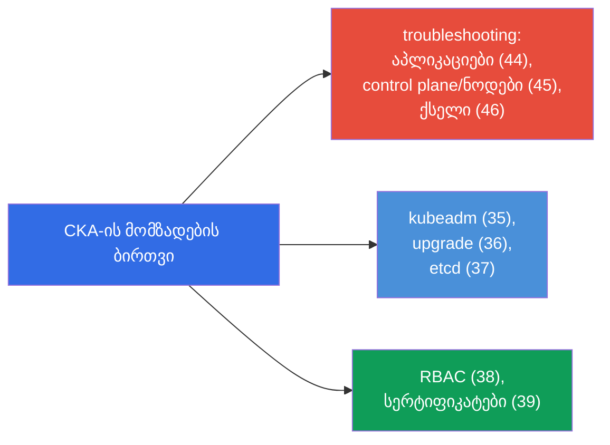
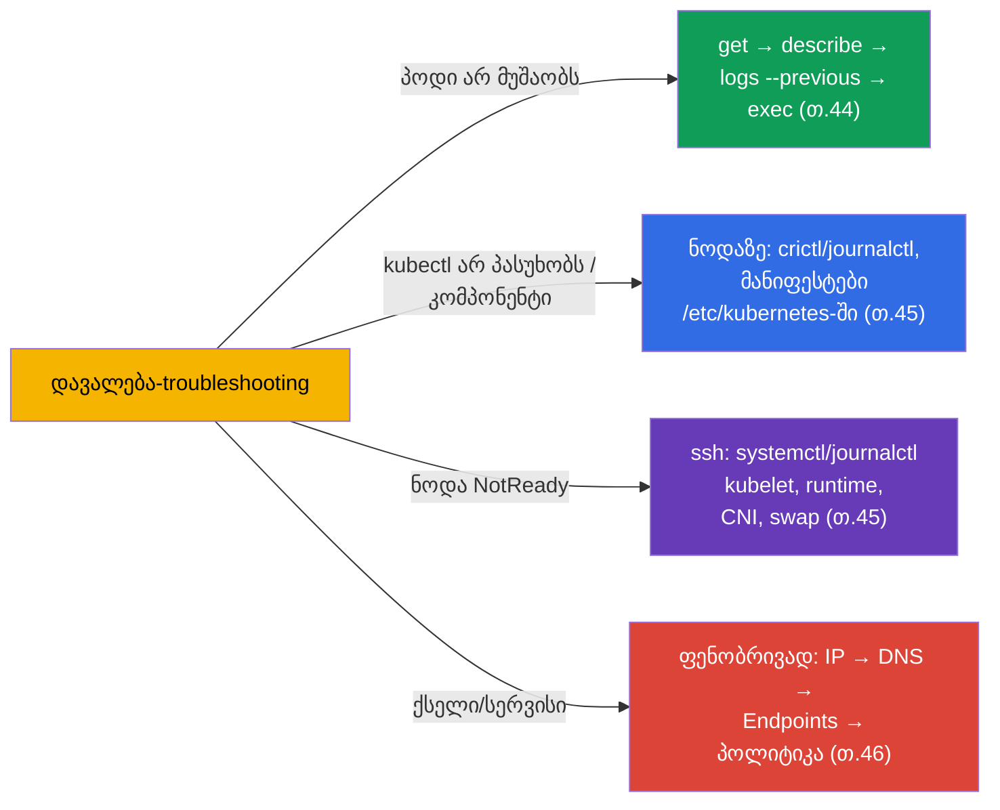
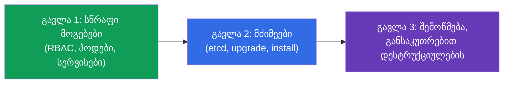
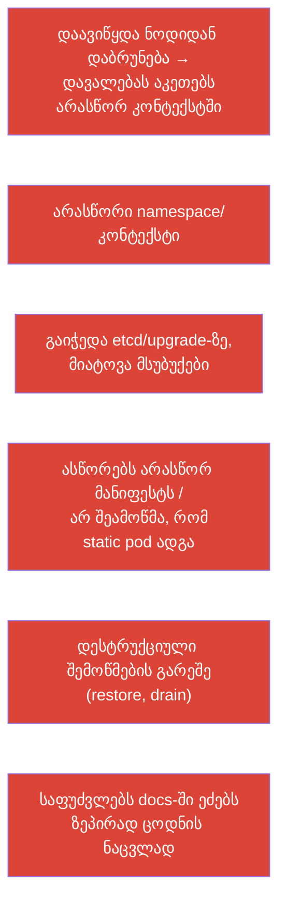
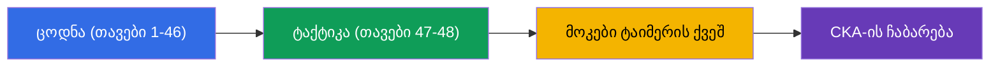

[Русская версия](ru.md) · [Eng version](README.md) · [Versión en español](es.md) · [Version française](fr.md) · [Deutsche Version](de.md) · [繁體中文版](tw.md) · [日本語版](jp.md)

# თავი 48. CKA გამოცდა: ფორმატი, დროის მართვა და სტრატეგია

> 🟦 **თავი CKA-სთვის.** სიჩქარისა და ორგანიზების საერთო ხერხები - იგივეა, რაც CKAD-ისთვის (თავი
> 47); აქ ფოკუსი CKA-ის სპეციფიკაზეა: troubleshooting (30%), კლასტერის ადმინისტრირება,
> ნოდებზე მუშაობა.
>
> **რა იქნება შემდეგ.** კურსის ფინალი. გაქვთ ყველა ცოდნა (თავები 1-46) და სიჩქარის ტაქტიკა (თავი
> 47). ახლა - როგორ ჩავაბაროთ სწორედ CKA: ეს გამოცდა ექსპლუატაციისა და
> troubleshooting-ის მხარესაა გადახრილი, მოითხოვს ნოდებზე SSH-ით მუშაობას და კლასტერის ჩავარდნების თავდაჯერებულ ანალიზს.
> ავაწყოთ სტრატეგია და გამეორების რუკა.

## 48.1. რითი განსხვავდება CKA CKAD-ისგან ტაქტიკით

ფორმატი იგივეა (2 საათი, ~15-20 დავალება, 66%, დოკუმენტაცია ნებადართულია, ნაწილობრივი ქულები), მაგრამ
აქცენტები სხვაა (თავი 1):



მთავარი განსხვავება: **CKA-ზე ბევრი სამუშაოა kubectl-ის გარეთ** - თავად ნოდებზე (SSH, სისტემური
სერვისები, ფაილები). Troubleshooting (30%) და კლასტერის ინსტალაცია/მომსახურება მოითხოვს ჩაძვრომას
`/etc/kubernetes/`-ში, `systemctl`, `journalctl`, `crictl`, `etcdctl`.

## 48.2. დომენების წონები და დროის განაწილება

დრო გაანაწილეთ წონების მიხედვით (თავი 1):



Troubleshooting და Cluster Architecture ერთად - გამოცდის ნახევარზე მეტია. სწორედ იქ ღირს
ძირითადი მომზადების ჩადება.

## 48.3. პირველი წუთები: იგივე პარამეტრები + SSH

გარემოს გამართვა - როგორც CKAD-ზე (თავი 47): alias, `$do`/`$now`, ავტოშევსება, vim
expandtab-ით. პლუს CKA-ის სპეციფიკა:

```bash
alias k=kubectl
export do="--dry-run=client -o yaml"
source <(kubectl completion bash); complete -o default -F __start_kubectl k
echo 'set tabstop=2 shiftwidth=2 expandtab' >> ~/.vimrc; export KUBE_EDITOR=vim
```



> **მნიშვნელოვანია CKA-სთვის.** ბევრი დავალება წყდება **ნოდაზე**, და არა kubectl-ით. მზად იყავით
> `ssh`-ისთვის control plane/worker-ზე, `sudo`-სთვის, `/etc/kubernetes/`-ში ფაილების რედაქტირებისთვის,
> `journalctl -u kubelet`, `crictl ps`-ის ნახვისთვის. არ დაგავიწყდეთ „თქვენს“ მანქანაზე დაბრუნება
> ნოდაზე მუშაობის შემდეგ.

## 48.4. CKA-ის საკვანძო დავალებები და სად გავიმეოროთ

ტიპური მაღალქულიანი დავალებები და კურსის თავები:

| დავალება | თავები |
|---------|-------|
| კლასტერის ინსტალაცია / ნოდის დამატება (kubeadm) | 35 |
| კლასტერის განახლება (upgrade, cordon/drain) | 36 |
| etcd-ის ბექაპი/აღდგენა | 37 |
| RBAC: როლები და მიბმები | 38 |
| სერტიფიკატის გამოცემა CSR-ით / kubeconfig | 39 |
| control plane-ის შეკეთება (static pods) | 15, 45 |
| ნოდა NotReady (kubelet/runtime/CNI) | 45, 30 |
| სერვისი/DNS არ მუშაობს (Endpoints, CoreDNS) | 7, 31, 46 |
| NetworkPolicy | 34 |
| Deployment, scheduling, რესურსები | 5, 8, 12-14 |
| PV/PVC, StorageClass | 25-26 |



## 48.5. troubleshooting-ის სტრატეგია ტაიმერის ქვეშ

რაკი troubleshooting - 30%-ია, ალგორითმები ავტომატიზმამდე გაიწაფეთ (თავები 44-46):



არ გამოიცნოთ - გამოიყენეთ გადაწყვეტილებების ხეები თავებიდან 44-46. სწრაფი ლოკალიზაცია („რომელი ფენა /
კომპონენტი“) უფრო მნიშვნელოვანია, ვიდრე იშვიათი დეტალების ცოდნა.

## 48.6. დროის მართვა და გამოცდის წესები

საერთო სტრატეგია - როგორც CKAD-ზე (თავი 47): სამი გავლა, წონას დაკვირვება, არ გაიჭედოთ,
დრო დატოვეთ შემოწმებისთვის. CKA-ის სპეციფიკა:

- **მძიმე დავალებები (etcd restore, upgrade, ინსტალაცია) ბევრ დროს იკავებს** - შეაფასეთ,
  ასწრებთ თუ არა, და არ შესწიროთ რამდენიმე მსუბუქი ერთი რთულის გულისთვის.
- **ნოდაზე მუშაობის შემდეგ დაბრუნდით საწყის კონტექსტში** - ადვილია დაგავიწყდეთ და შემდეგი
  დავალება „არასწორ ადგილას“ გააკეთოთ.
- **შეამოწმეთ დესტრუქციული ოპერაციები** (restore etcd, drain) - შეცდომის შემთხვევაში ძვირია.
- **kubernetes.io-ის დოკუმენტაცია ნებადართულია** - ხელთ იქონიეთ გვერდები kubeadm
  upgrade-ზე, etcd backup-ზე, CSR-ზე: ზუსტი ბრძანებების კოპირება მოსახერხებელია.



## 48.7. CKA-ზე შეცდომების ტოპი



## 48.8. ფინალური ჩეკ-ლისტი CKA-ის წინ

- [ ] შემიძლია kubeadm init/join და ვიცი ნოდის მომზადების ნაბიჯები (თავი 35);
- [ ] შემიძლია კლასტერის upgrade cordon/drain/uncordon-ით (თავი 36);
- [ ] ზეპირად ვიცი ბრძანებები etcd snapshot save/restore (თავი 37);
- [ ] თავდაჯერებულად ვქმნი RBAC-ს და ვამოწმებ `auth can-i --as` (თავი 38);
- [ ] შემიძლია CSR approve და kubeconfig-ის გამართვა (თავი 39);
- [ ] ვაკეთებ control plane-ს მანიფესტებით + crictl/journalctl (თავები 15, 45);
- [ ] ვარჩევ NotReady-ს ნოდაზე SSH-ით (თავი 45);
- [ ] ვამართავ ქსელს ფენობრივად და ვიცი Endpoints/DNS-ზე (თავი 46);
- [ ] გავმართე alias/ავტოშევსება/vim და კონტექსტებს რეფლექსურად ვცვლი (თავი 47);
- [ ] გავიარე მოკ-გამოცდები ტაიმერის ქვეშ.



## 48.9. მინი-ლექსიკონი

- **troubleshooting-დომენი** - CKA-ის 30%, ყველაზე წონიანი; აპლიკაციების/კლასტერის/ქსელის შეკეთება.
- **ნოდაზე მუშაობა** - SSH + systemctl/journalctl/crictl/etcdctl (CKA-ის სპეციფიკა).
- **სამი გავლა** - დროის სტრატეგია (მსუბუქები → მძიმეები → შემოწმება).
- **დესტრუქციული ოპერაციები** - etcd restore, drain: განსაკუთრებით შესამოწმებელი.
- **კონტექსტში დაბრუნება** - ნოდაზე მუშაობის შემდეგ საწყის მანქანაზე გაგრძელება.
- **მოკ-გამოცდა** - რეპეტიცია ტაიმერის ქვეშ ავტოშემოწმებით.

## 48.10. თავის შეჯამება

- CKA ფორმალურად CKAD-ის მსგავსია (2 საათი, ~17 დავალება, 66%, ნაწილობრივი ქულები), მაგრამ გადახრილია
  troubleshooting-ისკენ (30%) და ადმინისტრირებისკენ - ბევრი სამუშაოა kubectl-ის გარეთ, ნოდებზე SSH-ით.
- დრო - წონების მიხედვით: troubleshooting + cluster architecture ეს გამოცდის >50%-ია, სწორედ იქ ძირითადი
  ფოკუსი.
- გარემოს გამართვა იგივეა (თავი 47) + მზადყოფნა SSH/systemctl/journalctl/crictl/
  etcdctl-ისთვის ნოდებზე; ნოდაზე მუშაობის შემდეგ საწყის კონტექსტში დაბრუნება.
- საკვანძო დავალებები: kubeadm install/upgrade, etcd backup/restore, RBAC, CSR, control plane-ისა და
  ნოდების შეკეთება, ქსელის გამართვა - გავიმეოროთ რუკებით 48.4/48.5.
- Troubleshooting გადავწყვიტოთ გადაწყვეტილებების ხეებით (თავები 44-46), და არა გამოცნობით.
- დროის მართვა: სამი გავლა, არ გაიჭედოთ მძიმეებზე (etcd/upgrade), შეამოწმეთ
  დესტრუქციული ოპერაციები.

## 48.11. როგორ გამოგადგებათ: გამოცდაზე და რეალურ სამუშაოში

**გამოცდაზე (CKA).** ეს თავი - ყველაფრის ჩაბარების სტრატეგიად აწყობაა: დროის განაწილება
წონების მიხედვით, ნოდებზე მუშაობის მზადყოფნა, troubleshooting-ის ხეები და ჩეკ-ლისტი. თავ 47-თან
(საერთო ტაქტიკა) და თავების 1-46 ცოდნასთან ერთად ეს არის ის, რაც გამსვლელ ქულას იძლევა.

**რეალურ სამუშაოში.** CKA-ის უნარები - ეს სწორედ ადმინისტრატორის/SRE-ის ყოველდღიური სამუშაოა:
კლასტერის ატანა და განახლება, etcd-ის ბექაპი, წვდომების გამართვა, ჩავარდნილი control
plane-ის ან ნოდის შეკეთება, ქსელური ინციდენტის ანალიზი. გამოცდა ამოწმებს ზუსტად იმას, რასაც პროდში აკეთებენ -
ამიტომ CKA-სთვის მომზადება პირდაპირ ზრდის თქვენს ღირებულებას როგორც ინჟინრის.

## 48.12. თვითშემოწმების კითხვები

1. რითი განსხვავდება CKA-ის ტაქტიკა CKAD-ისგან? რატომ არის მნიშვნელოვანი ნოდებზე მუშაობის მზადყოფნა?
2. როგორ გავანაწილოთ 2 საათი დომენებზე და სად ჩავდოთ ძირითადი მომზადება?
3. რომელი ინსტრუმენტებია საჭირო ნოდაზე და რატომ არ შეიძლება დაგვავიწყდეს საწყის კონტექსტში დაბრუნება?
4. ჩამოთვალეთ CKA-ის საკვანძო მაღალქულიანი დავალებები და თავები მათი გამეორებისთვის.
5. როგორ მოვახდინოთ ტაიმერის ქვეშ troubleshooting-პრობლემის სწრაფი ლოკალიზაცია?
6. რატომ მოითხოვს დესტრუქციული ოპერაციები (etcd restore, drain) განსაკუთრებულ შემოწმებას?
7. რა არ არის თქვენს ფინალურ ჩეკ-ლისტში ჯერ ავტომატიზმამდე გაწაფული?

## კურსის დასკვნა

გილოცავთ - გაიარეთ მთელი ერთობლივი კურსი CKA + CKAD. გაარჩიეთ Kubernetes
კლასტერის არქიტექტურიდან და დატვირთვებიდან ქსელამდე, საცავამდე, უსაფრთხოებამდე,
ადმინისტრირებამდე და troubleshooting-მდე, და იცით ორივე გამოცდის ტაქტიკა. დარჩა მთავარი -
**ხელები**: გაატარეთ ლაბორატორიული სამუშაოები და მოკ-გამოცდები ტაიმერის ქვეშ, სანამ ბრძანებები
რეფლექსად არ იქცევა. ცოდნა + გაწაფული სიჩქარე = ჩაბარებული CKA და CKAD.

ერთი გამოცდისთვის მიზნობრივი მომზადებისთვის გამოიყენეთ გზამკვლევები:
[CKA](../CKA_GE.md) · [CKAD](../CKAD_GE.md).

🧪 ლაბი 119 (დრილები სიჩქარესა და JSONPath-ზე): [tasks/cka/labs/119](../../labs/119/README_GE.MD)

🧪 CKA-ის მოკ-გამოცდები: [tasks/cka/mock](../../mock)

🎮 Killercoda (ბრაუზერში, ინსტალაციის გარეშე): [Single Node Cluster](https://killercoda.com/chadmcrowell/course/cka/single-node) · [Two Node Cluster](https://killercoda.com/chadmcrowell/course/cka/two-node)

---
[სარჩევი](../README_GE.md) · [თავი 47](../47/ge.md)
