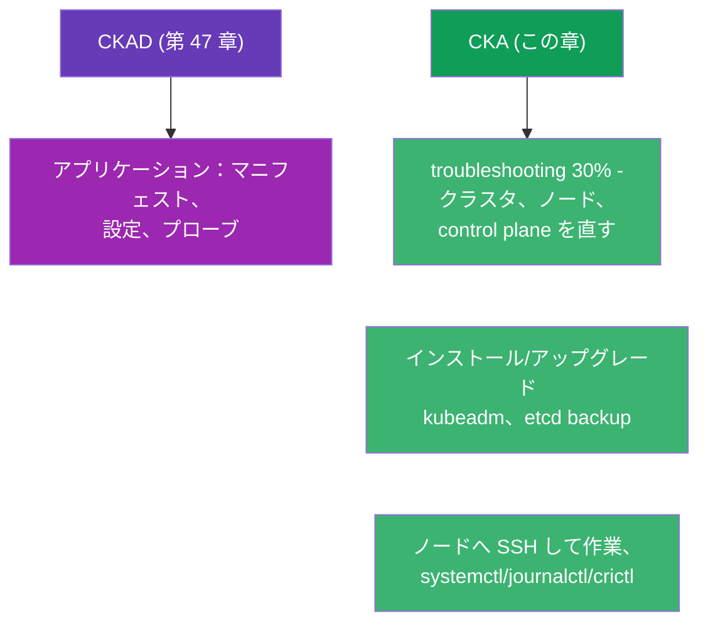
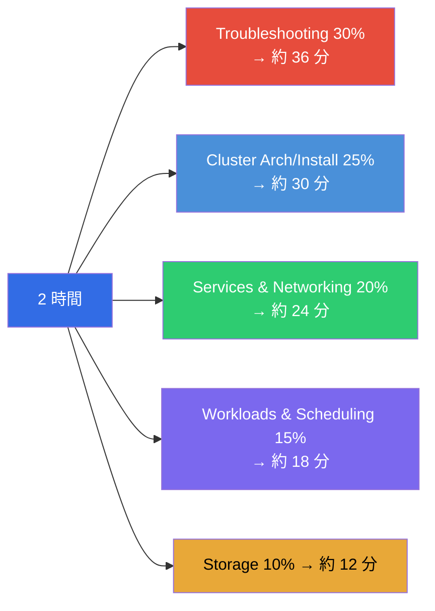
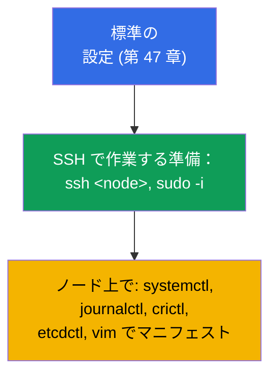
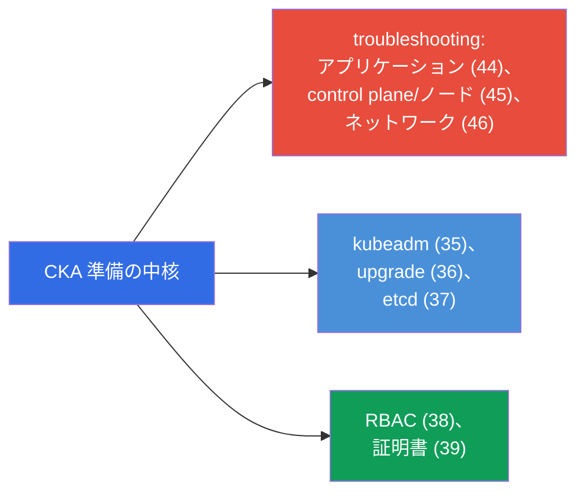
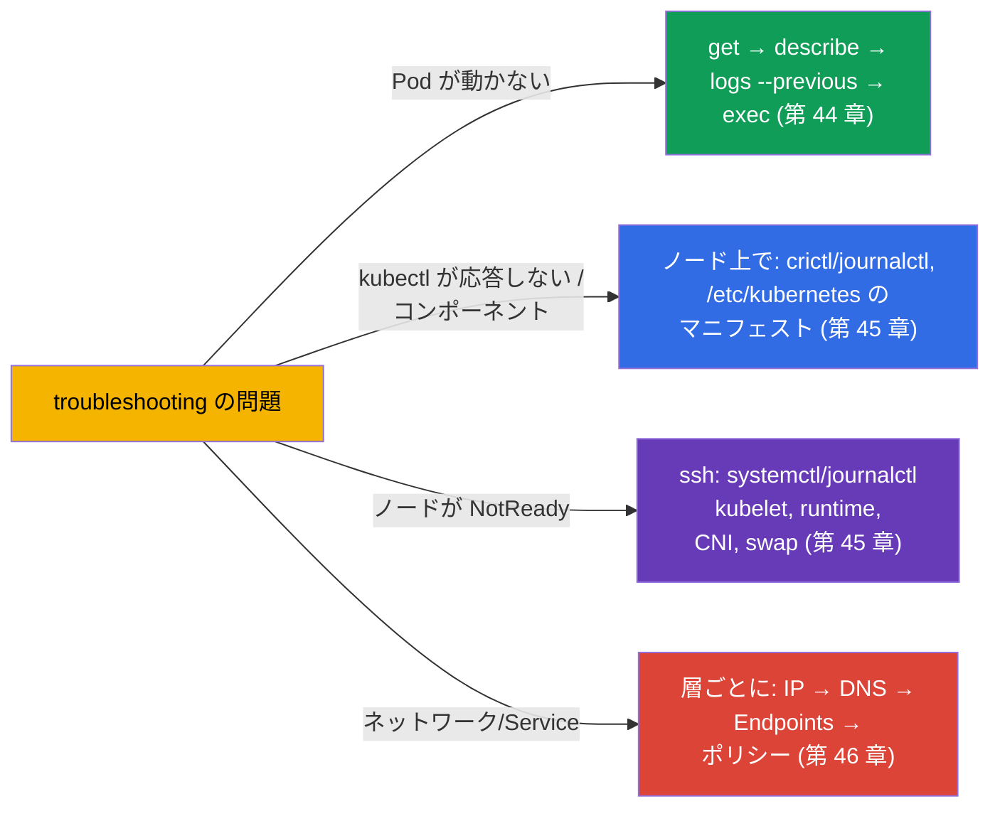
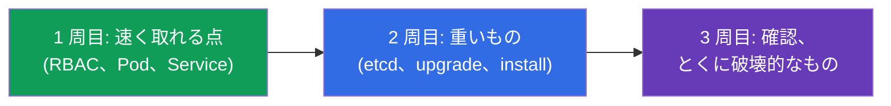
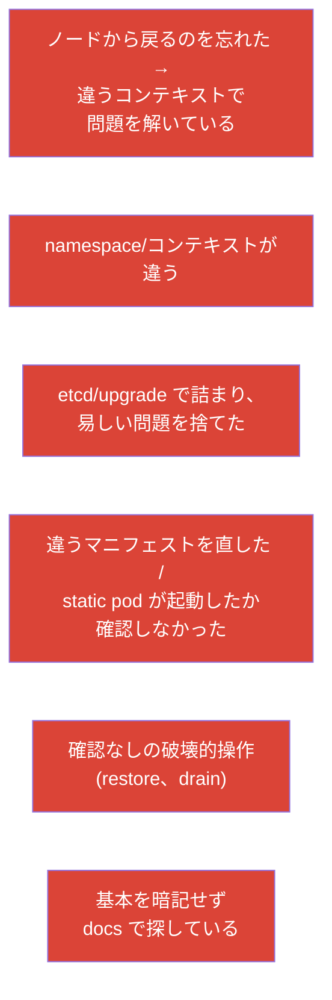

[Русская версия](ru.md) · [Eng version](README.md) · [Versión en español](es.md) · [Version française](fr.md) · [Deutsche Version](de.md) · [ქართული ვერსია](ge.md) · [繁體中文版](tw.md)

# 第 48 章。CKA 試験：形式、タイムマネジメント、戦略

> 🟦 **CKA 向けの章。** 速さと段取りの共通テクニックは CKAD（第 47 章）と同じです。
> ここでは CKA の特性に焦点を当てます：troubleshooting (30%)、クラスタの管理、
> ノード上での作業。
>
> **次は何か。** コースの最終章です。知識（第 1-46 章）と速さの戦術（第 47 章）は
> すでに揃っています。あとは、まさに CKA をどう合格するか：この試験は運用と
> troubleshooting に寄っていて、ノードへの SSH での作業と、クラスタ障害の確実な
> 切り分けを求めます。戦略と復習のマップをまとめましょう。

## 48.1. 戦術の面で CKA が CKAD と違うところ

形式は同じ（2 時間、約 15-20 問、66%、ドキュメント参照可、部分点あり）ですが、重点が
違います（第 1 章）：



もっとも大きな違い：**CKA では kubectl の外での作業が多い** - ノードそのものの上
（SSH、システムサービス、ファイル）です。Troubleshooting (30%) とクラスタの
インストール/保守は、`/etc/kubernetes/`、`systemctl`、`journalctl`、`crictl`、
`etcdctl` に踏み込むことを要求します。

## 48.2. ドメインの重みと時間の配分

時間は重みに応じて配分してください（第 1 章）：



Troubleshooting と Cluster Architecture を合わせると、試験の半分以上になります。準備の
主力を投じる価値があるのは、まさにそこです。

## 48.3. 最初の数分：同じ設定 + SSH

環境の準備は CKAD と同じ（第 47 章）：alias、`$do`/`$now`、補完、expandtab 付きの vim。
加えて CKA の特性：

```bash
alias k=kubectl
export do="--dry-run=client -o yaml"
source <(kubectl completion bash); complete -o default -F __start_kubectl k
echo 'set tabstop=2 shiftwidth=2 expandtab' >> ~/.vimrc; export KUBE_EDITOR=vim
```



> **CKA で重要なこと。** 多くの問題は kubectl 経由ではなく **ノード上で** 解きます。
> control plane/worker への `ssh`、`sudo`、`/etc/kubernetes/` のファイル編集、
> `journalctl -u kubelet` や `crictl ps` の確認ができるようにしておいてください。
> ノードでの作業のあとは「自分の」マシンに戻ることを忘れないでください。

## 48.4. CKA の主要な問題と、どこで復習するか

配点の高い典型的な問題と、コースの章：

| 問題 | 章 |
|---------|-------|
| クラスタをインストール / ノードを追加 (kubeadm) | 35 |
| クラスタをアップグレード (upgrade、cordon/drain) | 36 |
| etcd のバックアップ/リストア | 37 |
| RBAC：ロールとバインディング | 38 |
| CSR で証明書を発行 / kubeconfig | 39 |
| control plane を直す (static pods) | 15、45 |
| ノードが NotReady (kubelet/runtime/CNI) | 45、30 |
| Service/DNS が動かない (Endpoints、CoreDNS) | 7、31、46 |
| NetworkPolicy | 34 |
| Deployment、スケジューリング、リソース | 5、8、12-14 |
| PV/PVC、StorageClass | 25-26 |



## 48.5. タイマー下での troubleshooting 戦略

troubleshooting が 30% なのですから、アルゴリズムを反射になるまで練習してください
（第 44-46 章）：



当て推量はやめて、第 44-46 章の決定木を適用してください。素早い切り分け（どの層 /
どのコンポーネントか）のほうが、まれな細部の知識より重要です。

## 48.6. タイムマネジメントと試験のルール

全体の戦略は CKAD と同じ（第 47 章）：3 周する、重みを見る、詰まらない、確認の時間を
残す。CKA の特性：

- **重い問題（etcd restore、upgrade、インストール）は時間を多く食います** - 間に合うか
  を見積もり、難しい 1 問のために易しい数問を犠牲にしないでください。
- **ノードでの作業のあとは元のコンテキストに戻ってください** - 忘れて次の問題を
  「違う場所で」やってしまいがちです。
- **破壊的な操作（etcd の restore、drain）は確認してください** - 間違えたときの代償が
  大きいです。
- **kubernetes.io のドキュメントは参照可** - kubeadm upgrade、etcd backup、CSR の
  ページを手元に置いておきましょう：正確なコマンドはコピーすると便利です。



## 48.7. CKA でのミス トップ



## 48.8. CKA の前の最終チェックリスト

- [ ] kubeadm init/join ができ、ノード準備の手順を知っている（第 35 章）；
- [ ] cordon/drain/uncordon を伴うクラスタの upgrade ができる（第 36 章）；
- [ ] etcd snapshot save/restore のコマンドを暗記している（第 37 章）；
- [ ] RBAC を確実に作成し、`auth can-i --as` で確認できる（第 38 章）；
- [ ] CSR の approve と kubeconfig の設定ができる（第 39 章）；
- [ ] マニフェスト + crictl/journalctl で control plane を直せる（第 15、45 章）；
- [ ] SSH でノードの NotReady を切り分けられる（第 45 章）；
- [ ] ネットワークを層ごとにデバッグでき、Endpoints/DNS を理解している（第 46 章）；
- [ ] alias/補完/vim を設定し、反射でコンテキストを切り替えられる（第 47 章）；
- [ ] タイマー付きでモック試験を通した。


## 48.9. ミニ用語集

- **troubleshooting ドメイン** - CKA の 30%、もっとも比重が大きい；アプリケーション/
  クラスタ/ネットワークを直すこと。
- **ノード上での作業** - SSH + systemctl/journalctl/crictl/etcdctl（CKA の特性）。
- **3 周する** - 時間の戦略（易しい → 重い → 確認）。
- **破壊的な操作** - etcd の restore、drain：とくに確認すること。
- **コンテキストに戻る** - ノードでの作業のあと、元のマシンで続けること。
- **モック試験** - 自動採点付き、タイマー下でのリハーサル。

## 48.10. 本章のまとめ

- CKA は形式上は CKAD と同じ（2 時間、約 17 問、66%、部分点あり）ですが、
  troubleshooting (30%) と管理業務に寄っています - kubectl の外、SSH でのノード上の
  作業が多いです。
- 時間は重みに応じて：troubleshooting + cluster architecture で試験の 50% 超なので、
  そこに主な焦点を置きます。
- 環境の準備は同じ（第 47 章）+ ノード上での SSH/systemctl/journalctl/crictl/
  etcdctl への備え；ノードでの作業のあとは元のコンテキストに戻ること。
- 主要な問題：kubeadm の install/upgrade、etcd の backup/restore、RBAC、CSR、
  control plane とノードの修復、ネットワークのデバッグ - 48.4/48.5 のマップで復習を。
- Troubleshooting は当て推量ではなく決定木で解きます（第 44-46 章）。
- タイムマネジメント：3 周する、重いもの（etcd/upgrade）で詰まらない、破壊的な操作は
  確認する。

## 48.11. これがどう役に立つか：試験と実際の仕事で

**試験で (CKA)。** この章は、すべてを合格の戦略にまとめたものです：重みに応じた時間の
配分、ノード上で作業する備え、troubleshooting の決定木、そしてチェックリスト。第 47 章
（共通の戦術）と第 1-46 章の知識と合わせて、これが合格点をもたらします。

**実際の仕事で。** CKA のスキルは、そのまま管理者/SRE の日常業務です：クラスタを立てて
アップグレードし、etcd をバックアップし、アクセス権を設定し、落ちた control plane や
ノードを直し、ネットワーク障害を切り分ける。試験は本番でやることをそのまま問います -
だからこそ CKA の準備は、エンジニアとしてのあなたの価値を直接高めます。

## 48.12. 自己チェックの質問

1. CKA の戦術は CKAD とどう違いますか。なぜノード上で作業する備えが重要なのですか？
2. 2 時間をドメインごとにどう配分し、準備の主力をどこに投じますか？
3. ノード上ではどのツールが必要で、なぜ元のコンテキストに戻るのを忘れてはいけないのですか？
4. CKA の配点の高い主要な問題と、その復習に使う章を挙げてください。
5. タイマー下で troubleshooting の問題を素早く切り分けるにはどうしますか？
6. なぜ破壊的な操作（etcd の restore、drain）はとくに確認が必要なのですか？
7. あなたの最終チェックリストで、まだ反射になるまで練習できていないものは何ですか？

## コースの結び

おめでとうございます - CKA + CKAD の合同コースを最後まで走り抜けました。クラスタの
アーキテクチャとワークロードから、ネットワーク、ストレージ、セキュリティ、管理、
troubleshooting まで Kubernetes を解きほぐし、両方の試験の戦術も知っています。残るは
いちばん大事なこと - **手** です：コマンドが反射になるまで、タイマー付きでラボと
モック試験を通してください。知識 + 練り上げた速さ = CKA と CKAD の合格です。

一方の試験に的を絞って準備するには、ガイドを使ってください：
[CKA](../CKA_JP.md) · [CKAD](../CKAD_JP.md)。

🧪 ラボ 119（速度と JSONPath のドリル）: [tasks/cka/labs/119](../../labs/119/README_JP.MD)

🧪 CKA のモック試験: [tasks/cka/mock](../../mock)

---
[目次](../README_JP.md) · [第 47 章](../47/jp.md)
