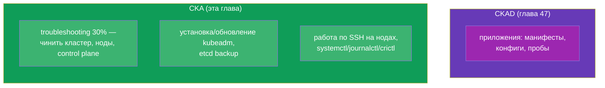
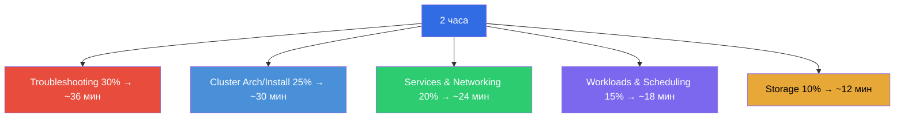
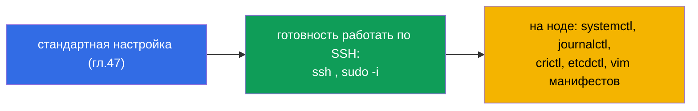
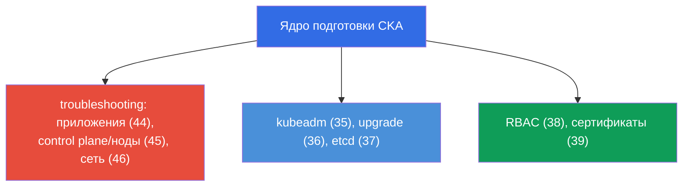
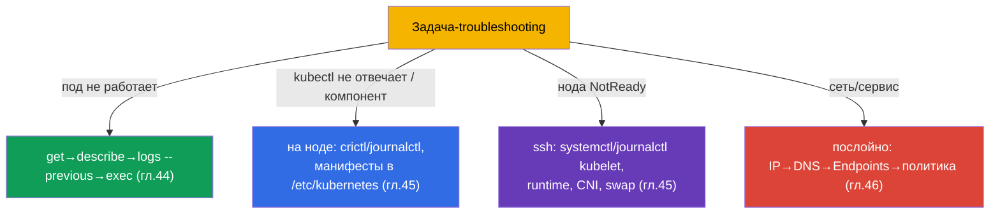
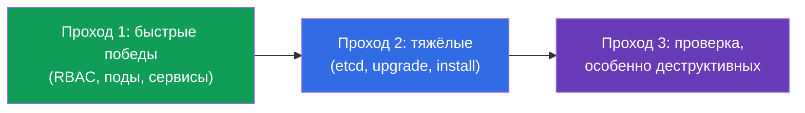
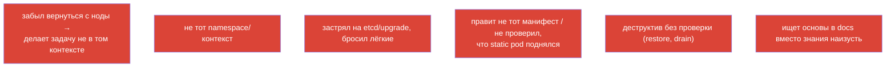

# Глава 48. Экзамен CKA: формат, тайм-менеджмент и стратегия

> 🟦 **Глава для CKA.** Общие приёмы скорости и организации - те же, что для CKAD (глава
> 47); здесь фокус на специфике CKA: troubleshooting (30%), администрирование кластера,
> работа на нодах.
>
> **Что дальше.** Финал курса. У вас есть все знания (главы 1-46) и тактика скорости (глава
> 47). Теперь - как сдать именно CKA: этот экзамен смещён в сторону эксплуатации и
> troubleshooting, требует работы по SSH на нодах и уверенного разбора сбоев кластера.
> Соберём стратегию и карту повторения.

## 48.1. Чем CKA отличается от CKAD по тактике

Формат тот же (2 часа, ~15-20 задач, 66%, документация разрешена, частичные баллы), но
акценты другие (глава 1):



Главное отличие: **на CKA много работы вне kubectl** - на самих нодах (SSH, системные
сервисы, файлы). Troubleshooting (30%) и установка/обслуживание кластера требуют лезть в
`/etc/kubernetes/`, `systemctl`, `journalctl`, `crictl`, `etcdctl`.

## 48.2. Веса доменов и распределение времени

Распределяйте время по весам (глава 1):



Troubleshooting и Cluster Architecture вместе - более половины экзамена. Именно туда стоит
вложить основную подготовку.

## 48.3. Первые минуты: те же настройки + SSH

Настройка окружения - как на CKAD (глава 47): alias, `$do`/`$now`, автодополнение, vim с
expandtab. Плюс специфика CKA:

```bash
alias k=kubectl
export do="--dry-run=client -o yaml"
source <(kubectl completion bash); complete -o default -F __start_kubectl k
echo 'set tabstop=2 shiftwidth=2 expandtab' >> ~/.vimrc; export KUBE_EDITOR=vim
```



> **Важно для CKA.** Много задач решаются **на ноде**, а не через kubectl. Будьте готовы
> `ssh` на control plane/worker, `sudo`, редактировать файлы в `/etc/kubernetes/`,
> смотреть `journalctl -u kubelet`, `crictl ps`. Не забывайте вернуться на «свою» машину
> после работы на ноде.

## 48.4. Ключевые задания CKA и где повторить

Типовые высокобалльные задания и главы курса:

| Задание | Главы |
|---------|-------|
| установить кластер / добавить ноду (kubeadm) | 35 |
| обновить кластер (upgrade, cordon/drain) | 36 |
| бэкап/восстановление etcd | 37 |
| RBAC: роли и привязки | 38 |
| выдать сертификат через CSR / kubeconfig | 39 |
| починить control plane (static pods) | 15, 45 |
| нода NotReady (kubelet/runtime/CNI) | 45, 30 |
| сервис/DNS не работает (Endpoints, CoreDNS) | 7, 31, 46 |
| NetworkPolicy | 34 |
| Deployment, scheduling, ресурсы | 5, 8, 12-14 |
| PV/PVC, StorageClass | 25-26 |



## 48.5. Стратегия troubleshooting под таймером

Раз troubleshooting - 30%, отработайте алгоритмы до автоматизма (главы 44-46):



Не гадайте - применяйте деревья решений из глав 44-46. Быстрая локализация («какой слой /
компонент») важнее знания редких деталей.

## 48.6. Тайм-менеджмент и правила экзамена

Общая стратегия - как на CKAD (глава 47): три прохода, смотреть вес, не застревать,
оставить время на проверку. Специфика CKA:

- **Тяжёлые задачи (etcd restore, upgrade, установка) занимают много времени** - оцените,
  успеваете ли, и не жертвуйте несколькими лёгкими ради одной сложной.
- **После работы на ноде вернитесь в исходный контекст** - легко забыть и делать
  следующую задачу «не там».
- **Проверяйте деструктивные операции** (restore etcd, drain) - они дороги при ошибке.
- **Документация kubernetes.io разрешена** - держите под рукой страницы про kubeadm
  upgrade, etcd backup, CSR: точные команды удобно копировать.



## 48.7. Топ ошибок на CKA



## 48.8. Финальный чек-лист перед CKA

- [ ] умею kubeadm init/join и знаю шаги подготовки ноды (глава 35);
- [ ] умею upgrade кластера с cordon/drain/uncordon (глава 36);
- [ ] знаю наизусть команды etcd snapshot save/restore (глава 37);
- [ ] уверенно создаю RBAC и проверяю `auth can-i --as` (глава 38);
- [ ] умею CSR approve и настройку kubeconfig (глава 39);
- [ ] чиню control plane через манифесты + crictl/journalctl (главы 15, 45);
- [ ] разбираю NotReady на ноде по SSH (глава 45);
- [ ] отлаживаю сеть послойно и знаю про Endpoints/DNS (глава 46);
- [ ] настроил alias/автодополнение/vim и переключаю контексты рефлекторно (глава 47);
- [ ] прогнал мок-экзамены под таймером.


## 48.9. Мини-глоссарий

- **troubleshooting-домен** - 30% CKA, самый весомый; чинить приложения/кластер/сеть.
- **работа на ноде** - SSH + systemctl/journalctl/crictl/etcdctl (специфика CKA).
- **три прохода** - стратегия времени (лёгкие → тяжёлые → проверка).
- **деструктивные операции** - etcd restore, drain: проверять особенно.
- **вернуться в контекст** - после работы на ноде продолжить на исходной машине.
- **мок-экзамен** - репетиция под таймером с автопроверкой.

## 48.10. Итоги главы

- CKA формально как CKAD (2 часа, ~17 задач, 66%, частичные баллы), но смещён в
  troubleshooting (30%) и администрирование - много работы вне kubectl, на нодах по SSH.
- Время - по весам: troubleshooting + cluster architecture это >50% экзамена, туда основной
  фокус.
- Настройка окружения та же (глава 47) + готовность к SSH/systemctl/journalctl/crictl/
  etcdctl на нодах; после работы на ноде возвращаться в исходный контекст.
- Ключевые задания: kubeadm install/upgrade, etcd backup/restore, RBAC, CSR, починка
  control plane и нод, сетевая отладка - повторить по картам 48.4/48.5.
- Troubleshooting решать деревьями решений (главы 44-46), а не гаданием.
- Тайм-менеджмент: три прохода, не застревать на тяжёлых (etcd/upgrade), проверять
  деструктивные операции.

## 48.11. Как это пригодится: на экзамене и в реальной работе

**На экзамене (CKA).** Эта глава - сборка всего в стратегию сдачи: распределение времени по
весам, готовность работать на нодах, деревья troubleshooting и чек-лист. Вместе с главой 47
(общая тактика) и знаниями глав 1-46 это то, что даёт проходной балл.

**В реальной работе.** Навыки CKA - это и есть повседневная работа администратора/SRE:
поднять и обновить кластер, забэкапить etcd, настроить доступы, починить упавший control
plane или ноду, разобрать сетевой инцидент. Экзамен проверяет ровно то, что делают в проде -
поэтому подготовка к CKA напрямую повышает вашу ценность как инженера.

## 48.12. Вопросы для самопроверки

1. Чем тактика CKA отличается от CKAD? Почему важна готовность работать на нодах?
2. Как распределить 2 часа по доменам и куда вложить основную подготовку?
3. Какие инструменты нужны на ноде и почему нельзя забыть вернуться в исходный контекст?
4. Перечислите ключевые высокобалльные задания CKA и главы для их повторения.
5. Как под таймером быстро локализовать troubleshooting-проблему?
6. Почему деструктивные операции (etcd restore, drain) требуют особой проверки?
7. Что в вашем финальном чек-листе ещё не отработано до автоматизма?

## Заключение курса

Поздравляем - вы прошли весь совместный курс CKA + CKAD. Вы разобрали Kubernetes от
архитектуры кластера и рабочих нагрузок до сети, хранилища, безопасности,
администрирования и troubleshooting, и знаете тактику обоих экзаменов. Осталось главное -
**руки**: прогоняйте лабораторные работы и мок-экзамены под таймером, пока команды не
станут рефлексом. Знания + отработанная скорость = сданные CKA и CKAD.

Для точечной подготовки к одному экзамену используйте путеводители:
[CKA](../CKA_RU.md) · [CKAD](../CKAD_RU.md).

🧪 Лаба 119 (дриллы на скорость и JSONPath): [tasks/cka/labs/119](../../labs/119/README_RU.MD)

🧪 Мок-экзамены CKA: [tasks/cka/mock](../../mock)

---
[Оглавление](../README_RU.md) · [Глава 47](../47/ru.md)
