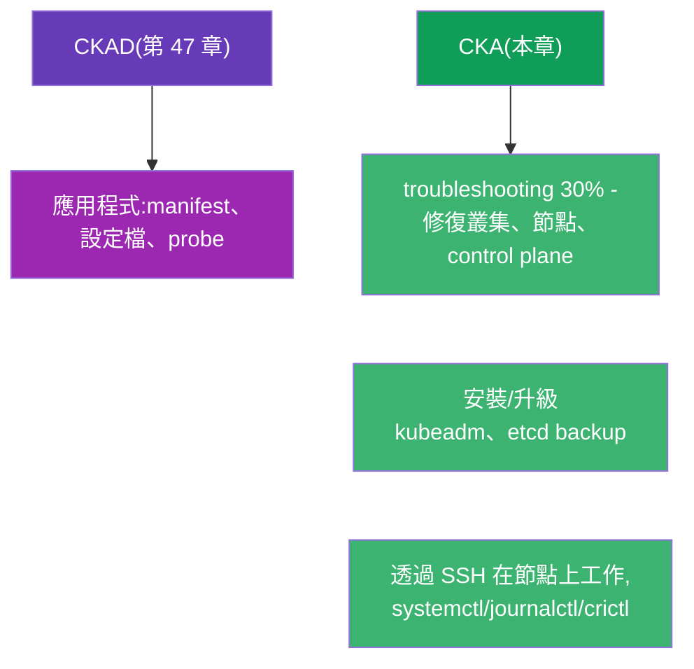
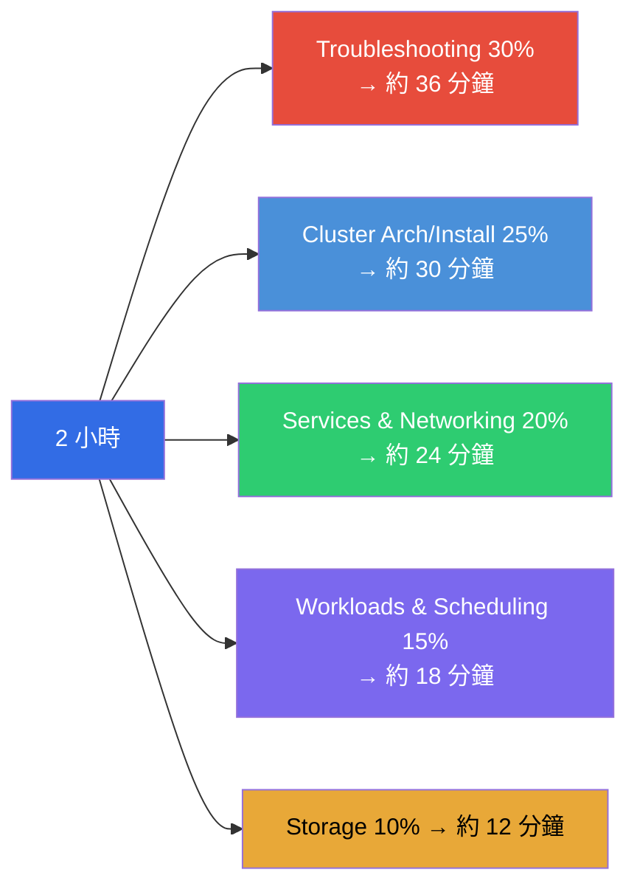
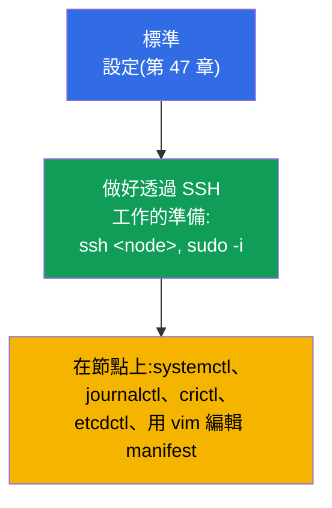
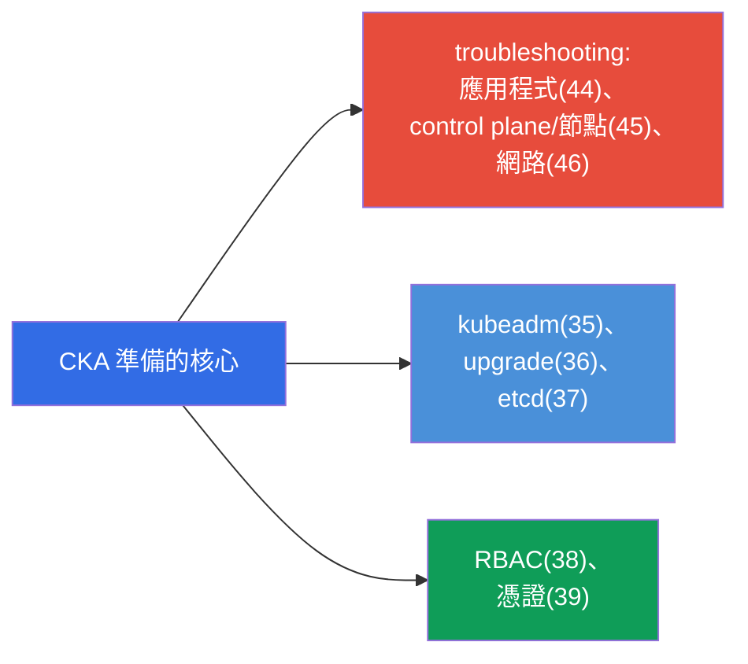
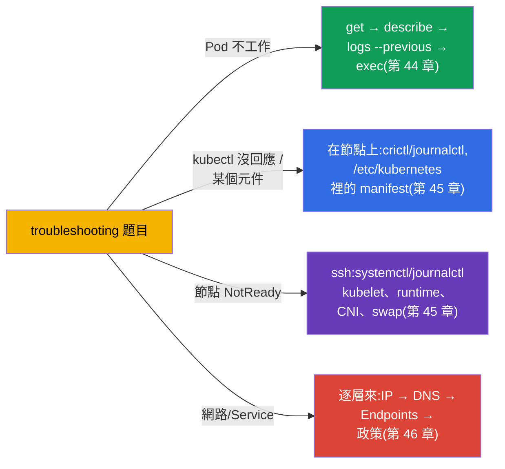
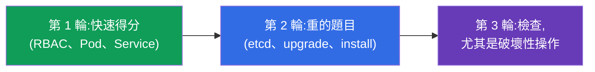
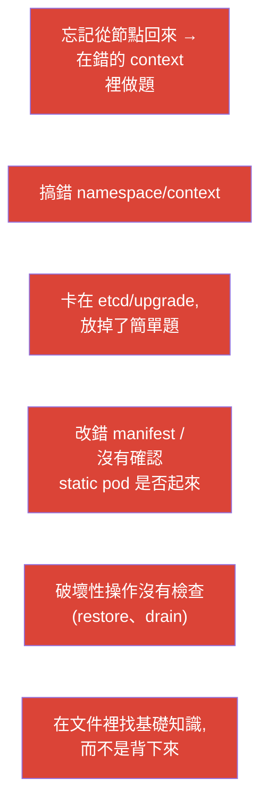

[Русская версия](ru.md) · [Eng version](README.md) · [Versión en español](es.md) · [Version française](fr.md) · [Deutsche Version](de.md) · [ქართული ვერსია](ge.md) · [日本語版](jp.md)

# 第 48 章。CKA 考試:形式、時間管理與策略

> 🟦 **CKA 章節。** 速度與組織方面的通用技巧 - 與 CKAD(第 47 章)完全相同;
> 這裡聚焦於 CKA 的特點:troubleshooting(30%)、叢集管理、
> 在節點上工作。
>
> **接下來。** 課程的最後一章。你已經擁有全部知識(第 1-46 章)與速度戰術(第
> 47 章)。現在要談的是 - 如何專門通過 CKA:這場考試偏向運維與
> troubleshooting,需要透過 SSH 在節點上工作,也需要能自信地分析叢集故障。
> 我們來把策略與複習地圖組裝起來。

## 48.1. 從戰術上看 CKA 與 CKAD 有何不同

形式是一樣的(2 小時、約 15-20 題、66%、允許查文件、有部分分數),但重點
不同(第 1 章):



最主要的差別:**在 CKA 上有很多工作是在 kubectl 之外完成的** - 就在節點本身
(SSH、系統服務、檔案)。Troubleshooting(30%)與叢集的安裝/維護要求你深入
`/etc/kubernetes/`、`systemctl`、`journalctl`、`crictl`、`etcdctl`。

## 48.2. 領域權重與時間分配

按照權重分配時間(第 1 章):



Troubleshooting 與 Cluster Architecture 加起來 - 超過考試的一半。主要的準備
精力就該投在那裡。

## 48.3. 最初幾分鐘:相同的設定 + SSH

環境設定 - 與 CKAD 上一樣(第 47 章):alias、`$do`/`$now`、自動補全、加上
expandtab 的 vim。再加上 CKA 的特點:

```bash
alias k=kubectl
export do="--dry-run=client -o yaml"
source <(kubectl completion bash); complete -o default -F __start_kubectl k
echo 'set tabstop=2 shiftwidth=2 expandtab' >> ~/.vimrc; export KUBE_EDITOR=vim
```



> **CKA 的重點提醒。** 有很多題目是**在節點上**解決的,而不是透過 kubectl。要
> 做好準備 `ssh` 到 control plane/worker、用 `sudo`、編輯 `/etc/kubernetes/`
> 裡的檔案、查看 `journalctl -u kubelet`、`crictl ps`。在節點上做完事之後,
> 別忘了回到「自己的」機器。

## 48.4. CKA 的關鍵題型與該去哪裡複習

典型的高分題目與課程章節:

| 題目 | 章節 |
|---------|-------|
| 安裝叢集 / 加入節點(kubeadm) | 35 |
| 升級叢集(upgrade、cordon/drain) | 36 |
| etcd 備份/還原 | 37 |
| RBAC:角色與繫結 | 38 |
| 透過 CSR 簽發憑證 / kubeconfig | 39 |
| 修復 control plane(static pods) | 15、45 |
| 節點 NotReady(kubelet/runtime/CNI) | 45、30 |
| Service/DNS 不通(Endpoints、CoreDNS) | 7、31、46 |
| NetworkPolicy | 34 |
| Deployment、排程、資源 | 5、8、12-14 |
| PV/PVC、StorageClass | 25-26 |



## 48.5. 計時之下的 troubleshooting 策略

既然 troubleshooting 佔 30%,就把演算法練到條件反射的程度(第 44-46 章):



不要猜 - 要套用第 44-46 章的決策樹。快速定位(「是哪一層 / 哪個元件」)比
知道罕見的細節更重要。

## 48.6. 時間管理與考試規則

整體策略 - 與 CKAD 上一樣(第 47 章):三輪掃過、看權重、不要卡住、留時間
檢查。CKA 的特點:

- **重的題目(etcd restore、upgrade、安裝)會吃掉很多時間** - 先評估自己
  來不來得及,不要為了一道難題犧牲好幾道簡單題。
- **在節點上工作完之後要回到原本的 context** - 很容易忘記,結果下一題就做
  「在錯的地方」。
- **檢查破壞性操作**(restore etcd、drain)- 一旦出錯,代價很高。
- **允許查 kubernetes.io 文件** - 把 kubeadm upgrade、etcd backup、CSR 的頁面
  放在手邊:精確的命令複製起來很方便。



## 48.7. CKA 上最常見的錯誤



## 48.8. CKA 前的最終檢查清單

- [ ] 會 kubeadm init/join,也知道節點的準備步驟(第 35 章);
- [ ] 會用 cordon/drain/uncordon 升級叢集(第 36 章);
- [ ] 把 etcd snapshot save/restore 的命令背得滾瓜爛熟(第 37 章);
- [ ] 能自信地建立 RBAC 並用 `auth can-i --as` 驗證(第 38 章);
- [ ] 會 CSR approve 與 kubeconfig 的設定(第 39 章);
- [ ] 會透過 manifest + crictl/journalctl 修復 control plane(第 15、45 章);
- [ ] 會透過 SSH 在節點上排查 NotReady(第 45 章);
- [ ] 會逐層除錯網路,也清楚 Endpoints/DNS(第 46 章);
- [ ] 設定好 alias/自動補全/vim,並且能反射性地切換 context(第 47 章);
- [ ] 在計時下跑過模擬考。


## 48.9. 小詞彙表

- **troubleshooting 領域** - 佔 CKA 的 30%,權重最大;修復應用程式/叢集/網路。
- **在節點上工作** - SSH + systemctl/journalctl/crictl/etcdctl(CKA 的特點)。
- **三輪掃過** - 時間策略(簡單 → 困難 → 檢查)。
- **破壞性操作** - etcd restore、drain:要特別檢查。
- **回到 context** - 在節點上工作完之後,回到原本的機器繼續。
- **模擬考** - 在計時與自動檢查之下的預演。

## 48.10. 本章總結

- CKA 在形式上跟 CKAD 一樣(2 小時、約 17 題、66%、有部分分數),但偏向
  troubleshooting(30%)與管理 - 有很多工作在 kubectl 之外,透過 SSH 在節點上。
- 時間 - 按權重分配:troubleshooting + cluster architecture 佔考試的 >50%,主要
  精力放那裡。
- 環境設定跟之前一樣(第 47 章),再加上在節點上使用 SSH/systemctl/journalctl/crictl/
  etcdctl 的準備;在節點上工作完之後要回到原本的 context。
- 關鍵題型:kubeadm install/upgrade、etcd backup/restore、RBAC、CSR、修復
  control plane 與節點、網路除錯 - 按 48.4/48.5 的地圖複習。
- Troubleshooting 要用決策樹來解(第 44-46 章),而不是靠猜。
- 時間管理:三輪掃過、不要卡在重的題目上(etcd/upgrade)、檢查破壞性操作。

## 48.11. 這些知識用在哪裡:考試與實際工作

**在考試中(CKA)。** 這一章是把一切組裝成應考策略:按權重分配時間、做好在節點
上工作的準備、troubleshooting 決策樹與檢查清單。加上第 47 章(通用戰術)與第
1-46 章的知識,這就是讓你拿到及格分數的東西。

**在實際工作中。** CKA 的技能就是管理員/SRE 的日常工作:把叢集架起來並升級、
備份 etcd、設定存取權限、修復掛掉的 control plane 或節點、排查網路事故。考試檢
驗的正是生產環境裡在做的事 - 所以準備 CKA 會直接提升你作為工程師的價值。

## 48.12. 自我檢查問題

1. CKA 的戰術與 CKAD 有什麼不同?為什麼做好在節點上工作的準備很重要?
2. 如何把 2 小時分配到各領域,以及主要的準備精力該投在哪裡?
3. 在節點上需要哪些工具,以及為什麼不能忘記回到原本的 context?
4. 列出 CKA 的關鍵高分題型,以及複習它們所對應的章節。
5. 在計時之下如何快速定位 troubleshooting 問題?
6. 為什麼破壞性操作(etcd restore、drain)需要特別檢查?
7. 你的最終檢查清單裡,還有哪些沒有練到條件反射的程度?

## 課程結語

恭喜 - 你走完了整個 CKA + CKAD 合併課程。你把 Kubernetes 從叢集架構與工作負載,
一路拆解到網路、儲存、安全、管理與 troubleshooting,並且掌握了兩場考試的戰術。
剩下最重要的是 - **動手**:在計時之下反覆跑實驗與模擬考,直到命令變成反射動作。
知識 + 練出來的速度 = 通過 CKA 與 CKAD。

若要針對某一場考試做重點準備,請使用指南:
[CKA](../CKA_TW.md) · [CKAD](../CKAD_TW.md)。

🧪 實驗 119(速度與 JSONPath 練習):[tasks/cka/labs/119](../../labs/119/README_TW.MD)

🧪 CKA 模擬考:[tasks/cka/mock](../../mock)

---
[目錄](../README_TW.md) · [第 47 章](../47/tw.md)
