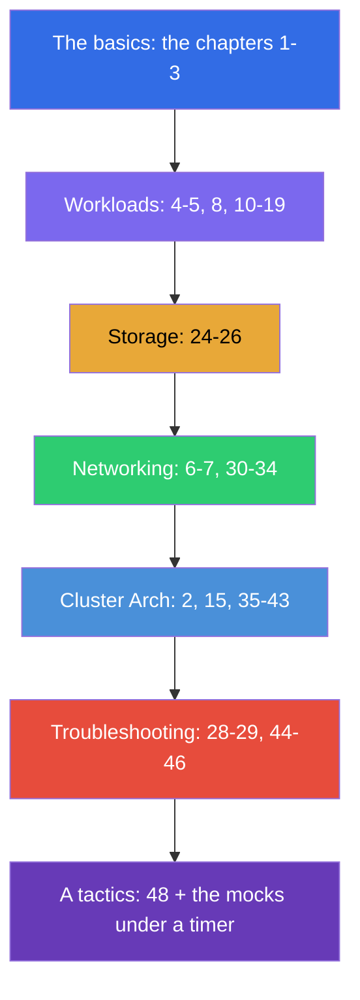

[Русская версия](CKA_RU.md) · [Versión en español](CKA_ES.md) · [Version française](CKA_FR.md) · [Deutsche Version](CKA_DE.md) · [ქართული ვერსია](CKA_GE.md)

# A guide of a preparation for the CKA

[← The contents of the course](README.md) · [The CKAD guide](CKAD.md)

This file is a route of a preparation exactly for the exam **CKA (Certified Kubernetes
Administrator)**. The course is a joint one (CKA + CKAD), and here only the chapters and the labs
needed for the CKA are collected, laid out by the official domains of the exam with their weights.

> **A format of the exam.** A practical one, 2 hours, ~15-20 tasks in a live cluster, a passing
> score is 66%, Kubernetes v1.35. A lot of a work at the nodes through an SSH. A detailed tactics - in
> [the chapter 48](48/README.md).

## Where to start (the basics for everyone)

If your base on the networks, DNS, TLS and the containers is still shaky - start with an optional
**Part 0** (without it the rest of the course is read harder):

- [0.1. Networking: IP, ports, CIDR, NAT](00-1-net/README.md)
- [0.2. DNS: how names turn into addresses](00-2-dns/README.md)
- [0.3. TLS and certificates: HTTPS, keys, a CA](00-3-tls/README.md)
- [0.4. Containers and Docker: images, layers, registries, runtime](00-4-containers/README.md)
- [0.5. Linux and the node tools: SSH, sudo, systemd, logs](00-5-linux/README.md) - **important for the CKA** (the node labs)
- [0.6. YAML: indentation, lists, dictionaries, manifests](00-6-yaml/README.md)
- [0.7. Linux networking under the hood: network namespaces, veth, routes](00-7-netns/README.md)
- [0.8. vim in 15 minutes: survive and configure it for YAML](00-8-vim/README.md) - **important for the CKA** (an editing of the manifests at the nodes through an SSH)

Next - a foundation of the course, go through these chapters first regardless of the exam:

1. [Introduction: Kubernetes, the exams, how this course is built](01/README.md)
2. [Kubernetes architecture: the control plane and worker nodes](02/README.md) - **a core for the CKA**
3. [Working with kubectl: the imperative and the declarative approach](03/README.md)

## The domains of the CKA and the chapters

### 🔴 Troubleshooting — 30% (the most weighty)

The biggest weight - invest a third of your time here.

- [28. A logging and a monitoring: the logs, the metrics-server, a kubectl top](28/README.md)
- [29. A debugging of the applications and an obsolescence of an API](29/README.md)
- [44. A debugging of the failures of the applications](44/README.md)
- [45. A debugging of a control plane and of the worker nodes](45/README.md)
- [46. A debugging of the services and of a network](46/README.md)

### 🔵 Cluster Architecture, Installation & Configuration — 25%

- [2. Kubernetes architecture](02/README.md)
- [15. Static Pods, PriorityClass and several schedulers](15/README.md)
- [35. An installation of a cluster with a help of kubeadm](35/README.md)
- [35A. A high availability (HA): several control plane nodes, the topologies of etcd, a balancer](35-2-ha/README.md)
- [35B. A designing and a sizing of a cluster: an infrastructure, a topology, IaC](35-3-design/README.md)
- [36. An upgrade of a cluster (a lifecycle)](36/README.md)
- [37. A backup and a restore of etcd](37/README.md)
- [38. RBAC: Role, ClusterRole and the bindings](38/README.md)
- [39. The TLS certificates, kubeconfig and a CSR API](39/README.md)
- [40. The interfaces of an extension: CNI, CSI, CRI](40/README.md)
- [41. The CRD and the operators](41/README.md)
- [42. Helm](42/README.md)
- [43. Kustomize](43/README.md)

### 🟢 Services & Networking — 20%

- [6. Namespaces, labels, selectors and annotations](06/README.md)
- [7. Services: ClusterIP, NodePort, LoadBalancer, Endpoints](07/README.md)
- [30. A network model of Kubernetes, a network of the pods and a CNI](30/README.md)
- [31. A Service from the inside, a DNS and a CoreDNS](31/README.md)
- [32. An Ingress and the Ingress controllers](32/README.md)
- [33. A Gateway API](33/README.md)
- [34. NetworkPolicy](34/README.md)

### 🟣 Workloads & Scheduling — 15%

- [4. Pods: the lifecycle, creation and configuration](04/README.md)
- [5. ReplicaSet and Deployment](05/README.md)
- [8. Deployment: rolling update and rollback](08/README.md)
- [10. Jobs and CronJobs](10/README.md)
- [11. DaemonSet and StatefulSet](11/README.md)
- [12. The scheduling of the Pods: nodeName, nodeSelector, affinity](12/README.md)
- [13. Taints and tolerations](13/README.md)
- [14. The resources: requests, limits, LimitRange, ResourceQuota](14/README.md)
- [16. The autoscaling of the workloads: HPA](16/README.md)
- [17. The commands, the arguments and the environment variables](17/README.md)
- [18. ConfigMap](18/README.md) · [19. Secret](19/README.md)
- [20. The SecurityContext and the capabilities](20/README.md) · [21. The ServiceAccount; authn/authz, the admission](21/README.md)

### 🟠 Storage — 10%

- [24. The volumes for the applications: an emptyDir and the ephemeral volumes](24/README.md)
- [25. The Volumes, the PersistentVolume and the PersistentVolumeClaim](25/README.md)
- [26. A StorageClass, a dynamic provisioning, a storing in a StatefulSet](26/README.md)

## A preparation for the exam

- [48. The exam CKA: a format, a time management and a strategy](48/README.md)
- [47. The exam CKAD: a productivity of kubectl and JSONPath](47/README.md) - the common receptions of a speed
  are useful for the CKA as well

## The labs

The labs (`tasks/cka/labs`, a numbering starts from 101) combine several adjacent topics into one
practical work. All the tasks are made in the exam style, with an automatic check
`check_result`. A correspondence of the labs to the domains of the CKA:

| A domain of the CKA | The labs |
|-----------|------|
| 🔴 Troubleshooting — 30% | [114](../labs/114/README.MD) (broken resources), [117](../labs/117/README.MD) (control plane/kubelet/static pod), [118](../labs/118/README.MD) (certificates/CoreDNS/a network), [109](../labs/109/README.MD) (the probes/the logs/a debugging), [111](../labs/111/README.MD)/[112](../labs/112/README.MD) (control plane/etcd) |
| 🔵 Cluster Architecture, Installation & Configuration — 25% | [116](../labs/116/README.MD) (kubeadm init+join from scratch), [124](../labs/124/README.MD) (HA control plane), [111](../labs/111/README.MD) (kubeadm upgrade), [112](../labs/112/README.MD) (etcd backup/restore), [113](../labs/113/README.MD) (RBAC/CSR), [121](../labs/121/README.MD) (the RBAC drills), [118](../labs/118/README.MD) (certificates/CNI), [123](../labs/123/README.MD) (an installation of a CNI from scratch), [115](../labs/115/README.MD) (CRD/Helm/Kustomize), [104](../labs/104/README.MD) (static pod) |
| 🟢 Services & Networking — 20% | [101](../labs/101/README.MD) (Service), [110](../labs/110/README.MD) (DNS, Ingress, Gateway API + a migration, NetworkPolicy), [125](../labs/125/README.MD) (DNS/CoreDNS), [120](../labs/120/README.MD) (the networking drills), [118](../labs/118/README.MD) (CoreDNS/a network), [123](../labs/123/README.MD) (an installation of a CNI from scratch) |
| 🟣 Workloads & Scheduling — 15% | [101](../labs/101/README.MD) (Deployment), [102](../labs/102/README.MD) (the updates/the strategies), [103](../labs/103/README.MD) (Jobs/CronJob/DaemonSet), [104](../labs/104/README.MD) (a scheduling/HPA), [122](../labs/122/README.MD) (the scheduling drills), [105](../labs/105/README.MD) (ConfigMap/Secret), [106](../labs/106/README.MD) (SecurityContext), [119](../labs/119/README.MD) (the drills/JSONPath) |
| 🟠 Storage — 10% | [108](../labs/108/README.MD) (PV/PVC), [107](../labs/107/README.MD) (the volumes) |

- 🧪 [tasks/cka/labs](../labs) - a catalog of all the labs
- 🧪 [tasks/cka/mock](../mock) - the mock exams of the CKA under a timer (a multicluster, an SSH, the weights of the tasks)

## A recommended order of a preparation for the CKA

Troubleshooting (44-46) and Cluster Architecture (35-43) are more than a half of the exam, that is why
go through them thoroughly and be sure to reinforce them with the mock exams under a timer.
