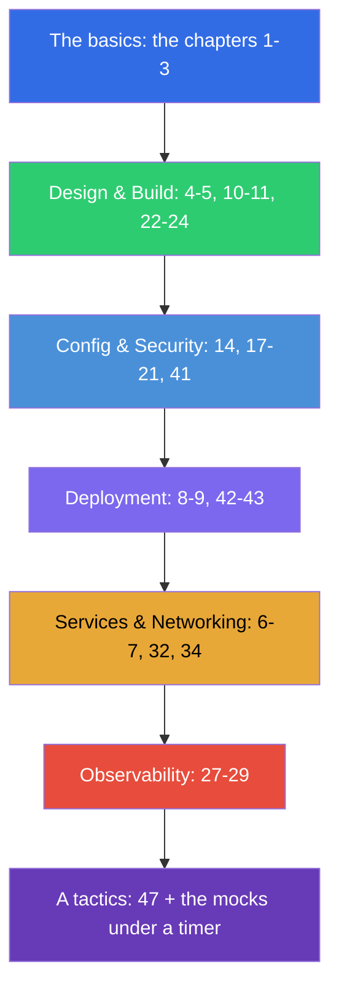

[Русская версия](CKAD_RU.md) · [Versión en español](CKAD_ES.md) · [Version française](CKAD_FR.md) · [Deutsche Version](CKAD_DE.md) · [ქართული ვერსია](CKAD_GE.md)

# A guide of a preparation for the CKAD

[← The contents of the course](README.md) · [The CKA guide](CKA.md)

This file is a route of a preparation exactly for the exam **CKAD (Certified Kubernetes Application
Developer)**. The course is a joint one (CKA + CKAD), and here only the chapters and the labs needed
for the CKAD are collected, laid out by the official domains of the exam with their weights.

> **A format of the exam.** A practical one, 2 hours, ~15-20 tasks in a live cluster, a passing
> score is 66%, Kubernetes v1.35. A focus is on the applications, not on an administration of a cluster.
> A detailed tactics - in [the chapter 47](47/README.md).

## Where to start (the basics for everyone)

If your base on the networks, DNS, TLS and the containers is still shaky - start with an optional
**Part 0** (especially [0.4 about the containers](00-4-containers/README.md) - a foundation for the CKAD):

- [0.1. Networking: IP, ports, CIDR, NAT](00-1-net/README.md)
- [0.2. DNS: how names turn into addresses](00-2-dns/README.md)
- [0.3. TLS and certificates: HTTPS, keys, a CA](00-3-tls/README.md)
- [0.4. Containers and Docker: images, layers, registries, runtime](00-4-containers/README.md)
- [0.5. Linux and the node tools: SSH, sudo, systemd, logs](00-5-linux/README.md)
- [0.6. YAML: indentation, lists, dictionaries, manifests](00-6-yaml/README.md) - **important for the CKAD** (every manifest)
- [0.7. Linux networking under the hood: network namespaces, veth, routes](00-7-netns/README.md)
- [0.8. vim in 15 minutes: survive and configure it for YAML](00-8-vim/README.md) - **important for the CKAD** (a fast editing of the manifests)

Next - a foundation of the course:

1. [Introduction: Kubernetes, the exams, how this course is built](01/README.md)
2. [Kubernetes architecture: the control plane and worker nodes](02/README.md) - for a general understanding
3. [Working with kubectl: the imperative and the declarative approach](03/README.md) - **critical for
   a speed**

## The domains of the CKAD and the chapters

### 🔵 Application Environment, Configuration and Security — 25% (the most weighty)

- [14. The resources: requests, limits, LimitRange, ResourceQuota](14/README.md)
- [17. The commands, the arguments and the environment variables](17/README.md)
- [18. ConfigMap](18/README.md)
- [19. Secret](19/README.md)
- [20. The SecurityContext and the capabilities](20/README.md)
- [21. The ServiceAccount; the authentication, the authorization, the admission](21/README.md)
- [41. The CRD and the operators](41/README.md) - «the resources that extend Kubernetes»

### 🟢 Application Design and Build — 20%

- [4. Pods: the lifecycle, creation and configuration](04/README.md)
- [5. ReplicaSet and Deployment](05/README.md)
- [10. Jobs and CronJobs](10/README.md)
- [11. DaemonSet and StatefulSet](11/README.md)
- [22. The multi-container Pods: a sidecar, an adapter, an ambassador, an init](22/README.md)
- [23. The images of the containers: a building, a Dockerfile, an optimization](23/README.md)
- [24. The volumes for the applications: an emptyDir and the ephemeral volumes](24/README.md)

### 🟣 Application Deployment — 20%

- [8. Deployment: rolling update and rollback](08/README.md)
- [9. The deployment strategies: blue/green and canary](09/README.md)
- [42. Helm](42/README.md)
- [43. Kustomize](43/README.md)

### 🟠 Services and Networking — 20%

- [6. Namespaces, labels, selectors and annotations](06/README.md)
- [7. Services: ClusterIP, NodePort, LoadBalancer, Endpoints](07/README.md)
- [32. An Ingress and the Ingress controllers](32/README.md)
- [34. NetworkPolicy](34/README.md)

### 🔴 Application Observability and Maintenance — 15%

- [27. The checks of a state: the liveness, the readiness and the startup probes](27/README.md)
- [28. A logging and a monitoring: the logs, the metrics-server, a kubectl top](28/README.md)
- [29. A debugging of the applications and an obsolescence of an API](29/README.md)

## A preparation for the exam

- [47. The exam CKAD: a format, a time management, JSONPath and a productivity of kubectl](47/README.md)

## What is NOT needed for the CKAD (unlike the CKA)

These topics of the course belong to an administration and are not asked at the CKAD (but they are
useful for an understanding): an installation of kubeadm (35), an upgrade of a cluster (36), a backup of etcd (37),
RBAC in depth (38), the certificates/a CSR (39), CNI/CSI/CRI (40), a troubleshooting of a control plane and of the nodes (45).
A basic understanding of an architecture (the chapter 2) and of a debugging (44, 46) is still useful.

## The labs

The labs (`tasks/cka/labs`, a numbering starts from 101) combine several adjacent topics into one
practical work. All the tasks are made in the exam style, with an automatic check
`check_result`. A correspondence of the labs to the domains of the CKAD:

| A domain of the CKAD | The labs |
|------------|------|
| 🔵 Application Environment, Configuration and Security — 25% | [105](../labs/105/README.MD) (ConfigMap/Secret/env), [106](../labs/106/README.MD) (SecurityContext), [104](../labs/104/README.MD) (the resources/the quotas), [113](../labs/113/README.MD) (ServiceAccount), [121](../labs/121/README.MD) (the RBAC drills), [115](../labs/115/README.MD) (CRD) |
| 🟢 Application Design and Build — 20% | [101](../labs/101/README.MD) (the pods/Deployment), [103](../labs/103/README.MD) (Jobs/CronJob), [107](../labs/107/README.MD) (multi-container/the images/the volumes) |
| 🟣 Application Deployment — 20% | [102](../labs/102/README.MD) (rolling update/canary/blue-green), [115](../labs/115/README.MD) (Helm/Kustomize) |
| 🟠 Services and Networking — 20% | [101](../labs/101/README.MD) (Service), [110](../labs/110/README.MD) (Ingress/NetworkPolicy), [125](../labs/125/README.MD) (DNS/CoreDNS), [120](../labs/120/README.MD) (the networking drills) |
| 🔴 Application Observability and Maintenance — 15% | [109](../labs/109/README.MD) (the probes/the logs/a debugging/the deprecations), [119](../labs/119/README.MD) (the drills on a speed + JSONPath) |

- 🧪 [tasks/cka/labs](../labs) - a catalog of all the labs
- 🧪 [tasks/ckad/mock](../../ckad/mock) - the mock exams of the CKAD under a timer

## A recommended order of a preparation for the CKAD

The CKAD is about a speed of a work with the applications. Practice an imperative generation of the manifests
(the chapter 3) and JSONPath (the chapter 47) to an automatism, then reinforce it with the mock exams under
a timer.
