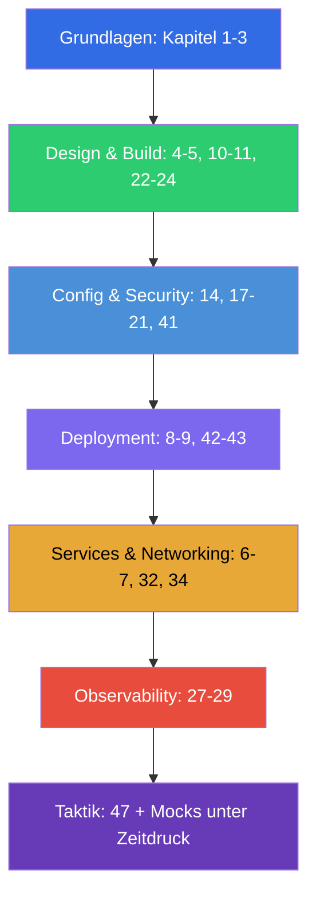

[Русская версия](CKAD_RU.md) · [Eng version](CKAD.md) · [Versión en español](CKAD_ES.md) · [Version française](CKAD_FR.md) · [ქართული ვერსია](CKAD_GE.md) · [繁體中文版](CKAD_TW.md) · [日本語版](CKAD_JP.md)

# Wegweiser zur Vorbereitung auf CKAD

[← Kursinhalt](README_DE.md) · [Wegweiser CKA](CKA_DE.md)

Diese Datei ist die Route der Vorbereitung genau auf die Prüfung **CKAD (Certified Kubernetes Application
Developer)**. Der Kurs ist gemeinsam (CKA + CKAD), und hier sind nur die Kapitel und Labs gesammelt, die
für CKAD nötig sind, geordnet nach den offiziellen Domänen der Prüfung mit ihren Gewichten.

> **Prüfungsformat.** Praktisch, 2 Stunden, ~15-20 Aufgaben in einem laufenden Cluster, Bestehensgrenze
> 66%, Kubernetes v1.35. Fokus auf Anwendungen, nicht auf der Administration des Clusters.
> Ausführliche Taktik - in [Kapitel 47](47/de.md).

## Wo anfangen (Grundlagen für alle)

Wenn die Basis zu Netzwerken, DNS, TLS und Containern noch wackelig ist - beginnen Sie mit dem optionalen
**Teil 0** (besonders [0.4 über Container](00-4-containers/de.md) - das Fundament für CKAD):

- [0.1. Netzwerk: IP, Ports, CIDR, NAT](00-1-net/de.md)
- [0.2. DNS: wie Namen zu Adressen werden](00-2-dns/de.md)
- [0.3. TLS und Zertifikate: HTTPS, Schlüssel, CA](00-3-tls/de.md)
- [0.4. Container und Docker: Images, Layer, Registries, Runtime](00-4-containers/de.md)
- [0.5. Linux und Node-Werkzeuge: SSH, sudo, systemd, Logs](00-5-linux/de.md)
- [0.6. YAML: Einrückung, Listen, Wörterbücher, Manifeste](00-6-yaml/de.md) - **wichtig für CKAD** (jedes Manifest)
- [0.7. Linux-Netzwerk unter der Haube: network namespaces, veth, Routen](00-7-netns/de.md)
- [0.8. vim in 15 Minuten: überleben und für YAML einrichten](00-8-vim/de.md) - **wichtig für CKAD** (schnelles Bearbeiten von Manifesten)

Weiter - das Fundament des Kurses:

1. [Einführung: Kubernetes, die Prüfungen und der Aufbau des Kurses](01/de.md)
2. [Architektur von Kubernetes: Control Plane und Worker-Knoten](02/de.md) - für das allgemeine Verständnis
3. [Arbeiten mit kubectl: der imperative und der deklarative Ansatz](03/de.md) - **kritisch für die
   Geschwindigkeit**

## Domänen von CKAD und Kapitel

### 🔵 Application Environment, Configuration and Security — 25% (am gewichtigsten)

- [14. Ressourcen: requests, limits, LimitRange, ResourceQuota](14/de.md)
- [17. Befehle, Argumente und Umgebungsvariablen](17/de.md)
- [18. ConfigMap](18/de.md)
- [19. Secret](19/de.md)
- [20. SecurityContext und capabilities](20/de.md)
- [21. ServiceAccount; Authentifizierung, Autorisierung, Admission](21/de.md)
- [41. CRD und Operatoren](41/de.md) - «Ressourcen, die Kubernetes erweitern»

### 🟢 Application Design and Build — 20%

- [4. Pods: Lebenszyklus, Erstellung und Konfiguration](04/de.md)
- [5. ReplicaSet und Deployment](05/de.md)
- [10. Jobs und CronJobs](10/de.md)
- [11. DaemonSet und StatefulSet](11/de.md)
- [22. Multi-Container-Pods: sidecar, adapter, ambassador, init](22/de.md)
- [23. Container-Images: Build, Dockerfile, Optimierung](23/de.md)
- [24. Volumes für Anwendungen: emptyDir und ephemere Volumes](24/de.md)

### 🟣 Application Deployment — 20%

- [8. Deployment: rolling update und rollback](08/de.md)
- [9. Deployment-Strategien: blue/green und canary](09/de.md)
- [42. Helm](42/de.md)
- [43. Kustomize](43/de.md)

### 🟠 Services and Networking — 20%

- [6. Namespaces, Labels, Selektoren und Annotations](06/de.md)
- [7. Services: ClusterIP, NodePort, LoadBalancer, Endpoints](07/de.md)
- [32. Ingress und Ingress-Controller](32/de.md)
- [34. NetworkPolicy](34/de.md)

### 🔴 Application Observability and Maintenance — 15%

- [27. Zustandsprüfungen: liveness, readiness, startup probes](27/de.md)
- [28. Logging und Monitoring: logs, metrics-server, kubectl top](28/de.md)
- [29. Debuggen von Anwendungen und Veralten von APIs](29/de.md)

## Prüfungsvorbereitung

- [47. Prüfung CKAD: Format, Zeitmanagement, JSONPath und Produktivität von kubectl](47/de.md)

## Was für CKAD NICHT nötig ist (im Unterschied zu CKA)

Diese Themen des Kurses gehören zur Administration und werden bei CKAD nicht gefragt (sind aber nützlich
für das Verständnis): Installation von kubeadm (35), Upgrade des Clusters (36), Backup von etcd (37), RBAC
in die Tiefe (38), Zertifikate/CSR (39), CNI/CSI/CRI (40), Troubleshooting der Control Plane und der Nodes
(45). Ein grundlegendes Verständnis der Architektur (Kapitel 2) und des Debuggings (44, 46) ist dennoch nützlich.

## Laborübungen

Die Labs (`tasks/cka/labs`, Nummerierung ab 101) fassen mehrere benachbarte Themen zu einer praktischen
Arbeit zusammen. Alle Aufgaben sind im Prüfungsstil gestaltet, mit automatischer Prüfung
`check_result`. Zuordnung der Labs zu den Domänen von CKAD:

| Domäne CKAD | Labs |
|------------|------|
| 🔵 Application Environment, Configuration and Security — 25% | [105](../labs/105/README_DE.MD) (ConfigMap/Secret/env), [106](../labs/106/README_DE.MD) (SecurityContext), [104](../labs/104/README_DE.MD) (Ressourcen/Quotas), [113](../labs/113/README_DE.MD) (ServiceAccount), [121](../labs/121/README_DE.MD) (RBAC-Drills), [115](../labs/115/README_DE.MD) (CRD) |
| 🟢 Application Design and Build — 20% | [101](../labs/101/README_DE.MD) (Pods/Deployment), [103](../labs/103/README_DE.MD) (Jobs/CronJob), [107](../labs/107/README_DE.MD) (Multi-Container/Images/Volumes) |
| 🟣 Application Deployment — 20% | [102](../labs/102/README_DE.MD) (rolling update/canary/blue-green), [115](../labs/115/README_DE.MD) (Helm/Kustomize) |
| 🟠 Services and Networking — 20% | [101](../labs/101/README_DE.MD) (Service), [110](../labs/110/README_DE.MD) (Ingress/NetworkPolicy), [125](../labs/125/README_DE.MD) (DNS/CoreDNS), [120](../labs/120/README_DE.MD) (Networking-Drills) |
| 🔴 Application Observability and Maintenance — 15% | [109](../labs/109/README_DE.MD) (Probes/Logs/Debugging/deprecations), [119](../labs/119/README_DE.MD) (Drills auf Geschwindigkeit + JSONPath) |

- 🧪 [tasks/cka/labs](../labs) - Katalog aller Laborübungen
- 🧪 [tasks/ckad/mock](../../ckad/mock) - CKAD-Mock-Prüfungen unter Zeitdruck

## Empfohlene Reihenfolge der Vorbereitung auf CKAD

CKAD - es geht um Geschwindigkeit bei der Arbeit mit Anwendungen. Üben Sie die imperative Generierung von
Manifesten (Kapitel 3) und JSONPath (Kapitel 47) bis zum Automatismus, festigen Sie es dann mit
Mock-Prüfungen unter Zeitdruck.
