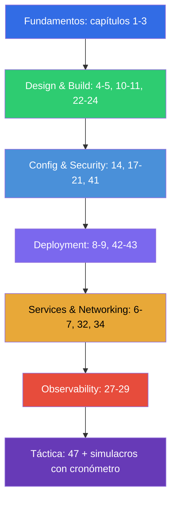

[Русская версия](CKAD_RU.md) · [Eng version](CKAD.md) · [Version française](CKAD_FR.md) · [Deutsche Version](CKAD_DE.md) · [ქართული ვერსია](CKAD_GE.md) · [繁體中文版](CKAD_TW.md) · [日本語版](CKAD_JP.md)

# Guía de preparación para el CKAD

[← Índice del curso](README_ES.md) · [Guía del CKA](CKA_ES.md)

Este archivo es la ruta de preparación específica para el examen **CKAD (Certified Kubernetes
Application Developer)**. El curso es conjunto (CKA + CKAD) y aquí se recogen solo los capítulos y
laboratorios necesarios para el CKAD, ordenados por los dominios oficiales del examen y sus pesos.

> **Formato del examen.** Práctico, 2 horas, ~15-20 tareas en un clúster real, nota de
> aprobado 66%, Kubernetes v1.35. El foco está en las aplicaciones, no en la administración del
> clúster. La táctica detallada está en el [capítulo 47](47/es.md).

## Por dónde empezar (fundamentos para todos)

Si tu base de redes, DNS, TLS y contenedores todavía es frágil, empieza por la opcional
**Parte 0** (sobre todo [0.4 sobre contenedores](00-4-containers/es.md) - el fundamento del CKAD):

- [0.1. Redes: IP, puertos, CIDR, NAT](00-1-net/es.md)
- [0.2. DNS: cómo los nombres se convierten en direcciones](00-2-dns/es.md)
- [0.3. TLS y certificados: HTTPS, claves, CA](00-3-tls/es.md)
- [0.4. Contenedores y Docker: imágenes, capas, registros, runtime](00-4-containers/es.md)
- [0.5. Linux y herramientas del nodo: SSH, sudo, systemd, logs](00-5-linux/es.md)
- [0.6. YAML: indentación, listas, diccionarios, manifiestos](00-6-yaml/es.md) - **importante para el CKAD** (cada manifiesto)
- [0.7. La red de Linux por dentro: network namespaces, veth, rutas](00-7-netns/es.md)
- [0.8. vim en 15 minutos: sobrevivir y configurarlo para YAML](00-8-vim/es.md) - **importante para el CKAD** (editar manifiestos rápido)

Después viene el fundamento del curso:

1. [Introducción: Kubernetes, los exámenes y la estructura del curso](01/es.md)
2. [Arquitectura de Kubernetes: control plane y nodos worker](02/es.md) - para la comprensión general
3. [Trabajar con kubectl: enfoques imperativo y declarativo](03/es.md) - **crítico para la
   velocidad**

## Dominios del CKAD y capítulos

### 🔵 Application Environment, Configuration and Security — 25% (el de más peso)

- [14. Recursos: requests, limits, LimitRange, ResourceQuota](14/es.md)
- [17. Comandos, argumentos y variables de entorno](17/es.md)
- [18. ConfigMap](18/es.md)
- [19. Secret](19/es.md)
- [20. SecurityContext y capabilities](20/es.md)
- [21. ServiceAccount; autenticación, autorización, admission](21/es.md)
- [41. CRD y operadores](41/es.md) - «recursos que extienden Kubernetes»

### 🟢 Application Design and Build — 20%

- [4. Pods: ciclo de vida, creación y configuración](04/es.md)
- [5. ReplicaSet y Deployment](05/es.md)
- [10. Jobs y CronJobs](10/es.md)
- [11. DaemonSet y StatefulSet](11/es.md)
- [22. Pods multi-container: sidecar, adapter, ambassador, init](22/es.md)
- [23. Imágenes de contenedores: construcción, Dockerfile, optimización](23/es.md)
- [24. Volúmenes para aplicaciones: emptyDir y volúmenes efímeros](24/es.md)

### 🟣 Application Deployment — 20%

- [8. Deployment: rolling update y rollback](08/es.md)
- [9. Estrategias de despliegue: blue/green y canary](09/es.md)
- [42. Helm](42/es.md)
- [43. Kustomize](43/es.md)

### 🟠 Services and Networking — 20%

- [6. Namespaces, labels, selectors y annotations](06/es.md)
- [7. Services: ClusterIP, NodePort, LoadBalancer, Endpoints](07/es.md)
- [32. Ingress y controladores Ingress](32/es.md)
- [34. NetworkPolicy](34/es.md)

### 🔴 Application Observability and Maintenance — 15%

- [27. Comprobaciones de estado: liveness, readiness y startup probes](27/es.md)
- [28. Logging y monitorización: logs, metrics-server, kubectl top](28/es.md)
- [29. Depuración de aplicaciones y obsolescencia de las API](29/es.md)

## Preparación para el examen

- [47. Examen CKAD: formato, gestión del tiempo, JSONPath y productividad con kubectl](47/es.md)

## Lo que NO hace falta para el CKAD (a diferencia del CKA)

Estos temas del curso pertenecen a la administración y no se preguntan en el CKAD (pero son útiles
para entenderlo todo): instalación con kubeadm (35), actualización del clúster (36), backup de etcd
(37), RBAC a fondo (38), certificados/CSR (39), CNI/CSI/CRI (40), troubleshooting del control plane
y de los nodos (45). La arquitectura básica (capítulo 2) y la depuración (44, 46) sí ayudan.

## Laboratorios

Los laboratorios (`tasks/cka/labs`, numerados desde 101) reúnen varios temas afines en un único
trabajo práctico. Todas las tareas están planteadas en estilo de examen con autoverificación
`check_result`. Correspondencia de los laboratorios con los dominios del CKAD:

| Dominio CKAD | Laboratorios |
|------------|------|
| 🔵 Application Environment, Configuration and Security — 25% | [105](../labs/105/README_ES.MD) (ConfigMap/Secret/env), [106](../labs/106/README_ES.MD) (SecurityContext), [104](../labs/104/README_ES.MD) (recursos/cuotas), [113](../labs/113/README_ES.MD) (ServiceAccount), [121](../labs/121/README_ES.MD) (drills de RBAC), [115](../labs/115/README_ES.MD) (CRD) |
| 🟢 Application Design and Build — 20% | [101](../labs/101/README_ES.MD) (pods/Deployment), [103](../labs/103/README_ES.MD) (Jobs/CronJob), [107](../labs/107/README_ES.MD) (multi-container/imágenes/volúmenes) |
| 🟣 Application Deployment — 20% | [102](../labs/102/README_ES.MD) (rolling update/canary/blue-green), [115](../labs/115/README_ES.MD) (Helm/Kustomize) |
| 🟠 Services and Networking — 20% | [101](../labs/101/README_ES.MD) (Service), [110](../labs/110/README_ES.MD) (Ingress/NetworkPolicy), [125](../labs/125/README_ES.MD) (DNS/CoreDNS), [120](../labs/120/README_ES.MD) (drills de red) |
| 🔴 Application Observability and Maintenance — 15% | [109](../labs/109/README_ES.MD) (probes/logs/depuración/deprecations), [119](../labs/119/README_ES.MD) (drills de velocidad + JSONPath) |

- 🧪 [tasks/cka/labs](../labs) - catálogo de todos los laboratorios
- 🧪 [tasks/ckad/mock](../../ckad/mock) - exámenes de simulación del CKAD con cronómetro

## Orden recomendado de preparación para el CKAD

El CKAD va de velocidad trabajando con aplicaciones. Practica la generación imperativa de
manifiestos (capítulo 3) y JSONPath (capítulo 47) hasta automatizarlas, y luego consolida con
exámenes de simulación con cronómetro.
