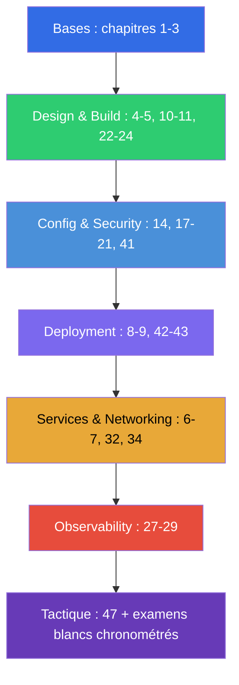

[Русская версия](CKAD_RU.md) · [Eng version](CKAD.md) · [Versión en español](CKAD_ES.md) · [Deutsche Version](CKAD_DE.md) · [ქართული ვერსია](CKAD_GE.md)

# Guide de préparation au CKAD

[← Sommaire du cours](README_FR.md) · [Guide CKA](CKA_FR.md)

Ce fichier est l'itinéraire de préparation à l'examen **CKAD (Certified Kubernetes Application
Developer)** précisément. Le cours est commun (CKA + CKAD), et seuls les chapitres et les TP
nécessaires au CKAD sont rassemblés ici, répartis par domaines officiels de l'examen avec leurs poids.

> **Format de l'examen.** Pratique, 2 heures, ~15-20 tâches dans un cluster réel, score de
> réussite 66%, Kubernetes v1.35. L'accent est mis sur les applications, pas sur l'administration du cluster.
> Tactique détaillée - dans le [chapitre 47](47/fr.md).

## Par où commencer (les bases pour tous)

Si vos bases en réseaux, DNS, TLS et conteneurs sont encore fragiles - commencez par la
**Partie 0** facultative (surtout [0.4 sur les conteneurs](00-4-containers/fr.md) - la fondation du CKAD) :

- [0.1. Les réseaux : IP, ports, CIDR, NAT](00-1-net/fr.md)
- [0.2. Le DNS : comment les noms se transforment en adresses](00-2-dns/fr.md)
- [0.3. TLS et certificats : HTTPS, clés, CA](00-3-tls/fr.md)
- [0.4. Conteneurs et Docker : images, couches, registres, runtime](00-4-containers/fr.md)
- [0.5. Linux et les outils du nœud : SSH, sudo, systemd, logs](00-5-linux/fr.md)
- [0.6. YAML : indentation, listes, dictionnaires, manifestes](00-6-yaml/fr.md) - **important pour le CKAD** (chaque manifeste)
- [0.7. Le réseau Linux sous le capot : network namespaces, veth, routes](00-7-netns/fr.md)
- [0.8. vim en 15 minutes : survivre et le régler pour YAML](00-8-vim/fr.md) - **important pour le CKAD** (édition rapide des manifestes)

Ensuite - la fondation du cours :

1. [Introduction : Kubernetes, les examens, la structure du cours](01/fr.md)
2. [Architecture de Kubernetes : control plane et nœuds worker](02/fr.md) - pour la compréhension générale
3. [Travailler avec kubectl : approches impérative et déclarative](03/fr.md) - **critique pour la
   vitesse**

## Domaines du CKAD et chapitres

### 🔵 Application Environment, Configuration and Security — 25% (le plus lourd)

- [14. Ressources : requests, limits, LimitRange, ResourceQuota](14/fr.md)
- [17. Commandes, arguments et variables d'environnement](17/fr.md)
- [18. ConfigMap](18/fr.md)
- [19. Secret](19/fr.md)
- [20. SecurityContext et capabilities](20/fr.md)
- [21. ServiceAccount ; authentification, autorisation, admission](21/fr.md)
- [41. CRD et opérateurs](41/fr.md) - « les ressources qui étendent Kubernetes »

### 🟢 Application Design and Build — 20%

- [4. Les pods : cycle de vie, création et configuration](04/fr.md)
- [5. ReplicaSet et Deployment](05/fr.md)
- [10. Jobs et CronJobs](10/fr.md)
- [11. DaemonSet et StatefulSet](11/fr.md)
- [22. Pods multi-conteneurs : sidecar, adapter, ambassador, init](22/fr.md)
- [23. Images de conteneurs : build, Dockerfile, optimisation](23/fr.md)
- [24. Volumes pour les applications : emptyDir et volumes éphémères](24/fr.md)

### 🟣 Application Deployment — 20%

- [8. Deployment : rolling update et rollback](08/fr.md)
- [9. Stratégies de déploiement : blue/green et canary](09/fr.md)
- [42. Helm](42/fr.md)
- [43. Kustomize](43/fr.md)

### 🟠 Services and Networking — 20%

- [6. Namespaces, labels, selectors et annotations](06/fr.md)
- [7. Services : ClusterIP, NodePort, LoadBalancer, Endpoints](07/fr.md)
- [32. Ingress et contrôleurs Ingress](32/fr.md)
- [34. NetworkPolicy](34/fr.md)

### 🔴 Application Observability and Maintenance — 15%

- [27. Vérifications d'état : liveness, readiness, startup probes](27/fr.md)
- [28. Logging et monitoring : logs, metrics-server, kubectl top](28/fr.md)
- [29. Débogage des applications et dépréciation des API](29/fr.md)

## Préparation à l'examen

- [47. L'examen CKAD : format, gestion du temps, JSONPath et productivité kubectl](47/fr.md)

## Ce qui n'est PAS nécessaire pour le CKAD (contrairement au CKA)

Ces sujets du cours relèvent de l'administration et ne sont pas demandés au CKAD (mais ils sont utiles
à la compréhension) : installation avec kubeadm (35), mise à jour du cluster (36), sauvegarde d'etcd (37),
RBAC en profondeur (38), certificats/CSR (39), CNI/CSI/CRI (40), troubleshooting du control plane et des nœuds (45).
Une compréhension de base de l'architecture (chapitre 2) et du débogage (44, 46) reste tout de même utile.

## Travaux pratiques

Les TP (`tasks/cka/labs`, numérotés à partir de 101) réunissent plusieurs sujets voisins en un
seul travail pratique. Toutes les tâches sont formulées comme à l'examen, avec l'autovérification
`check_result`. Correspondance des TP avec les domaines du CKAD :

| Domaine CKAD | TP |
|------------|------|
| 🔵 Application Environment, Configuration and Security — 25% | [105](../labs/105/README_FR.MD) (ConfigMap/Secret/env), [106](../labs/106/README_FR.MD) (SecurityContext), [104](../labs/104/README_FR.MD) (ressources/quotas), [113](../labs/113/README_FR.MD) (ServiceAccount), [121](../labs/121/README_FR.MD) (drills RBAC), [115](../labs/115/README_FR.MD) (CRD) |
| 🟢 Application Design and Build — 20% | [101](../labs/101/README_FR.MD) (pods/Deployment), [103](../labs/103/README_FR.MD) (Jobs/CronJob), [107](../labs/107/README_FR.MD) (multi-conteneurs/images/volumes) |
| 🟣 Application Deployment — 20% | [102](../labs/102/README_FR.MD) (rolling update/canary/blue-green), [115](../labs/115/README_FR.MD) (Helm/Kustomize) |
| 🟠 Services and Networking — 20% | [101](../labs/101/README_FR.MD) (Service), [110](../labs/110/README_FR.MD) (Ingress/NetworkPolicy), [125](../labs/125/README_FR.MD) (DNS/CoreDNS), [120](../labs/120/README_FR.MD) (drills networking) |
| 🔴 Application Observability and Maintenance — 15% | [109](../labs/109/README_FR.MD) (probes/logs/débogage/deprecations), [119](../labs/119/README_FR.MD) (drills de vitesse + JSONPath) |

- 🧪 [tasks/cka/labs](../labs) - catalogue de tous les travaux pratiques
- 🧪 [tasks/ckad/mock](../../ckad/mock) - examens blancs CKAD chronométrés

## Ordre de préparation recommandé pour le CKAD

Le CKAD - c'est la vitesse de travail avec les applications. Entraînez-vous à la génération impérative
de manifestes (chapitre 3) et à JSONPath (chapitre 47) jusqu'à l'automatisme, puis consolidez avec des
examens blancs chronométrés.
