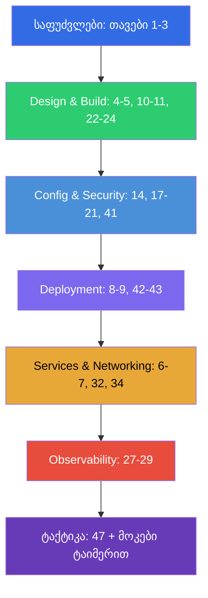

[Русская версия](CKAD_RU.md) · [Eng version](CKAD.md) · [Versión en español](CKAD_ES.md) · [Version française](CKAD_FR.md) · [Deutsche Version](CKAD_DE.md) · [繁體中文版](CKAD_TW.md) · [日本語版](CKAD_JP.md)

# CKAD-სთვის მომზადების გზამკვლევი

[← კურსის სარჩევი](README_GE.md) · [CKA-ის გზამკვლევი](CKA_GE.md)

ეს ფაილი - სწორედ **CKAD (Certified Kubernetes Application
Developer)** გამოცდისთვის მომზადების მარშრუტია. კურსი ერთობლივია (CKA + CKAD), და აქ შეკრებილია
მხოლოდ CKAD-სთვის საჭირო თავები და ლაბები, დალაგებული გამოცდის ოფიციალური დომენების მიხედვით მათი წონებით.

> **გამოცდის ფორმატი.** პრაქტიკული, 2 საათი, ~15-20 დავალება ცოცხალ კლასტერში, გამსვლელი
> ქულა 66%, Kubernetes v1.35. ფოკუსი აპლიკაციებზეა და არა კლასტერის ადმინისტრირებაზე.
> დეტალური ტაქტიკა - [თავ 47-ში](47/ge.md).

## საიდან დაიწყოთ (საფუძვლები ყველასთვის)

თუ ქსელების, DNS-ის, TLS-ისა და კონტეინერების ბაზა ჯერ სუსტია - დაიწყეთ არასავალდებულო
**ნაწილი 0**-დან (განსაკუთრებით [0.4 კონტეინერების შესახებ](00-4-containers/ge.md) - CKAD-ის საფუძველი):

- [0.1. ქსელი: IP, პორტები, CIDR, NAT](00-1-net/ge.md)
- [0.2. DNS: როგორ იქცევა სახელები მისამართებად](00-2-dns/ge.md)
- [0.3. TLS და სერტიფიკატები: HTTPS, გასაღებები, CA](00-3-tls/ge.md)
- [0.4. კონტეინერები და Docker: იმიჯები, შრეები, რეესტრები, runtime](00-4-containers/ge.md)
- [0.5. Linux და ნოდის ხელსაწყოები: SSH, sudo, systemd, ლოგები](00-5-linux/ge.md)
- [0.6. YAML: აცილება, სიები, ლექსიკონები, მანიფესტები](00-6-yaml/ge.md) - **მნიშვნელოვანია CKAD-სთვის** (ყოველი მანიფესტი)
- [0.7. Linux-ქსელი კაპოტის ქვეშ: network namespaces, veth, მარშრუტები](00-7-netns/ge.md)
- [0.8. vim 15 წუთში: გადარჩი და მოირგე YAML-ისთვის](00-8-vim/ge.md) - **მნიშვნელოვანია CKAD-სთვის** (მანიფესტების სწრაფი რედაქტირება)

შემდეგ - კურსის საფუძველი:

1. [შესავალი: Kubernetes, გამოცდები, კურსის აგებულება](01/ge.md)
2. [Kubernetes-ის არქიტექტურა: control plane და worker-ნოდები](02/ge.md) - საერთო გაგებისთვის
3. [kubectl-თან მუშაობა: იმპერატიული და დეკლარაციული მიდგომები](03/ge.md) - **კრიტიკულია
   სიჩქარისთვის**

## CKAD-ს დომენები და თავები

### 🔵 Application Environment, Configuration and Security — 25% (ყველაზე წონიანი)

- [14. რესურსები: requests, limits, LimitRange, ResourceQuota](14/ge.md)
- [17. ბრძანებები, არგუმენტები და გარემოს ცვლადები](17/ge.md)
- [18. ConfigMap](18/ge.md)
- [19. Secret](19/ge.md)
- [20. SecurityContext და capabilities](20/ge.md)
- [21. ServiceAccount; ავთენტიფიკაცია, ავტორიზაცია, admission](21/ge.md)
- [41. CRD და ოპერატორები](41/ge.md) - «რესურსები, რომლებიც აფართოებს Kubernetes-ს»

### 🟢 Application Design and Build — 20%

- [4. Pod-ები: სასიცოცხლო ციკლი, შექმნა და კონფიგურირება](04/ge.md)
- [5. ReplicaSet და Deployment](05/ge.md)
- [10. Jobs და CronJobs](10/ge.md)
- [11. DaemonSet და StatefulSet](11/ge.md)
- [22. Multi-container Pod-ები: sidecar, adapter, ambassador, init](22/ge.md)
- [23. კონტეინერების იმიჯები: აწყობა, Dockerfile, ოპტიმიზაცია](23/ge.md)
- [24. ტომები აპლიკაციებისთვის: emptyDir და ეფემერული ტომები](24/ge.md)

### 🟣 Application Deployment — 20%

- [8. Deployment: rolling update და rollback](08/ge.md)
- [9. გაშლის სტრატეგიები: blue/green და canary](09/ge.md)
- [42. Helm](42/ge.md)
- [43. Kustomize](43/ge.md)

### 🟠 Services and Networking — 20%

- [6. Namespaces, labels, selectors და annotations](06/ge.md)
- [7. Services: ClusterIP, NodePort, LoadBalancer, Endpoints](07/ge.md)
- [32. Ingress და Ingress-კონტროლერები](32/ge.md)
- [34. NetworkPolicy](34/ge.md)

### 🔴 Application Observability and Maintenance — 15%

- [27. მდგომარეობის შემოწმებები: liveness, readiness, startup probes](27/ge.md)
- [28. ლოგირება და მონიტორინგი: logs, metrics-server, kubectl top](28/ge.md)
- [29. აპლიკაციების გამართვა და API-ს მოძველება](29/ge.md)

## გამოცდისთვის მომზადება

- [47. CKAD გამოცდა: ფორმატი, დროის მართვა, JSONPath და kubectl-ის პროდუქტიულობა](47/ge.md)

## რა არ არის საჭირო CKAD-სთვის (CKA-სგან განსხვავებით)

კურსის ეს თემები ეხება ადმინისტრირებას და CKAD-ზე არ იკითხება (მაგრამ სასარგებლოა
გაგებისთვის): kubeadm-ის დაყენება (35), კლასტერის განახლება (36), etcd-ს ბექაპი (37), RBAC სიღრმისეულად
(38), სერტიფიკატები/CSR (39), CNI/CSI/CRI (40), control plane-ისა და ნოდების troubleshooting (45).
არქიტექტურის ბაზური გაგება (თავი 2) და გამართვა (44, 46) მაინც სასარგებლოა.

## ლაბორატორიული სამუშაოები

ლაბები (`tasks/cka/labs`, ნუმერაცია 101-დან) აერთიანებს რამდენიმე მომიჯნავე თემას ერთ
პრაქტიკულ სამუშაოში. ყველა დავალება გაფორმებულია გამოცდის სტილში `check_result`
ავტოშემოწმებით. ლაბების შესაბამისობა CKAD-ს დომენებთან:

| CKAD-ს დომენი | ლაბები |
|------------|------|
| 🔵 Application Environment, Configuration and Security — 25% | [105](../labs/105/README_GE.MD) (ConfigMap/Secret/env), [106](../labs/106/README_GE.MD) (SecurityContext), [104](../labs/104/README_GE.MD) (რესურსები/კვოტები), [113](../labs/113/README_GE.MD) (ServiceAccount), [121](../labs/121/README_GE.MD) (RBAC-დრილები), [115](../labs/115/README_GE.MD) (CRD) |
| 🟢 Application Design and Build — 20% | [101](../labs/101/README_GE.MD) (Pod-ები/Deployment), [103](../labs/103/README_GE.MD) (Jobs/CronJob), [107](../labs/107/README_GE.MD) (multi-container/იმიჯები/ტომები) |
| 🟣 Application Deployment — 20% | [102](../labs/102/README_GE.MD) (rolling update/canary/blue-green), [115](../labs/115/README_GE.MD) (Helm/Kustomize) |
| 🟠 Services and Networking — 20% | [101](../labs/101/README_GE.MD) (Service), [110](../labs/110/README_GE.MD) (Ingress/NetworkPolicy), [125](../labs/125/README_GE.MD) (DNS/CoreDNS), [120](../labs/120/README_GE.MD) (networking-დრილები) |
| 🔴 Application Observability and Maintenance — 15% | [109](../labs/109/README_GE.MD) (პრობები/ლოგები/გამართვა/deprecations), [119](../labs/119/README_GE.MD) (დრილები სიჩქარეზე + JSONPath) |

- 🧪 [tasks/cka/labs](../labs) - ყველა ლაბორატორიული სამუშაოს კატალოგი
- 🧪 [tasks/ckad/mock](../../ckad/mock) - CKAD-ს მოკ-გამოცდები ტაიმერით

## CKAD-სთვის მომზადების რეკომენდებული თანმიმდევრობა

CKAD - აპლიკაციებთან მუშაობის სიჩქარეზეა. გაიწაფეთ მანიფესტების იმპერატიულ გენერაციაში
(თავი 3) და JSONPath-ში (თავი 47) ავტომატიზმამდე, შემდეგ განიმტკიცეთ მოკ-გამოცდებით
ტაიმერით.
