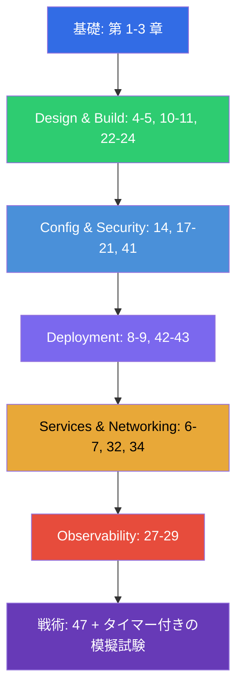

[Русская версия](CKAD_RU.md) · [Eng version](CKAD.md) · [Versión en español](CKAD_ES.md) · [Version française](CKAD_FR.md) · [Deutsche Version](CKAD_DE.md) · [ქართული ვერსია](CKAD_GE.md) · [繁體中文版](CKAD_TW.md)

# CKAD 対策ガイド

[← コース目次](README_JP.md) · [CKA ガイド](CKA_JP.md)

このファイルは、まさに **CKAD (Certified Kubernetes Application Developer)** 試験の
ための対策ルートです。コースは CKA と CKAD の共通コースなので、ここには CKAD に必要な
章とラボだけを集め、公式の試験領域とその配点に沿って並べてあります。

> **試験の形式。** 実技形式、2 時間、実際のクラスタで 15-20 問ほど、合格ラインは
> 66%、Kubernetes v1.35。焦点はクラスタ管理ではなくアプリケーションにあります。
> 詳しい戦術は[第 47 章](47/jp.md)にあります。

## どこから始めるか (全員向けの基礎)

ネットワーク、DNS、TLS、コンテナの土台がまだ不安なら、任意の
**パート 0** から始めてください (とくに[0.4 コンテナについて](00-4-containers/jp.md) - CKAD の基礎):

- [0.1. ネットワーク: IP、ポート、CIDR、NAT](00-1-net/jp.md)
- [0.2. DNS: 名前はどうやってアドレスになるか](00-2-dns/jp.md)
- [0.3. TLS と証明書: HTTPS、鍵、CA](00-3-tls/jp.md)
- [0.4. コンテナと Docker: イメージ、レイヤ、レジストリ、runtime](00-4-containers/jp.md)
- [0.5. Linux とノードのツール: SSH、sudo、systemd、ログ](00-5-linux/jp.md)
- [0.6. YAML: インデント、リスト、辞書、マニフェスト](00-6-yaml/jp.md) - **CKAD で重要** (すべてのマニフェスト)
- [0.7. 内部から見た Linux ネットワーク: network namespaces、veth、ルート](00-7-netns/jp.md)
- [0.8. 15 分で学ぶ vim: 生き延びて YAML 向けに設定する](00-8-vim/jp.md) - **CKAD で重要** (マニフェストの高速編集)

次はコースの土台です:

1. [はじめに: Kubernetes、試験、コースの構成](01/jp.md)
2. [Kubernetes のアーキテクチャ: control plane と worker ノード](02/jp.md) - 全体像の理解のために
3. [kubectl の使い方: 命令的アプローチと宣言的アプローチ](03/jp.md) - **速度のために
   決定的に重要**

## CKAD の領域と対応する章

### 🔵 Application Environment, Configuration and Security — 25% (もっとも配点が高い)

- [14. リソース: requests、limits、LimitRange、ResourceQuota](14/jp.md)
- [17. コマンド、引数、環境変数](17/jp.md)
- [18. ConfigMap](18/jp.md)
- [19. Secret](19/jp.md)
- [20. SecurityContext と capabilities](20/jp.md)
- [21. ServiceAccount、認証、認可、admission](21/jp.md)
- [41. CRD とオペレータ](41/jp.md) - 「Kubernetes を拡張するリソース」

### 🟢 Application Design and Build — 20%

- [4. Pod: ライフサイクル、作成と設定](04/jp.md)
- [5. ReplicaSet と Deployment](05/jp.md)
- [10. Jobs と CronJobs](10/jp.md)
- [11. DaemonSet と StatefulSet](11/jp.md)
- [22. Multi-container Pod: sidecar、adapter、ambassador、init](22/jp.md)
- [23. コンテナイメージ: ビルド、Dockerfile、最適化](23/jp.md)
- [24. アプリケーション向けのボリューム: emptyDir とエフェメラルボリューム](24/jp.md)

### 🟣 Application Deployment — 20%

- [8. Deployment: rolling update と rollback](08/jp.md)
- [9. デプロイ戦略: blue/green と canary](09/jp.md)
- [42. Helm](42/jp.md)
- [43. Kustomize](43/jp.md)

### 🟠 Services and Networking — 20%

- [6. Namespaces、ラベル、セレクタ、アノテーション](06/jp.md)
- [7. Services: ClusterIP、NodePort、LoadBalancer、Endpoints](07/jp.md)
- [32. Ingress と Ingress コントローラ](32/jp.md)
- [34. NetworkPolicy](34/jp.md)

### 🔴 Application Observability and Maintenance — 15%

- [27. 状態のチェック: liveness、readiness、startup probes](27/jp.md)
- [28. ロギングとモニタリング: logs、metrics-server、kubectl top](28/jp.md)
- [29. アプリケーションのデバッグと API の非推奨化](29/jp.md)

## 試験の準備

- [47. CKAD 試験: 形式、時間管理、JSONPath、kubectl の生産性](47/jp.md)

## CKAD で必要ではないもの (CKA との違い)

コースのこれらのテーマは管理側の話で、CKAD では問われません (ただし理解には役立ちます):
kubeadm のインストール (35)、クラスタのアップグレード (36)、etcd のバックアップ (37)、
RBAC の深掘り (38)、証明書と CSR (39)、CNI/CSI/CRI (40)、control plane とノードの
troubleshooting (45)。アーキテクチャ (第 2 章) とデバッグ (44、46) の基本的な理解は
それでも役に立ちます。

## ラボ

ラボ (`tasks/cka/labs`、番号は 101 から) は、いくつかの隣接するテーマを 1 つの
実技作業にまとめたものです。すべての課題は試験と同じスタイルで、自動チェック
`check_result` 付きで用意されています。ラボと CKAD 領域の対応:

| CKAD の領域 | ラボ |
|------------|------|
| 🔵 Application Environment, Configuration and Security — 25% | [105](../labs/105/README_JP.MD) (ConfigMap/Secret/env)、[106](../labs/106/README_JP.MD) (SecurityContext)、[104](../labs/104/README_JP.MD) (リソース/クォータ)、[113](../labs/113/README_JP.MD) (ServiceAccount)、[121](../labs/121/README_JP.MD) (RBAC ドリル)、[115](../labs/115/README_JP.MD) (CRD) |
| 🟢 Application Design and Build — 20% | [101](../labs/101/README_JP.MD) (Pod/Deployment)、[103](../labs/103/README_JP.MD) (Jobs/CronJob)、[107](../labs/107/README_JP.MD) (multi-container/イメージ/ボリューム) |
| 🟣 Application Deployment — 20% | [102](../labs/102/README_JP.MD) (rolling update/canary/blue-green)、[115](../labs/115/README_JP.MD) (Helm/Kustomize) |
| 🟠 Services and Networking — 20% | [101](../labs/101/README_JP.MD) (Service)、[110](../labs/110/README_JP.MD) (Ingress/NetworkPolicy)、[125](../labs/125/README_JP.MD) (DNS/CoreDNS)、[120](../labs/120/README_JP.MD) (networking ドリル) |
| 🔴 Application Observability and Maintenance — 15% | [109](../labs/109/README_JP.MD) (probes/ログ/デバッグ/deprecations)、[119](../labs/119/README_JP.MD) (速度ドリル + JSONPath) |

- 🧪 [tasks/cka/labs](../labs) - すべてのラボのカタログ
- 🧪 [tasks/ckad/mock](../../ckad/mock) - タイマー付きの CKAD 模擬試験

## CKAD 対策の推奨順序

CKAD はアプリケーションを扱う速度が問われます。マニフェストの命令的な生成 (第 3 章) と
JSONPath (第 47 章) を反射的にできるところまで練習し、そのあとタイマー付きの模擬試験で
固めてください。
