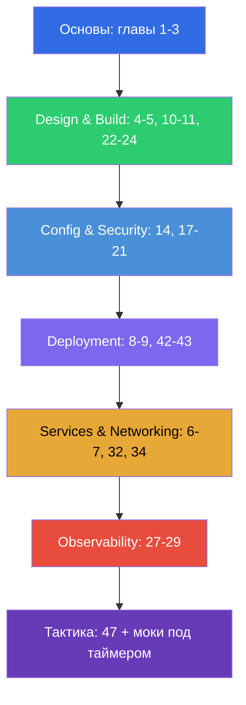

# Путеводитель по подготовке к CKAD

[← Оглавление курса](README_RU.md) · [Путеводитель CKA](CKA_RU.md)

Этот файл - маршрут подготовки именно к экзамену **CKAD (Certified Kubernetes Application
Developer)**. Курс совместный (CKA + CKAD), и здесь собраны только главы и лабы, нужные
для CKAD, разложенные по официальным доменам экзамена с их весами.

> **Формат экзамена.** Практический, 2 часа, ~15-20 задач в живом кластере, проходной
> балл 66%, Kubernetes v1.35. Фокус на приложениях, а не на администрировании кластера.
> Подробная тактика - в [главе 47](47/ru.md).

## С чего начать (основы для всех)

Если база по сетям, DNS, TLS и контейнерам пока шаткая - начните с необязательной
**Части 0** (особенно [0.4 про контейнеры](00-4-containers/ru.md) - фундамент для CKAD):

- [0.1. Сеть: IP, порты, CIDR, NAT](00-1-net/ru.md)
- [0.2. DNS: как имена превращаются в адреса](00-2-dns/ru.md)
- [0.3. TLS и сертификаты: HTTPS, ключи, CA](00-3-tls/ru.md)
- [0.4. Контейнеры и Docker: образы, слои, реестры, runtime](00-4-containers/ru.md)
- [0.5. Linux и инструменты ноды: SSH, sudo, systemd, логи](00-5-linux/ru.md)
- [0.6. YAML: отступы, списки, словари, манифесты](00-6-yaml/ru.md) - **важно для CKAD** (каждый манифест)
- [0.7. Linux-сеть под капотом: network namespaces, veth, маршруты](00-7-netns/ru.md)

Дальше - фундамент курса:

1. [Введение: Kubernetes, экзамены, устройство курса](01/ru.md)
2. [Архитектура Kubernetes: control plane и worker-ноды](02/ru.md) - для общего понимания
3. [Работа с kubectl: императивный и декларативный подходы](03/ru.md) - **критично для
   скорости**

## Домены CKAD и главы

### 🔵 Application Environment, Configuration and Security — 25% (самый весомый)

- [14. Ресурсы: requests, limits, LimitRange, ResourceQuota](14/ru.md)
- [17. Команды, аргументы и переменные окружения](17/ru.md)
- [18. ConfigMap](18/ru.md)
- [19. Secret](19/ru.md)
- [20. SecurityContext и capabilities](20/ru.md)
- [21. ServiceAccount; аутентификация, авторизация, admission](21/ru.md)
- [41. CRD и операторы](41/ru.md) - «ресурсы, расширяющие Kubernetes»

### 🟢 Application Design and Build — 20%

- [4. Поды: жизненный цикл, создание и конфигурирование](04/ru.md)
- [5. ReplicaSet и Deployment](05/ru.md)
- [10. Jobs и CronJobs](10/ru.md)
- [11. DaemonSet и StatefulSet](11/ru.md)
- [22. Multi-container поды: sidecar, adapter, ambassador, init](22/ru.md)
- [23. Образы контейнеров: сборка, Dockerfile, оптимизация](23/ru.md)
- [24. Тома для приложений: emptyDir и эфемерные тома](24/ru.md)

### 🟣 Application Deployment — 20%

- [8. Deployment: rolling update и rollback](08/ru.md)
- [9. Стратегии развёртывания: blue/green и canary](09/ru.md)
- [42. Helm](42/ru.md)
- [43. Kustomize](43/ru.md)

### 🟠 Services and Networking — 20%

- [6. Namespaces, метки, селекторы и аннотации](06/ru.md)
- [7. Services: ClusterIP, NodePort, LoadBalancer, Endpoints](07/ru.md)
- [32. Ingress и Ingress-контроллеры](32/ru.md)
- [34. NetworkPolicy](34/ru.md)

### 🔴 Application Observability and Maintenance — 15%

- [27. Проверки состояния: liveness, readiness, startup probes](27/ru.md)
- [28. Логирование и мониторинг: logs, metrics-server, kubectl top](28/ru.md)
- [29. Отладка приложений и устаревание API](29/ru.md)

## Подготовка к экзамену

- [47. Экзамен CKAD: формат, тайм-менеджмент, JSONPath и продуктивность kubectl](47/ru.md)

## Что для CKAD НЕ нужно (в отличие от CKA)

Эти темы курса относятся к администрированию и на CKAD не спрашиваются (но полезны для
понимания): установка kubeadm (35), обновление кластера (36), бэкап etcd (37), RBAC вглубь
(38), сертификаты/CSR (39), CNI/CSI/CRI (40), troubleshooting control plane и нод (45).
Базовое понимание архитектуры (глава 2) и отладки (44, 46) всё же полезно.

## Лабораторные работы

Лабы (`tasks/cka/labs`, нумерация со 101) объединяют несколько смежных тем в одну
практическую работу. Все задания оформлены в экзаменационном стиле с автопроверкой
`check_result`. Соответствие лаб доменам CKAD:

| Домен CKAD | Лабы |
|------------|------|
| 🔵 Application Environment, Configuration and Security — 25% | [105](../labs/105/README_RU.MD) (ConfigMap/Secret/env), [106](../labs/106/README_RU.MD) (SecurityContext), [104](../labs/104/README_RU.MD) (ресурсы/квоты), [113](../labs/113/README_RU.MD) (ServiceAccount), [121](../labs/121/README_RU.MD) (RBAC-дриллы), [115](../labs/115/README_RU.MD) (CRD) |
| 🟢 Application Design and Build — 20% | [101](../labs/101/README_RU.MD) (поды/Deployment), [103](../labs/103/README_RU.MD) (Jobs/CronJob), [107](../labs/107/README_RU.MD) (multi-container/образы/тома) |
| 🟣 Application Deployment — 20% | [102](../labs/102/README_RU.MD) (rolling update/canary/blue-green), [115](../labs/115/README_RU.MD) (Helm/Kustomize) |
| 🟠 Services and Networking — 20% | [101](../labs/101/README_RU.MD) (Service), [110](../labs/110/README_RU.MD) (Ingress/NetworkPolicy), [125](../labs/125/README_RU.MD) (DNS/CoreDNS), [120](../labs/120/README_RU.MD) (networking-дриллы) |
| 🔴 Application Observability and Maintenance — 15% | [109](../labs/109/README_RU.MD) (пробы/логи/отладка/deprecations), [119](../labs/119/README_RU.MD) (дриллы на скорость + JSONPath) |

- 🧪 [tasks/cka/labs](../labs) - каталог всех лабораторных работ
- 🧪 [tasks/ckad/mock](../../ckad/mock) - мок-экзамены CKAD под таймером

## Рекомендуемый порядок подготовки к CKAD

CKAD - про скорость работы с приложениями. Отработайте императивную генерацию манифестов
(глава 3) и JSONPath (глава 47) до автоматизма, затем закрепляйте мок-экзаменами под
таймером.
