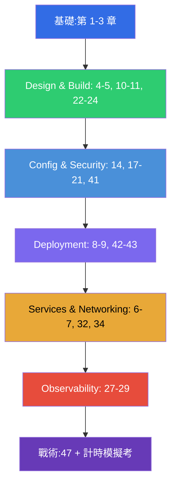

[Русская версия](CKAD_RU.md) · [Eng version](CKAD.md) · [Versión en español](CKAD_ES.md) · [Version française](CKAD_FR.md) · [Deutsche Version](CKAD_DE.md) · [ქართული ვერსია](CKAD_GE.md) · [日本語版](CKAD_JP.md)

# CKAD 備考指南

[← 課程目錄](README_TW.md) · [CKA 指南](CKA_TW.md)

本檔案是專門針對 **CKAD (Certified Kubernetes Application Developer)** 考試的備考路線。
本課程是聯合課程 (CKA + CKAD),這裡只收錄 CKAD 所需的章節與實驗,並按照官方考試領域
及其權重進行編排。

> **考試形式。** 實作型,2 小時,在真實叢集中完成約 15-20 道題目,及格分數
> 為 66%,Kubernetes v1.35。重點在於應用程式,而不是叢集管理。
> 詳細戰術請見[第 47 章](47/tw.md)。

## 從哪裡開始 (適合所有人的基礎)

如果你在網路、DNS、TLS 和容器方面的基礎還不夠穩固 - 請從選修的
**第 0 部分**開始 (特別是[0.4 關於容器](00-4-containers/tw.md) - CKAD 的基石):

- [0.1. 網路:IP、通訊埠、CIDR、NAT](00-1-net/tw.md)
- [0.2. DNS:名稱如何變成位址](00-2-dns/tw.md)
- [0.3. TLS 與憑證:HTTPS、金鑰、CA](00-3-tls/tw.md)
- [0.4. 容器與 Docker:映像、層、registry、runtime](00-4-containers/tw.md)
- [0.5. Linux 與節點工具:SSH、sudo、systemd、日誌](00-5-linux/tw.md)
- [0.6. YAML:縮排、清單、字典、manifest](00-6-yaml/tw.md) - **對 CKAD 很重要** (每個 manifest 都會用到)
- [0.7. 底層的 Linux 網路:network namespaces、veth、路由](00-7-netns/tw.md)
- [0.8. 15 分鐘上手 vim:活下來並針對 YAML 進行設定](00-8-vim/tw.md) - **對 CKAD 很重要** (快速編輯 manifest)

接下來是課程的基礎部分:

1. [導論:Kubernetes、各項考試、課程結構](01/tw.md)
2. [Kubernetes 架構:control plane 與 worker 節點](02/tw.md) - 用於建立整體理解
3. [使用 kubectl:命令式與宣告式方法](03/tw.md) - **對速度至關重要**

## CKAD 領域與對應章節

### 🔵 Application Environment, Configuration and Security — 25% (權重最高)

- [14. 資源:requests、limits、LimitRange、ResourceQuota](14/tw.md)
- [17. 命令、引數與環境變數](17/tw.md)
- [18. ConfigMap](18/tw.md)
- [19. Secret](19/tw.md)
- [20. SecurityContext 與 capabilities](20/tw.md)
- [21. ServiceAccount;認證、授權、admission](21/tw.md)
- [41. CRD 與 operator](41/tw.md) - 「擴充 Kubernetes 的資源」

### 🟢 Application Design and Build — 20%

- [4. Pod:生命週期、建立與設定](04/tw.md)
- [5. ReplicaSet 與 Deployment](05/tw.md)
- [10. Jobs 與 CronJobs](10/tw.md)
- [11. DaemonSet 與 StatefulSet](11/tw.md)
- [22. Multi-container Pod:sidecar、adapter、ambassador、init](22/tw.md)
- [23. 容器映像:建置、Dockerfile、最佳化](23/tw.md)
- [24. 應用程式的卷:emptyDir 與臨時卷](24/tw.md)

### 🟣 Application Deployment — 20%

- [8. Deployment:rolling update 與 rollback](08/tw.md)
- [9. 部署策略:blue/green 與 canary](09/tw.md)
- [42. Helm](42/tw.md)
- [43. Kustomize](43/tw.md)

### 🟠 Services and Networking — 20%

- [6. Namespaces、標籤、選擇器與註解](06/tw.md)
- [7. Services:ClusterIP、NodePort、LoadBalancer、Endpoints](07/tw.md)
- [32. Ingress 與 Ingress 控制器](32/tw.md)
- [34. NetworkPolicy](34/tw.md)

### 🔴 Application Observability and Maintenance — 15%

- [27. 狀態檢查:liveness、readiness、startup probes](27/tw.md)
- [28. 日誌與監控:logs、metrics-server、kubectl top](28/tw.md)
- [29. 應用程式除錯與 API 淘汰](29/tw.md)

## 考前準備

- [47. CKAD 考試:形式、時間管理、JSONPath 與 kubectl 生產力](47/tw.md)

## CKAD 不需要的內容 (與 CKA 的差別)

課程中的這些主題屬於管理範疇,CKAD 不會考 (但對理解仍有幫助):kubeadm 安裝 (35)、
叢集升級 (36)、etcd 備份 (37)、深入 RBAC (38)、憑證/CSR (39)、CNI/CSI/CRI (40)、
control plane 與節點的 troubleshooting (45)。
對架構 (第 2 章) 與除錯 (44、46) 有基本理解仍然是有益的。

## 實驗

實驗 (`tasks/cka/labs`,編號從 101 開始) 把幾個相鄰主題合併成一次
實作練習。所有題目都以考試風格編寫,並帶有自動檢查
`check_result`。實驗與 CKAD 領域的對應關係:

| CKAD 領域 | 實驗 |
|------------|------|
| 🔵 Application Environment, Configuration and Security — 25% | [105](../labs/105/README_TW.MD) (ConfigMap/Secret/env)、[106](../labs/106/README_TW.MD) (SecurityContext)、[104](../labs/104/README_TW.MD) (資源/配額)、[113](../labs/113/README_TW.MD) (ServiceAccount)、[121](../labs/121/README_TW.MD) (RBAC 快練)、[115](../labs/115/README_TW.MD) (CRD) |
| 🟢 Application Design and Build — 20% | [101](../labs/101/README_TW.MD) (Pod/Deployment)、[103](../labs/103/README_TW.MD) (Jobs/CronJob)、[107](../labs/107/README_TW.MD) (multi-container/映像/卷) |
| 🟣 Application Deployment — 20% | [102](../labs/102/README_TW.MD) (rolling update/canary/blue-green)、[115](../labs/115/README_TW.MD) (Helm/Kustomize) |
| 🟠 Services and Networking — 20% | [101](../labs/101/README_TW.MD) (Service)、[110](../labs/110/README_TW.MD) (Ingress/NetworkPolicy)、[125](../labs/125/README_TW.MD) (DNS/CoreDNS)、[120](../labs/120/README_TW.MD) (networking 快練) |
| 🔴 Application Observability and Maintenance — 15% | [109](../labs/109/README_TW.MD) (probes/日誌/除錯/deprecations)、[119](../labs/119/README_TW.MD) (速度快練 + JSONPath) |

- 🧪 [tasks/cka/labs](../labs) - 所有實驗的目錄
- 🧪 [tasks/ckad/mock](../../ckad/mock) - 計時的 CKAD 模擬考

## 建議的 CKAD 備考順序

CKAD 考的是操作應用程式的速度。請把命令式產生 manifest (第 3 章) 與 JSONPath
(第 47 章) 練到成為本能,然後用計時的模擬考來鞏固。
