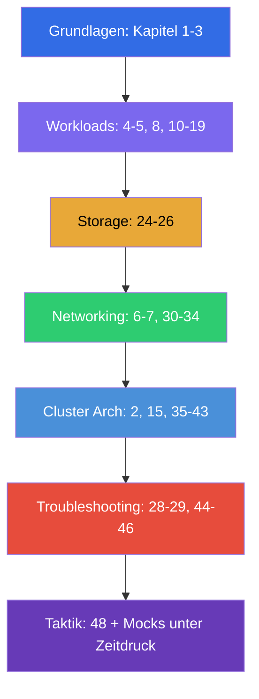

[Русская версия](CKA_RU.md) · [Eng version](CKA.md) · [Versión en español](CKA_ES.md) · [Version française](CKA_FR.md) · [ქართული ვერსია](CKA_GE.md) · [繁體中文版](CKA_TW.md) · [日本語版](CKA_JP.md)

# Wegweiser zur Vorbereitung auf CKA

[← Kursinhalt](README_DE.md) · [Wegweiser CKAD](CKAD_DE.md)

Diese Datei ist die Route der Vorbereitung genau auf die Prüfung **CKA (Certified Kubernetes
Administrator)**. Der Kurs ist gemeinsam (CKA + CKAD), und hier sind nur die Kapitel und Labs
gesammelt, die für CKA nötig sind, geordnet nach den offiziellen Domänen der Prüfung mit ihren Gewichten.

> **Prüfungsformat.** Praktisch, 2 Stunden, ~15-20 Aufgaben in einem laufenden Cluster,
> Bestehensgrenze 66%, Kubernetes v1.35. Viel Arbeit auf den Nodes per SSH. Ausführliche Taktik - in
> [Kapitel 48](48/de.md).

## Wo anfangen (Grundlagen für alle)

Wenn die Basis zu Netzwerken, DNS, TLS und Containern noch wackelig ist - beginnen Sie mit dem
optionalen **Teil 0** (ohne ihn liest sich der restliche Kurs schwerer):

- [0.1. Netzwerk: IP, Ports, CIDR, NAT](00-1-net/de.md)
- [0.2. DNS: wie Namen zu Adressen werden](00-2-dns/de.md)
- [0.3. TLS und Zertifikate: HTTPS, Schlüssel, CA](00-3-tls/de.md)
- [0.4. Container und Docker: Images, Layer, Registries, Runtime](00-4-containers/de.md)
- [0.5. Linux und Node-Werkzeuge: SSH, sudo, systemd, Logs](00-5-linux/de.md) - **wichtig für CKA** (Node-Labs)
- [0.6. YAML: Einrückung, Listen, Wörterbücher, Manifeste](00-6-yaml/de.md)
- [0.7. Linux-Netzwerk unter der Haube: network namespaces, veth, Routen](00-7-netns/de.md)
- [0.8. vim in 15 Minuten: überleben und für YAML einrichten](00-8-vim/de.md) - **wichtig für CKA** (Bearbeiten von Manifesten auf den Nodes per SSH)

Weiter - das Fundament des Kurses, arbeiten Sie diese Kapitel unabhängig von der Prüfung als erste durch:

1. [Einführung: Kubernetes, die Prüfungen und der Aufbau des Kurses](01/de.md)
2. [Architektur von Kubernetes: Control Plane und Worker-Knoten](02/de.md) - **Kern für CKA**
3. [Arbeiten mit kubectl: der imperative und der deklarative Ansatz](03/de.md)

## Domänen von CKA und Kapitel

### 🔴 Troubleshooting — 30% (am gewichtigsten)

Das größte Gewicht - investieren Sie hier ein Drittel der Zeit.

- [28. Logging und Monitoring: logs, metrics-server, kubectl top](28/de.md)
- [29. Debuggen von Anwendungen und Veralten von APIs](29/de.md)
- [44. Debugging von Anwendungsfehlern](44/de.md)
- [45. Debugging der Control Plane und der Worker-Nodes](45/de.md)
- [46. Debugging von Services und Netzwerk](46/de.md)

### 🔵 Cluster Architecture, Installation & Configuration — 25%

- [2. Architektur von Kubernetes](02/de.md)
- [15. Static Pods, PriorityClass und mehrere Scheduler](15/de.md)
- [35. Installation eines Clusters mit kubeadm](35/de.md)
- [35A. Hochverfügbarkeit (HA): mehrere Control-Plane-Nodes, etcd-Topologien, Load Balancer](35-2-ha/de.md)
- [35B. Cluster-Design und Sizing: Infrastruktur, Topologie, IaC](35-3-design/de.md)
- [36. Upgrade des Clusters (lifecycle)](36/de.md)
- [37. Backup und Wiederherstellung von etcd](37/de.md)
- [38. RBAC: Role, ClusterRole und bindings](38/de.md)
- [39. TLS-Zertifikate, kubeconfig und CSR API](39/de.md)
- [40. Erweiterungsschnittstellen: CNI, CSI, CRI](40/de.md)
- [41. CRD und Operatoren](41/de.md)
- [42. Helm](42/de.md)
- [43. Kustomize](43/de.md)

### 🟢 Services & Networking — 20%

- [6. Namespaces, Labels, Selektoren und Annotations](06/de.md)
- [7. Services: ClusterIP, NodePort, LoadBalancer, Endpoints](07/de.md)
- [30. Das Netzwerkmodell von Kubernetes, Pod-Netz und CNI](30/de.md)
- [31. Service von innen, DNS und CoreDNS](31/de.md)
- [32. Ingress und Ingress-Controller](32/de.md)
- [33. Gateway API](33/de.md)
- [34. NetworkPolicy](34/de.md)

### 🟣 Workloads & Scheduling — 15%

- [4. Pods: Lebenszyklus, Erstellung und Konfiguration](04/de.md)
- [5. ReplicaSet und Deployment](05/de.md)
- [8. Deployment: rolling update und rollback](08/de.md)
- [10. Jobs und CronJobs](10/de.md)
- [11. DaemonSet und StatefulSet](11/de.md)
- [12. Planung von Pods: nodeName, nodeSelector, affinity](12/de.md)
- [13. Taints und tolerations](13/de.md)
- [14. Ressourcen: requests, limits, LimitRange, ResourceQuota](14/de.md)
- [16. Autoscaling von Lasten: HPA](16/de.md)
- [17. Befehle, Argumente und Umgebungsvariablen](17/de.md)
- [18. ConfigMap](18/de.md) · [19. Secret](19/de.md)
- [20. SecurityContext und capabilities](20/de.md) · [21. ServiceAccount; Authentifizierung, Autorisierung, Admission](21/de.md)

### 🟠 Storage — 10%

- [24. Volumes für Anwendungen: emptyDir und ephemere Volumes](24/de.md)
- [25. Volumes, PersistentVolume und PersistentVolumeClaim](25/de.md)
- [26. StorageClass, dynamisches Provisioning, Speicher im StatefulSet](26/de.md)

## Prüfungsvorbereitung

- [48. Prüfung CKA: Format, Zeitmanagement und Strategie](48/de.md)
- [47. Prüfung CKAD: Produktivität von kubectl und JSONPath](47/de.md) - die allgemeinen Techniken
  für Geschwindigkeit sind auch für CKA nützlich

## Laborübungen

Die Labs (`tasks/cka/labs`, Nummerierung ab 101) fassen mehrere benachbarte Themen zu einer
praktischen Arbeit zusammen. Alle Aufgaben sind im Prüfungsstil gestaltet, mit automatischer Prüfung
`check_result`. Zuordnung der Labs zu den Domänen von CKA:

| Domäne CKA | Labs |
|-----------|------|
| 🔴 Troubleshooting — 30% | [114](../labs/114/README_DE.MD) (kaputte Ressourcen), [117](../labs/117/README_DE.MD) (control plane/kubelet/static pod), [118](../labs/118/README_DE.MD) (Zertifikate/CoreDNS/Netzwerk), [109](../labs/109/README_DE.MD) (Probes/Logs/Debugging), [111](../labs/111/README_DE.MD)/[112](../labs/112/README_DE.MD) (control plane/etcd) |
| 🔵 Cluster Architecture, Installation & Configuration — 25% | [116](../labs/116/README_DE.MD) (kubeadm init+join von Null), [124](../labs/124/README_DE.MD) (HA control plane), [111](../labs/111/README_DE.MD) (kubeadm upgrade), [112](../labs/112/README_DE.MD) (etcd backup/restore), [113](../labs/113/README_DE.MD) (RBAC/CSR), [121](../labs/121/README_DE.MD) (RBAC-Drills), [118](../labs/118/README_DE.MD) (Zertifikate/CNI), [123](../labs/123/README_DE.MD) (Installation von CNI von Null), [115](../labs/115/README_DE.MD) (CRD/Helm/Kustomize), [104](../labs/104/README_DE.MD) (static pod) |
| 🟢 Services & Networking — 20% | [101](../labs/101/README_DE.MD) (Service), [110](../labs/110/README_DE.MD) (DNS, Ingress, Gateway API + Migration, NetworkPolicy), [125](../labs/125/README_DE.MD) (DNS/CoreDNS), [120](../labs/120/README_DE.MD) (Networking-Drills), [118](../labs/118/README_DE.MD) (CoreDNS/Netzwerk), [123](../labs/123/README_DE.MD) (Installation von CNI von Null) |
| 🟣 Workloads & Scheduling — 15% | [101](../labs/101/README_DE.MD) (Deployment), [102](../labs/102/README_DE.MD) (Updates/Strategien), [103](../labs/103/README_DE.MD) (Jobs/CronJob/DaemonSet), [104](../labs/104/README_DE.MD) (Scheduling/HPA), [122](../labs/122/README_DE.MD) (Scheduling-Drills), [105](../labs/105/README_DE.MD) (ConfigMap/Secret), [106](../labs/106/README_DE.MD) (SecurityContext), [119](../labs/119/README_DE.MD) (Drills/JSONPath) |
| 🟠 Storage — 10% | [108](../labs/108/README_DE.MD) (PV/PVC), [107](../labs/107/README_DE.MD) (Volumes) |

- 🧪 [tasks/cka/labs](../labs) - Katalog aller Laborübungen
- 🧪 [tasks/cka/mock](../mock) - CKA-Mock-Prüfungen unter Zeitdruck (Multi-Cluster, SSH, Gewichte der Aufgaben)

## Empfohlene Reihenfolge der Vorbereitung auf CKA

Troubleshooting (44-46) und Cluster Architecture (35-43) - mehr als die Hälfte der Prüfung, deshalb
arbeiten Sie sie gründlich durch und festigen Sie sie unbedingt mit Mock-Prüfungen unter Zeitdruck.
