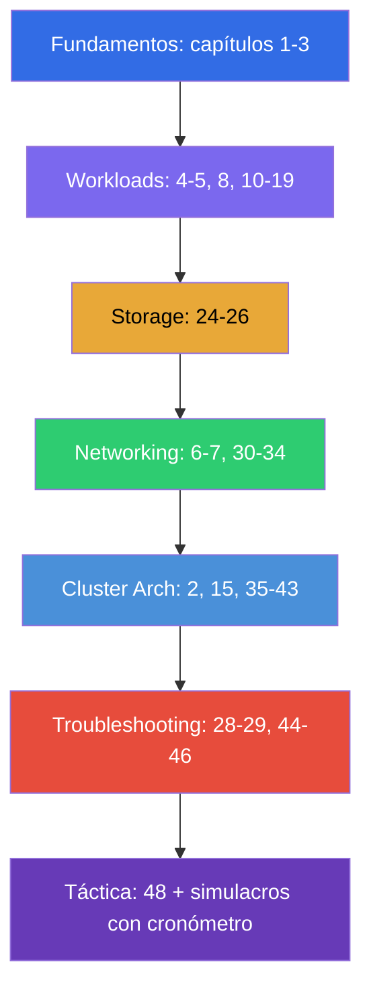

[Русская версия](CKA_RU.md) · [Eng version](CKA.md) · [Version française](CKA_FR.md) · [Deutsche Version](CKA_DE.md) · [ქართული ვერსია](CKA_GE.md)

# Guía de preparación para el CKA

[← Índice del curso](README_ES.md) · [Guía del CKAD](CKAD_ES.md)

Este archivo es la ruta de preparación específica para el examen **CKA (Certified Kubernetes
Administrator)**. El curso es conjunto (CKA + CKAD) y aquí se recogen solo los capítulos y
laboratorios necesarios para el CKA, ordenados por los dominios oficiales del examen y sus pesos.

> **Formato del examen.** Práctico, 2 horas, ~15-20 tareas en un clúster real, nota de
> aprobado 66%, Kubernetes v1.35. Mucho trabajo en los nodos por SSH. La táctica detallada está en
> el [capítulo 48](48/es.md).

## Por dónde empezar (fundamentos para todos)

Si tu base de redes, DNS, TLS y contenedores todavía es frágil, empieza por la opcional
**Parte 0** (sin ella el resto del curso se lee con mucha más dificultad):

- [0.1. Redes: IP, puertos, CIDR, NAT](00-1-net/es.md)
- [0.2. DNS: cómo los nombres se convierten en direcciones](00-2-dns/es.md)
- [0.3. TLS y certificados: HTTPS, claves, CA](00-3-tls/es.md)
- [0.4. Contenedores y Docker: imágenes, capas, registros, runtime](00-4-containers/es.md)
- [0.5. Linux y herramientas del nodo: SSH, sudo, systemd, logs](00-5-linux/es.md) - **importante para el CKA** (laboratorios de nodos)
- [0.6. YAML: indentación, listas, diccionarios, manifiestos](00-6-yaml/es.md)
- [0.7. La red de Linux por dentro: network namespaces, veth, rutas](00-7-netns/es.md)
- [0.8. vim en 15 minutos: sobrevivir y configurarlo para YAML](00-8-vim/es.md) - **importante para el CKA** (editar manifiestos en los nodos por SSH)

Después viene el fundamento del curso: recorre estos capítulos primero, sea cual sea el examen:

1. [Introducción: Kubernetes, los exámenes y la estructura del curso](01/es.md)
2. [Arquitectura de Kubernetes: control plane y nodos worker](02/es.md) - **núcleo para el CKA**
3. [Trabajar con kubectl: enfoques imperativo y declarativo](03/es.md)

## Dominios del CKA y capítulos

### 🔴 Troubleshooting — 30% (el de más peso)

Es el mayor peso: dedícale un tercio de tu tiempo.

- [28. Logging y monitorización: logs, metrics-server, kubectl top](28/es.md)
- [29. Depuración de aplicaciones y obsolescencia de las API](29/es.md)
- [44. Depuración de fallos de aplicaciones](44/es.md)
- [45. Depuración del control plane y de los nodos worker](45/es.md)
- [46. Depuración de servicios y de la red](46/es.md)

### 🔵 Cluster Architecture, Installation & Configuration — 25%

- [2. Arquitectura de Kubernetes](02/es.md)
- [15. Static Pods, PriorityClass y varios planificadores](15/es.md)
- [35. Instalación del clúster con kubeadm](35/es.md)
- [35A. Alta disponibilidad (HA): varios nodos de control plane, topologías de etcd, balanceador](35-2-ha/es.md)
- [35B. Diseño y sizing del clúster: infraestructura, topología, IaC](35-3-design/es.md)
- [36. Actualización del clúster (lifecycle)](36/es.md)
- [37. Backup y restauración de etcd](37/es.md)
- [38. RBAC: Role, ClusterRole y bindings](38/es.md)
- [39. Certificados TLS, kubeconfig y la CSR API](39/es.md)
- [40. Interfaces de extensión: CNI, CSI, CRI](40/es.md)
- [41. CRD y operadores](41/es.md)
- [42. Helm](42/es.md)
- [43. Kustomize](43/es.md)

### 🟢 Services & Networking — 20%

- [6. Namespaces, labels, selectors y annotations](06/es.md)
- [7. Services: ClusterIP, NodePort, LoadBalancer, Endpoints](07/es.md)
- [30. El modelo de red de Kubernetes, la red de pods y la CNI](30/es.md)
- [31. Service por dentro, DNS y CoreDNS](31/es.md)
- [32. Ingress y controladores Ingress](32/es.md)
- [33. Gateway API](33/es.md)
- [34. NetworkPolicy](34/es.md)

### 🟣 Workloads & Scheduling — 15%

- [4. Pods: ciclo de vida, creación y configuración](04/es.md)
- [5. ReplicaSet y Deployment](05/es.md)
- [8. Deployment: rolling update y rollback](08/es.md)
- [10. Jobs y CronJobs](10/es.md)
- [11. DaemonSet y StatefulSet](11/es.md)
- [12. Planificación de Pods: nodeName, nodeSelector, affinity](12/es.md)
- [13. Taints y tolerations](13/es.md)
- [14. Recursos: requests, limits, LimitRange, ResourceQuota](14/es.md)
- [16. Autoescalado de cargas: HPA](16/es.md)
- [17. Comandos, argumentos y variables de entorno](17/es.md)
- [18. ConfigMap](18/es.md) · [19. Secret](19/es.md)
- [20. SecurityContext y capabilities](20/es.md) · [21. ServiceAccount; autenticación, autorización, admission](21/es.md)

### 🟠 Storage — 10%

- [24. Volúmenes para aplicaciones: emptyDir y volúmenes efímeros](24/es.md)
- [25. Volumes, PersistentVolume y PersistentVolumeClaim](25/es.md)
- [26. StorageClass, aprovisionamiento dinámico y almacenamiento en StatefulSet](26/es.md)

## Preparación para el examen

- [48. Examen CKA: formato, gestión del tiempo y estrategia](48/es.md)
- [47. Examen CKAD: productividad con kubectl y JSONPath](47/es.md) - los trucos generales de
  velocidad también sirven para el CKA

## Laboratorios

Los laboratorios (`tasks/cka/labs`, numerados desde 101) reúnen varios temas afines en un único
trabajo práctico. Todas las tareas están planteadas en estilo de examen con autoverificación
`check_result`. Correspondencia de los laboratorios con los dominios del CKA:

| Dominio CKA | Laboratorios |
|-----------|------|
| 🔴 Troubleshooting — 30% | [114](../labs/114/README_ES.MD) (recursos rotos), [117](../labs/117/README_ES.MD) (control plane/kubelet/static pod), [118](../labs/118/README_ES.MD) (certificados/CoreDNS/red), [109](../labs/109/README_ES.MD) (probes/logs/depuración), [111](../labs/111/README_ES.MD)/[112](../labs/112/README_ES.MD) (control plane/etcd) |
| 🔵 Cluster Architecture, Installation & Configuration — 25% | [116](../labs/116/README_ES.MD) (kubeadm init+join desde cero), [124](../labs/124/README_ES.MD) (HA control plane), [111](../labs/111/README_ES.MD) (kubeadm upgrade), [112](../labs/112/README_ES.MD) (etcd backup/restore), [113](../labs/113/README_ES.MD) (RBAC/CSR), [121](../labs/121/README_ES.MD) (drills de RBAC), [118](../labs/118/README_ES.MD) (certificados/CNI), [123](../labs/123/README_ES.MD) (instalación de CNI desde cero), [115](../labs/115/README_ES.MD) (CRD/Helm/Kustomize), [104](../labs/104/README_ES.MD) (static pod) |
| 🟢 Services & Networking — 20% | [101](../labs/101/README_ES.MD) (Service), [110](../labs/110/README_ES.MD) (DNS, Ingress, Gateway API + migración, NetworkPolicy), [125](../labs/125/README_ES.MD) (DNS/CoreDNS), [120](../labs/120/README_ES.MD) (drills de red), [118](../labs/118/README_ES.MD) (CoreDNS/red), [123](../labs/123/README_ES.MD) (instalación de CNI desde cero) |
| 🟣 Workloads & Scheduling — 15% | [101](../labs/101/README_ES.MD) (Deployment), [102](../labs/102/README_ES.MD) (actualizaciones/estrategias), [103](../labs/103/README_ES.MD) (Jobs/CronJob/DaemonSet), [104](../labs/104/README_ES.MD) (planificación/HPA), [122](../labs/122/README_ES.MD) (drills de planificación), [105](../labs/105/README_ES.MD) (ConfigMap/Secret), [106](../labs/106/README_ES.MD) (SecurityContext), [119](../labs/119/README_ES.MD) (drills/JSONPath) |
| 🟠 Storage — 10% | [108](../labs/108/README_ES.MD) (PV/PVC), [107](../labs/107/README_ES.MD) (volúmenes) |

- 🧪 [tasks/cka/labs](../labs) - catálogo de todos los laboratorios
- 🧪 [tasks/cka/mock](../mock) - exámenes de simulación del CKA con cronómetro (multiclúster, SSH, pesos de las tareas)

## Orden recomendado de preparación para el CKA

Troubleshooting (44-46) y Cluster Architecture (35-43) son más de la mitad del examen, así que
recórrelos a fondo y consolídalos sin falta con simulacros de examen con cronómetro.
