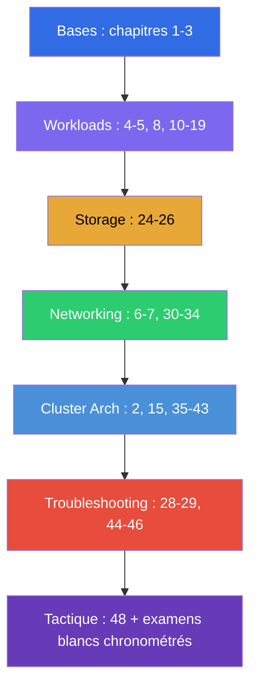

[Русская версия](CKA_RU.md) · [Eng version](CKA.md) · [Versión en español](CKA_ES.md) · [Deutsche Version](CKA_DE.md) · [ქართული ვერსია](CKA_GE.md)

# Guide de préparation au CKA

[← Sommaire du cours](README_FR.md) · [Guide CKAD](CKAD_FR.md)

Ce fichier est l'itinéraire de préparation à l'examen **CKA (Certified Kubernetes
Administrator)** précisément. Le cours est commun (CKA + CKAD), et seuls les chapitres et les TP
nécessaires au CKA sont rassemblés ici, répartis par domaines officiels de l'examen avec leurs poids.

> **Format de l'examen.** Pratique, 2 heures, ~15-20 tâches dans un cluster réel, score de
> réussite 66%, Kubernetes v1.35. Beaucoup de travail sur les nœuds en SSH. Tactique détaillée - dans
> le [chapitre 48](48/fr.md).

## Par où commencer (les bases pour tous)

Si vos bases en réseaux, DNS, TLS et conteneurs sont encore fragiles - commencez par la
**Partie 0** facultative (sans elle, le reste du cours se lit plus difficilement) :

- [0.1. Les réseaux : IP, ports, CIDR, NAT](00-1-net/fr.md)
- [0.2. Le DNS : comment les noms se transforment en adresses](00-2-dns/fr.md)
- [0.3. TLS et certificats : HTTPS, clés, CA](00-3-tls/fr.md)
- [0.4. Conteneurs et Docker : images, couches, registres, runtime](00-4-containers/fr.md)
- [0.5. Linux et les outils du nœud : SSH, sudo, systemd, logs](00-5-linux/fr.md) - **important pour le CKA** (TP sur les nœuds)
- [0.6. YAML : indentation, listes, dictionnaires, manifestes](00-6-yaml/fr.md)
- [0.7. Le réseau Linux sous le capot : network namespaces, veth, routes](00-7-netns/fr.md)
- [0.8. vim en 15 minutes : survivre et le régler pour YAML](00-8-vim/fr.md) - **important pour le CKA** (édition des manifestes sur les nœuds en SSH)

Ensuite - la fondation du cours, parcourez ces chapitres en premier, quel que soit l'examen :

1. [Introduction : Kubernetes, les examens, la structure du cours](01/fr.md)
2. [Architecture de Kubernetes : control plane et nœuds worker](02/fr.md) - **le noyau pour le CKA**
3. [Travailler avec kubectl : approches impérative et déclarative](03/fr.md)

## Domaines du CKA et chapitres

### 🔴 Troubleshooting — 30% (le plus lourd)

Le poids le plus élevé - consacrez-y un tiers de votre temps.

- [28. Logging et monitoring : logs, metrics-server, kubectl top](28/fr.md)
- [29. Débogage des applications et dépréciation des API](29/fr.md)
- [44. Déboguer les pannes d'applications](44/fr.md)
- [45. Déboguer le control plane et les nœuds worker](45/fr.md)
- [46. Déboguer les services et le réseau](46/fr.md)

### 🔵 Cluster Architecture, Installation & Configuration — 25%

- [2. Architecture de Kubernetes](02/fr.md)
- [15. Static Pods, PriorityClass et planificateurs multiples](15/fr.md)
- [35. Installation d'un cluster avec kubeadm](35/fr.md)
- [35A. Haute disponibilité (HA) : plusieurs nœuds control plane, topologies etcd, répartiteur de charge](35-2-ha/fr.md)
- [35B. Conception et dimensionnement du cluster : infrastructure, topologie, IaC](35-3-design/fr.md)
- [36. Mise à jour du cluster (lifecycle)](36/fr.md)
- [37. Sauvegarde et restauration d'etcd](37/fr.md)
- [38. RBAC : Role, ClusterRole et bindings](38/fr.md)
- [39. Certificats TLS, kubeconfig et l'API CSR](39/fr.md)
- [40. Interfaces d'extension : CNI, CSI, CRI](40/fr.md)
- [41. CRD et opérateurs](41/fr.md)
- [42. Helm](42/fr.md)
- [43. Kustomize](43/fr.md)

### 🟢 Services & Networking — 20%

- [6. Namespaces, labels, selectors et annotations](06/fr.md)
- [7. Services : ClusterIP, NodePort, LoadBalancer, Endpoints](07/fr.md)
- [30. Le modèle réseau de Kubernetes, le réseau des pods et le CNI](30/fr.md)
- [31. Le Service de l'intérieur, le DNS et CoreDNS](31/fr.md)
- [32. Ingress et contrôleurs Ingress](32/fr.md)
- [33. Gateway API](33/fr.md)
- [34. NetworkPolicy](34/fr.md)

### 🟣 Workloads & Scheduling — 15%

- [4. Les pods : cycle de vie, création et configuration](04/fr.md)
- [5. ReplicaSet et Deployment](05/fr.md)
- [8. Deployment : rolling update et rollback](08/fr.md)
- [10. Jobs et CronJobs](10/fr.md)
- [11. DaemonSet et StatefulSet](11/fr.md)
- [12. Planification des Pods : nodeName, nodeSelector, affinity](12/fr.md)
- [13. Taints et tolerations](13/fr.md)
- [14. Ressources : requests, limits, LimitRange, ResourceQuota](14/fr.md)
- [16. Autoscaling des charges de travail : HPA](16/fr.md)
- [17. Commandes, arguments et variables d'environnement](17/fr.md)
- [18. ConfigMap](18/fr.md) · [19. Secret](19/fr.md)
- [20. SecurityContext et capabilities](20/fr.md) · [21. ServiceAccount ; authentification, autorisation, admission](21/fr.md)

### 🟠 Storage — 10%

- [24. Volumes pour les applications : emptyDir et volumes éphémères](24/fr.md)
- [25. Volumes, PersistentVolume et PersistentVolumeClaim](25/fr.md)
- [26. StorageClass, provisionnement dynamique, stockage dans un StatefulSet](26/fr.md)

## Préparation à l'examen

- [48. L'examen CKA : format, gestion du temps et stratégie](48/fr.md)
- [47. L'examen CKAD : productivité kubectl et JSONPath](47/fr.md) - les techniques générales de
  vitesse sont utiles aussi pour le CKA

## Travaux pratiques

Les TP (`tasks/cka/labs`, numérotés à partir de 101) réunissent plusieurs sujets voisins en un
seul travail pratique. Toutes les tâches sont formulées comme à l'examen, avec
l'autovérification `check_result`. Correspondance des TP avec les domaines du CKA :

| Domaine CKA | TP |
|-----------|------|
| 🔴 Troubleshooting — 30% | [114](../labs/114/README_FR.MD) (ressources cassées), [117](../labs/117/README_FR.MD) (control plane/kubelet/static pod), [118](../labs/118/README_FR.MD) (certificats/CoreDNS/réseau), [109](../labs/109/README_FR.MD) (probes/logs/débogage), [111](../labs/111/README_FR.MD)/[112](../labs/112/README_FR.MD) (control plane/etcd) |
| 🔵 Cluster Architecture, Installation & Configuration — 25% | [116](../labs/116/README_FR.MD) (kubeadm init+join de zéro), [124](../labs/124/README_FR.MD) (HA control plane), [111](../labs/111/README_FR.MD) (kubeadm upgrade), [112](../labs/112/README_FR.MD) (etcd backup/restore), [113](../labs/113/README_FR.MD) (RBAC/CSR), [121](../labs/121/README_FR.MD) (drills RBAC), [118](../labs/118/README_FR.MD) (certificats/CNI), [123](../labs/123/README_FR.MD) (installation du CNI depuis zéro), [115](../labs/115/README_FR.MD) (CRD/Helm/Kustomize), [104](../labs/104/README_FR.MD) (static pod) |
| 🟢 Services & Networking — 20% | [101](../labs/101/README_FR.MD) (Service), [110](../labs/110/README_FR.MD) (DNS, Ingress, Gateway API + migration, NetworkPolicy), [125](../labs/125/README_FR.MD) (DNS/CoreDNS), [120](../labs/120/README_FR.MD) (drills networking), [118](../labs/118/README_FR.MD) (CoreDNS/réseau), [123](../labs/123/README_FR.MD) (installation du CNI depuis zéro) |
| 🟣 Workloads & Scheduling — 15% | [101](../labs/101/README_FR.MD) (Deployment), [102](../labs/102/README_FR.MD) (mises à jour/stratégies), [103](../labs/103/README_FR.MD) (Jobs/CronJob/DaemonSet), [104](../labs/104/README_FR.MD) (planification/HPA), [122](../labs/122/README_FR.MD) (drills scheduling), [105](../labs/105/README_FR.MD) (ConfigMap/Secret), [106](../labs/106/README_FR.MD) (SecurityContext), [119](../labs/119/README_FR.MD) (drills/JSONPath) |
| 🟠 Storage — 10% | [108](../labs/108/README_FR.MD) (PV/PVC), [107](../labs/107/README_FR.MD) (volumes) |

- 🧪 [tasks/cka/labs](../labs) - catalogue de tous les travaux pratiques
- 🧪 [tasks/cka/mock](../mock) - examens blancs CKA chronométrés (multicluster, SSH, poids des tâches)

## Ordre de préparation recommandé pour le CKA

Le troubleshooting (44-46) et Cluster Architecture (35-43) - plus de la moitié de l'examen, alors
parcourez-les à fond et consolidez impérativement avec des examens blancs chronométrés.
