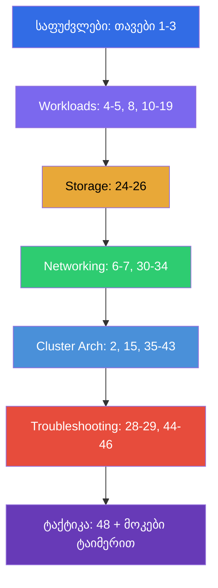

[Русская версия](CKA_RU.md) · [Eng version](CKA.md) · [Versión en español](CKA_ES.md) · [Version française](CKA_FR.md) · [Deutsche Version](CKA_DE.md)

# CKA-სთვის მომზადების გზამკვლევი

[← კურსის სარჩევი](README_GE.md) · [CKAD-ის გზამკვლევი](CKAD_GE.md)

ეს ფაილი - სწორედ **CKA (Certified Kubernetes Administrator)** გამოცდისთვის მომზადების მარშრუტია.
კურსი ერთობლივია (CKA + CKAD), და აქ შეკრებილია მხოლოდ CKA-სთვის საჭირო თავები და ლაბები, დალაგებული გამოცდის ოფიციალური დომენების მიხედვით მათი წონებით.

> **გამოცდის ფორმატი.** პრაქტიკული, 2 საათი, ~15-20 დავალება ცოცხალ კლასტერში, გამსვლელი
> ქულა 66%, Kubernetes v1.35. ბევრი სამუშაო ნოდებზე SSH-ით. დეტალური ტაქტიკა -
> [თავ 48-ში](48/ge.md).

## საიდან დაიწყოთ (საფუძვლები ყველასთვის)

თუ ქსელების, DNS-ის, TLS-ისა და კონტეინერების ბაზა ჯერ სუსტია - დაიწყეთ არასავალდებულო
**ნაწილი 0**-დან (მის გარეშე დანარჩენი კურსი უფრო რთულად იკითხება):

- [0.1. ქსელი: IP, პორტები, CIDR, NAT](00-1-net/ge.md)
- [0.2. DNS: როგორ იქცევა სახელები მისამართებად](00-2-dns/ge.md)
- [0.3. TLS და სერტიფიკატები: HTTPS, გასაღებები, CA](00-3-tls/ge.md)
- [0.4. კონტეინერები და Docker: იმიჯები, შრეები, რეესტრები, runtime](00-4-containers/ge.md)
- [0.5. Linux და ნოდის ხელსაწყოები: SSH, sudo, systemd, ლოგები](00-5-linux/ge.md) - **მნიშვნელოვანია CKA-სთვის** (ნოდების ლაბები)
- [0.6. YAML: აცილება, სიები, ლექსიკონები, მანიფესტები](00-6-yaml/ge.md)
- [0.7. Linux-ქსელი კაპოტის ქვეშ: network namespaces, veth, მარშრუტები](00-7-netns/ge.md)
- [0.8. vim 15 წუთში: გადარჩი და მოირგე YAML-ისთვის](00-8-vim/ge.md) - **მნიშვნელოვანია CKA-სთვის** (მანიფესტების რედაქტირება ნოდებზე SSH-ით)

შემდეგ - კურსის საფუძველი, ეს თავები გაიარეთ პირველად, გამოცდის მიუხედავად:

1. [შესავალი: Kubernetes, გამოცდები, კურსის აგებულება](01/ge.md)
2. [Kubernetes-ის არქიტექტურა: control plane და worker-ნოდები](02/ge.md) - **ბირთვი CKA-სთვის**
3. [kubectl-თან მუშაობა: იმპერატიული და დეკლარაციული მიდგომები](03/ge.md)

## CKA-ს დომენები და თავები

### 🔴 Troubleshooting — 30% (ყველაზე წონიანი)

ყველაზე დიდი წონა - ჩადეთ აქ დროის მესამედი.

- [28. ლოგირება და მონიტორინგი: logs, metrics-server, kubectl top](28/ge.md)
- [29. აპლიკაციების გამართვა და API-ს მოძველება](29/ge.md)
- [44. აპლიკაციების ავარიების გამართვა](44/ge.md)
- [45. control plane-ისა და worker-ნოდების გამართვა](45/ge.md)
- [46. სერვისებისა და ქსელის გამართვა](46/ge.md)

### 🔵 Cluster Architecture, Installation & Configuration — 25%

- [2. Kubernetes-ის არქიტექტურა](02/ge.md)
- [15. Static Pods, PriorityClass და რამდენიმე დამგეგმავი](15/ge.md)
- [35. კლასტერის დაყენება kubeadm-ის დახმარებით](35/ge.md)
- [35A. მაღალი ხელმისაწვდომობა (HA): რამდენიმე control-plane, etcd-ტოპოლოგიები, ბალანსერი](35-2-ha/ge.md)
- [35B. კლასტერის დაპროექტება და საიზინგი: ინფრასტრუქტურა, ტოპოლოგია, IaC](35-3-design/ge.md)
- [36. კლასტერის განახლება (lifecycle)](36/ge.md)
- [37. etcd-ს რეზერვული კოპირება და აღდგენა](37/ge.md)
- [38. RBAC: Role, ClusterRole და binding-ები](38/ge.md)
- [39. TLS-სერტიფიკატები, kubeconfig და CSR API](39/ge.md)
- [40. გაფართოების ინტერფეისები: CNI, CSI, CRI](40/ge.md)
- [41. CRD და ოპერატორები](41/ge.md)
- [42. Helm](42/ge.md)
- [43. Kustomize](43/ge.md)

### 🟢 Services & Networking — 20%

- [6. Namespaces, labels, selectors და annotations](06/ge.md)
- [7. Services: ClusterIP, NodePort, LoadBalancer, Endpoints](07/ge.md)
- [30. Kubernetes-ის ქსელური მოდელი, Pod-ების ქსელი და CNI](30/ge.md)
- [31. Service შიგნიდან, DNS და CoreDNS](31/ge.md)
- [32. Ingress და Ingress-კონტროლერები](32/ge.md)
- [33. Gateway API](33/ge.md)
- [34. NetworkPolicy](34/ge.md)

### 🟣 Workloads & Scheduling — 15%

- [4. Pod-ები: სასიცოცხლო ციკლი, შექმნა და კონფიგურირება](04/ge.md)
- [5. ReplicaSet და Deployment](05/ge.md)
- [8. Deployment: rolling update და rollback](08/ge.md)
- [10. Jobs და CronJobs](10/ge.md)
- [11. DaemonSet და StatefulSet](11/ge.md)
- [12. Pod-ების დაგეგმვა: nodeName, nodeSelector, affinity](12/ge.md)
- [13. Taints და tolerations](13/ge.md)
- [14. რესურსები: requests, limits, LimitRange, ResourceQuota](14/ge.md)
- [16. დატვირთვების ავტომასშტაბირება: HPA](16/ge.md)
- [17. ბრძანებები, არგუმენტები და გარემოს ცვლადები](17/ge.md)
- [18. ConfigMap](18/ge.md) · [19. Secret](19/ge.md)
- [20. SecurityContext და capabilities](20/ge.md) · [21. ServiceAccount; ავთენტიფიკაცია, ავტორიზაცია, admission](21/ge.md)

### 🟠 Storage — 10%

- [24. ტომები აპლიკაციებისთვის: emptyDir და ეფემერული ტომები](24/ge.md)
- [25. Volumes, PersistentVolume და PersistentVolumeClaim](25/ge.md)
- [26. StorageClass, დინამიკური პროვიზიონინგი, შენახვა StatefulSet-ში](26/ge.md)

## გამოცდისთვის მომზადება

- [48. CKA გამოცდა: ფორმატი, დროის მართვა და სტრატეგია](48/ge.md)
- [47. CKAD გამოცდა: kubectl-ის პროდუქტიულობა და JSONPath](47/ge.md) - სიჩქარის საერთო ხერხები
  სასარგებლოა CKA-სთვისაც

## ლაბორატორიული სამუშაოები

ლაბები (`tasks/cka/labs`, ნუმერაცია 101-დან) აერთიანებს რამდენიმე მომიჯნავე თემას ერთ პრაქტიკულ
სამუშაოში. ყველა დავალება გაფორმებულია გამოცდის სტილში `check_result` ავტოშემოწმებით. ლაბების შესაბამისობა CKA-ს დომენებთან:

| CKA-ს დომენი | ლაბები |
|-----------|------|
| 🔴 Troubleshooting — 30% | [114](../labs/114/README_GE.MD) (გატეხილი რესურსები), [117](../labs/117/README_GE.MD) (control plane/kubelet/static pod), [118](../labs/118/README_GE.MD) (სერტიფიკატები/CoreDNS/ქსელი), [109](../labs/109/README_GE.MD) (პრობები/ლოგები/გამართვა), [111](../labs/111/README_GE.MD)/[112](../labs/112/README_GE.MD) (control plane/etcd) |
| 🔵 Cluster Architecture, Installation & Configuration — 25% | [116](../labs/116/README_GE.MD) (kubeadm init+join ნულიდან), [124](../labs/124/README_GE.MD) (HA control plane), [111](../labs/111/README_GE.MD) (kubeadm upgrade), [112](../labs/112/README_GE.MD) (etcd backup/restore), [113](../labs/113/README_GE.MD) (RBAC/CSR), [121](../labs/121/README_GE.MD) (RBAC-დრილები), [118](../labs/118/README_GE.MD) (სერტიფიკატები/CNI), [123](../labs/123/README_GE.MD) (CNI-ის ინსტალაცია ნულიდან), [115](../labs/115/README_GE.MD) (CRD/Helm/Kustomize), [104](../labs/104/README_GE.MD) (static pod) |
| 🟢 Services & Networking — 20% | [101](../labs/101/README_GE.MD) (Service), [110](../labs/110/README_GE.MD) (DNS, Ingress, Gateway API + მიგრაცია, NetworkPolicy), [125](../labs/125/README_GE.MD) (DNS/CoreDNS), [120](../labs/120/README_GE.MD) (networking-დრილები), [118](../labs/118/README_GE.MD) (CoreDNS/ქსელი), [123](../labs/123/README_GE.MD) (CNI-ის ინსტალაცია ნულიდან) |
| 🟣 Workloads & Scheduling — 15% | [101](../labs/101/README_GE.MD) (Deployment), [102](../labs/102/README_GE.MD) (განახლებები/სტრატეგიები), [103](../labs/103/README_GE.MD) (Jobs/CronJob/DaemonSet), [104](../labs/104/README_GE.MD) (დაგეგმვა/HPA), [122](../labs/122/README_GE.MD) (scheduling-დრილები), [105](../labs/105/README_GE.MD) (ConfigMap/Secret), [106](../labs/106/README_GE.MD) (SecurityContext), [119](../labs/119/README_GE.MD) (დრილები/JSONPath) |
| 🟠 Storage — 10% | [108](../labs/108/README_GE.MD) (PV/PVC), [107](../labs/107/README_GE.MD) (ტომები) |

- 🧪 [tasks/cka/labs](../labs) - ყველა ლაბორატორიული სამუშაოს კატალოგი
- 🧪 [tasks/cka/mock](../mock) - CKA-ს მოკ-გამოცდები ტაიმერით (მულტიკლასტერი, SSH, დავალებების წონები)

## CKA-სთვის მომზადების რეკომენდებული თანმიმდევრობა

Troubleshooting (44-46) და Cluster Architecture (35-43) - გამოცდის ნახევარზე მეტია, ამიტომ
გაიარეთ ისინი საფუძვლიანად და აუცილებლად განიმტკიცეთ მოკ-გამოცდებით ტაიმერით.
