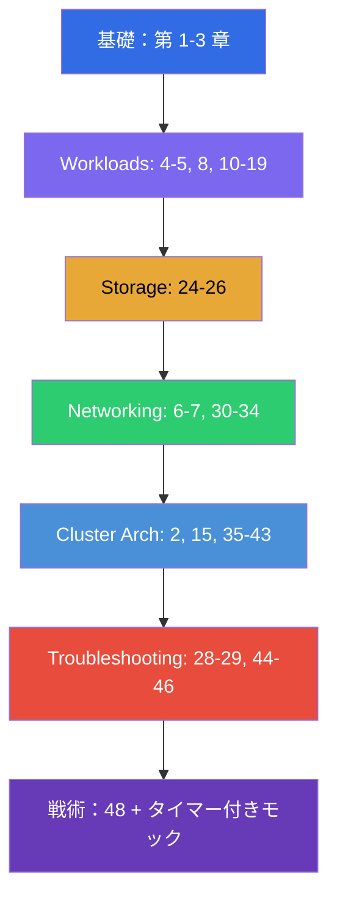

[Русская версия](CKA_RU.md) · [Eng version](CKA.md) · [Versión en español](CKA_ES.md) · [Version française](CKA_FR.md) · [Deutsche Version](CKA_DE.md) · [ქართული ვერსია](CKA_GE.md) · [繁體中文版](CKA_TW.md)

# CKA 準備ガイド

[← コース目次](README_JP.md) · [CKAD ガイド](CKAD_JP.md)

このファイルは、まさに **CKA (Certified Kubernetes Administrator)** 試験のための
準備ルートです。コースは共通（CKA + CKAD）で、ここには CKA に必要な章とラボだけを
集め、公式の試験領域とその重みに沿って並べてあります。

> **試験の形式。** 実技形式、2 時間、実際のクラスタで約 15-20 問、合格ライン
> 66%、Kubernetes v1.35。SSH でノード上で行う作業が多くあります。詳しい戦術は
> [第 48 章](48/jp.md) にあります。

## どこから始めるか（全員向けの基礎）

ネットワーク、DNS、TLS、コンテナの土台がまだ不安なら、任意の
**パート 0** から始めてください（これがないとコースの残りは読みづらくなります）：

- [0.1. ネットワーク：IP、ポート、CIDR、NAT](00-1-net/jp.md)
- [0.2. DNS：名前はどうやってアドレスに変わるか](00-2-dns/jp.md)
- [0.3. TLS と証明書：HTTPS、鍵、CA](00-3-tls/jp.md)
- [0.4. コンテナと Docker：イメージ、レイヤ、レジストリ、runtime](00-4-containers/jp.md)
- [0.5. Linux とノードのツール：SSH、sudo、systemd、ログ](00-5-linux/jp.md) - **CKA には重要**（ノード系のラボ）
- [0.6. YAML：インデント、リスト、辞書、マニフェスト](00-6-yaml/jp.md)
- [0.7. Linux ネットワークの内部：network namespaces、veth、ルート](00-7-netns/jp.md)
- [0.8. 15 分で覚える vim：生き延びて YAML 向けに設定する](00-8-vim/jp.md) - **CKA には重要**（SSH でノード上のマニフェストを編集する）

次はコースの土台です。どの試験を受けるかに関係なく、この章から先に進めてください：

1. [はじめに：Kubernetes、試験、コースの構成](01/jp.md)
2. [Kubernetes のアーキテクチャ：control plane と worker ノード](02/jp.md) - **CKA の中核**
3. [kubectl の使い方：命令的アプローチと宣言的アプローチ](03/jp.md)

## CKA の領域と章

### 🔴 Troubleshooting — 30%（もっとも重い）

重みが最大です - ここに時間の 3 分の 1 を投じてください。

- [28. ロギングと監視：logs、metrics-server、kubectl top](28/jp.md)
- [29. アプリケーションのデバッグと API の廃止](29/jp.md)
- [44. アプリケーション障害のデバッグ](44/jp.md)
- [45. control plane と worker ノードのデバッグ](45/jp.md)
- [46. サービスとネットワークのデバッグ](46/jp.md)

### 🔵 Cluster Architecture, Installation & Configuration — 25%

- [2. Kubernetes のアーキテクチャ](02/jp.md)
- [15. Static Pods、PriorityClass、複数のスケジューラ](15/jp.md)
- [35. kubeadm を使ったクラスタのインストール](35/jp.md)
- [35A. 高可用性（HA）：複数の control-plane、etcd のトポロジ、ロードバランサ](35-2-ha/jp.md)
- [35B. クラスタの設計とサイジング：インフラ、トポロジ、IaC](35-3-design/jp.md)
- [36. クラスタのアップグレード（lifecycle）](36/jp.md)
- [37. etcd のバックアップとリストア](37/jp.md)
- [38. RBAC：Role、ClusterRole と各種 binding](38/jp.md)
- [39. TLS 証明書、kubeconfig と CSR API](39/jp.md)
- [40. 拡張インターフェース：CNI、CSI、CRI](40/jp.md)
- [41. CRD とオペレータ](41/jp.md)
- [42. Helm](42/jp.md)
- [43. Kustomize](43/jp.md)

### 🟢 Services & Networking — 20%

- [6. Namespaces、ラベル、セレクタ、アノテーション](06/jp.md)
- [7. Services：ClusterIP、NodePort、LoadBalancer、Endpoints](07/jp.md)
- [30. Kubernetes のネットワークモデル、Pod のネットワークと CNI](30/jp.md)
- [31. Service の内部、DNS と CoreDNS](31/jp.md)
- [32. Ingress と Ingress コントローラ](32/jp.md)
- [33. Gateway API](33/jp.md)
- [34. NetworkPolicy](34/jp.md)

### 🟣 Workloads & Scheduling — 15%

- [4. Pod：ライフサイクル、作成と設定](04/jp.md)
- [5. ReplicaSet と Deployment](05/jp.md)
- [8. Deployment：rolling update と rollback](08/jp.md)
- [10. Jobs と CronJobs](10/jp.md)
- [11. DaemonSet と StatefulSet](11/jp.md)
- [12. Pod のスケジューリング：nodeName、nodeSelector、affinity](12/jp.md)
- [13. Taints と tolerations](13/jp.md)
- [14. リソース：requests、limits、LimitRange、ResourceQuota](14/jp.md)
- [16. ワークロードのオートスケーリング：HPA](16/jp.md)
- [17. コマンド、引数、環境変数](17/jp.md)
- [18. ConfigMap](18/jp.md) · [19. Secret](19/jp.md)
- [20. SecurityContext と capabilities](20/jp.md) · [21. ServiceAccount、認証と admission](21/jp.md)

### 🟠 Storage — 10%

- [24. アプリケーション向けのボリューム：emptyDir と一時ボリューム](24/jp.md)
- [25. Volumes、PersistentVolume と PersistentVolumeClaim](25/jp.md)
- [26. StorageClass、動的プロビジョニング、StatefulSet でのストレージ](26/jp.md)

## 試験の準備

- [48. CKA 試験：形式、タイムマネジメント、戦略](48/jp.md)
- [47. CKAD 試験：kubectl の生産性と JSONPath](47/jp.md) - 共通のスピードアップの
  テクニックは CKA にも役立ちます

## ラボ

ラボ（`tasks/cka/labs`、番号は 101 から）は、いくつかの隣接するテーマを 1 つの
実習にまとめたものです。すべての課題は試験と同じスタイルで、自動チェック
`check_result` 付きで書かれています。ラボと CKA 領域の対応：

| CKA 領域 | ラボ |
|-----------|------|
| 🔴 Troubleshooting — 30% | [114](../labs/114/README_JP.MD)（壊れたリソース）、[117](../labs/117/README_JP.MD)（control plane/kubelet/static pod）、[118](../labs/118/README_JP.MD)（証明書/CoreDNS/ネットワーク）、[109](../labs/109/README_JP.MD)（プローブ/ログ/デバッグ）、[111](../labs/111/README_JP.MD)/[112](../labs/112/README_JP.MD)（control plane/etcd） |
| 🔵 Cluster Architecture, Installation & Configuration — 25% | [116](../labs/116/README_JP.MD)（ゼロからの kubeadm init+join）、[124](../labs/124/README_JP.MD)（HA control plane）、[111](../labs/111/README_JP.MD)（kubeadm upgrade）、[112](../labs/112/README_JP.MD)（etcd backup/restore）、[113](../labs/113/README_JP.MD)（RBAC/CSR）、[121](../labs/121/README_JP.MD)（RBAC のドリル）、[118](../labs/118/README_JP.MD)（証明書/CNI）、[123](../labs/123/README_JP.MD)（ゼロからの CNI インストール）、[115](../labs/115/README_JP.MD)（CRD/Helm/Kustomize）、[104](../labs/104/README_JP.MD)（static pod） |
| 🟢 Services & Networking — 20% | [101](../labs/101/README_JP.MD)（Service）、[110](../labs/110/README_JP.MD)（DNS、Ingress、Gateway API + 移行、NetworkPolicy）、[125](../labs/125/README_JP.MD)（DNS/CoreDNS）、[120](../labs/120/README_JP.MD)（networking のドリル）、[118](../labs/118/README_JP.MD)（CoreDNS/ネットワーク）、[123](../labs/123/README_JP.MD)（ゼロからの CNI インストール） |
| 🟣 Workloads & Scheduling — 15% | [101](../labs/101/README_JP.MD)（Deployment）、[102](../labs/102/README_JP.MD)（更新/戦略）、[103](../labs/103/README_JP.MD)（Jobs/CronJob/DaemonSet）、[104](../labs/104/README_JP.MD)（スケジューリング/HPA）、[122](../labs/122/README_JP.MD)（scheduling のドリル）、[105](../labs/105/README_JP.MD)（ConfigMap/Secret）、[106](../labs/106/README_JP.MD)（SecurityContext）、[119](../labs/119/README_JP.MD)（ドリル/JSONPath） |
| 🟠 Storage — 10% | [108](../labs/108/README_JP.MD)（PV/PVC）、[107](../labs/107/README_JP.MD)（ボリューム） |

- 🧪 [tasks/cka/labs](../labs) - すべてのラボのカタログ
- 🧪 [tasks/cka/mock](../mock) - タイマー付きの CKA モック試験（マルチクラスタ、SSH、課題の重み）

## CKA 準備のおすすめの順序

Troubleshooting（44-46）と Cluster Architecture（35-43）は試験の半分以上を占めるので、
しっかり通し、必ずタイマー付きのモック試験で定着させてください。
