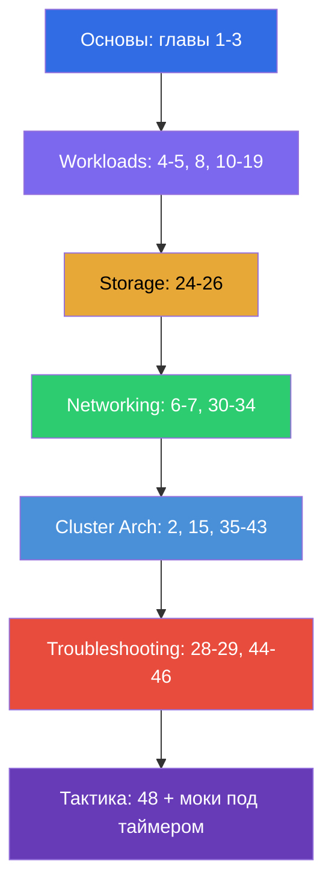

# Путеводитель по подготовке к CKA

[← Оглавление курса](README_RU.md) · [Путеводитель CKAD](CKAD_RU.md)

Этот файл - маршрут подготовки именно к экзамену **CKA (Certified Kubernetes
Administrator)**. Курс совместный (CKA + CKAD), и здесь собраны только главы и лабы,
нужные для CKA, разложенные по официальным доменам экзамена с их весами.

> **Формат экзамена.** Практический, 2 часа, ~15-20 задач в живом кластере, проходной
> балл 66%, Kubernetes v1.35. Много работы на нодах по SSH. Подробная тактика - в
> [главе 48](48/ru.md).

## С чего начать (основы для всех)

Если база по сетям, DNS, TLS и контейнерам пока шаткая - начните с необязательной
**Части 0** (без неё остальной курс читается тяжелее):

- [0.1. Сеть: IP, порты, CIDR, NAT](00-1-net/ru.md)
- [0.2. DNS: как имена превращаются в адреса](00-2-dns/ru.md)
- [0.3. TLS и сертификаты: HTTPS, ключи, CA](00-3-tls/ru.md)
- [0.4. Контейнеры и Docker: образы, слои, реестры, runtime](00-4-containers/ru.md)
- [0.5. Linux и инструменты ноды: SSH, sudo, systemd, логи](00-5-linux/ru.md) - **важно для CKA** (нодовые лабы)
- [0.6. YAML: отступы, списки, словари, манифесты](00-6-yaml/ru.md)
- [0.7. Linux-сеть под капотом: network namespaces, veth, маршруты](00-7-netns/ru.md)

Дальше - фундамент курса, пройдите эти главы первыми независимо от экзамена:

1. [Введение: Kubernetes, экзамены, устройство курса](01/ru.md)
2. [Архитектура Kubernetes: control plane и worker-ноды](02/ru.md) - **ядро для CKA**
3. [Работа с kubectl: императивный и декларативный подходы](03/ru.md)

## Домены CKA и главы

### 🔴 Troubleshooting — 30% (самый весомый)

Наибольший вес - вкладывайте сюда треть времени.

- [28. Логирование и мониторинг: logs, metrics-server, kubectl top](28/ru.md)
- [29. Отладка приложений и устаревание API](29/ru.md)
- [44. Отладка сбоев приложений](44/ru.md)
- [45. Отладка control plane и worker-нод](45/ru.md)
- [46. Отладка сервисов и сети](46/ru.md)

### 🔵 Cluster Architecture, Installation & Configuration — 25%

- [2. Архитектура Kubernetes](02/ru.md)
- [15. Static Pods, PriorityClass и несколько планировщиков](15/ru.md)
- [35. Установка кластера с помощью kubeadm](35/ru.md)
- [35A. Высокая доступность (HA): несколько control-plane, etcd-топологии, балансировщик](35-2-ha/ru.md)
- [35B. Проектирование и сайзинг кластера: инфраструктура, топология, IaC](35-3-design/ru.md)
- [36. Обновление кластера (lifecycle)](36/ru.md)
- [37. Резервное копирование и восстановление etcd](37/ru.md)
- [38. RBAC: Role, ClusterRole и binding'и](38/ru.md)
- [39. TLS-сертификаты, kubeconfig и CSR API](39/ru.md)
- [40. Интерфейсы расширения: CNI, CSI, CRI](40/ru.md)
- [41. CRD и операторы](41/ru.md)
- [42. Helm](42/ru.md)
- [43. Kustomize](43/ru.md)

### 🟢 Services & Networking — 20%

- [6. Namespaces, метки, селекторы и аннотации](06/ru.md)
- [7. Services: ClusterIP, NodePort, LoadBalancer, Endpoints](07/ru.md)
- [30. Сетевая модель Kubernetes, сеть подов и CNI](30/ru.md)
- [31. Service изнутри, DNS и CoreDNS](31/ru.md)
- [32. Ingress и Ingress-контроллеры](32/ru.md)
- [33. Gateway API](33/ru.md)
- [34. NetworkPolicy](34/ru.md)

### 🟣 Workloads & Scheduling — 15%

- [4. Поды: жизненный цикл, создание и конфигурирование](04/ru.md)
- [5. ReplicaSet и Deployment](05/ru.md)
- [8. Deployment: rolling update и rollback](08/ru.md)
- [10. Jobs и CronJobs](10/ru.md)
- [11. DaemonSet и StatefulSet](11/ru.md)
- [12. Планирование подов: nodeName, nodeSelector, affinity](12/ru.md)
- [13. Taints и tolerations](13/ru.md)
- [14. Ресурсы: requests, limits, LimitRange, ResourceQuota](14/ru.md)
- [16. Автомасштабирование нагрузок: HPA](16/ru.md)
- [17. Команды, аргументы и переменные окружения](17/ru.md)
- [18. ConfigMap](18/ru.md) · [19. Secret](19/ru.md)

### 🟠 Storage — 10%

- [24. Тома для приложений: emptyDir и эфемерные тома](24/ru.md)
- [25. Volumes, PersistentVolume и PersistentVolumeClaim](25/ru.md)
- [26. StorageClass, динамический провижининг, хранение в StatefulSet](26/ru.md)

## Подготовка к экзамену

- [48. Экзамен CKA: формат, тайм-менеджмент и стратегия](48/ru.md)
- [47. Экзамен CKAD: продуктивность kubectl и JSONPath](47/ru.md) - общие приёмы скорости
  полезны и для CKA

## Лабораторные работы

Лабы (`tasks/cka/labs`, нумерация со 101) объединяют несколько смежных тем в одну
практическую работу. Все задания оформлены в экзаменационном стиле с автопроверкой
`check_result`. Соответствие лаб доменам CKA:

| Домен CKA | Лабы |
|-----------|------|
| 🔴 Troubleshooting — 30% | [114](../labs/114/README_RU.MD) (сломанные ресурсы), [117](../labs/117/README_RU.MD) (control plane/kubelet/static pod), [118](../labs/118/README_RU.MD) (сертификаты/CoreDNS/сеть), [109](../labs/109/README_RU.MD) (пробы/логи/отладка), [111](../labs/111/README_RU.MD)/[112](../labs/112/README_RU.MD) (control plane/etcd) |
| 🔵 Cluster Architecture, Installation & Configuration — 25% | [116](../labs/116/README_RU.MD) (kubeadm init+join с нуля), [124](../labs/124/README_RU.MD) (HA control plane), [111](../labs/111/README_RU.MD) (kubeadm upgrade), [112](../labs/112/README_RU.MD) (etcd backup/restore), [113](../labs/113/README_RU.MD) (RBAC/CSR), [121](../labs/121/README_RU.MD) (RBAC-дриллы), [118](../labs/118/README_RU.MD) (сертификаты/CNI), [123](../labs/123/README_RU.MD) (установка CNI с нуля), [115](../labs/115/README_RU.MD) (CRD/Helm/Kustomize), [104](../labs/104/README_RU.MD) (static pod) |
| 🟢 Services & Networking — 20% | [101](../labs/101/README_RU.MD) (Service), [110](../labs/110/README_RU.MD) (DNS, Ingress, Gateway API + миграция, NetworkPolicy), [120](../labs/120/README_RU.MD) (networking-дриллы), [118](../labs/118/README_RU.MD) (CoreDNS/сеть), [123](../labs/123/README_RU.MD) (установка CNI с нуля) |
| 🟣 Workloads & Scheduling — 15% | [101](../labs/101/README_RU.MD) (Deployment), [102](../labs/102/README_RU.MD) (обновления/стратегии), [103](../labs/103/README_RU.MD) (Jobs/CronJob/DaemonSet), [104](../labs/104/README_RU.MD) (планирование/HPA), [122](../labs/122/README_RU.MD) (scheduling-дриллы), [105](../labs/105/README_RU.MD) (ConfigMap/Secret), [119](../labs/119/README_RU.MD) (дриллы/JSONPath) |
| 🟠 Storage — 10% | [108](../labs/108/README_RU.MD) (PV/PVC), [107](../labs/107/README_RU.MD) (тома) |

- 🧪 [tasks/cka/labs](../labs) - каталог всех лабораторных работ
- 🧪 [tasks/cka/mock](../mock) - мок-экзамены CKA под таймером (мультикластер, SSH, веса заданий)

## Рекомендуемый порядок подготовки к CKA

Troubleshooting (44-46) и Cluster Architecture (35-43) - более половины экзамена, поэтому
проходите их основательно и обязательно закрепляйте мок-экзаменами под таймером.
