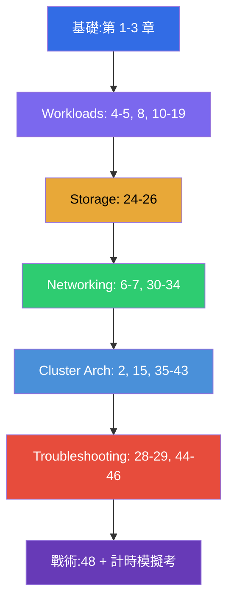

[Русская версия](CKA_RU.md) · [Eng version](CKA.md) · [Versión en español](CKA_ES.md) · [Version française](CKA_FR.md) · [Deutsche Version](CKA_DE.md) · [ქართული ვერსია](CKA_GE.md) · [日本語版](CKA_JP.md)

# CKA 備考指南

[← 課程目錄](README_TW.md) · [CKAD 指南](CKAD_TW.md)

這個檔案是專門針對 **CKA(Certified Kubernetes Administrator)** 考試的備考路線。
本課程是合併課程(CKA + CKAD),這裡只收錄 CKA 需要的章節與實驗,並依照官方
考試領域及其權重排列。

> **考試形式。** 實作型,2 小時,在真實叢集中約 15-20 題,及格分數
> 66%,Kubernetes v1.35。有大量透過 SSH 在節點上的操作。詳細戰術見
> [第 48 章](48/tw.md)。

## 從何開始(所有人的基礎)

如果你在網路、DNS、TLS 與容器方面的基礎還不穩 - 請從選讀的
**第 0 部分** 開始(沒有它,課程其餘部分會讀得比較吃力):

- [0.1. 網路:IP、埠、CIDR、NAT](00-1-net/tw.md)
- [0.2. DNS:名稱如何變成位址](00-2-dns/tw.md)
- [0.3. TLS 與憑證:HTTPS、金鑰、CA](00-3-tls/tw.md)
- [0.4. 容器與 Docker:映像、層、registry、runtime](00-4-containers/tw.md)
- [0.5. Linux 與節點工具:SSH、sudo、systemd、日誌](00-5-linux/tw.md) - **對 CKA 很重要**(節點類實驗)
- [0.6. YAML:縮排、清單、字典、manifest](00-6-yaml/tw.md)
- [0.7. Linux 網路的底層:network namespaces、veth、路由](00-7-netns/tw.md)
- [0.8. 15 分鐘上手 vim:活下來並為 YAML 做設定](00-8-vim/tw.md) - **對 CKA 很重要**(透過 SSH 在節點上編輯 manifest)

接下來是課程的基礎,無論考哪一門都請先讀完這幾章:

1. [導論:Kubernetes、考試、課程結構](01/tw.md)
2. [Kubernetes 架構:control plane 與 worker 節點](02/tw.md) - **CKA 的核心**
3. [使用 kubectl:命令式與宣告式方法](03/tw.md)

## CKA 領域與章節

### 🔴 Troubleshooting — 30%(權重最高)

權重最大 - 請把三分之一的時間投入到這裡。

- [28. 日誌與監控:logs、metrics-server、kubectl top](28/tw.md)
- [29. 應用程式除錯與 API 的淘汰](29/tw.md)
- [44. 應用程式故障除錯](44/tw.md)
- [45. control plane 與 worker 節點的除錯](45/tw.md)
- [46. 服務與網路的除錯](46/tw.md)

### 🔵 Cluster Architecture, Installation & Configuration — 25%

- [2. Kubernetes 架構](02/tw.md)
- [15. Static Pods、PriorityClass 與多個排程器](15/tw.md)
- [35. 使用 kubeadm 安裝叢集](35/tw.md)
- [35A. 高可用(HA):多個 control-plane、etcd 拓撲、負載平衡器](35-2-ha/tw.md)
- [35B. 叢集設計與規模估算:基礎設施、拓撲、IaC](35-3-design/tw.md)
- [36. 叢集升級(lifecycle)](36/tw.md)
- [37. etcd 的備份與還原](37/tw.md)
- [38. RBAC:Role、ClusterRole 與各種 binding](38/tw.md)
- [39. TLS 憑證、kubeconfig 與 CSR API](39/tw.md)
- [40. 擴充介面:CNI、CSI、CRI](40/tw.md)
- [41. CRD 與 operator](41/tw.md)
- [42. Helm](42/tw.md)
- [43. Kustomize](43/tw.md)

### 🟢 Services & Networking — 20%

- [6. Namespaces、標籤、選擇器與註解](06/tw.md)
- [7. Services:ClusterIP、NodePort、LoadBalancer、Endpoints](07/tw.md)
- [30. Kubernetes 網路模型、Pod 網路與 CNI](30/tw.md)
- [31. Service 的內部、DNS 與 CoreDNS](31/tw.md)
- [32. Ingress 與 Ingress 控制器](32/tw.md)
- [33. Gateway API](33/tw.md)
- [34. NetworkPolicy](34/tw.md)

### 🟣 Workloads & Scheduling — 15%

- [4. Pod:生命週期、建立與設定](04/tw.md)
- [5. ReplicaSet 與 Deployment](05/tw.md)
- [8. Deployment:rolling update 與 rollback](08/tw.md)
- [10. Jobs 與 CronJobs](10/tw.md)
- [11. DaemonSet 與 StatefulSet](11/tw.md)
- [12. Pod 的排程:nodeName、nodeSelector、affinity](12/tw.md)
- [13. Taints 與 tolerations](13/tw.md)
- [14. 資源:requests、limits、LimitRange、ResourceQuota](14/tw.md)
- [16. 工作負載的自動擴縮:HPA](16/tw.md)
- [17. 命令、參數與環境變數](17/tw.md)
- [18. ConfigMap](18/tw.md) · [19. Secret](19/tw.md)
- [20. SecurityContext 與 capabilities](20/tw.md) · [21. ServiceAccount、認證與 admission](21/tw.md)

### 🟠 Storage — 10%

- [24. 應用程式的卷:emptyDir 與臨時卷](24/tw.md)
- [25. Volumes、PersistentVolume 與 PersistentVolumeClaim](25/tw.md)
- [26. StorageClass、動態 provisioning、StatefulSet 中的儲存](26/tw.md)

## 考試準備

- [48. CKA 考試:形式、時間管理與策略](48/tw.md)
- [47. CKAD 考試:kubectl 與 JSONPath 的效率](47/tw.md) - 通用的提速技巧
  對 CKA 也有用

## 實驗

實驗(`tasks/cka/labs`,編號從 101 開始)把幾個相鄰主題合併成一份
實作作業。所有題目都以考試風格編寫,並帶有自動檢查
`check_result`。實驗與 CKA 領域的對應關係:

| CKA 領域 | 實驗 |
|-----------|------|
| 🔴 Troubleshooting — 30% | [114](../labs/114/README_TW.MD)(壞掉的資源)、[117](../labs/117/README_TW.MD)(control plane/kubelet/static pod)、[118](../labs/118/README_TW.MD)(憑證/CoreDNS/網路)、[109](../labs/109/README_TW.MD)(探針/日誌/除錯)、[111](../labs/111/README_TW.MD)/[112](../labs/112/README_TW.MD)(control plane/etcd) |
| 🔵 Cluster Architecture, Installation & Configuration — 25% | [116](../labs/116/README_TW.MD)(從零做 kubeadm init+join)、[124](../labs/124/README_TW.MD)(HA control plane)、[111](../labs/111/README_TW.MD)(kubeadm upgrade)、[112](../labs/112/README_TW.MD)(etcd backup/restore)、[113](../labs/113/README_TW.MD)(RBAC/CSR)、[121](../labs/121/README_TW.MD)(RBAC 練習)、[118](../labs/118/README_TW.MD)(憑證/CNI)、[123](../labs/123/README_TW.MD)(從零安裝 CNI)、[115](../labs/115/README_TW.MD)(CRD/Helm/Kustomize)、[104](../labs/104/README_TW.MD)(static pod) |
| 🟢 Services & Networking — 20% | [101](../labs/101/README_TW.MD)(Service)、[110](../labs/110/README_TW.MD)(DNS、Ingress、Gateway API + 遷移、NetworkPolicy)、[125](../labs/125/README_TW.MD)(DNS/CoreDNS)、[120](../labs/120/README_TW.MD)(networking 練習)、[118](../labs/118/README_TW.MD)(CoreDNS/網路)、[123](../labs/123/README_TW.MD)(從零安裝 CNI) |
| 🟣 Workloads & Scheduling — 15% | [101](../labs/101/README_TW.MD)(Deployment)、[102](../labs/102/README_TW.MD)(更新/策略)、[103](../labs/103/README_TW.MD)(Jobs/CronJob/DaemonSet)、[104](../labs/104/README_TW.MD)(排程/HPA)、[122](../labs/122/README_TW.MD)(scheduling 練習)、[105](../labs/105/README_TW.MD)(ConfigMap/Secret)、[106](../labs/106/README_TW.MD)(SecurityContext)、[119](../labs/119/README_TW.MD)(練習/JSONPath) |
| 🟠 Storage — 10% | [108](../labs/108/README_TW.MD)(PV/PVC)、[107](../labs/107/README_TW.MD)(卷) |

- 🧪 [tasks/cka/labs](../labs) - 所有實驗的目錄
- 🧪 [tasks/cka/mock](../mock) - 計時的 CKA 模擬考(多叢集、SSH、題目權重)

## 建議的 CKA 備考順序

Troubleshooting(44-46)與 Cluster Architecture(35-43)佔了考試一半以上,
因此請扎實地讀完它們,並務必用計時的模擬考來鞏固。
