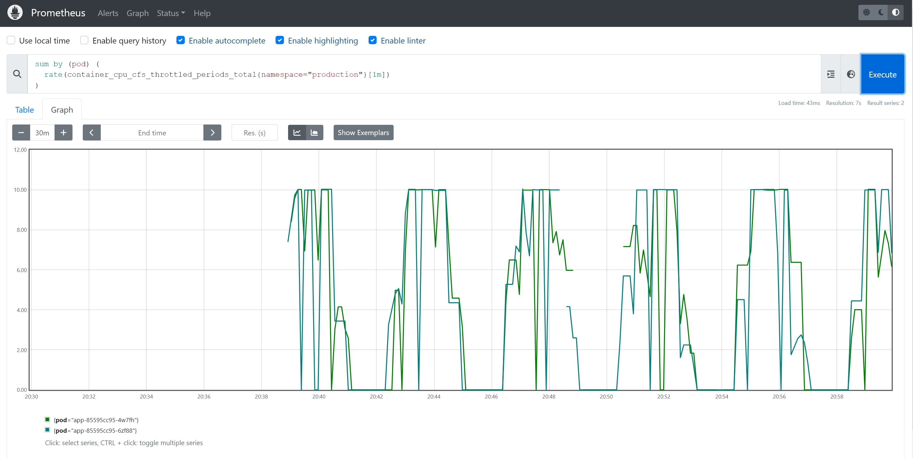
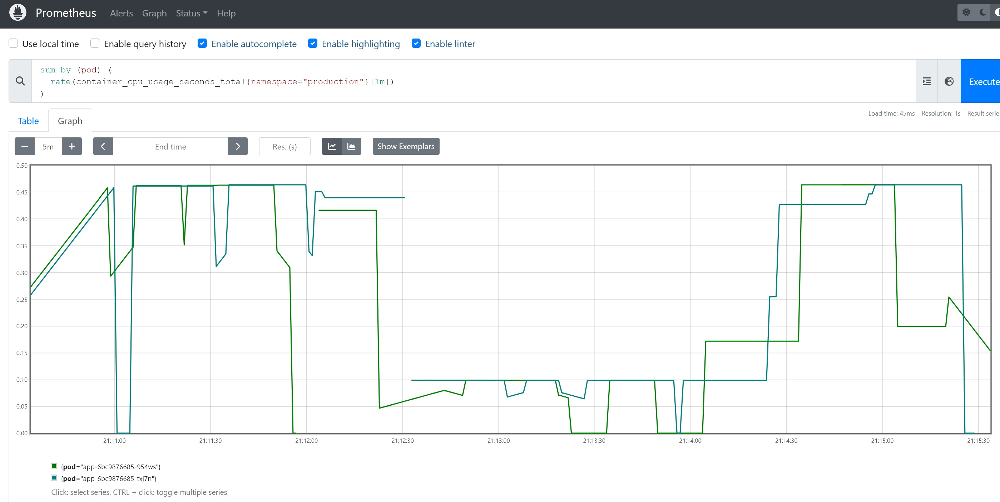

Port forward prometheus service to work PC
```
kubectl port-forward --address 0.0.0.0 svc/kube-prometheus-stack-prometheus 9090:9090 -n monitoring

```
open in browser http://{worker_pc_IP}:9090

check throttled containers
````
sum by (pod) (
  rate(container_cpu_cfs_throttled_periods_total{namespace="production"}[1m])
)
````

 

disable cpu limit for the pods 
```` 
k edit deployments.apps -n production

````

``` 
.......
        resources:
          limits:
#            cpu: 250m     # disable it 
            memory: 20Mi
          requests:
            cpu: 100m
            memory: 10Mi

.......


```
check cpu ussage 
````
sum by (pod) (
  rate(container_cpu_usage_seconds_total{namespace="production"}[1m])
)

````
 


cpu usage is lees than 500m . add 20% to it .
set cpu limit for the pods  600m
```` 
k edit deployments.apps -n production

````

``` 
.......
        resources:
          limits:
            cpu: 600m     # add it 
            memory: 20Mi
          requests:
            cpu: 100m
            memory: 10Mi

.......

```
check throttled containers again
````
sum by (pod) (
  rate(container_cpu_cfs_throttled_periods_total{namespace="production"}[1m])
)
````


It is lees than 1  . It is ok