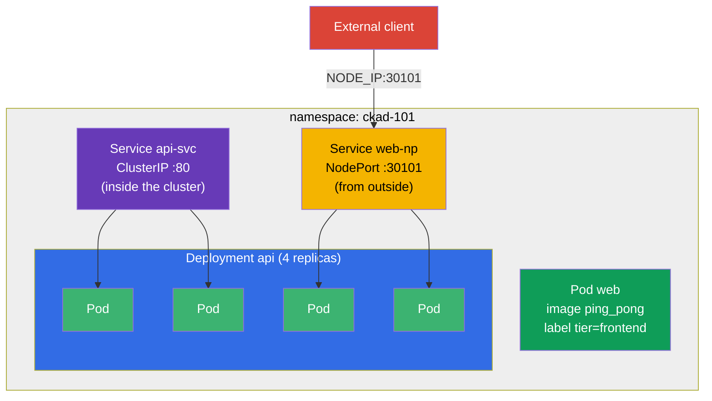

[Русская версия](README_RU.MD) · [Versión en español](README_ES.MD) · [Version française](README_FR.MD) · [Deutsche Version](README_DE.MD) · [ქართული ვერსია](README_GE.MD)

# Lab 101 — Kubernetes Basics: Pods, Deployment, Namespaces, Labels, Service

## Description

The first hands-on lab of the CKA + CKAD course and the foundation for everything that
follows. Here you practice the baseline set of operations that shows up in literally every
mock exam and every real-world task: isolating resources in a **namespace**, running a
single **Pod**, managing an application through a **Deployment** (create, scale), wiring
Pods together with a **Service** (internal ClusterIP and external NodePort), and pulling
data out of the cluster with **JSONPath**.

All tasks are written in exam style (like real CKA/CKAD questions) with automatic
validation via the `check_result` command. It is recommended to solve them with imperative
commands (`kubectl run/create/expose`) — on the exam that is the fastest path.

## Goal

Reinforce the material from the course chapters:

- [Chapter 2. Kubernetes Architecture](../../course/02/ru.md) — what a cluster is made of
- [Chapter 3. Working with kubectl](../../course/03/ru.md) — imperative style, `--dry-run`, JSONPath
- [Chapter 4. Pods](../../course/04/ru.md) — the basic unit of execution
- [Chapter 5. ReplicaSet and Deployment](../../course/05/ru.md) — managing replicas
- [Chapter 6. Namespaces, Labels, Selectors](../../course/06/ru.md) — organization and relationships
- [Chapter 7. Services](../../course/07/ru.md) — stable access and load balancing

## What We Build and Why

In this lab we assemble, step by step, a small but complete application inside a dedicated
namespace. Every object serves its own purpose:

| Object | What it is | Why it is in this lab |
|--------|------------|-----------------------|
| **Namespace `ckad-101`** | a namespace — a partition of the cluster | keep all lab resources in their own namespace without disturbing others (chapter 6) |
| **Pod `web`** with label `tier=frontend` | a single Pod with an application | learn to run a Pod and attach a label that selectors will later use to find it (chapters 4, 6) |
| **Deployment `api`** (4 replicas) | a controller on top of a ReplicaSet | run the application "the right way" — with self-healing and scaling, not as a bare Pod (chapter 5) |
| **Service `api-svc`** (ClusterIP) | a stable internal address | give the Deployment's Pods a single entry point inside the cluster and confirm the Service actually found the Pods (Endpoints, chapter 7) |
| **Service `web-np`** (NodePort) | external access through a node port | learn to expose an application to the outside world — a frequent mock-exam task (chapter 7) |
| **JSONPath query** | extracting fields through the API | practice the "dump data into a file" skill that appears in almost every mock exam (chapter 3) |

The final picture of what will be deployed:



## Infrastructure

The environment is deployed in AWS (`eu-central-1`) via Terragrunt and consists of:

| Component  | Description                                                  |
|------------|--------------------------------------------------------------|
| `vpc`      | VPC `10.10.0.0/16` with public subnets                        |
| `ssh-keys` | SSH keys for node access                                      |
| `k8s-1`    | Kubernetes `1.35.2` (kubeadm), Calico CNI, metrics-server installed |
| `worker`   | Work machine with `kubectl`, cluster access and `check_result` |

Instances: `t3.medium` (master), Ubuntu `22.04`. The cluster is single-node — the master is
untainted (the `control-plane` taint is removed), so Pods are scheduled directly on it.

## Deployment

```bash
TASK=101 make run_cka_task
```

Once it is created, connect to the work machine (worker) over SSH and do the tasks from
there. `kubectl` is already pointed at the `cluster1-admin@cluster1` context.

Handy commands on the work machine:

```bash
time_left       # how much time is left
check_result    # check your solution
```

## Tasks

---
|        **1**        | **A namespace for the lab resources**                        |
| :-----------------: | :----------------------------------------------------------- |
| What to do          | Create a namespace named `ckad-101`. All other lab objects are created **inside** it so they do not interfere with other cluster resources. |
| Acceptance criteria | - namespace `ckad-101` exists. |
---
|        **2**        | **A single Pod with a label**                                |
| :-----------------: | :----------------------------------------------------------- |
| What to do          | In namespace `ckad-101` run a single Pod named `web` with container image `viktoruj/ping_pong:latest` (a training HTTP server on port `8080`). Attach the label `tier=frontend` to the Pod (labels like this are how objects later find each other through selectors). |
| Acceptance criteria | - Pod `web` in namespace `ckad-101`;<br/>- container image is `viktoruj/ping_pong`;<br/>- the Pod has the label `tier=frontend`. |
---
|        **3**        | **A Deployment with 4 replicas**                             |
| :-----------------: | :----------------------------------------------------------- |
| What to do          | In namespace `ckad-101` create a Deployment named `api` with container image `viktoruj/ping_pong:latest`. Scale it to `4` replicas and wait until all 4 Pods become Ready. |
| Acceptance criteria | - Deployment `api` in namespace `ckad-101`;<br/>- container image is `viktoruj/ping_pong`;<br/>- `4` ready replicas. |
---
|        **4**        | **A ClusterIP Service in front of the Deployment**           |
| :-----------------: | :----------------------------------------------------------- |
| What to do          | In namespace `ckad-101` create a Service named `api-svc` of type **ClusterIP** that selects the Pods of Deployment `api`. The Service port is `80`, the `targetPort` (the port on the Pods) is `8080` (the HTTP port of the ping_pong application). Make sure the Service found the Pods (its Endpoints are not empty). |
| Acceptance criteria | - Service `api-svc` in namespace `ckad-101`, port `80`;<br/>- Endpoints are not empty (the Service is bound to the `api` Pods). |
---
|        **5**        | **A NodePort Service to the outside**                        |
| :-----------------: | :----------------------------------------------------------- |
| What to do          | In namespace `ckad-101` create a Service named `web-np` of type **NodePort** for Deployment `api` (`targetPort` is `8080`). The Service port is `80`, and on the nodes it must be reachable on the fixed port `nodePort: 30101`. |
| Acceptance criteria | - Service `web-np` in namespace `ckad-101`, type `NodePort`;<br/>- Service port `80`;<br/>- `nodePort` = `30101`. |
---
|        **6**        | **JSONPath: Pod names into a file**                          |
| :-----------------: | :----------------------------------------------------------- |
| What to do          | Using `kubectl ... -o jsonpath`, get the names of **all** Pods in namespace `ckad-101` and save them to the file `/var/work/tests/artifacts/6/pods.txt` (the file must contain, among others, the name of Pod `web` and the Pods of Deployment `api`). |
| Acceptance criteria | - the file `/var/work/tests/artifacts/6/pods.txt` is not empty and contains Pod names (including `web` and `api`). |
---

## Checking the Result

On the work machine run the automatic validation:

```bash
check_result
```

The script runs the tests and shows how many tasks are complete.

## Solution

Reference solution: [worker/files/solutions/1.MD](worker/files/solutions/1.MD)

## Mock Exam Coverage

The lab covers the basic mock-exam tasks: CKA mock 01 (#1, 2, 3, 5, 6, 8), CKA mock 02
(#2, 3, 5, 6, 7, 8, 9), CKAD mock 01 (#1, 2, 5) — Pods, namespaces, labels, Deployment,
scaling, ClusterIP/NodePort Services and output via JSONPath.

## Deleting the Cluster and Resources

```bash
TASK=101 make delete_cka_task
```
