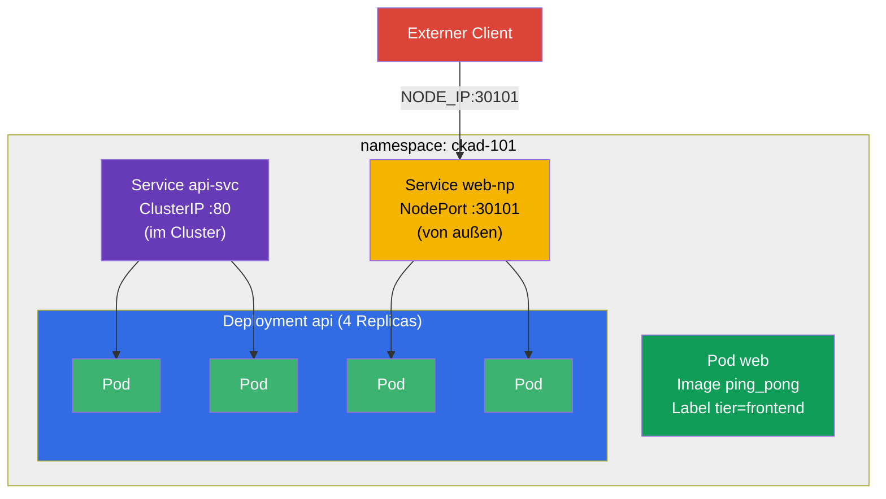

[Русская версия](README_RU.MD) · [Eng version](README.MD) · [Versión en español](README_ES.MD) · [Version française](README_FR.MD) · [ქართული ვერსია](README_GE.MD) · [繁體中文版](README_TW.MD) · [日本語版](README_JP.MD)

# Lab 101 — Kubernetes-Grundlagen: Pods, Deployment, Namespaces, Labels, Service

## Beschreibung

Die erste Praxisübung des Kurses CKA + CKAD und die Grundlage für alle weiteren. Hier übst
du den Basissatz an Operationen, der buchstäblich in jeder Mock-Prüfung und in jeder echten
Aufgabe vorkommt: Isolierung von Ressourcen in einem **Namespace**, Start eines einzelnen
**Pods**, Verwaltung einer Anwendung über ein **Deployment** (Erstellen, Skalieren),
Verbinden von Pods über einen **Service** (internes ClusterIP und externes NodePort) sowie
das Auslesen von Daten aus dem Cluster mit **JSONPath**.

Alle Aufgaben sind im Prüfungsstil formuliert (wie echte CKA/CKAD-Fragen) mit automatischer
Prüfung über den Befehl `check_result`. Empfohlen wird die Lösung mit imperativen Befehlen
(`kubectl run/create/expose`) — in der Prüfung ist das der schnellste Weg.

## Ziel

Den Stoff der Kurskapitel festigen:

- [Kapitel 2. Kubernetes-Architektur](../../course/02/de.md) — woraus ein Cluster besteht
- [Kapitel 3. Arbeiten mit kubectl](../../course/03/de.md) — imperativer Stil, `--dry-run`, JSONPath
- [Kapitel 4. Pods](../../course/04/de.md) — die Basiseinheit der Ausführung
- [Kapitel 5. ReplicaSet und Deployment](../../course/05/de.md) — Verwaltung von Replicas
- [Kapitel 6. Namespaces, Labels, Selektoren](../../course/06/de.md) — Organisation und Beziehungen
- [Kapitel 7. Services](../../course/07/de.md) — stabiler Zugriff und Lastverteilung

## Was wir erstellen und warum

In diesem Lab bauen wir Schritt für Schritt eine kleine, aber vollständige Anwendung in
einem eigenen Namespace auf. Jedes Objekt erfüllt seine eigene Aufgabe:

| Objekt | Was das ist | Warum in diesem Lab |
|--------|-------------|---------------------|
| **Namespace `ckad-101`** | Namespace — ein Abschnitt des Clusters | alle Lab-Ressourcen im eigenen Namespace halten, ohne andere zu stören (Kapitel 6) |
| **Pod `web`** mit dem Label `tier=frontend` | einzelner Pod mit einer Anwendung | lernen, einen Pod zu starten und ihm ein Label zu geben, über das Selektoren ihn später finden (Kapitel 4, 6) |
| **Deployment `api`** (4 Replicas) | Controller über einem ReplicaSet | die Anwendung „richtig“ starten — mit Selbstheilung und Skalierung, nicht als nackter Pod (Kapitel 5) |
| **Service `api-svc`** (ClusterIP) | stabile interne Adresse | den Pods des Deployments einen einheitlichen Eintrittspunkt im Cluster geben und prüfen, dass der Service die Pods wirklich gefunden hat (Endpoints, Kapitel 7) |
| **Service `web-np`** (NodePort) | externer Zugriff über den Node-Port | lernen, die Anwendung nach außen zu veröffentlichen — häufige Aufgabe in Mock-Prüfungen (Kapitel 7) |
| **JSONPath-Abfrage** | Auslesen von Feldern über die API | die Fähigkeit „Daten in eine Datei schreiben“ üben, die in fast jeder Mock-Prüfung vorkommt (Kapitel 3) |

Das Gesamtbild dessen, was ausgerollt wird:



## Infrastruktur

Die Umgebung wird in AWS (`eu-central-1`) über Terragrunt ausgerollt und besteht aus:

| Komponente | Beschreibung                                                 |
|------------|--------------------------------------------------------------|
| `vpc`      | VPC `10.10.0.0/16` mit öffentlichen Subnetzen                 |
| `ssh-keys` | SSH-Schlüssel für den Zugriff auf die Nodes                    |
| `k8s-1`    | Kubernetes `1.35.2` (kubeadm), CNI Calico, metrics-server installiert |
| `worker`   | Arbeitsmaschine mit `kubectl`, Cluster-Zugriff und `check_result` |

Instanzen: `t3.medium` (Master), Ubuntu `22.04`. Der Cluster hat einen Node — beim Master
ist der Taint `control-plane` entfernt, daher werden Pods direkt auf ihm geplant.

## Bereitstellung

```bash
TASK=101 make run_cka_task
```

Verbinde dich nach dem Erstellen per SSH mit der Arbeitsmaschine (Worker) und erledige die
Aufgaben von dort. `kubectl` ist bereits auf den Kontext `cluster1-admin@cluster1`
eingestellt.

Nützliche Befehle auf der Arbeitsmaschine:

```bash
time_left       # wie viel Zeit noch bleibt
check_result    # Lösung prüfen
```

## Aufgaben

---
|        **1**        | **Namespace für die Lab-Ressourcen**                         |
| :-----------------: | :----------------------------------------------------------- |
| Was wir tun         | Erstelle einen Namespace mit dem Namen `ckad-101`. Alle weiteren Objekte des Labs werden **darin** erstellt, um andere Cluster-Ressourcen nicht zu stören. |
| Abnahmekriterien    | - Namespace `ckad-101` existiert. |
---
|        **2**        | **Einzelner Pod mit Label**                                  |
| :-----------------: | :----------------------------------------------------------- |
| Was wir tun         | Starte im Namespace `ckad-101` einen einzelnen Pod mit dem Namen `web`, Container-Image `viktoruj/ping_pong:latest` (ein Lern-HTTP-Server auf Port `8080`). Hänge an den Pod das Label `tier=frontend` (über solche Labels finden Objekte später einander per Selector). |
| Abnahmekriterien    | - Pod `web` im Namespace `ckad-101`;<br/>- Container-Image ist `viktoruj/ping_pong`;<br/>- der Pod hat das Label `tier=frontend`. |
---
|        **3**        | **Deployment mit 4 Replicas**                                |
| :-----------------: | :----------------------------------------------------------- |
| Was wir tun         | Erstelle im Namespace `ckad-101` ein Deployment mit dem Namen `api`, Container-Image `viktoruj/ping_pong:latest`. Skaliere es auf `4` Replicas und warte, bis alle 4 Pods bereit (Ready) sind. |
| Abnahmekriterien    | - Deployment `api` im Namespace `ckad-101`;<br/>- Container-Image ist `viktoruj/ping_pong`;<br/>- `4` bereite (ready) Replicas. |
---
|        **4**        | **ClusterIP-Service vor dem Deployment**                     |
| :-----------------: | :----------------------------------------------------------- |
| Was wir tun         | Erstelle im Namespace `ckad-101` einen Service mit dem Namen `api-svc` vom Typ **ClusterIP**, der die Pods des Deployments `api` auswählt. Der Service-Port ist `80`, der `targetPort` (der Port auf den Pods) ist `8080` (der HTTP-Port der Anwendung ping_pong). Stelle sicher, dass der Service die Pods gefunden hat (seine Endpoints sind nicht leer). |
| Abnahmekriterien    | - Service `api-svc` im Namespace `ckad-101`, Port `80`;<br/>- Endpoints sind nicht leer (der Service ist mit den `api`-Pods verbunden). |
---
|        **5**        | **NodePort-Service nach außen**                              |
| :-----------------: | :----------------------------------------------------------- |
| Was wir tun         | Erstelle im Namespace `ckad-101` einen Service mit dem Namen `web-np` vom Typ **NodePort** für das Deployment `api` (`targetPort` — `8080`). Der Service-Port ist `80`, und auf den Nodes muss er über den festen Port `nodePort: 30101` erreichbar sein. |
| Abnahmekriterien    | - Service `web-np` im Namespace `ckad-101`, Typ `NodePort`;<br/>- Service-Port `80`;<br/>- `nodePort` = `30101`. |
---
|        **6**        | **JSONPath: Pod-Namen in eine Datei**                        |
| :-----------------: | :----------------------------------------------------------- |
| Was wir tun         | Hole mit `kubectl ... -o jsonpath` die Namen **aller** Pods im Namespace `ckad-101` und speichere sie in der Datei `/var/work/tests/artifacts/6/pods.txt` (die Datei muss insbesondere den Namen des Pods `web` und die Pods des Deployments `api` enthalten). |
| Abnahmekriterien    | - die Datei `/var/work/tests/artifacts/6/pods.txt` ist nicht leer und enthält Pod-Namen (u. a. `web` und `api`). |
---

## Ergebnisprüfung

Starte auf der Arbeitsmaschine die automatische Prüfung:

```bash
check_result
```

Das Skript führt die Tests aus und zeigt, wie viele Aufgaben erledigt sind.

## Lösung

Referenzlösung: [worker/files/solutions/1_DE.MD](worker/files/solutions/1_DE.MD)

## Abdeckung der Mock-Prüfungen

Das Lab deckt die Basisaufgaben der Mocks ab: CKA mock 01 (Nr. 1, 2, 3, 5, 6, 8), CKA mock 02
(Nr. 2, 3, 5, 6, 7, 8, 9), CKAD mock 01 (Nr. 1, 2, 5) — Pods, Namespaces, Labels, Deployment,
Skalierung, ClusterIP/NodePort-Services und Ausgabe über JSONPath.

## Löschen von Cluster und Ressourcen

```bash
TASK=101 make delete_cka_task
```
