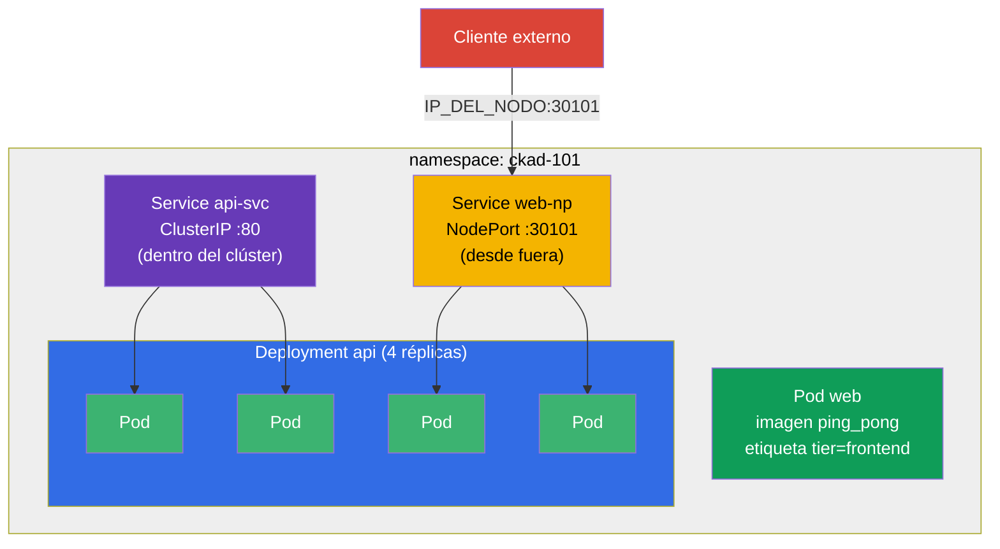

[Русская версия](README_RU.MD) · [Eng version](README.MD) · [Version française](README_FR.MD) · [Deutsche Version](README_DE.MD) · [ქართული ვერსია](README_GE.MD)

# Lab 101 — Fundamentos de Kubernetes: pods, Deployment, namespaces, etiquetas, Service

## Descripción

La primera práctica del curso CKA + CKAD y la base de todas las siguientes. Aquí practicas
el conjunto básico de operaciones que aparece literalmente en cada examen simulado y en cada
tarea real: aislar recursos en un **namespace**, ejecutar un **pod** individual, gestionar
una aplicación mediante un **Deployment** (creación, escalado), conectar pods con un
**Service** (ClusterIP interno y NodePort externo) y extraer datos del clúster con
**JSONPath**.

Todas las tareas están redactadas en estilo de examen (como las preguntas reales de
CKA/CKAD) con verificación automática mediante el comando `check_result`. Se recomienda
resolverlas con comandos imperativos (`kubectl run/create/expose`): en el examen es el
camino más rápido.

## Objetivo

Consolidar el material de los capítulos del curso:

- [Capítulo 2. Arquitectura de Kubernetes](../../course/02/ru.md) — de qué está compuesto el clúster
- [Capítulo 3. Trabajar con kubectl](../../course/03/ru.md) — estilo imperativo, `--dry-run`, JSONPath
- [Capítulo 4. Pods](../../course/04/ru.md) — la unidad básica de ejecución
- [Capítulo 5. ReplicaSet y Deployment](../../course/05/ru.md) — gestión de réplicas
- [Capítulo 6. Namespaces, etiquetas, selectores](../../course/06/ru.md) — organización y relaciones
- [Capítulo 7. Services](../../course/07/ru.md) — acceso estable y balanceo

## Qué creamos y para qué

En este laboratorio montamos paso a paso una aplicación pequeña pero completa en un
namespace propio. Cada objeto resuelve su propia tarea:

| Objeto | Qué es | Para qué está en este laboratorio |
|--------|--------|-----------------------------------|
| **Namespace `ckad-101`** | namespace — una partición del clúster | mantener todos los recursos del laboratorio en su propio namespace, sin molestar a los demás (capítulo 6) |
| **Pod `web`** con la etiqueta `tier=frontend` | pod individual con una aplicación | aprender a ejecutar un pod y a ponerle una etiqueta por la que luego lo encuentran los selectores (capítulos 4, 6) |
| **Deployment `api`** (4 réplicas) | controlador sobre un ReplicaSet | ejecutar la aplicación «como se debe»: con autorecuperación y escalado, no como un pod suelto (capítulo 5) |
| **Service `api-svc`** (ClusterIP) | dirección interna estable | dar a los pods del Deployment un único punto de entrada dentro del clúster y comprobar que el Service realmente encontró los pods (Endpoints, capítulo 7) |
| **Service `web-np`** (NodePort) | acceso externo a través del puerto del nodo | aprender a exponer la aplicación hacia fuera: tarea frecuente en los simulados (capítulo 7) |
| **Consulta JSONPath** | extracción de campos a través de la API | entrenar la habilidad de «volcar datos a un fichero», presente en casi todos los exámenes simulados (capítulo 3) |

Panorama final de lo que quedará despliegado:



## Infraestructura

El entorno se despliega en AWS (`eu-central-1`) mediante Terragrunt y consta de:

| Componente | Descripción                                                  |
|------------|--------------------------------------------------------------|
| `vpc`      | VPC `10.10.0.0/16` con subredes públicas                      |
| `ssh-keys` | Claves SSH para el acceso a los nodos                         |
| `k8s-1`    | Kubernetes `1.35.2` (kubeadm), CNI Calico, metrics-server instalado |
| `worker`   | Máquina de trabajo con `kubectl`, acceso al clúster y `check_result` |

Instancias: `t3.medium` (master), Ubuntu `22.04`. El clúster es de un solo nodo: al master
se le ha quitado el taint `control-plane`, por lo que los pods se planifican directamente
en él.

## Despliegue

```bash
TASK=101 make run_cka_task
```

Tras la creación, conéctate por SSH a la máquina de trabajo (worker) y realiza las tareas
desde allí. `kubectl` ya está configurado con el contexto `cluster1-admin@cluster1`.

Comandos útiles en la máquina de trabajo:

```bash
time_left       # cuánto tiempo queda
check_result    # comprobar la solución
```

## Tareas

---
|        **1**        | **Namespace para los recursos del laboratorio**              |
| :-----------------: | :----------------------------------------------------------- |
| Qué hacemos         | Crea un namespace con el nombre `ckad-101`. Todos los demás objetos del laboratorio se crean **dentro** de él, para no interferir con otros recursos del clúster. |
| Criterios de aceptación | - el namespace `ckad-101` existe. |
---
|        **2**        | **Pod individual con label**                                 |
| :-----------------: | :----------------------------------------------------------- |
| Qué hacemos         | En el namespace `ckad-101` ejecuta un Pod individual llamado `web`, con la imagen de contenedor `viktoruj/ping_pong:latest` (es un servidor HTTP didáctico en el puerto `8080`). Ponle al Pod el label `tier=frontend` (por labels como este los objetos se encuentran después mediante selector). |
| Criterios de aceptación | - Pod `web` en el namespace `ckad-101`;<br/>- la imagen del contenedor es `viktoruj/ping_pong`;<br/>- el Pod tiene el label `tier=frontend`. |
---
|        **3**        | **Deployment con 4 réplicas**                                |
| :-----------------: | :----------------------------------------------------------- |
| Qué hacemos         | En el namespace `ckad-101` crea un Deployment llamado `api`, con la imagen de contenedor `viktoruj/ping_pong:latest`. Escálalo a `4` réplicas y espera hasta que los 4 Pods estén listos (Ready). |
| Criterios de aceptación | - Deployment `api` en el namespace `ckad-101`;<br/>- la imagen del contenedor es `viktoruj/ping_pong`;<br/>- `4` réplicas listas (ready). |
---
|        **4**        | **Service ClusterIP delante del Deployment**                 |
| :-----------------: | :----------------------------------------------------------- |
| Qué hacemos         | En el namespace `ckad-101` crea un Service llamado `api-svc` de tipo **ClusterIP** que seleccione los Pods del Deployment `api`. El puerto del Service es `80` y el `targetPort` (el puerto en los Pods) es `8080` (el puerto HTTP de la aplicación ping_pong). Asegúrate de que el Service encontró los Pods (sus Endpoints no están vacíos). |
| Criterios de aceptación | - Service `api-svc` en el namespace `ckad-101`, puerto `80`;<br/>- los Endpoints no están vacíos (el Service está enlazado con los Pods de `api`). |
---
|        **5**        | **Service NodePort hacia fuera**                             |
| :-----------------: | :----------------------------------------------------------- |
| Qué hacemos         | En el namespace `ckad-101` crea un Service llamado `web-np` de tipo **NodePort** para el Deployment `api` (`targetPort` — `8080`). El puerto del Service es `80` y en los nodos debe estar accesible en el puerto fijo `nodePort: 30101`. |
| Criterios de aceptación | - Service `web-np` en el namespace `ckad-101`, tipo `NodePort`;<br/>- puerto del Service `80`;<br/>- `nodePort` = `30101`. |
---
|        **6**        | **JSONPath: nombres de los Pods a un fichero**               |
| :-----------------: | :----------------------------------------------------------- |
| Qué hacemos         | Con `kubectl ... -o jsonpath` obtén los nombres de **todos** los Pods del namespace `ckad-101` y guárdalos en el fichero `/var/work/tests/artifacts/6/pods.txt` (el fichero debe contener, en particular, el nombre del Pod `web` y los Pods del Deployment `api`). |
| Criterios de aceptación | - el fichero `/var/work/tests/artifacts/6/pods.txt` no está vacío y contiene nombres de pods (incluidos `web` y `api`). |
---

## Comprobación del resultado

En la máquina de trabajo lanza la verificación automática:

```bash
check_result
```

El script ejecuta los tests y muestra cuántas tareas están completadas.

## Solución

Solución de referencia: [worker/files/solutions/1_ES.MD](worker/files/solutions/1_ES.MD)

## Cobertura de exámenes simulados

El laboratorio cubre las tareas básicas de los simulados: CKA mock 01 (n.º 1, 2, 3, 5, 6, 8),
CKA mock 02 (n.º 2, 3, 5, 6, 7, 8, 9), CKAD mock 01 (n.º 1, 2, 5) — pods, namespaces,
etiquetas, Deployment, escalado, Services ClusterIP/NodePort y salida mediante JSONPath.

## Eliminación del clúster y los recursos

```bash
TASK=101 make delete_cka_task
```
