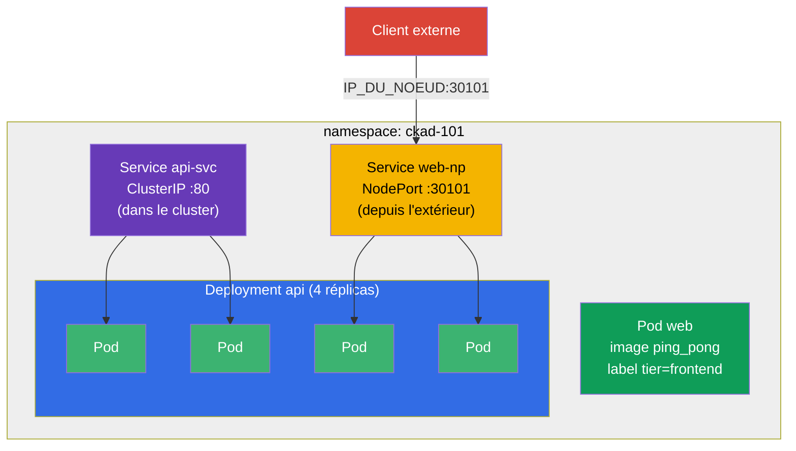

[Русская версия](README_RU.MD) · [Eng version](README.MD) · [Versión en español](README_ES.MD) · [Deutsche Version](README_DE.MD) · [ქართული ვერსია](README_GE.MD) · [繁體中文版](README_TW.MD) · [日本語版](README_JP.MD)

# Lab 101 — Bases de Kubernetes : pods, Deployment, namespaces, labels, Service

## Description

Le premier travail pratique du cours CKA + CKAD et le socle de tous les suivants. Vous y
travaillez l'ensemble d'opérations de base que l'on retrouve littéralement dans chaque
examen blanc et dans chaque tâche réelle : isoler des ressources dans un **namespace**,
lancer un **pod** unique, gérer une application via un **Deployment** (création, mise à
l'échelle), relier les pods avec un **Service** (ClusterIP interne et NodePort externe) et
extraire des données du cluster avec **JSONPath**.

Toutes les tâches sont rédigées dans le style de l'examen (comme les vraies questions
CKA/CKAD) avec une vérification automatique via la commande `check_result`. Il est
recommandé de les résoudre avec des commandes impératives (`kubectl run/create/expose`) :
à l'examen, c'est la voie la plus rapide.

## Objectif

Consolider le contenu des chapitres du cours :

- [Chapitre 2. Architecture de Kubernetes](../../course/02/fr.md) — de quoi est constitué un cluster
- [Chapitre 3. Travailler avec kubectl](../../course/03/fr.md) — style impératif, `--dry-run`, JSONPath
- [Chapitre 4. Pods](../../course/04/fr.md) — l'unité d'exécution de base
- [Chapitre 5. ReplicaSet et Deployment](../../course/05/fr.md) — gestion des réplicas
- [Chapitre 6. Namespaces, labels, sélecteurs](../../course/06/fr.md) — organisation et liens
- [Chapitre 7. Services](../../course/07/fr.md) — accès stable et répartition de charge

## Ce que nous créons et pourquoi

Dans ce lab, nous assemblons pas à pas une petite application complète dans un namespace
dédié. Chaque objet a son propre rôle :

| Objet | Ce que c'est | Pourquoi dans ce lab |
|-------|--------------|----------------------|
| **Namespace `ckad-101`** | namespace — une partition du cluster | garder toutes les ressources du lab dans son propre namespace, sans gêner les autres (chapitre 6) |
| **Pod `web`** avec le label `tier=frontend` | pod unique avec une application | apprendre à lancer un pod et à lui attacher un label par lequel les sélecteurs le retrouveront ensuite (chapitres 4, 6) |
| **Deployment `api`** (4 réplicas) | contrôleur au-dessus d'un ReplicaSet | lancer l'application « comme il faut » — avec auto-réparation et mise à l'échelle, et non comme un pod nu (chapitre 5) |
| **Service `api-svc`** (ClusterIP) | adresse interne stable | donner aux pods du Deployment un point d'entrée unique dans le cluster et vérifier que le Service a réellement trouvé les pods (Endpoints, chapitre 7) |
| **Service `web-np`** (NodePort) | accès externe via le port du nœud | apprendre à exposer l'application vers l'extérieur — tâche fréquente des examens blancs (chapitre 7) |
| **Requête JSONPath** | extraction de champs via l'API | entraîner la compétence « écrire des données dans un fichier », présente dans presque tous les examens blancs (chapitre 3) |

Vue d'ensemble de ce qui sera déployé :



## Infrastructure

L'environnement est déployé dans AWS (`eu-central-1`) via Terragrunt et se compose de :

| Composant  | Description                                                  |
|------------|--------------------------------------------------------------|
| `vpc`      | VPC `10.10.0.0/16` avec des sous-réseaux publics               |
| `ssh-keys` | Clés SSH pour l'accès aux nœuds                                |
| `k8s-1`    | Kubernetes `1.35.2` (kubeadm), CNI Calico, metrics-server installé |
| `worker`   | Machine de travail avec `kubectl`, accès au cluster et `check_result` |

Instances : `t4g.medium` (master), Ubuntu `22.04`. Le cluster est mono-nœud — le taint
`control-plane` a été retiré du master, les pods sont donc planifiés directement dessus.

## Déploiement

```bash
TASK=101 make run_cka_task
```

Après la création, connectez-vous en SSH à la machine de travail (worker) et effectuez les
tâches depuis celle-ci. `kubectl` est déjà configuré sur le contexte
`cluster1-admin@cluster1`.

Commandes utiles sur la machine de travail :

```bash
time_left       # combien de temps il reste
check_result    # vérifier la solution
```

## Tâches

---
|        **1**        | **Namespace pour les ressources du lab**                     |
| :-----------------: | :----------------------------------------------------------- |
| Ce qu'on fait       | Créez un namespace nommé `ckad-101`. Tous les autres objets du lab sont créés **à l'intérieur** de celui-ci, afin de ne pas gêner les autres ressources du cluster. |
| Critères d'acceptation | - le namespace `ckad-101` existe. |
---
|        **2**        | **Pod unique avec un label**                                 |
| :-----------------: | :----------------------------------------------------------- |
| Ce qu'on fait       | Dans le namespace `ckad-101`, lancez un Pod unique nommé `web`, image du conteneur `viktoruj/ping_pong:latest` (c'est un serveur HTTP pédagogique sur le port `8080`). Attachez au Pod le label `tier=frontend` (c'est par ce genre de labels que les objets se retrouvent ensuite via un selector). |
| Critères d'acceptation | - Pod `web` dans le namespace `ckad-101` ;<br/>- l'image du conteneur est `viktoruj/ping_pong` ;<br/>- le Pod possède le label `tier=frontend`. |
---
|        **3**        | **Deployment à 4 réplicas**                                  |
| :-----------------: | :----------------------------------------------------------- |
| Ce qu'on fait       | Dans le namespace `ckad-101`, créez un Deployment nommé `api`, image du conteneur `viktoruj/ping_pong:latest`. Mettez-le à l'échelle à `4` réplicas et attendez que les 4 Pods soient prêts (Ready). |
| Critères d'acceptation | - Deployment `api` dans le namespace `ckad-101` ;<br/>- l'image du conteneur est `viktoruj/ping_pong` ;<br/>- `4` réplicas prêts (ready). |
---
|        **4**        | **Service ClusterIP devant le Deployment**                   |
| :-----------------: | :----------------------------------------------------------- |
| Ce qu'on fait       | Dans le namespace `ckad-101`, créez un Service nommé `api-svc` de type **ClusterIP** qui sélectionne les Pods du Deployment `api`. Le port du Service est `80`, le `targetPort` (le port sur les Pods) est `8080` (le port HTTP de l'application ping_pong). Assurez-vous que le Service a trouvé les Pods (ses Endpoints ne sont pas vides). |
| Critères d'acceptation | - Service `api-svc` dans le namespace `ckad-101`, port `80` ;<br/>- les Endpoints ne sont pas vides (le Service est lié aux Pods `api`). |
---
|        **5**        | **Service NodePort vers l'extérieur**                        |
| :-----------------: | :----------------------------------------------------------- |
| Ce qu'on fait       | Dans le namespace `ckad-101`, créez un Service nommé `web-np` de type **NodePort** pour le Deployment `api` (`targetPort` — `8080`). Le port du Service est `80`, et sur les nœuds il doit être accessible sur le port fixe `nodePort: 30101`. |
| Critères d'acceptation | - Service `web-np` dans le namespace `ckad-101`, type `NodePort` ;<br/>- port du Service `80` ;<br/>- `nodePort` = `30101`. |
---
|        **6**        | **JSONPath : noms des Pods dans un fichier**                 |
| :-----------------: | :----------------------------------------------------------- |
| Ce qu'on fait       | À l'aide de `kubectl ... -o jsonpath`, récupérez les noms de **tous** les Pods du namespace `ckad-101` et enregistrez-les dans le fichier `/var/work/tests/artifacts/6/pods.txt` (le fichier doit contenir, notamment, le nom du Pod `web` et les Pods du Deployment `api`). |
| Critères d'acceptation | - le fichier `/var/work/tests/artifacts/6/pods.txt` n'est pas vide et contient des noms de pods (dont `web` et `api`). |
---

## Vérification du résultat

Sur la machine de travail, lancez la vérification automatique :

```bash
check_result
```

Le script exécute les tests et affiche le nombre de tâches réussies.

## Solution

Solution de référence : [worker/files/solutions/1_FR.MD](worker/files/solutions/1_FR.MD)

## Couverture des examens blancs

Le lab couvre les tâches de base des examens blancs : CKA mock 01 (n° 1, 2, 3, 5, 6, 8),
CKA mock 02 (n° 2, 3, 5, 6, 7, 8, 9), CKAD mock 01 (n° 1, 2, 5) — pods, namespaces, labels,
Deployment, mise à l'échelle, Services ClusterIP/NodePort et sortie via JSONPath.

## Suppression du cluster et des ressources

```bash
TASK=101 make delete_cka_task
```
