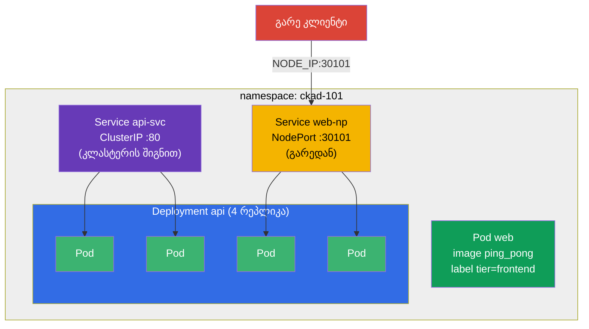

[Русская версия](README_RU.MD) · [Eng version](README.MD) · [Versión en español](README_ES.MD) · [Version française](README_FR.MD) · [Deutsche Version](README_DE.MD) · [繁體中文版](README_TW.MD) · [日本語版](README_JP.MD)

# Lab 101 — Kubernetes-ის საფუძვლები: pod-ები, Deployment, namespace-ები, ლეიბლები, Service

## აღწერა

CKA + CKAD კურსის პირველი პრაქტიკული სამუშაო და საფუძველი ყველა შემდგომისთვის. აქ თქვენ
ამუშავებთ ბაზისურ ოპერაციათა ნაკრებს, რომელიც სიტყვასიტყვით ყველა mock-გამოცდაში და ყველა
რეალურ ამოცანაში გვხვდება: რესურსების იზოლაცია **namespace**-ში, ერთეული **pod**-ის
გაშვება, აპლიკაციის მართვა **Deployment**-ის მეშვეობით (შექმნა, მასშტაბირება), pod-ების
დაკავშირება **Service**-ით (შიდა ClusterIP და გარე NodePort) და კლასტერიდან მონაცემების
ამოღება **JSONPath**-ის საშუალებით.

ყველა დავალება გამოცდის სტილშია გაფორმებული (როგორც რეალური CKA/CKAD კითხვები) და მათი
შემოწმება ავტომატურად ხდება ბრძანებით `check_result`. რეკომენდებულია ამოხსნა იმპერატიული
ბრძანებებით (`kubectl run/create/expose`) — გამოცდაზე ეს ყველაზე სწრაფი გზაა.

## მიზანი

განამტკიცოთ კურსის თავების მასალა:

- [თავი 2. Kubernetes-ის არქიტექტურა](../../course/02/ge.md) — რისგან შედგება კლასტერი
- [თავი 3. მუშაობა kubectl-თან](../../course/03/ge.md) — იმპერატიული სტილი, `--dry-run`, JSONPath
- [თავი 4. Pod-ები](../../course/04/ge.md) — გაშვების ბაზისური ერთეული
- [თავი 5. ReplicaSet და Deployment](../../course/05/ge.md) — რეპლიკების მართვა
- [თავი 6. Namespace-ები, ლეიბლები, სელექტორები](../../course/06/ge.md) — ორგანიზება და კავშირები
- [თავი 7. Services](../../course/07/ge.md) — სტაბილური წვდომა და დატვირთვის ბალანსირება

## რას ვქმნით და რისთვის

ამ ლაბორატორიაში ნაბიჯ-ნაბიჯ ვაწყობთ პატარა, მაგრამ სრულ აპლიკაციას ცალკე namespace-ში.
თითოეული ობიექტი თავის ამოცანას ასრულებს:

| ობიექტი | რა არის ეს | რისთვის არის ამ ლაბორატორიაში |
|---------|------------|-------------------------------|
| **Namespace `ckad-101`** | namespace — კლასტერის სექცია | ლაბორატორიის ყველა რესურსს ვინახავთ საკუთარ namespace-ში, სხვებისთვის ხელის შეშლის გარეშე (თავი 6) |
| **Pod `web`** ლეიბლით `tier=frontend` | ერთეული pod აპლიკაციით | ვსწავლობთ pod-ის გაშვებას და ლეიბლის მიმაგრებას, რომლითაც მას შემდეგ სელექტორები პოულობენ (თავები 4, 6) |
| **Deployment `api`** (4 რეპლიკა) | კონტროლერი ReplicaSet-ის ზემოთ | აპლიკაციას ვუშვებთ „სწორად“ — თვითაღდგენით და მასშტაბირებით, და არა შიშველი pod-ით (თავი 5) |
| **Service `api-svc`** (ClusterIP) | სტაბილური შიდა მისამართი | Deployment-ის pod-ებს ვაძლევთ ერთიან შესვლის წერტილს კლასტერის შიგნით და ვამოწმებთ, რომ Service-მა pod-ები რეალურად იპოვა (Endpoints, თავი 7) |
| **Service `web-np`** (NodePort) | გარე წვდომა node-ის პორტით | ვსწავლობთ აპლიკაციის გარეთ გამოტანას — mock-გამოცდების ხშირი ამოცანა (თავი 7) |
| **JSONPath-შერჩევა** | ველების ამოღება API-ს გავლით | ვწვრთნით უნარს „მონაცემები ჩაწერე ფაილში“, რომელიც თითქმის ყველა mock-გამოცდაშია (თავი 3) |

საბოლოო სურათი იმისა, რაც განთავსდება:



## ინფრასტრუქტურა

გარემო იშლება AWS-ში (`eu-central-1`) Terragrunt-ის მეშვეობით და შედგება:

| კომპონენტი | აღწერა                                                    |
|------------|-----------------------------------------------------------|
| `vpc`      | VPC `10.10.0.0/16` საჯარო ქვექსელებით                      |
| `ssh-keys` | SSH-გასაღებები node-ებზე წვდომისთვის                        |
| `k8s-1`    | Kubernetes `1.35.2` (kubeadm), CNI Calico, დაყენებულია metrics-server |
| `worker`   | სამუშაო მანქანა `kubectl`-ით, კლასტერზე წვდომით და `check_result`-ით |

ინსტანსები: `t4g.medium` (master), Ubuntu `22.04`. კლასტერი ერთკვანძიანია — master-ს
მოშორებულია taint `control-plane`, ამიტომ pod-ები პირდაპირ მასზე იგეგმება.

## განთავსება

```bash
TASK=101 make run_cka_task
```

შექმნის შემდეგ დაუკავშირდით სამუშაო მანქანას (worker) SSH-ით და დავალებები შეასრულეთ
იქიდან. `kubectl` უკვე კონფიგურირებულია კონტექსტზე `cluster1-admin@cluster1`.

სასარგებლო ბრძანებები სამუშაო მანქანაზე:

```bash
time_left       # რამდენი დრო დარჩა
check_result    # ამოხსნის შემოწმება
```

## დავალებები

---
|        **1**        | **Namespace ლაბორატორიის რესურსებისთვის**                    |
| :-----------------: | :----------------------------------------------------------- |
| რას ვაკეთებთ        | შექმენით namespace სახელით `ckad-101`. ლაბორატორიის ყველა დანარჩენი ობიექტი იქმნება **მის შიგნით**, რომ კლასტერის სხვა რესურსებს ხელი არ შეეშლოს. |
| მიღების კრიტერიუმები | - namespace `ckad-101` არსებობს. |
---
|        **2**        | **ერთეული Pod label-ით**                                     |
| :-----------------: | :----------------------------------------------------------- |
| რას ვაკეთებთ        | namespace `ckad-101`-ში გაუშვით ერთეული Pod სახელით `web`, კონტეინერის image `viktoruj/ping_pong:latest` (ეს სასწავლო HTTP-სერვერია პორტზე `8080`). Pod-ს მიამაგრეთ label `tier=frontend` (ასეთი label-ებით ობიექტები შემდეგ ერთმანეთს selector-ით პოულობენ). |
| მიღების კრიტერიუმები | - Pod `web` namespace `ckad-101`-ში;<br/>- კონტეინერის image — `viktoruj/ping_pong`;<br/>- Pod-ს აქვს label `tier=frontend`. |
---
|        **3**        | **Deployment 4 რეპლიკაზე**                                   |
| :-----------------: | :----------------------------------------------------------- |
| რას ვაკეთებთ        | namespace `ckad-101`-ში შექმენით Deployment სახელით `api`, კონტეინერის image `viktoruj/ping_pong:latest`. დაამასშტაბირეთ `4` რეპლიკამდე და დაელოდეთ, სანამ ოთხივე Pod მზად (Ready) გახდება. |
| მიღების კრიტერიუმები | - Deployment `api` namespace `ckad-101`-ში;<br/>- კონტეინერის image — `viktoruj/ping_pong`;<br/>- `4` მზა (ready) რეპლიკა. |
---
|        **4**        | **ClusterIP Service Deployment-ის წინ**                      |
| :-----------------: | :----------------------------------------------------------- |
| რას ვაკეთებთ        | namespace `ckad-101`-ში შექმენით Service სახელით `api-svc` ტიპით **ClusterIP**, რომელიც შეარჩევს Deployment `api`-ის Pod-ებს. Service-ის პორტი — `80`, `targetPort` (პორტი Pod-ებზე) — `8080` (ping_pong აპლიკაციის HTTP-პორტი). დარწმუნდით, რომ Service-მა Pod-ები იპოვა (მისი Endpoints არ არის ცარიელი). |
| მიღების კრიტერიუმები | - Service `api-svc` namespace `ckad-101`-ში, პორტი `80`;<br/>- Endpoints არ არის ცარიელი (Service დაკავშირებულია `api`-ის Pod-ებთან). |
---
|        **5**        | **NodePort Service გარეთ**                                   |
| :-----------------: | :----------------------------------------------------------- |
| რას ვაკეთებთ        | namespace `ckad-101`-ში შექმენით Service სახელით `web-np` ტიპით **NodePort** Deployment `api`-სთვის (`targetPort` — `8080`). Service-ის პორტი — `80`, ხოლო node-ებზე ის ხელმისაწვდომი უნდა იყოს ფიქსირებულ პორტზე `nodePort: 30101`. |
| მიღების კრიტერიუმები | - Service `web-np` namespace `ckad-101`-ში, ტიპი `NodePort`;<br/>- Service-ის პორტი `80`;<br/>- `nodePort` = `30101`. |
---
|        **6**        | **JSONPath: Pod-ების სახელები ფაილში**                       |
| :-----------------: | :----------------------------------------------------------- |
| რას ვაკეთებთ        | `kubectl ... -o jsonpath`-ის დახმარებით მიიღეთ namespace `ckad-101`-ის **ყველა** Pod-ის სახელი და შეინახეთ ფაილში `/var/work/tests/artifacts/6/pods.txt` (ფაილში კერძოდ უნდა იყოს Pod `web`-ის და Deployment `api`-ის Pod-ების სახელები). |
| მიღების კრიტერიუმები | - ფაილი `/var/work/tests/artifacts/6/pods.txt` არ არის ცარიელი და შეიცავს pod-ების სახელებს (მათ შორის `web` და `api`). |
---

## შედეგის შემოწმება

სამუშაო მანქანაზე გაუშვით ავტომატური შემოწმება:

```bash
check_result
```

სკრიპტი გაატარებს ტესტებს და აჩვენებს, რამდენი დავალებაა შესრულებული.

## ამოხსნა

ეტალონური ამოხსნა: [worker/files/solutions/1_GE.MD](worker/files/solutions/1_GE.MD)

## Mock-გამოცდების დაფარვა

ლაბორატორია ფარავს mock-ების ბაზისურ დავალებებს: CKA mock 01 (№1, 2, 3, 5, 6, 8), CKA mock 02
(№2, 3, 5, 6, 7, 8, 9), CKAD mock 01 (№1, 2, 5) — pod-ები, namespace-ები, ლეიბლები,
Deployment, მასშტაბირება, ClusterIP/NodePort სერვისები და გამოტანა JSONPath-ით.

## კლასტერისა და რესურსების წაშლა

```bash
TASK=101 make delete_cka_task
```
