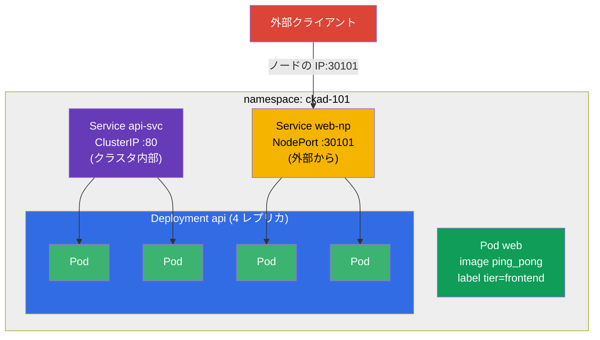

[Русская версия](README_RU.MD) · [Eng version](README.MD) · [Versión en español](README_ES.MD) · [Version française](README_FR.MD) · [Deutsche Version](README_DE.MD) · [ქართული ვერსია](README_GE.MD) · [繁體中文版](README_TW.MD)

# Lab 101 - Kubernetes の基礎：Pod、Deployment、namespace、ラベル、Service

## 概要

CKA + CKAD コースの最初の実習であり、以降のすべての実習の土台です。ここでは
模擬試験や実務のあらゆる場面で登場する基本操作の一式を
練習します：**namespace** によるリソースの分離、単一の **Pod** の起動、
**Deployment** によるアプリケーションの管理（作成、
スケーリング）、**Service**（クラスタ内部の ClusterIP と外部向けの
NodePort）による Pod の接続、そして **JSONPath** によるクラスタからのデータ取得です。

すべての課題は試験形式（実際の CKA/CKAD の問題と同じスタイル）で書かれており、
`check_result` コマンドで自動的に検証されます。解答には命令型のコマンド
（`kubectl run/create/expose`）を使うことをおすすめします - 試験ではこれが最速です。

## 目的

次のコース章の内容を定着させます：

- [第 2 章。Kubernetes のアーキテクチャ](../../course/02/README.md) - クラスタは何で構成されるか
- [第 3 章。kubectl の使い方](../../course/03/README.md) - 命令型、`--dry-run`、JSONPath
- [第 4 章。Pod](../../course/04/README.md) - 実行の基本単位
- [第 5 章。ReplicaSet と Deployment](../../course/05/README.md) - レプリカの管理
- [第 6 章。Namespaces、ラベル、セレクター](../../course/06/README.md) - 整理と関連付け
- [第 7 章。Services](../../course/07/README.md) - 安定したアクセスと負荷分散

## 何を作り、なぜ作るのか

この実習では、独立した namespace の中に小さくても完結したアプリケーションを
一歩ずつ組み立てます。各オブジェクトにはそれぞれの役割があります：

| オブジェクト | これは何か | この実習での役割 |
|--------|---------|-------------------|
| **Namespace `ckad-101`** | namespace - クラスタの区画 | 実習のすべてのリソースを自分の namespace に置き、他に干渉しないようにする（第 6 章） |
| **Pod `web`**（ラベル `tier=frontend` 付き） | アプリケーションを実行する単一の Pod | Pod の起動と、後にセレクターが探す手がかりとなるラベルの付け方を学ぶ（第 4、6 章） |
| **Deployment `api`**（4 レプリカ） | ReplicaSet の上に立つコントローラー | 素の Pod ではなく、自己修復とスケーリングを備えた「正しい方法」でアプリケーションを実行する（第 5 章） |
| **Service `api-svc`**（ClusterIP） | 安定した内部アドレス | Deployment の Pods にクラスタ内部の統一された入口を与え、Service が実際に Pods を見つけたことを確認する（Endpoints、第 7 章） |
| **Service `web-np`**（NodePort） | ノードのポート経由の外部アクセス | アプリケーションを外部に公開する方法を学ぶ - 模擬試験でよく出る課題（第 7 章） |
| **JSONPath による抽出** | API 経由でフィールドを取り出す | ほぼすべての模擬試験に出てくる「データをファイルに出力する」スキルを鍛える（第 3 章） |

最終的にデプロイされる全体像：



## インフラ

環境は Terragrunt により AWS（`eu-central-1`）に展開され、次の要素で構成されます：

| コンポーネント | 説明                                                    |
|------------|-------------------------------------------------------------|
| `vpc`      | パブリックサブネットを持つ VPC `10.10.0.0/16`                    |
| `ssh-keys` | ノードへアクセスするための SSH キー                                |
| `k8s-1`    | Kubernetes `1.35.2`（kubeadm）、CNI Calico、metrics-server 導入済み |
| `worker`   | `kubectl`、クラスタへのアクセス、`check_result` を備えた作業マシン |

インスタンス：`t4g.medium`（master）、Ubuntu `22.04`。クラスタは単一ノード構成で、master の
taint は解除されています（`control-plane` taint を削除）。そのため Pod は master 上に直接スケジュールされます。

## デプロイ

```bash
TASK=101 make run_cka_task
```

作成が完了したら、SSH で作業マシン（worker）に接続し、そこから課題を進めてください。
`kubectl` はすでに `cluster1-admin@cluster1` コンテキストに設定されています。

作業マシンで使える便利なコマンド：

```bash
time_left       # 残り時間
check_result    # 解答をチェックする
```

## 課題

---
|        **1**        | **実習リソース用の namespace**                              |
| :-----------------: | :----------------------------------------------------------- |
| やること            | `ckad-101` という名前の namespace を作成してください。実習の他のすべてのオブジェクトは、クラスタの他のリソースに干渉しないよう、**その中に**作成します。 |
| 受け入れ基準        | - namespace `ckad-101` が存在する。 |
---
|        **2**        | **label 付きの単一 Pod**                                    |
| :-----------------: | :----------------------------------------------------------- |
| やること            | namespace `ckad-101` の中で、`web` という名前の単一 Pod をコンテナイメージ `viktoruj/ping_pong:latest` で起動してください（これは `8080` ポートで動く学習用の HTTP サーバーです）。この Pod に label `tier=frontend` を付けてください（オブジェクトは後にこの種の label を使い、selector で互いを見つけます）。 |
| 受け入れ基準        | - namespace `ckad-101` に Pod `web` がある；<br/>- コンテナイメージが `viktoruj/ping_pong` である；<br/>- Pod に label `tier=frontend` がある。 |
---
|        **3**        | **4 レプリカの Deployment**                                  |
| :-----------------: | :----------------------------------------------------------- |
| やること            | namespace `ckad-101` の中で、`api` という名前の Deployment をコンテナイメージ `viktoruj/ping_pong:latest` で作成してください。これを `4` レプリカにスケールし、4 つの Pod すべてが Ready になるまで待ちます。 |
| 受け入れ基準        | - namespace `ckad-101` に Deployment `api` がある；<br/>- コンテナイメージが `viktoruj/ping_pong` である；<br/>- `4` つの ready なレプリカがある。 |
---
|        **4**        | **Deployment の前に置く ClusterIP Service**                       |
| :-----------------: | :----------------------------------------------------------- |
| やること            | namespace `ckad-101` の中で、Deployment `api` の Pods を選択する **ClusterIP** タイプの Service を `api-svc` という名前で作成してください。Service のポートは `80`、`targetPort`（Pods 側のポート）は `8080`（ping_pong アプリの HTTP ポート）です。Service が Pods を見つけていること（Endpoints が空でないこと）を確認してください。 |
| 受け入れ基準        | - namespace `ckad-101` に Service `api-svc` があり、ポートは `80`；<br/>- Endpoints が空でない（Service が `api` の Pods に紐づいている）。 |
---
|        **5**        | **外部向けの NodePort Service**                                  |
| :-----------------: | :----------------------------------------------------------- |
| やること            | namespace `ckad-101` の中で、Deployment `api` 用に **NodePort** タイプの Service を `web-np` という名前で作成してください（`targetPort` は `8080`）。Service のポートは `80` で、ノード上では固定ポート `nodePort: 30101` でアクセスできる必要があります。 |
| 受け入れ基準        | - namespace `ckad-101` に Service `web-np` があり、タイプは `NodePort`；<br/>- Service のポートが `80`；<br/>- `nodePort` = `30101`。 |
---
|        **6**        | **JSONPath：Pods の名前をファイルへ**                              |
| :-----------------: | :----------------------------------------------------------- |
| やること            | `kubectl ... -o jsonpath` を使って namespace `ckad-101` の**すべての** Pods の名前を取得し、ファイル `/var/work/tests/artifacts/6/pods.txt` に保存してください（ファイルには特に Pod `web` と Deployment `api` の Pods の名前が含まれている必要があります）。 |
| 受け入れ基準        | - ファイル `/var/work/tests/artifacts/6/pods.txt` が空でなく、Pod の名前（`web` と `api` を含む）が入っている。 |
---

## 結果のチェック

作業マシンで自動チェックを実行します：

```bash
check_result
```

スクリプトがテストを実行し、いくつの課題が完了したかを表示します。

## 解答

参考解答：[worker/files/solutions/1_JP.MD](worker/files/solutions/1_JP.MD)

## 模擬試験のカバー範囲

この実習は模擬試験の基本課題をカバーします：CKA mock 01（第 1、2、3、5、6、8 問）、CKA mock 02
（第 2、3、5、6、7、8、9 問）、CKAD mock 01（第 1、2、5 問） - Pod、namespace、ラベル、Deployment、
スケーリング、ClusterIP/NodePort サービス、そして JSONPath による出力です。

## クラスタとリソースの削除

```bash
TASK=101 make delete_cka_task
```
