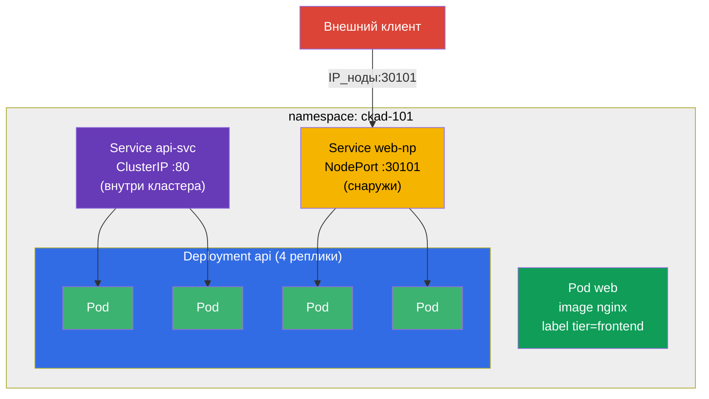

# Lab 101 — Основы Kubernetes: поды, Deployment, namespaces, метки, Service

## Описание

Первая практическая работа курса CKA + CKAD и фундамент для всех последующих. Здесь вы
отрабатываете базовый набор операций, который встречается буквально в каждом
мок-экзамене и в каждой реальной задаче: изоляция ресурсов в **namespace**, запуск
одиночного **пода**, управление приложением через **Deployment** (создание,
масштабирование), связывание подов **Service** (внутренним ClusterIP и внешним
NodePort) и извлечение данных из кластера через **JSONPath**.

Все задания оформлены в экзаменационном стиле (как реальные вопросы CKA/CKAD) с
автоматической проверкой командой `check_result`. Решать рекомендуется императивными
командами (`kubectl run/create/expose`) — на экзамене это самый быстрый путь.

## Цель

Закрепить материал глав курса:

- [Глава 2. Архитектура Kubernetes](../../course/02/ru.md) — из чего состоит кластер
- [Глава 3. Работа с kubectl](../../course/03/ru.md) — императив, `--dry-run`, JSONPath
- [Глава 4. Поды](../../course/04/ru.md) — базовая единица запуска
- [Глава 5. ReplicaSet и Deployment](../../course/05/ru.md) — управление репликами
- [Глава 6. Namespaces, метки, селекторы](../../course/06/ru.md) — организация и связи
- [Глава 7. Services](../../course/07/ru.md) — стабильный доступ и балансировка

## Что мы создаём и зачем

В этой лабе мы шаг за шагом собираем маленькое, но полное приложение в отдельном
namespace. Каждый объект решает свою задачу:

| Объект | Что это | Зачем в этой лабе |
|--------|---------|-------------------|
| **Namespace `ckad-101`** | неймспейс — раздел кластера | держим все ресурсы лабы в своём неймспейсе, не мешая другим (глава 6) |
| **Pod `web`** с меткой `tier=frontend` | одиночный под с приложением | учимся запускать под и вешать метку, по которой его потом находят селекторы (главы 4, 6) |
| **Deployment `api`** (4 реплики) | контроллер над ReplicaSet | запускаем приложение «правильно» — с самовосстановлением и масштабированием, а не голым подом (глава 5) |
| **Service `api-svc`** (ClusterIP) | стабильный внутренний адрес | даём подам деплоя единую точку входа внутри кластера и проверяем, что сервис реально нашёл поды (Endpoints, глава 7) |
| **Service `web-np`** (NodePort) | внешний доступ через порт ноды | учимся выставлять приложение наружу — частая задача моков (глава 7) |
| **JSONPath-выборка** | извлечение полей через API | тренируем навык «выведи данные в файл», который есть почти в каждом мок-экзамене (глава 3) |

Итоговая картина того, что будет развёрнуто:



## Инфраструктура

Окружение разворачивается в AWS (`eu-central-1`) через Terragrunt и состоит из:

| Компонент  | Описание                                                    |
|------------|-------------------------------------------------------------|
| `vpc`      | VPC `10.10.0.0/16` с публичными подсетями                    |
| `ssh-keys` | SSH-ключи для доступа к нодам                                |
| `k8s-1`    | Kubernetes `1.35.2` (kubeadm), CNI Calico, установлен metrics-server |
| `worker`   | Рабочая машина с `kubectl`, доступом к кластеру и `check_result` |

Инстансы: `t3.medium` (master) Ubuntu `22.04`. Кластер одноузловой — master
«разтейнчен» (снят taint `control-plane`), поэтому поды планируются прямо на него.

## Развёртывание

```bash
TASK=101 make run_cka_task
```

После создания подключитесь к рабочей машине (worker) по SSH и выполняйте задания
оттуда. `kubectl` уже настроен на контекст `cluster1-admin@cluster1`.

Полезные команды на рабочей машине:

```bash
time_left       # сколько осталось времени
check_result    # проверить решение
```

## Задания

---
|        **1**        | **Создать неймспейс для всех ресурсов лабы**                   |
| :-----------------: | :------------------------------------------------------------- |
| Что делаем          | Заводим отдельный неймспейс, чтобы ресурсы лабы жили изолированно |
| Критерии приёмки    | - Namespace: `ckad-101`                                        |
---
|        **2**        | **Запустить одиночный под с меткой**                           |
| :-----------------: | :------------------------------------------------------------- |
| Что делаем          | Запускаем под и вешаем метку — по ней объекты находят друг друга |
| Критерии приёмки    | - Namespace: `ckad-101`<br/>- Pod: `web`<br/>- Image: `nginx`<br/>- Label: `tier=frontend` |
---
|        **3**        | **Развернуть Deployment и отмасштабировать до 4 реплик**       |
| :-----------------: | :------------------------------------------------------------- |
| Что делаем          | Запускаем приложение через контроллер и меняем число копий     |
| Критерии приёмки    | - Namespace: `ckad-101`<br/>- Deployment: `api`<br/>- Image: `nginx`<br/>- Реплик: `4` (все Ready) |
---
|        **4**        | **Выставить внутренний сервис перед деплоем**                  |
| :-----------------: | :------------------------------------------------------------- |
| Что делаем          | Даём подам деплоя стабильный ClusterIP и проверяем связь (Endpoints) |
| Критерии приёмки    | - Namespace: `ckad-101`<br/>- Service: `api-svc`, тип `ClusterIP`<br/>- Порт: `80` → targetPort `80`<br/>- Endpoints не пусты (сервис связан с подами `api`) |
---
|        **5**        | **Выставить приложение наружу через NodePort**                 |
| :-----------------: | :------------------------------------------------------------- |
| Что делаем          | Открываем доступ к деплою `api` снаружи по порту ноды          |
| Критерии приёмки    | - Namespace: `ckad-101`<br/>- Service: `web-np`, тип `NodePort`<br/>- Порт: `80`<br/>- nodePort: `30101` |
---
|        **6**        | **Извлечь данные через JSONPath в файл**                       |
| :-----------------: | :------------------------------------------------------------- |
| Что делаем          | Тренируем вывод полей через API — частый тип заданий на экзамене |
| Критерии приёмки    | - В файл `/var/work/tests/artifacts/6/pods.txt` записаны имена всех подов namespace `ckad-101` (через JSONPath) |
---

## Проверка результата

На рабочей машине запустите автоматическую проверку:

```bash
check_result
```

Скрипт прогонит тесты и покажет, сколько заданий выполнено.

## Решение

Эталонное решение: [worker/files/solutions/1.MD](worker/files/solutions/1.MD)

## Покрытие мок-экзаменов

Лаба закрывает базовые задания моков: CKA mock 01 (№1, 2, 3, 5, 6, 8), CKA mock 02
(№2, 3, 5, 6, 7, 8, 9), CKAD mock 01 (№1, 2, 5) — поды, namespaces, метки, Deployment,
масштабирование, ClusterIP/NodePort-сервисы и вывод через JSONPath.

## Удаление кластера и ресурсов

```bash
TASK=101 make delete_cka_task
```
