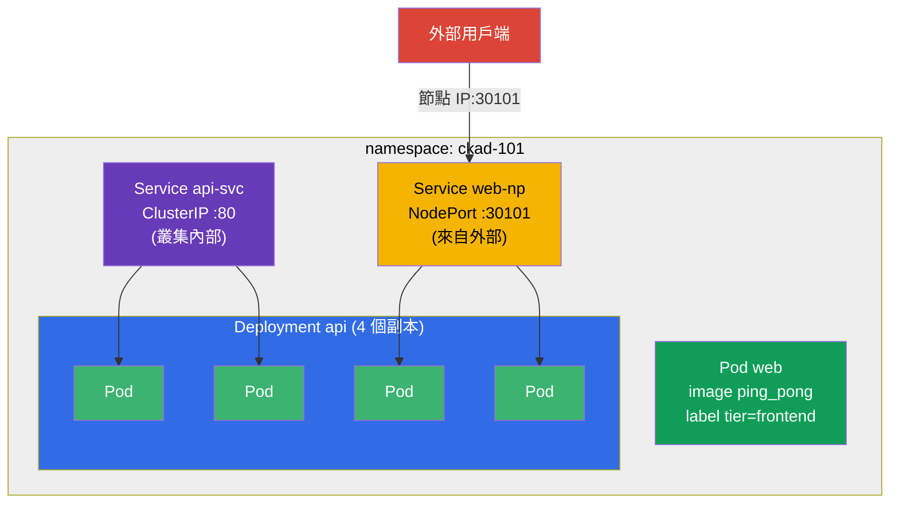

[Русская версия](README_RU.MD) · [Eng version](README.MD) · [Versión en español](README_ES.MD) · [Version française](README_FR.MD) · [Deutsche Version](README_DE.MD) · [ქართული ვერსია](README_GE.MD) · [日本語版](README_JP.MD)

# Lab 101 - Kubernetes 基礎:Pod、Deployment、namespace、標籤、Service

## 說明

CKA + CKAD 課程的第一個實作練習,也是後續所有練習的基礎。在這裡你會
練習一組最基本的操作,它們幾乎出現在每一份模擬考題和每一個真實任務中:
在 **namespace** 中隔離資源、執行單一 **Pod**、透過 **Deployment** 管理應用程式
(建立、擴縮)、用 **Service**(內部的 ClusterIP 與對外的 NodePort)
把 Pod 串接起來,以及透過 **JSONPath** 從叢集中
取出資料。

所有任務都以考試風格撰寫(就像真正的 CKA/CKAD 題目),並透過
`check_result` 指令自動驗證。建議使用命令式指令
(`kubectl run/create/expose`)來解題 - 在考試中這是最快的方式。

## 目標

鞏固以下課程章節的內容:

- [第 2 章。Kubernetes 架構](../../course/02/README.md) - 叢集由哪些部分組成
- [第 3 章。使用 kubectl](../../course/03/README.md) - 命令式風格、`--dry-run`、JSONPath
- [第 4 章。Pod](../../course/04/README.md) - 最基本的執行單位
- [第 5 章。ReplicaSet 與 Deployment](../../course/05/README.md) - 管理副本
- [第 6 章。Namespaces、標籤、選擇器](../../course/06/README.md) - 組織與關聯
- [第 7 章。Services](../../course/07/README.md) - 穩定的存取與負載平衡

## 我們要建立什麼,以及為什麼

在這個實驗中,我們一步一步在一個獨立的 namespace 裡組裝一個小而完整的
應用程式。每個物件都有自己的用途:

| 物件 | 這是什麼 | 為什麼出現在這個實驗中 |
|--------|---------|-------------------|
| **Namespace `ckad-101`** | 一個 namespace - 叢集的一個分區 | 把實驗的所有資源放在自己的 namespace 中,不干擾其他資源(第 6 章) |
| **Pod `web`** 帶標籤 `tier=frontend` | 執行應用程式的單一 Pod | 學會執行 Pod 並掛上標籤,之後 selector 就靠這個標籤找到它(第 4、6 章) |
| **Deployment `api`**(4 個副本) | 位於 ReplicaSet 之上的控制器 | 用「正確的方式」執行應用程式 - 具備自我修復與擴縮能力,而不是裸的 Pod(第 5 章) |
| **Service `api-svc`**(ClusterIP) | 穩定的內部位址 | 為 Deployment 的 Pods 提供叢集內部的統一入口,並確認 Service 確實找到了 Pods(Endpoints,第 7 章) |
| **Service `web-np`**(NodePort) | 透過節點埠對外存取 | 學會把應用程式對外開放 - 模擬考中的常見題目(第 7 章) |
| **JSONPath 查詢** | 透過 API 取出欄位 | 練習「把資料輸出到檔案」這項技巧,它幾乎出現在每一份模擬考中(第 3 章) |

最終部署出來的整體樣貌:



## 基礎架構

環境透過 Terragrunt 部署在 AWS(`eu-central-1`),由以下部分組成:

| 元件       | 說明                                                        |
|------------|-------------------------------------------------------------|
| `vpc`      | VPC `10.10.0.0/16`,含公有子網路                              |
| `ssh-keys` | 用於存取節點的 SSH 金鑰                                       |
| `k8s-1`    | Kubernetes `1.35.2`(kubeadm),CNI Calico,已安裝 metrics-server |
| `worker`   | 工作機,具備 `kubectl`、叢集存取權限與 `check_result`           |

執行個體:`t3.medium`(master),Ubuntu `22.04`。叢集為單節點 - master
已解除污點(移除了 `control-plane` taint),因此 Pod 會直接排程到它上面。

## 部署

```bash
TASK=101 make run_cka_task
```

建立完成後,請透過 SSH 連線到工作機(worker),並在那裡完成任務。
`kubectl` 已經指向 `cluster1-admin@cluster1` context。

工作機上的實用指令:

```bash
time_left       # 還剩多少時間
check_result    # 檢查解答
```

## 任務

---
|        **1**        | **實驗資源使用的 namespace**                                  |
| :-----------------: | :----------------------------------------------------------- |
| 要做什麼            | 建立名為 `ckad-101` 的 namespace。實驗中其他所有物件都建立在**它裡面**,以免干擾叢集中的其他資源。 |
| 驗收標準            | - namespace `ckad-101` 存在。 |
---
|        **2**        | **帶 label 的單一 Pod**                                      |
| :-----------------: | :----------------------------------------------------------- |
| 要做什麼            | 在 namespace `ckad-101` 中執行名為 `web` 的單一 Pod,容器映像為 `viktoruj/ping_pong:latest`(這是一個監聽 `8080` 埠的教學用 HTTP 伺服器)。為該 Pod 掛上 label `tier=frontend`(物件之後就是透過這類 label 經由 selector 互相找到彼此)。 |
| 驗收標準            | - namespace `ckad-101` 中有 Pod `web`;<br/>- 容器映像為 `viktoruj/ping_pong`;<br/>- Pod 具有 label `tier=frontend`。 |
---
|        **3**        | **4 個副本的 Deployment**                                     |
| :-----------------: | :----------------------------------------------------------- |
| 要做什麼            | 在 namespace `ckad-101` 中建立名為 `api` 的 Deployment,容器映像為 `viktoruj/ping_pong:latest`。將它擴充到 `4` 個副本,並等到全部 4 個 Pod 都變成就緒(Ready)。 |
| 驗收標準            | - namespace `ckad-101` 中有 Deployment `api`;<br/>- 容器映像為 `viktoruj/ping_pong`;<br/>- `4` 個就緒(ready)的副本。 |
---
|        **4**        | **Deployment 前面的 ClusterIP Service**                       |
| :-----------------: | :----------------------------------------------------------- |
| 要做什麼            | 在 namespace `ckad-101` 中建立名為 `api-svc` 的 **ClusterIP** 類型 Service,它選取 Deployment `api` 的 Pods。Service 的埠為 `80`,`targetPort`(Pods 上的埠)為 `8080`(ping_pong 應用程式的 HTTP 埠)。請確認 Service 找到了 Pods(它的 Endpoints 不為空)。 |
| 驗收標準            | - namespace `ckad-101` 中有 Service `api-svc`,埠為 `80`;<br/>- Endpoints 不為空(Service 已與 `api` 的 Pods 綁定)。 |
---
|        **5**        | **對外的 NodePort Service**                                   |
| :-----------------: | :----------------------------------------------------------- |
| 要做什麼            | 在 namespace `ckad-101` 中為 Deployment `api` 建立名為 `web-np` 的 **NodePort** 類型 Service(`targetPort` 為 `8080`)。Service 的埠為 `80`,而在節點上必須能透過固定埠 `nodePort: 30101` 存取。 |
| 驗收標準            | - namespace `ckad-101` 中有 Service `web-np`,類型為 `NodePort`;<br/>- Service 的埠為 `80`;<br/>- `nodePort` = `30101`。 |
---
|        **6**        | **JSONPath:把 Pods 的名稱寫入檔案**                            |
| :-----------------: | :----------------------------------------------------------- |
| 要做什麼            | 使用 `kubectl ... -o jsonpath` 取得 namespace `ckad-101` 中**所有** Pods 的名稱,並儲存到檔案 `/var/work/tests/artifacts/6/pods.txt`(檔案中特別要有 Pod `web` 以及 Deployment `api` 的 Pods 名稱)。 |
| 驗收標準            | - 檔案 `/var/work/tests/artifacts/6/pods.txt` 不為空,且包含 Pod 名稱(其中包括 `web` 與 `api`)。 |
---

## 檢查結果

在工作機上執行自動檢查:

```bash
check_result
```

腳本會跑完測試,並顯示已完成多少任務。

## 解答

參考解答:[worker/files/solutions/1_TW.MD](worker/files/solutions/1_TW.MD)

## 模擬考涵蓋範圍

本實驗涵蓋模擬考的基礎題目:CKA mock 01(第 1、2、3、5、6、8 題)、CKA mock 02
(第 2、3、5、6、7、8、9 題)、CKAD mock 01(第 1、2、5 題)- Pod、namespace、標籤、Deployment、
擴縮、ClusterIP/NodePort Service 以及透過 JSONPath 輸出。

## 刪除叢集與資源

```bash
TASK=101 make delete_cka_task
```
