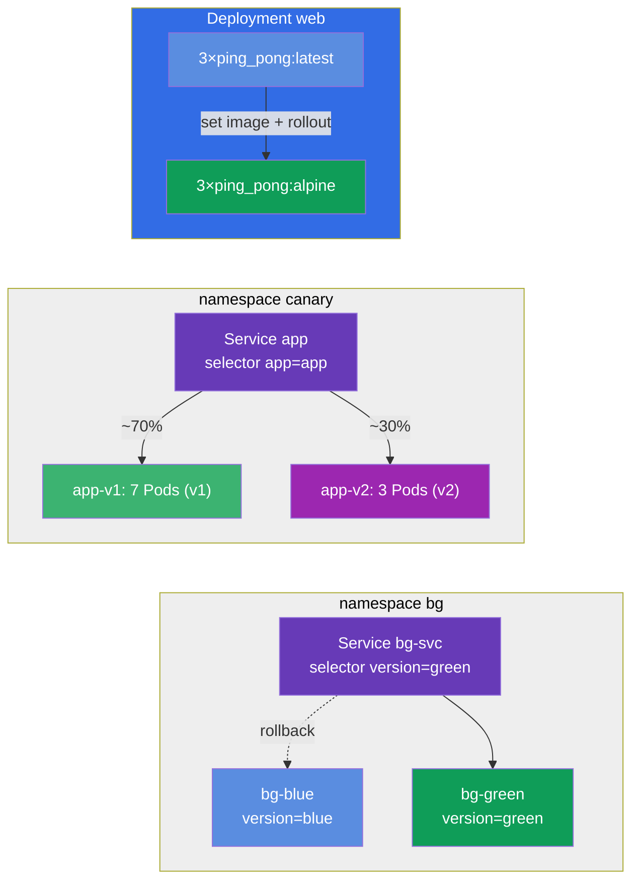

[Русская версия](README_RU.MD) · [Versión en español](README_ES.MD) · [Version française](README_FR.MD) · [Deutsche Version](README_DE.MD) · [ქართული ვერსია](README_GE.MD) · [繁體中文版](README_TW.MD) · [日本語版](README_JP.MD)

# Lab 102 — Updates and Deployment Strategies: rolling update, rollback, canary, blue/green

## Description

A hands-on lab about updating applications with zero downtime. Here you practice what
happens to an application in production every day: a smooth rollout of a new version (rolling
update), recording the reason for the change (change-cause), a fast rollback to the previous
version, and the finer release strategies — canary (the new version receives only part of the
traffic) and blue/green (an instant switch between two environments).

All tasks are written in exam style (like real CKA/CKAD questions) with automatic
validation via the `check_result` command. It is recommended to solve them with imperative
commands (`kubectl create/set image/rollout/patch`) — on the exam that is the fastest path.

## Goal

Reinforce the material from the course chapters:

- [Chapter 8. Deployment: rolling update and rollback](../../course/08/README.md) — smooth rollout, revision history, change-cause, rollback
- [Chapter 9. Deployment strategies: blue/green and canary](../../course/09/README.md) — splitting traffic across versions and switching environments

## What We Build and Why

In this lab we walk through the full lifecycle of an application update — from a smooth
rollout to a rollback and advanced release strategies. Every object serves its own purpose:

| Object | What it is | Why it is in this lab |
|--------|------------|-----------------------|
| **Deployment `web`** | an application Deployment with a versioned image | on it we practice a rolling update, recording the change-cause and the safe rollout strategy `maxSurge`/`maxUnavailable` (chapter 8) |
| **Deployment `roll`** | a separate Deployment dedicated to rollback | we update it and roll back to the previous version with `rollout undo` (chapter 8) |
| **namespace `canary` + Service `app` + Deployments `app-v1`/`app-v2`** | a canary release | one Service splits traffic across two versions proportionally to the number of Pods (v1=7, v2=3 → v2 ≈ 30%) (chapter 9) |
| **namespace `bg` + Service `bg-svc` + Deployments `bg-blue`/`bg-green`** | blue/green | an instant version switch by changing the Service selector, and the rollback is just as instant (chapter 9) |

The final picture of what will be deployed:



## Infrastructure

The environment is deployed in AWS (`eu-central-1`) via Terragrunt and consists of:

| Component  | Description                                                  |
|------------|--------------------------------------------------------------|
| `vpc`      | VPC `10.10.0.0/16` with public subnets                        |
| `ssh-keys` | SSH keys for node access                                      |
| `k8s-1`    | Kubernetes `1.35.2` (kubeadm), Calico CNI, metrics-server installed |
| `worker`   | Work machine with `kubectl`, cluster access and `check_result` |

Instances: `t4g.medium` (master), Ubuntu `22.04`. The cluster is single-node — the master is
untainted (the `control-plane` taint is removed), so Pods are scheduled directly on it.

## Deployment

```bash
TASK=102 make run_cka_task
```

Once it is created, connect to the work machine (worker) over SSH and do the tasks from
there. `kubectl` is already pointed at the `cluster1-admin@cluster1` context.

Handy commands on the work machine:

```bash
time_left       # how much time is left
check_result    # check your solution
```

## Tasks

---
|        **1**        | **Deploy the baseline version of the application**             |
| :-----------------: | :------------------------------------------------------------- |
| What to do          | Create a Deployment named `web` with container image `viktoruj/ping_pong:latest` (a training HTTP server on port `8080`) and `3` replicas. Wait until all replicas become Ready. This is the Deployment we will update and tune later on. |
| Acceptance criteria | - Deployment `web` exists;<br/>- container image is `viktoruj/ping_pong:latest`;<br/>- `3` ready replicas. |
---
|        **2**        | **Roll out a new version smoothly and record the reason**      |
| :-----------------: | :------------------------------------------------------------- |
| What to do          | Perform a rolling update of Deployment `web` to image `viktoruj/ping_pong:alpine` and record the reason for the change in the `kubernetes.io/change-cause` annotation so it shows up in the rollout history (`rollout history`). Wait for the rollout to finish — the history must accumulate at least 2 revisions. |
| Acceptance criteria | - the image of Deployment `web` is updated to `viktoruj/ping_pong:alpine`;<br/>- the rollout history has ≥ 2 revisions. |
---
|        **3**        | **Roll a Deployment back to the previous version**             |
| :-----------------: | :------------------------------------------------------------- |
| What to do          | Create a separate Deployment named `roll` (image `viktoruj/ping_pong:latest`), update its image to another version (for example, `:alpine`), and then roll back to the previous version with `rollout undo`. After the rollback the image must be `viktoruj/ping_pong:latest` again, and the Deployment `generation` must be at least `3` (create + update + rollback). |
| Acceptance criteria | - Deployment `roll` exists;<br/>- after the rollback the image = `viktoruj/ping_pong:latest`;<br/>- there were several revisions (`generation` ≥ 3). |
---
|        **4**        | **Set up a canary release (~30% to the new version)**          |
| :-----------------: | :------------------------------------------------------------- |
| What to do          | Create namespace `canary`. In it deploy two Deployments of the same application: `app-v1` (`7` replicas, label `version=v1`) and `app-v2` (`3` replicas, label `version=v2`), both with image `viktoruj/ping_pong`. Create a single Service `app` (port `8080`, `targetPort 8080`) that selects the Pods of **both** versions by the shared label `app=app`. That way the share of traffic going to the new version is set by the replica count: v1=7, v2=3 → v2 gets ~30%. Make sure the Service found the Pods (Endpoints are not empty). |
| Acceptance criteria | - namespace `canary` exists;<br/>- Service `app`, selector `app=app`, port `8080`, Endpoints are not empty;<br/>- Deployment `app-v1`: `7` replicas, label `version=v1`;<br/>- Deployment `app-v2`: `3` replicas, label `version=v2` (image `viktoruj/ping_pong`). |
---
|        **5**        | **Configure a safe rollout strategy (surge)**                  |
| :-----------------: | :------------------------------------------------------------- |
| What to do          | Give Deployment `web` a safe rollout strategy: type `RollingUpdate` with `maxSurge: 2` and `maxUnavailable: 0`. With these settings new Pods come up before the old ones are terminated, so the application's capacity does not drop during the rollout. |
| Acceptance criteria | - Deployment `web` has strategy `RollingUpdate`;<br/>- `maxSurge: 2`;<br/>- `maxUnavailable: 0`. |
---
|        **6**        | **Blue/Green: an instant version switch**                      |
| :-----------------: | :------------------------------------------------------------- |
| What to do          | Create namespace `bg`. Deploy two environments of the same application in it: Deployment `bg-blue` (label `version=blue`) and `bg-green` (label `version=green`), image `viktoruj/ping_pong`. Create Service `bg-svc` and switch its selector to `version=green` so traffic moves to green instantly (Endpoints point to the green Pods). The rollback works the same way — switch the selector back to blue. |
| Acceptance criteria | - namespace `bg` exists;<br/>- Deployment `bg-blue` (label `version=blue`) and `bg-green` (label `version=green`), image `viktoruj/ping_pong`;<br/>- Service `bg-svc` is switched to `version=green` (Endpoints point to green). |
---

## Checking the Result

On the work machine run the automatic validation:

```bash
check_result
```

The script runs the tests and shows how many tasks are complete.

## Solution

Reference solution: [worker/files/solutions/1.MD](worker/files/solutions/1.MD)

## Mock Exam Coverage

The lab covers the mock-exam tasks about updates and deployment strategies: CKA mock 01 (#16 —
rolling update + record), CKAD mock 02 (#3 — rollback + scale, #9 — canary 30%) —
rolling update, change-cause, rollback, canary and blue/green.

## Deleting the Cluster and Resources

```bash
TASK=102 make delete_cka_task
```
