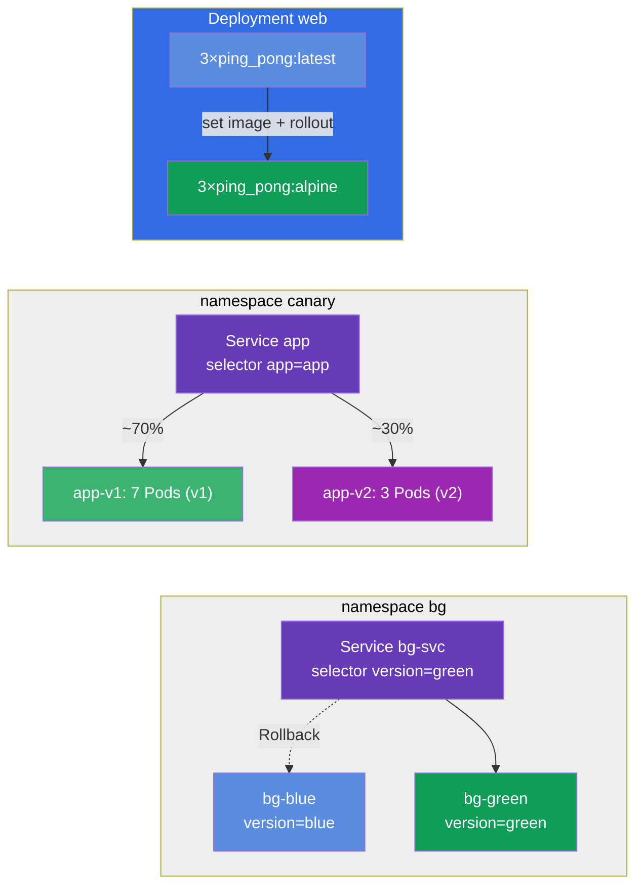

[Русская версия](README_RU.MD) · [Eng version](README.MD) · [Versión en español](README_ES.MD) · [Version française](README_FR.MD) · [ქართული ვერსია](README_GE.MD) · [繁體中文版](README_TW.MD) · [日本語版](README_JP.MD)

# Lab 102 — Updates und Deployment-Strategien: Rolling Update, Rollback, Canary, Blue/Green

## Beschreibung

Ein Praxis-Lab zum Aktualisieren von Anwendungen ohne Ausfallzeit. Hier übst du, was einer
Anwendung in der Produktion täglich passiert: das sanfte Ausrollen einer neuen Version
(Rolling Update), das Festhalten des Änderungsgrundes (change-cause), das schnelle
Zurückrollen auf die Vorversion (Rollback) sowie feinere Ausrollstrategien — Canary (die neue
Version erhält nur einen Teil des Traffics) und Blue/Green (sofortiges Umschalten zwischen
zwei Umgebungen).

Alle Aufgaben sind im Prüfungsstil formuliert (wie echte CKA/CKAD-Fragen) mit automatischer
Prüfung über den Befehl `check_result`. Empfohlen wird die Lösung mit imperativen Befehlen
(`kubectl create/set image/rollout/patch`) — in der Prüfung ist das der schnellste Weg.

## Ziel

Den Stoff der Kurskapitel festigen:

- [Kapitel 8. Deployment: Rolling Update und Rollback](../../course/08/de.md) — sanftes Ausrollen, Revisionshistorie, change-cause, Rollback
- [Kapitel 9. Deployment-Strategien: Blue/Green und Canary](../../course/09/de.md) — Traffic-Verteilung auf Versionen und Umschalten der Umgebungen

## Was wir erstellen und warum

In diesem Lab durchlaufen wir den vollständigen Lebenszyklus eines Anwendungsupdates — vom
sanften Ausrollen über das Rollback bis zu fortgeschrittenen Ausrollstrategien. Jedes Objekt
erfüllt seine eigene Aufgabe:

| Objekt | Was das ist | Warum in diesem Lab |
|--------|-------------|---------------------|
| **Deployment `web`** | Deployment der Anwendung mit Image-Version | daran üben wir Rolling Update, das Festhalten der change-cause und die sichere Ausrollstrategie `maxSurge`/`maxUnavailable` (Kapitel 8) |
| **Deployment `roll`** | separates Deployment für das Rollback | wir aktualisieren es und rollen mit `rollout undo` auf die Vorversion zurück (Kapitel 8) |
| **Namespace `canary` + Service `app` + Deployments `app-v1`/`app-v2`** | Canary-Ausrollung | ein Service verteilt den Traffic proportional zur Anzahl der Pods auf zwei Versionen (v1=7, v2=3 → v2 ≈ 30%) (Kapitel 9) |
| **Namespace `bg` + Service `bg-svc` + Deployments `bg-blue`/`bg-green`** | Blue/Green | sofortiges Umschalten der Version durch Ändern des Service-Selectors, das Rollback geht genauso schnell (Kapitel 9) |

Das Gesamtbild dessen, was ausgerollt wird:



## Infrastruktur

Die Umgebung wird in AWS (`eu-central-1`) über Terragrunt ausgerollt und besteht aus:

| Komponente | Beschreibung                                                 |
|------------|--------------------------------------------------------------|
| `vpc`      | VPC `10.10.0.0/16` mit öffentlichen Subnetzen                 |
| `ssh-keys` | SSH-Schlüssel für den Zugriff auf die Nodes                    |
| `k8s-1`    | Kubernetes `1.35.2` (kubeadm), CNI Calico, metrics-server installiert |
| `worker`   | Arbeitsmaschine mit `kubectl`, Cluster-Zugriff und `check_result` |

Instanzen: `t4g.medium` (Master), Ubuntu `22.04`. Der Cluster hat einen Node — beim Master
ist der Taint `control-plane` entfernt, daher werden Pods direkt auf ihm geplant.

## Bereitstellung

```bash
TASK=102 make run_cka_task
```

Verbinde dich nach dem Erstellen per SSH mit der Arbeitsmaschine (Worker) und erledige die
Aufgaben von dort. `kubectl` ist bereits auf den Kontext `cluster1-admin@cluster1`
eingestellt.

Nützliche Befehle auf der Arbeitsmaschine:

```bash
time_left       # wie viel Zeit noch bleibt
check_result    # Lösung prüfen
```

## Aufgaben

---
|        **1**        | **Die Basisversion der Anwendung ausrollen**                   |
| :-----------------: | :------------------------------------------------------------- |
| Was wir tun         | Erstelle ein Deployment mit dem Namen `web`, Container-Image `viktoruj/ping_pong:latest` (Lern-HTTP-Server auf Port `8080`), `3` Replicas. Warte, bis alle Replicas bereit (Ready) sind. Genau dieses Deployment aktualisieren und konfigurieren wir im Folgenden. |
| Akzeptanzkriterien  | - das Deployment `web` existiert;<br/>- Container-Image ist `viktoruj/ping_pong:latest`;<br/>- `3` bereite (ready) Replicas. |
---
|        **2**        | **Version sanft aktualisieren und den Grund festhalten**       |
| :-----------------: | :------------------------------------------------------------- |
| Was wir tun         | Aktualisiere das Image des Deployments `web` sanft (Rolling Update) auf `viktoruj/ping_pong:alpine` und halte den Änderungsgrund in der Annotation `kubernetes.io/change-cause` fest, damit er in der Rollout-Historie (`rollout history`) sichtbar ist. Warte, bis das Ausrollen fertig ist — in der Historie müssen mindestens 2 Revisionen stehen. |
| Akzeptanzkriterien  | - das Image des Deployments `web` ist auf `viktoruj/ping_pong:alpine` aktualisiert;<br/>- in der Rollout-Historie ≥ 2 Revisionen. |
---
|        **3**        | **Das Deployment auf die Vorversion zurückrollen**             |
| :-----------------: | :------------------------------------------------------------- |
| Was wir tun         | Erstelle ein separates Deployment mit dem Namen `roll` (Image `viktoruj/ping_pong:latest`), aktualisiere sein Image auf eine andere Version (zum Beispiel `:alpine`) und rolle dann mit `rollout undo` auf die Vorversion zurück. Nach dem Rollback muss das Image wieder `viktoruj/ping_pong:latest` sein und die `generation` des Deployments mindestens `3` betragen (Erstellen + Aktualisieren + Rollback). |
| Akzeptanzkriterien  | - das Deployment `roll` existiert;<br/>- nach dem Rollback Image = `viktoruj/ping_pong:latest`;<br/>- es gab mehrere Revisionen (`generation` ≥ 3). |
---
|        **4**        | **Canary-Ausrollung einrichten (~30% auf die neue Version)**   |
| :-----------------: | :------------------------------------------------------------- |
| Was wir tun         | Erstelle den Namespace `canary`. Rolle darin zwei Deployments derselben Anwendung aus: `app-v1` (`7` Replicas, Label `version=v1`) und `app-v2` (`3` Replicas, Label `version=v2`), beide mit dem Image `viktoruj/ping_pong`. Erstelle einen einzigen Service `app` (Port `8080`, `targetPort 8080`), der über das gemeinsame Label `app=app` die Pods **beider** Versionen auswählt. So wird der Traffic-Anteil der neuen Version über die Anzahl der Replicas gesteuert: v1=7, v2=3 → v2 erhält ~30%. Stelle sicher, dass der Service die Pods gefunden hat (Endpoints sind nicht leer). |
| Akzeptanzkriterien  | - der Namespace `canary` existiert;<br/>- Service `app`, Selector `app=app`, Port `8080`, Endpoints nicht leer;<br/>- Deployment `app-v1`: `7` Replicas, Label `version=v1`;<br/>- Deployment `app-v2`: `3` Replicas, Label `version=v2` (Image `viktoruj/ping_pong`). |
---
|        **5**        | **Eine sichere Ausrollstrategie einstellen (Surge)**           |
| :-----------------: | :------------------------------------------------------------- |
| Was wir tun         | Gib dem Deployment `web` eine sichere Ausrollstrategie: Typ `RollingUpdate` mit `maxSurge: 2` und `maxUnavailable: 0`. Mit diesen Einstellungen starten neue Pods, bevor die alten beendet werden, und die Kapazität der Anwendung sinkt während des Ausrollens nicht. |
| Akzeptanzkriterien  | - das Deployment `web` hat die Strategy `RollingUpdate`;<br/>- `maxSurge: 2`;<br/>- `maxUnavailable: 0`. |
---
|        **6**        | **Blue/Green: sofortiges Umschalten der Version**              |
| :-----------------: | :------------------------------------------------------------- |
| Was wir tun         | Erstelle den Namespace `bg`. Rolle darin zwei Umgebungen derselben Anwendung aus: Deployment `bg-blue` (Label `version=blue`) und `bg-green` (Label `version=green`), Image `viktoruj/ping_pong`. Erstelle den Service `bg-svc` und schalte seinen Selector auf `version=green`, damit der Traffic sofort auf green wechselt (die Endpoints zeigen auf die green-Pods). Das Rollback funktioniert genauso — den Selector zurück auf blue setzen. |
| Akzeptanzkriterien  | - der Namespace `bg` existiert;<br/>- Deployment `bg-blue` (Label `version=blue`) und `bg-green` (Label `version=green`), Image `viktoruj/ping_pong`;<br/>- der Service `bg-svc` ist auf `version=green` umgeschaltet (Endpoints zeigen auf green). |
---

## Ergebnisprüfung

Starte auf der Arbeitsmaschine die automatische Prüfung:

```bash
check_result
```

Das Skript führt die Tests aus und zeigt, wie viele Aufgaben erledigt sind.

## Lösung

Referenzlösung: [worker/files/solutions/1_DE.MD](worker/files/solutions/1_DE.MD)

## Abdeckung der Mock-Prüfungen

Das Lab deckt die Mock-Aufgaben zu Updates und Deployment-Strategien ab: CKA mock 01 (Nr. 16 —
Rolling Update + record), CKAD mock 02 (Nr. 3 — Rollback + Scale, Nr. 9 — Canary 30%) —
Rolling Update, change-cause, Rollback, Canary und Blue/Green.

## Löschen von Cluster und Ressourcen

```bash
TASK=102 make delete_cka_task
```
