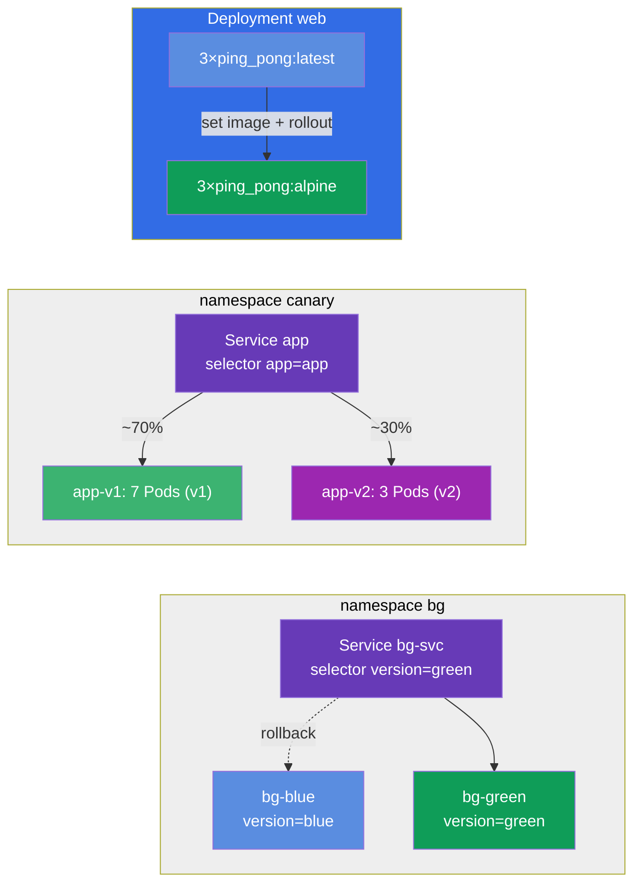

[Русская версия](README_RU.MD) · [Eng version](README.MD) · [Version française](README_FR.MD) · [Deutsche Version](README_DE.MD) · [ქართული ვერსია](README_GE.MD)

# Lab 102 — Actualizaciones y estrategias de despliegue: rolling update, rollback, canary, blue/green

## Descripción

Práctica sobre la actualización de aplicaciones sin tiempo de caída. Aquí trabajas lo que le
ocurre a una aplicación en producción cada día: el despliegue progresivo de una nueva versión
(rolling update), el registro del motivo del cambio (change-cause), la vuelta rápida a la
versión anterior (rollback) y estrategias de despliegue más finas: canary (la nueva versión
recibe solo una parte del tráfico) y blue/green (conmutación instantánea entre dos entornos).

Todas las tareas están redactadas en estilo de examen (como las preguntas reales de
CKA/CKAD) con verificación automática mediante el comando `check_result`. Se recomienda
resolverlas con comandos imperativos (`kubectl create/set image/rollout/patch`): en el
examen es el camino más rápido.

## Objetivo

Consolidar el material de los capítulos del curso:

- [Capítulo 8. Deployment: rolling update y rollback](../../course/08/ru.md) — despliegue progresivo, historial de revisiones, change-cause, rollback
- [Capítulo 9. Estrategias de despliegue: blue/green y canary](../../course/09/ru.md) — reparto del tráfico entre versiones y conmutación de entornos

## Qué creamos y para qué

En este laboratorio recorremos el ciclo de vida completo de una actualización: desde el
despliegue progresivo hasta el rollback y las estrategias avanzadas. Cada objeto resuelve su
propia tarea:

| Objeto | Qué es | Para qué está en este laboratorio |
|--------|--------|-----------------------------------|
| **Deployment `web`** | despliegue de la aplicación con versión de imagen | sobre él practicamos el rolling update, el registro del change-cause y la estrategia segura `maxSurge`/`maxUnavailable` (capítulo 8) |
| **Deployment `roll`** | despliegue independiente dedicado al rollback | lo actualizamos y volvemos a la versión anterior con `rollout undo` (capítulo 8) |
| **namespace `canary` + Service `app` + Deployments `app-v1`/`app-v2`** | despliegue canary | un único Service reparte el tráfico entre dos versiones de forma proporcional al número de Pods (v1=7, v2=3 → v2 ≈ 30%) (capítulo 9) |
| **namespace `bg` + Service `bg-svc` + Deployments `bg-blue`/`bg-green`** | blue/green | conmutación instantánea de versión cambiando el selector del Service; el rollback es igual de instantáneo (capítulo 9) |

Imagen final de lo que se va a desplegar:



## Infraestructura

El entorno se despliega en AWS (`eu-central-1`) mediante Terragrunt y consta de:

| Componente | Descripción                                                  |
|------------|--------------------------------------------------------------|
| `vpc`      | VPC `10.10.0.0/16` con subredes públicas                      |
| `ssh-keys` | Claves SSH para el acceso a los nodos                         |
| `k8s-1`    | Kubernetes `1.35.2` (kubeadm), CNI Calico, metrics-server instalado |
| `worker`   | Máquina de trabajo con `kubectl`, acceso al clúster y `check_result` |

Instancias: `t3.medium` (master), Ubuntu `22.04`. El clúster es de un solo nodo: al master
se le ha quitado el taint `control-plane`, por lo que los pods se planifican directamente
en él.

## Despliegue

```bash
TASK=102 make run_cka_task
```

Tras la creación, conéctate por SSH a la máquina de trabajo (worker) y realiza las tareas
desde allí. `kubectl` ya está configurado con el contexto `cluster1-admin@cluster1`.

Comandos útiles en la máquina de trabajo:

```bash
time_left       # cuánto tiempo queda
check_result    # comprobar la solución
```

## Tareas

---
|        **1**        | **Desplegar la versión base de la aplicación**                 |
| :-----------------: | :------------------------------------------------------------- |
| Qué hacemos         | Crea un Deployment con el nombre `web`, imagen del contenedor `viktoruj/ping_pong:latest` (servidor HTTP didáctico en el puerto `8080`), `3` réplicas. Espera hasta que todas las réplicas estén listas (Ready). Este es el Deployment que actualizaremos y ajustaremos más adelante. |
| Criterios de aceptación | - el Deployment `web` existe;<br/>- la imagen del contenedor es `viktoruj/ping_pong:latest`;<br/>- `3` réplicas listas (ready). |
---
|        **2**        | **Actualizar la versión de forma progresiva y registrar el motivo** |
| :-----------------: | :------------------------------------------------------------- |
| Qué hacemos         | Actualiza de forma progresiva (rolling update) la imagen del Deployment `web` a `viktoruj/ping_pong:alpine` y registra el motivo del cambio en la anotación `kubernetes.io/change-cause`, para que sea visible en el historial de despliegues (`rollout history`). Espera a que termine el despliegue: en el historial deben acumularse al menos 2 revisiones. |
| Criterios de aceptación | - la imagen del Deployment `web` se ha actualizado a `viktoruj/ping_pong:alpine`;<br/>- el historial de despliegues tiene ≥ 2 revisiones. |
---
|        **3**        | **Volver el despliegue a la versión anterior**                 |
| :-----------------: | :------------------------------------------------------------- |
| Qué hacemos         | Crea un Deployment aparte con el nombre `roll` (imagen `viktoruj/ping_pong:latest`), actualiza su imagen a otra versión (por ejemplo, `:alpine`) y después vuelve a la versión anterior con el comando `rollout undo`. Tras el rollback la imagen debe ser de nuevo `viktoruj/ping_pong:latest` y la `generation` del despliegue no menor que `3` (creación + actualización + rollback). |
| Criterios de aceptación | - el Deployment `roll` existe;<br/>- tras el rollback la imagen = `viktoruj/ping_pong:latest`;<br/>- hubo varias revisiones (`generation` ≥ 3). |
---
|        **4**        | **Configurar un despliegue canary (~30% a la nueva versión)**  |
| :-----------------: | :------------------------------------------------------------- |
| Qué hacemos         | Crea el namespace `canary`. Despliega en él dos Deployment de la misma aplicación: `app-v1` (`7` réplicas, label `version=v1`) y `app-v2` (`3` réplicas, label `version=v2`), ambos con la imagen `viktoruj/ping_pong`. Crea un único Service `app` (puerto `8080`, `targetPort 8080`) que, mediante el label común `app=app`, seleccione los Pods de **ambas** versiones. Así la proporción de tráfico hacia la nueva versión la fija el número de réplicas: v1=7, v2=3 → v2 recibe ~30%. Asegúrate de que el Service ha encontrado los Pods (los Endpoints no están vacíos). |
| Criterios de aceptación | - el namespace `canary` existe;<br/>- Service `app`, selector `app=app`, puerto `8080`, Endpoints no vacíos;<br/>- Deployment `app-v1`: `7` réplicas, label `version=v1`;<br/>- Deployment `app-v2`: `3` réplicas, label `version=v2` (imagen `viktoruj/ping_pong`). |
---
|        **5**        | **Configurar una estrategia de despliegue segura (surge)**     |
| :-----------------: | :------------------------------------------------------------- |
| Qué hacemos         | Asigna al Deployment `web` una estrategia de despliegue segura: tipo `RollingUpdate` con `maxSurge: 2` y `maxUnavailable: 0`. Con esos ajustes los Pods nuevos arrancan antes de que se apaguen los viejos, y la capacidad de la aplicación no baja durante el despliegue. |
| Criterios de aceptación | - el Deployment `web` tiene strategy `RollingUpdate`;<br/>- `maxSurge: 2`;<br/>- `maxUnavailable: 0`. |
---
|        **6**        | **Blue/Green: conmutación instantánea de versión**             |
| :-----------------: | :------------------------------------------------------------- |
| Qué hacemos         | Crea el namespace `bg`. Despliega en él dos entornos de la misma aplicación: Deployment `bg-blue` (label `version=blue`) y `bg-green` (label `version=green`), imagen `viktoruj/ping_pong`. Crea el Service `bg-svc` y cambia su selector a `version=green`, para que el tráfico pase al instante a green (los Endpoints apuntan a los Pods de green). El rollback se hace igual: devolviendo el selector a blue. |
| Criterios de aceptación | - el namespace `bg` existe;<br/>- Deployment `bg-blue` (label `version=blue`) y `bg-green` (label `version=green`), imagen `viktoruj/ping_pong`;<br/>- el Service `bg-svc` está conmutado a `version=green` (los Endpoints apuntan a green). |
---

## Comprobación del resultado

En la máquina de trabajo lanza la verificación automática:

```bash
check_result
```

El script ejecuta los tests y muestra cuántas tareas están completadas.

## Solución

Solución de referencia: [worker/files/solutions/1_ES.MD](worker/files/solutions/1_ES.MD)

## Cobertura de exámenes simulados

El laboratorio cubre las tareas de los simulados sobre actualizaciones y estrategias de
despliegue: CKA mock 01 (n.º 16 — rolling update + record), CKAD mock 02 (n.º 3 — rollback +
scale, n.º 9 — canary 30%) — rolling update, change-cause, rollback, canary y blue/green.

## Eliminación del clúster y los recursos

```bash
TASK=102 make delete_cka_task
```
