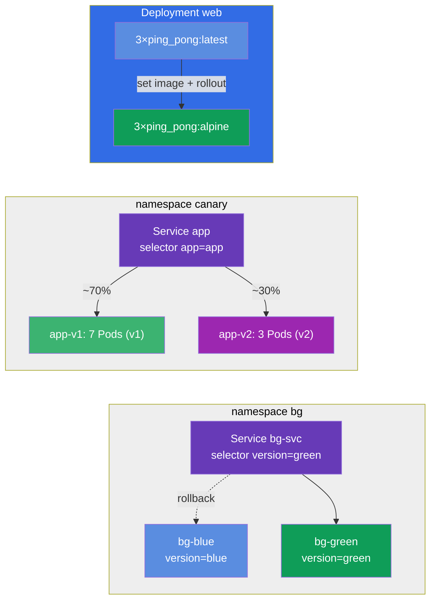

[Русская версия](README_RU.MD) · [Eng version](README.MD) · [Versión en español](README_ES.MD) · [Deutsche Version](README_DE.MD) · [ქართული ვერსია](README_GE.MD) · [繁體中文版](README_TW.MD) · [日本語版](README_JP.MD)

# Lab 102 — Mises à jour et stratégies de déploiement : rolling update, rollback, canary, blue/green

## Description

Un lab consacré à la mise à jour d'applications sans interruption de service. Vous y
travaillez ce qui arrive chaque jour à une application en production : le déploiement
progressif d'une nouvelle version (rolling update), l'enregistrement de la raison du
changement (change-cause), le retour rapide à la version précédente (rollback) et des
stratégies de mise en production plus fines — canary (la nouvelle version ne reçoit qu'une
partie du trafic) et blue/green (basculement instantané entre deux environnements).

Toutes les tâches sont rédigées dans le style de l'examen (comme les vraies questions
CKA/CKAD) avec une vérification automatique via la commande `check_result`. Il est
recommandé de les résoudre avec des commandes impératives
(`kubectl create/set image/rollout/patch`) : à l'examen, c'est la voie la plus rapide.

## Objectif

Consolider le contenu des chapitres du cours :

- [Chapitre 8. Deployment : rolling update et rollback](../../course/08/fr.md) — déploiement progressif, historique des révisions, change-cause, rollback
- [Chapitre 9. Stratégies de déploiement : blue/green et canary](../../course/09/fr.md) — répartition du trafic entre les versions et bascule des environnements

## Ce que nous créons et pourquoi

Dans ce lab, nous parcourons tout le cycle de vie d'une mise à jour d'application — du
déploiement progressif au rollback en passant par les stratégies avancées. Chaque objet a son
propre rôle :

| Objet | Ce que c'est | Pourquoi dans ce lab |
|-------|--------------|----------------------|
| **Deployment `web`** | déploiement de l'application avec une version d'image | c'est sur lui qu'on travaille le rolling update, l'enregistrement du change-cause et la stratégie sûre `maxSurge`/`maxUnavailable` (chapitre 8) |
| **Deployment `roll`** | déploiement séparé dédié au rollback | on le met à jour puis on revient à la version précédente avec `rollout undo` (chapitre 8) |
| **namespace `canary` + Service `app` + Deployments `app-v1`/`app-v2`** | mise en production canary | un seul Service répartit le trafic entre deux versions proportionnellement au nombre de Pods (v1=7, v2=3 → v2 ≈ 30%) (chapitre 9) |
| **namespace `bg` + Service `bg-svc` + Deployments `bg-blue`/`bg-green`** | blue/green | bascule instantanée de version en changeant le selector du Service ; le rollback est tout aussi instantané (chapitre 9) |

Image finale de ce qui sera déployé :



## Infrastructure

L'environnement est déployé dans AWS (`eu-central-1`) via Terragrunt et se compose de :

| Composant  | Description                                                  |
|------------|--------------------------------------------------------------|
| `vpc`      | VPC `10.10.0.0/16` avec des sous-réseaux publics               |
| `ssh-keys` | Clés SSH pour l'accès aux nœuds                                |
| `k8s-1`    | Kubernetes `1.35.2` (kubeadm), CNI Calico, metrics-server installé |
| `worker`   | Machine de travail avec `kubectl`, accès au cluster et `check_result` |

Instances : `t4g.medium` (master), Ubuntu `22.04`. Le cluster est mono-nœud — le taint
`control-plane` a été retiré du master, les pods sont donc planifiés directement dessus.

## Déploiement

```bash
TASK=102 make run_cka_task
```

Après la création, connectez-vous en SSH à la machine de travail (worker) et effectuez les
tâches depuis celle-ci. `kubectl` est déjà configuré sur le contexte
`cluster1-admin@cluster1`.

Commandes utiles sur la machine de travail :

```bash
time_left       # combien de temps il reste
check_result    # vérifier la solution
```

## Tâches

---
|        **1**        | **Déployer la version de base de l'application**               |
| :-----------------: | :------------------------------------------------------------- |
| Ce qu'on fait       | Créez un Deployment nommé `web`, image du conteneur `viktoruj/ping_pong:latest` (serveur HTTP pédagogique sur le port `8080`), `3` réplicas. Attendez que tous les réplicas soient prêts (Ready). C'est ce Deployment que nous allons mettre à jour et configurer par la suite. |
| Critères d'acceptation | - le Deployment `web` existe ;<br/>- l'image du conteneur est `viktoruj/ping_pong:latest` ;<br/>- `3` réplicas prêts (ready). |
---
|        **2**        | **Mettre à jour la version en douceur et enregistrer la raison** |
| :-----------------: | :------------------------------------------------------------- |
| Ce qu'on fait       | Mettez à jour en douceur (rolling update) l'image du Deployment `web` vers `viktoruj/ping_pong:alpine` et notez la raison du changement dans l'annotation `kubernetes.io/change-cause`, afin qu'elle apparaisse dans l'historique des déploiements (`rollout history`). Attendez la fin du déploiement — l'historique doit contenir au moins 2 révisions. |
| Critères d'acceptation | - l'image du Deployment `web` est passée à `viktoruj/ping_pong:alpine` ;<br/>- l'historique des déploiements compte ≥ 2 révisions. |
---
|        **3**        | **Revenir à la version précédente du déploiement**             |
| :-----------------: | :------------------------------------------------------------- |
| Ce qu'on fait       | Créez un Deployment distinct nommé `roll` (image `viktoruj/ping_pong:latest`), changez son image pour une autre version (par exemple `:alpine`), puis revenez à la version précédente avec la commande `rollout undo`. Après le rollback, l'image doit redevenir `viktoruj/ping_pong:latest` et la `generation` du déploiement ne doit pas être inférieure à `3` (création + mise à jour + rollback). |
| Critères d'acceptation | - le Deployment `roll` existe ;<br/>- après le rollback, image = `viktoruj/ping_pong:latest` ;<br/>- il y a eu plusieurs révisions (`generation` ≥ 3). |
---
|        **4**        | **Mettre en place une bascule canary (~30% vers la nouvelle version)** |
| :-----------------: | :------------------------------------------------------------- |
| Ce qu'on fait       | Créez le namespace `canary`. Déployez-y deux Deployment de la même application : `app-v1` (`7` réplicas, label `version=v1`) et `app-v2` (`3` réplicas, label `version=v2`), tous deux avec l'image `viktoruj/ping_pong`. Créez un seul Service `app` (port `8080`, `targetPort 8080`) qui, via le label commun `app=app`, sélectionne les Pods des **deux** versions. Ainsi la part de trafic vers la nouvelle version est définie par le nombre de réplicas : v1=7, v2=3 → v2 reçoit ~30%. Assurez-vous que le Service a trouvé les Pods (les Endpoints ne sont pas vides). |
| Critères d'acceptation | - le namespace `canary` existe ;<br/>- Service `app`, selector `app=app`, port `8080`, Endpoints non vides ;<br/>- Deployment `app-v1` : `7` réplicas, label `version=v1` ;<br/>- Deployment `app-v2` : `3` réplicas, label `version=v2` (image `viktoruj/ping_pong`). |
---
|        **5**        | **Configurer une stratégie de déploiement sûre (surge)**       |
| :-----------------: | :------------------------------------------------------------- |
| Ce qu'on fait       | Donnez au Deployment `web` une stratégie de déploiement sûre : type `RollingUpdate` avec `maxSurge: 2` et `maxUnavailable: 0`. Avec ces réglages, les nouveaux Pods démarrent avant l'arrêt des anciens et la capacité de l'application ne baisse pas pendant le déploiement. |
| Critères d'acceptation | - le Deployment `web` a la strategy `RollingUpdate` ;<br/>- `maxSurge: 2` ;<br/>- `maxUnavailable: 0`. |
---
|        **6**        | **Blue/Green : bascule instantanée de version**                |
| :-----------------: | :------------------------------------------------------------- |
| Ce qu'on fait       | Créez le namespace `bg`. Déployez-y deux environnements de la même application : Deployment `bg-blue` (label `version=blue`) et `bg-green` (label `version=green`), image `viktoruj/ping_pong`. Créez le Service `bg-svc` et basculez son selector sur `version=green` pour que le trafic passe instantanément sur green (les Endpoints pointent vers les Pods green). Le rollback se fait de la même façon — en remettant le selector sur blue. |
| Critères d'acceptation | - le namespace `bg` existe ;<br/>- Deployment `bg-blue` (label `version=blue`) et `bg-green` (label `version=green`), image `viktoruj/ping_pong` ;<br/>- le Service `bg-svc` est basculé sur `version=green` (les Endpoints pointent vers green). |
---

## Vérification du résultat

Sur la machine de travail, lancez la vérification automatique :

```bash
check_result
```

Le script exécute les tests et affiche le nombre de tâches réussies.

## Solution

Solution de référence : [worker/files/solutions/1_FR.MD](worker/files/solutions/1_FR.MD)

## Couverture des examens blancs

Le lab couvre les tâches des examens blancs sur les mises à jour et les stratégies de
déploiement : CKA mock 01 (n° 16 — rolling update + record), CKAD mock 02 (n° 3 — rollback +
scale, n° 9 — canary 30%) — rolling update, change-cause, rollback, canary et blue/green.

## Suppression du cluster et des ressources

```bash
TASK=102 make delete_cka_task
```
