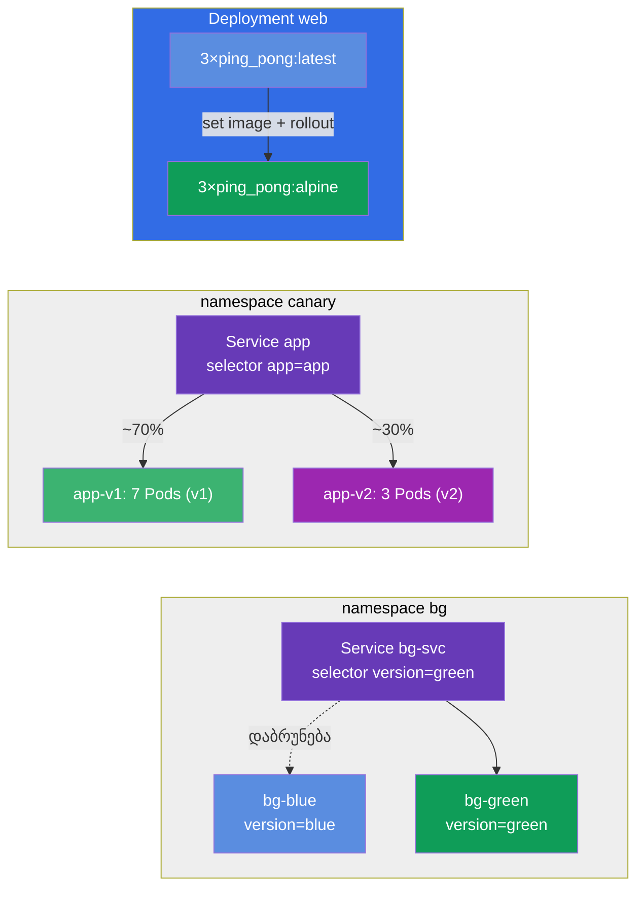

[Русская версия](README_RU.MD) · [Eng version](README.MD) · [Versión en español](README_ES.MD) · [Version française](README_FR.MD) · [Deutsche Version](README_DE.MD) · [繁體中文版](README_TW.MD) · [日本語版](README_JP.MD)

# Lab 102 — განახლებები და განთავსების სტრატეგიები: rolling update, rollback, canary, blue/green

## აღწერა

პრაქტიკული სამუშაო აპლიკაციების განახლებაზე შეფერხების გარეშე. აქ თქვენ ამუშავებთ იმას, რაც
პროდაქშენში აპლიკაციას ყოველდღე ხდება: ახალი ვერსიის შეუფერხებელი გამოშვება (rolling
update), ცვლილების მიზეზის ჩაწერა (change-cause), წინა ვერსიაზე სწრაფი დაბრუნება
(rollback) და უფრო დახვეწილი გამოშვების სტრატეგიები — canary (ახალი ვერსია ტრაფიკის
მხოლოდ ნაწილს იღებს) და blue/green (მყისიერი გადართვა ორ გარემოს შორის).

ყველა დავალება გამოცდის სტილშია გაფორმებული (როგორც რეალური CKA/CKAD კითხვები) და მათი
შემოწმება ავტომატურად ხდება ბრძანებით `check_result`. რეკომენდებულია ამოხსნა იმპერატიული
ბრძანებებით (`kubectl create/set image/rollout/patch`) — გამოცდაზე ეს ყველაზე სწრაფი გზაა.

## მიზანი

განამტკიცოთ კურსის თავების მასალა:

- [თავი 8. Deployment: rolling update და rollback](../../course/08/ge.md) — შეუფერხებელი გამოშვება, რევიზიების ისტორია, change-cause, დაბრუნება
- [თავი 9. განთავსების სტრატეგიები: blue/green და canary](../../course/09/ge.md) — ტრაფიკის განაწილება ვერსიებს შორის და გარემოების გადართვა

## რას ვქმნით და რისთვის

ამ ლაბორატორიაში ვამუშავებთ აპლიკაციის განახლების სრულ ციკლს — შეუფერხებელი გამოშვებიდან
დაბრუნებამდე და გამოშვების გაფართოებულ სტრატეგიებამდე. თითოეული ობიექტი თავის ამოცანას ასრულებს:

| ობიექტი | რა არის ეს | რისთვის არის ამ ლაბორატორიაში |
|---------|------------|-------------------------------|
| **Deployment `web`** | აპლიკაციის დეპლოი image-ის ვერსიით | მასზე ვამუშავებთ rolling update-ს, change-cause-ის ჩაწერას და გამოშვების უსაფრთხო სტრატეგიას `maxSurge`/`maxUnavailable` (თავი 8) |
| **Deployment `roll`** | ცალკე დეპლოი დაბრუნებისთვის | ვაახლებთ და წინა ვერსიაზე ვბრუნდებით `rollout undo`-ს მეშვეობით (თავი 8) |
| **namespace `canary` + Service `app` + Deployment-ები `app-v1`/`app-v2`** | canary-გამოშვება | ერთი Service ტრაფიკს ორ ვერსიას შორის ანაწილებს Pod-ების რაოდენობის პროპორციულად (v1=7, v2=3 → v2 ≈ 30%) (თავი 9) |
| **namespace `bg` + Service `bg-svc` + Deployment-ები `bg-blue`/`bg-green`** | blue/green | ვერსიის მყისიერი გადართვა Service-ის selector-ის შეცვლით, დაბრუნებაც ისევე მყისიერია (თავი 9) |

საბოლოო სურათი იმისა, რაც განთავსდება:



## ინფრასტრუქტურა

გარემო იშლება AWS-ში (`eu-central-1`) Terragrunt-ის მეშვეობით და შედგება:

| კომპონენტი | აღწერა                                                    |
|------------|-----------------------------------------------------------|
| `vpc`      | VPC `10.10.0.0/16` საჯარო ქვექსელებით                      |
| `ssh-keys` | SSH-გასაღებები node-ებზე წვდომისთვის                        |
| `k8s-1`    | Kubernetes `1.35.2` (kubeadm), CNI Calico, დაყენებულია metrics-server |
| `worker`   | სამუშაო მანქანა `kubectl`-ით, კლასტერზე წვდომით და `check_result`-ით |

ინსტანსები: `t3.medium` (master), Ubuntu `22.04`. კლასტერი ერთკვანძიანია — master-ს
მოშორებულია taint `control-plane`, ამიტომ pod-ები პირდაპირ მასზე იგეგმება.

## განთავსება

```bash
TASK=102 make run_cka_task
```

შექმნის შემდეგ დაუკავშირდით სამუშაო მანქანას (worker) SSH-ით და დავალებები შეასრულეთ
იქიდან. `kubectl` უკვე კონფიგურირებულია კონტექსტზე `cluster1-admin@cluster1`.

სასარგებლო ბრძანებები სამუშაო მანქანაზე:

```bash
time_left       # რამდენი დრო დარჩა
check_result    # ამოხსნის შემოწმება
```

## დავალებები

---
|        **1**        | **აპლიკაციის საბაზისო ვერსიის განთავსება**                     |
| :-----------------: | :------------------------------------------------------------- |
| რას ვაკეთებთ        | შექმენით Deployment სახელით `web`, კონტეინერის image `viktoruj/ping_pong:latest` (სასწავლო HTTP-სერვერი პორტზე `8080`), `3` რეპლიკა. დაელოდეთ, სანამ ყველა რეპლიკა მზად (Ready) გახდება. სწორედ ამ Deployment-ს ვაახლებთ და ვაკონფიგურირებთ შემდგომში. |
| მიღების კრიტერიუმები | - Deployment `web` არსებობს;<br/>- კონტეინერის image — `viktoruj/ping_pong:latest`;<br/>- `3` მზა (ready) რეპლიკა. |
---
|        **2**        | **ვერსიის შეუფერხებელი განახლება და მიზეზის ჩაწერა**           |
| :-----------------: | :------------------------------------------------------------- |
| რას ვაკეთებთ        | შეუფერხებლად (rolling update) განაახლეთ Deployment `web`-ის image `viktoruj/ping_pong:alpine`-ზე და ცვლილების მიზეზი დააფიქსირეთ ანოტაციაში `kubernetes.io/change-cause`, რომ ის გამოშვებების ისტორიაში (`rollout history`) ჩანდეს. დაელოდეთ გამოშვების დასრულებას — ისტორიაში უნდა დაგროვდეს არანაკლებ 2 რევიზია. |
| მიღების კრიტერიუმები | - Deployment `web`-ის image განახლებულია `viktoruj/ping_pong:alpine`-ზე;<br/>- გამოშვებების ისტორიაში ≥ 2 რევიზია. |
---
|        **3**        | **დეპლოის დაბრუნება წინა ვერსიაზე**                            |
| :-----------------: | :------------------------------------------------------------- |
| რას ვაკეთებთ        | შექმენით ცალკე Deployment სახელით `roll` (image `viktoruj/ping_pong:latest`), განაახლეთ მისი image სხვა ვერსიაზე (მაგალითად, `:alpine`), შემდეგ კი დაბრუნდით წინა ვერსიაზე ბრძანებით `rollout undo`. დაბრუნების შემდეგ image ისევ `viktoruj/ping_pong:latest` უნდა გახდეს, ხოლო დეპლოის `generation` — არანაკლებ `3` (შექმნა + განახლება + დაბრუნება). |
| მიღების კრიტერიუმები | - Deployment `roll` არსებობს;<br/>- დაბრუნების შემდეგ image = `viktoruj/ping_pong:latest`;<br/>- იყო რამდენიმე რევიზია (`generation` ≥ 3). |
---
|        **4**        | **canary-გამოშვების კონფიგურაცია (~30% ახალ ვერსიაზე)**        |
| :-----------------: | :------------------------------------------------------------- |
| რას ვაკეთებთ        | შექმენით namespace `canary`. მასში განათავსეთ ერთი აპლიკაციის ორი Deployment: `app-v1` (`7` რეპლიკა, label `version=v1`) და `app-v2` (`3` რეპლიკა, label `version=v2`), ორივე image-ით `viktoruj/ping_pong`. შექმენით ერთი Service `app` (პორტი `8080`, `targetPort 8080`), რომელიც საერთო label `app=app`-ით შეარჩევს **ორივე** ვერსიის Pod-ებს. ასე ახალ ვერსიაზე ტრაფიკის წილი რეპლიკების რაოდენობით განისაზღვრება: v1=7, v2=3 → v2 იღებს ~30%-ს. დარწმუნდით, რომ Service-მა Pod-ები იპოვა (Endpoints არ არის ცარიელი). |
| მიღების კრიტერიუმები | - namespace `canary` არსებობს;<br/>- Service `app`, selector `app=app`, პორტი `8080`, Endpoints არ არის ცარიელი;<br/>- Deployment `app-v1`: `7` რეპლიკა, label `version=v1`;<br/>- Deployment `app-v2`: `3` რეპლიკა, label `version=v2` (image `viktoruj/ping_pong`). |
---
|        **5**        | **გამოშვების უსაფრთხო სტრატეგიის კონფიგურაცია (surge)**        |
| :-----------------: | :------------------------------------------------------------- |
| რას ვაკეთებთ        | მიუთითეთ Deployment `web`-ს გამოშვების უსაფრთხო სტრატეგია: ტიპი `RollingUpdate` პარამეტრებით `maxSurge: 2` და `maxUnavailable: 0`. ასეთი პარამეტრებით ახალი Pod-ები ძველების გამორთვამდე ეშვება და აპლიკაციის სიმძლავრე გამოშვების მსვლელობაში არ ეცემა. |
| მიღების კრიტერიუმები | - Deployment `web`-ს აქვს strategy `RollingUpdate`;<br/>- `maxSurge: 2`;<br/>- `maxUnavailable: 0`. |
---
|        **6**        | **Blue/Green: ვერსიის მყისიერი გადართვა**                      |
| :-----------------: | :------------------------------------------------------------- |
| რას ვაკეთებთ        | შექმენით namespace `bg`. განათავსეთ მასში ერთი აპლიკაციის ორი გარემო: Deployment `bg-blue` (label `version=blue`) და `bg-green` (label `version=green`), image `viktoruj/ping_pong`. შექმენით Service `bg-svc` და გადართეთ მისი selector `version=green`-ზე, რომ ტრაფიკი მყისიერად გადავიდეს green-ზე (Endpoints green-ის Pod-ებზე მიდის). დაბრუნება ანალოგიურად კეთდება — selector-ის უკან blue-ზე შეცვლით. |
| მიღების კრიტერიუმები | - namespace `bg` არსებობს;<br/>- Deployment `bg-blue` (label `version=blue`) და `bg-green` (label `version=green`), image `viktoruj/ping_pong`;<br/>- Service `bg-svc` გადართულია `version=green`-ზე (Endpoints green-ზე მიდის). |
---

## შედეგის შემოწმება

სამუშაო მანქანაზე გაუშვით ავტომატური შემოწმება:

```bash
check_result
```

სკრიპტი გაატარებს ტესტებს და აჩვენებს, რამდენი დავალებაა შესრულებული.

## ამოხსნა

ეტალონური ამოხსნა: [worker/files/solutions/1_GE.MD](worker/files/solutions/1_GE.MD)

## Mock-გამოცდების დაფარვა

ლაბორატორია ფარავს mock-ების დავალებებს განახლებებსა და განთავსების სტრატეგიებზე: CKA mock 01
(№16 — rolling update + record), CKAD mock 02 (№3 — rollback + scale, №9 — canary 30%) —
rolling update, change-cause, rollback, canary და blue/green.

## კლასტერისა და რესურსების წაშლა

```bash
TASK=102 make delete_cka_task
```
