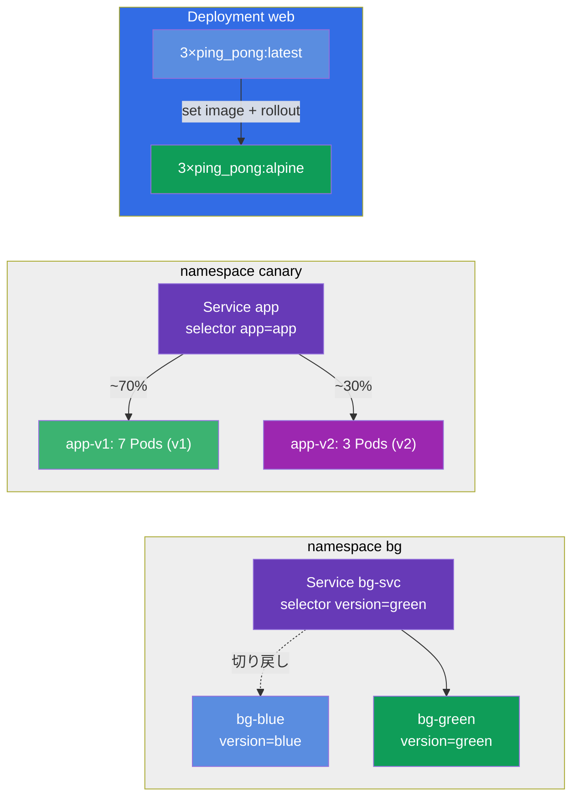

[Русская версия](README_RU.MD) · [Eng version](README.MD) · [Versión en español](README_ES.MD) · [Version française](README_FR.MD) · [Deutsche Version](README_DE.MD) · [ქართული ვერსია](README_GE.MD) · [繁體中文版](README_TW.MD)

# Lab 102 — 更新とデプロイ戦略：rolling update、rollback、canary、blue/green

## 概要

ダウンタイムなしでアプリケーションを更新するための実習です。ここでは本番環境の
アプリケーションで毎日起きていることを練習します。新しいバージョンの滑らかな展開
(rolling update)、変更理由の記録 (change-cause)、直前のバージョンへの素早い切り戻し
(rollback)、そしてより細かなリリース戦略 - canary (新しいバージョンがトラフィックの
一部だけを受け取る) と blue/green (2 つの環境を瞬時に切り替える)。

すべての課題は試験形式で作られており (実際の CKA/CKAD の問題と同じように)、
`check_result` コマンドによる自動チェックが付いています。解答には命令型のコマンド
(`kubectl create/set image/rollout/patch`) を使うのがおすすめです - 試験では最速の道です。

## 目的

コースの各章の内容を定着させます。

- [第 8 章。Deployment：rolling update と rollback](../../course/08/README.md) - 滑らかな展開、リビジョン履歴、change-cause、切り戻し
- [第 9 章。デプロイ戦略：blue/green と canary](../../course/09/README.md) - バージョン間のトラフィック分配と環境の切り替え

## 何を作るのか、そしてなぜ

このラボではアプリケーション更新のライフサイクル全体を練習します - 滑らかな展開から
切り戻し、さらに進んだリリース戦略まで。それぞれのオブジェクトに役割があります。

| オブジェクト | これは何か | なぜこのラボにあるのか |
|--------|---------|-------------------|
| **Deployment `web`** | イメージのバージョンを持つアプリケーションのデプロイ | これを使って rolling update、change-cause の記録、安全な展開戦略 `maxSurge`/`maxUnavailable` を練習します (第 8 章) |
| **Deployment `roll`** | 切り戻し用の独立したデプロイ | 更新を行い、`rollout undo` で直前のバージョンへ切り戻します (第 8 章) |
| **namespace `canary` + Service `app` + Deployments `app-v1`/`app-v2`** | canary リリース | 1 つの Service が Pods の数に比例して 2 つのバージョンへトラフィックを分配します (v1=7、v2=3 → v2 ≈ 30%) (第 9 章) |
| **namespace `bg` + Service `bg-svc` + Deployments `bg-blue`/`bg-green`** | blue/green | Service の selector を変えるだけでバージョンを瞬時に切り替え、切り戻しも同じく瞬時です (第 9 章) |

デプロイされる最終的な全体像：



## インフラ

環境は Terragrunt により AWS (`eu-central-1`) にデプロイされ、次の要素からなります。

| コンポーネント | 説明                                                       |
|------------|-------------------------------------------------------------|
| `vpc`      | パブリックサブネットを持つ VPC `10.10.0.0/16`                 |
| `ssh-keys` | ノードへアクセスするための SSH 鍵                             |
| `k8s-1`    | Kubernetes `1.35.2` (kubeadm)、CNI Calico、metrics-server 導入済み |
| `worker`   | `kubectl`、クラスターへのアクセス、`check_result` を備えた作業マシン |

インスタンス：`t3.medium` (master)、Ubuntu `22.04`。クラスターは単一ノードで、master の
taint は外されています (`control-plane` taint を削除) ので、Pod は直接そこに配置されます。

## デプロイ

```bash
TASK=102 make run_cka_task
```

作成が終わったら作業マシン (worker) に SSH で接続し、そこから課題を進めてください。
`kubectl` はすでに `cluster1-admin@cluster1` コンテキストに設定されています。

作業マシンで便利なコマンド：

```bash
time_left       # 残り時間
check_result    # 解答をチェックする
```

## 課題

---
|        **1**        | **アプリケーションの基準バージョンをデプロイする**             |
| :-----------------: | :------------------------------------------------------------- |
| 何をするか          | `web` という名前の Deployment を作成してください。コンテナイメージは `viktoruj/ping_pong:latest` (`8080` ポートで動く学習用 HTTP サーバー)、レプリカ数は `3` です。すべてのレプリカが Ready になるまで待ちます。まさにこの Deployment を、この先で更新したり設定したりしていきます。 |
| 受け入れ基準        | - Deployment `web` が存在する；<br/>- コンテナイメージが `viktoruj/ping_pong:latest`；<br/>- `3` つの ready なレプリカ。 |
---
|        **2**        | **バージョンを滑らかに更新し、理由を記録する**                 |
| :-----------------: | :------------------------------------------------------------- |
| 何をするか          | Deployment `web` のイメージを滑らかに (rolling update) `viktoruj/ping_pong:alpine` へ更新し、変更理由をアノテーション `kubernetes.io/change-cause` に記録して、展開履歴 (`rollout history`) から見えるようにしてください。展開の完了を待ちます - 履歴には 2 つ以上のリビジョンが溜まっているはずです。 |
| 受け入れ基準        | - Deployment `web` のイメージが `viktoruj/ping_pong:alpine` に更新されている；<br/>- 展開履歴に 2 つ以上のリビジョンがある。 |
---
|        **3**        | **デプロイを直前のバージョンへ切り戻す**                       |
| :-----------------: | :------------------------------------------------------------- |
| 何をするか          | `roll` という名前の独立した Deployment を作成し (イメージ `viktoruj/ping_pong:latest`)、そのイメージを別のバージョンへ更新して (たとえば `:alpine`)、その後 `rollout undo` コマンドで直前のバージョンへ切り戻してください。切り戻し後、イメージは再び `viktoruj/ping_pong:latest` になり、デプロイの `generation` は `3` 以上になっている必要があります (作成 + 更新 + 切り戻し)。 |
| 受け入れ基準        | - Deployment `roll` が存在する；<br/>- 切り戻し後のイメージが `viktoruj/ping_pong:latest`；<br/>- 複数のリビジョンがあった (`generation` ≥ 3)。 |
---
|        **4**        | **canary リリースを設定する (新バージョンに約 30%)**           |
| :-----------------: | :------------------------------------------------------------- |
| 何をするか          | namespace `canary` を作成してください。その中に同じアプリケーションの Deployment を 2 つ展開します。`app-v1` (`7` レプリカ、label `version=v1`) と `app-v2` (`3` レプリカ、label `version=v2`) で、どちらもイメージは `viktoruj/ping_pong` です。共通の label `app=app` によって**両方**のバージョンの Pods を選ぶ Service `app` (ポート `8080`、`targetPort 8080`) を 1 つ作成してください。こうすると新しいバージョンへのトラフィックの割合はレプリカ数で決まります。v1=7、v2=3 → v2 が約 30% を受け取ります。Service が Pods を見つけていること (Endpoints が空でないこと) を確認してください。 |
| 受け入れ基準        | - namespace `canary` が存在する；<br/>- Service `app`、selector `app=app`、ポート `8080`、Endpoints が空でない；<br/>- Deployment `app-v1`：`7` レプリカ、label `version=v1`；<br/>- Deployment `app-v2`：`3` レプリカ、label `version=v2` (イメージ `viktoruj/ping_pong`)。 |
---
|        **5**        | **安全な展開戦略を設定する (surge)**                           |
| :-----------------: | :------------------------------------------------------------- |
| 何をするか          | Deployment `web` に安全な展開戦略を設定してください。タイプは `RollingUpdate` で、`maxSurge: 2` と `maxUnavailable: 0` です。この設定では古い Pods が落とされる前に新しい Pods が立ち上がるため、展開中にアプリケーションの処理能力が落ちません。 |
| 受け入れ基準        | - Deployment `web` の strategy が `RollingUpdate`；<br/>- `maxSurge: 2`；<br/>- `maxUnavailable: 0`。 |
---
|        **6**        | **Blue/Green：バージョンの瞬時な切り替え**                     |
| :-----------------: | :------------------------------------------------------------- |
| 何をするか          | namespace `bg` を作成してください。その中に同じアプリケーションの 2 つの環境を展開します。Deployment `bg-blue` (label `version=blue`) と `bg-green` (label `version=green`) で、イメージは `viktoruj/ping_pong` です。Service `bg-svc` を作成し、その selector を `version=green` へ切り替えて、トラフィックが瞬時に green へ移るようにしてください (Endpoints が green の Pods を指す)。切り戻しも同じやり方です - selector を blue へ戻すだけです。 |
| 受け入れ基準        | - namespace `bg` が存在する；<br/>- Deployment `bg-blue` (label `version=blue`) と `bg-green` (label `version=green`)、イメージ `viktoruj/ping_pong`；<br/>- Service `bg-svc` が `version=green` に切り替わっている (Endpoints が green を指す)。 |
---

## 結果のチェック

作業マシンで自動チェックを実行します。

```bash
check_result
```

スクリプトがテストを走らせ、いくつの課題が完了したかを表示します。

## 解答

参考解答：[worker/files/solutions/1_JP.MD](worker/files/solutions/1_JP.MD)

## モック試験のカバー範囲

このラボは更新とデプロイ戦略に関するモック試験の課題をカバーします。CKA mock 01 (No.16 -
rolling update + record)、CKAD mock 02 (No.3 - rollback + scale、No.9 - canary 30%) -
rolling update、change-cause、rollback、canary と blue/green。

## クラスターとリソースの削除

```bash
TASK=102 make delete_cka_task
```
